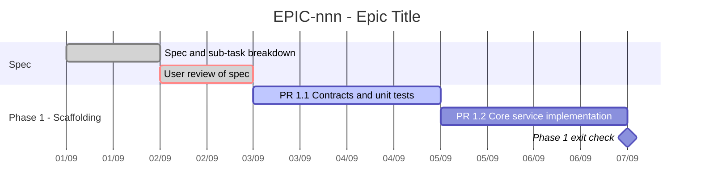

# EPIC-{nnn} — Tracking

<!-- Lightweight tracking index: high-level headings, Gantt schedule, and milestone log only. -->
<!-- DO NOT write implementation details, test outputs, or full specs here. Detailed problem context, design, acceptance criteria, and per-file notes belong strictly in each child task file under incomplete/ or completed/. -->
- **Epic:** {link to the parent epic README}
- **Status:** {🔵 Planned / 🟡 In Progress / ✅ Done (YYYY-MM-DD)}
- **Target Completion:** {YYYY-MM-DD}
- **Renders:** GitHub Markdown, VS Code Mermaid preview, or mermaid.live.

---

## 1. Schedule (Gantt)

<!-- Keep bars high-level (one per milestone/PR). Replace sample bars with your epic timeline. -->

---

## 2. Sub-tasks & PR Matrix

<!-- Keep rows to 1-line references. Clickable links point to active child task files under incomplete/ or completed/. -->

| Id | Sub-task | Branch / PR | Risk | Status | Target / Merged |
| :--- | :--- | :--- | :-: | :--- | :--- |
| {EPIC-nnnA} | {summary, linked to incomplete/ task file} | `{branch_name}` | {🟢 / 🟡 / 🔴} | {🔵 Planned / 🟡 Active / ✅ Merged} | {YYYY-MM-DD} |
| {EPIC-nnnB} | {summary, linked to incomplete/ task file} | `{branch_name}` | {🟢 / 🟡 / 🔴} | {🔵 Planned / 🟡 Active / ✅ Merged} | {YYYY-MM-DD} |

---

## 3. Milestone & Status Log

<!-- One line per event/PR. No long commentary or logs — summarize event and outcome in one sentence. Detailed notes belong in child task files. -->

| Date | Item | Event & Outcome |
| :--- | :--- | :--- |
| {YYYY-MM-DD} | Spec | Epic scaffolded, sub-tasks sliced, reviewed. |
| {YYYY-MM-DD} | PR 1.1 | Merged (PR #{number}) — {1-line outcome}. |

---

## 4. Blockers & Dependencies

| Blocker / Dependency | Impacted Tasks | Resolution / Owner | Status |
| :--- | :--- | :--- | :--- |
| {Prerequisite or external blocker} | {Task Ids} | {Resolution strategy or owner} | {🟡 Open / ✅ Resolved} |
