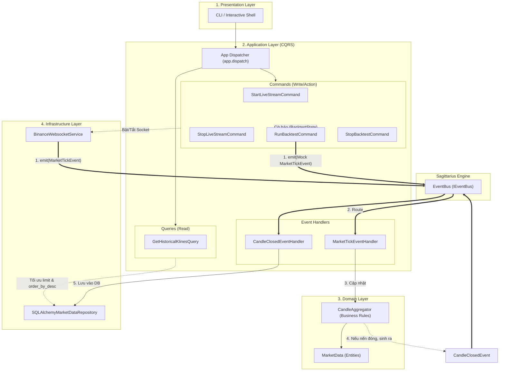
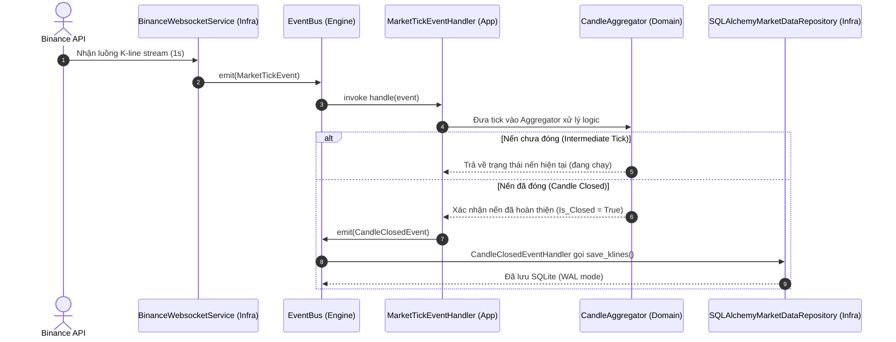

# System Architecture & Event-Driven Flows

This document contains Mermaid diagrams illustrating the Clean Architecture, CQRS, and Event-Driven flows within the Binance Bot.

## 1. CQRS & Event-Driven Architecture (Flowchart)

This diagram shows the high-level boundaries between layers and how Commands, Queries, and Events travel through the system.

## 2. Real-Time Tick Processing Flow (Sequence Diagram)

This sequence diagram details the exact step-by-step flow of handling a Live Tick, from WebSocket reception to UI updates and DB persistence.

