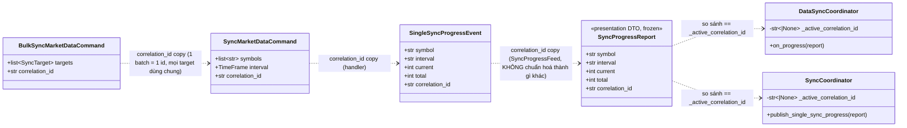

# Thiết kế Kiến trúc: `correlation_id` — phân biệt event của action nào, màn hình nào (BOT-121/BOT-122)

**Trạng thái:** ✅ Đã triển khai — 2026-08-31. Ví dụ cụ thể đang chạy: `SingleSyncProgressEvent`
(đồng bộ dữ liệu). Tài liệu này ghi lại **cơ chế chung**, để event thứ hai/thứ ba cần cùng vấn đề
áp dụng đúng khuôn thay vì phát minh lại (hoặc lặp lại đúng lỗi đã sửa).

---

## 1. Tổng quan Thiết kế (Design Overview)

### Vấn đề giải quyết

Khi **nhiều màn hình cùng nghe một loại event trên cùng một bus**, mỗi màn hình cần trả lời được
câu hỏi *"event này có phải của tôi không?"* — nếu không, một hành động ở màn A (VD Backtest tự
sync coverage-gap) làm progress bar ở màn B (VD Data Management) nhảy số sai, hoặc ngược lại.

Lịch sử 2 bước tại repo này:

1. **`BOT-121` (2026-08-30):** phát hiện `SyncProgressFeed` phát `SingleSyncProgressEvent` cho
   **cả** Backtest và Data Management (2 coordinator độc lập, 2 tracker riêng), nhưng không bên
   nào lọc lại — progress bar bên này hiển thị số của bên kia. Fix ban đầu: mỗi coordinator tự
   lọc report có `(symbol, interval)` khớp với action nó đang chờ.
2. **`BOT-122` (2026-08-31):** user chỉ ra bản chất của fix #1 — lọc theo `(symbol, interval)` là
   **trùng hợp dữ liệu nghiệp vụ, không phải định danh thật**. Hai action khác nhau hoàn toàn có
   thể nhắm cùng một `(symbol, interval)` (Backtest tự sync gap cho BTCUSDT/1m *đúng lúc*
   Data Management bấm resync tay cùng BTCUSDT/1m) — khi đó lọc theo khoá nghiệp vụ không phân
   biệt được, tái phát đúng lớp lỗi `BOT-121` vừa sửa. Thay bằng `correlation_id`: một chuỗi định
   danh **sinh tại nơi phát sinh request**, không phải suy ra từ nội dung dữ liệu.

### Nguyên tắc cốt lõi

> **Đừng lọc event chéo màn hình bằng dữ liệu nghiệp vụ (symbol, interval, id bản ghi, …). Luôn
> sinh một `correlation_id` tại nơi request bắt đầu, gắn nó xuyên suốt tới event, và so sánh bằng
> giá trị đó.**

Dữ liệu nghiệp vụ mô tả **cái gì** đang được xử lý; `correlation_id` mô tả **ai** đang chờ kết
quả. Hai action có thể xử lý cùng một "cái gì" (cùng symbol, cùng interval, cùng ID) nhưng không
bao giờ có cùng `correlation_id` nếu được sinh đúng (UUID) — đó là khác biệt duy nhất đủ tin cậy
để dùng làm khoá lọc.

---

## 2. Sơ đồ Luồng (Sequence Diagram) — ca cụ thể `SingleSyncProgressEvent`

```mermaid
sequenceDiagram
    autonumber
    participant BT as DataSyncCoordinator (Backtest)
    participant DM as SyncCoordinator (Data Management)
    participant CMD as SyncMarketDataCommand
    participant H as SyncMarketDataCommandHandler
    participant EV as SingleSyncProgressEvent (bus)
    participant Feed as SyncProgressFeed

    Note over BT,DM: Mỗi coordinator sinh correlation_id của RIÊNG nó khi bắt đầu 1 action
    BT->>BT: id_bt = uuid4() ; self._active_correlation_id = id_bt
    BT->>CMD: SyncMarketDataCommand(symbol, interval, correlation_id=id_bt)
    CMD->>H: dispatch()
    H->>EV: publish(symbol, interval, current, total, correlation_id=id_bt)

    Note over DM: Đồng thời, Data Management tự chạy 1 action khác — CÙNG symbol+interval
    DM->>DM: id_dm = uuid4() ; self._active_correlation_id = id_dm
    DM->>CMD: SyncMarketDataCommand(symbol, interval, correlation_id=id_dm)
    CMD->>H: dispatch()
    H->>EV: publish(symbol, interval, current, total, correlation_id=id_dm)

    EV->>Feed: mọi event, không lọc gì (đúng vai trò "fan-out cho mọi màn")
    Feed->>BT: SyncProgressReport(..., correlation_id=id_bt)
    Feed->>BT: SyncProgressReport(..., correlation_id=id_dm)
    BT->>BT: id_bt == self._active_correlation_id? NHẬN | id_dm == self._active_correlation_id? BỎ QUA

    Feed->>DM: SyncProgressReport(..., correlation_id=id_bt)
    Feed->>DM: SyncProgressReport(..., correlation_id=id_dm)
    DM->>DM: id_bt == self._active_correlation_id? BỎ QUA | id_dm == self._active_correlation_id? NHẬN
```

Điểm mấu chốt: `symbol`/`interval` của 2 report ở trên **giống hệt nhau** — nếu lọc theo khoá đó
(cách `BOT-121` làm), cả hai coordinator sẽ nhận NHẦM report của nhau. `correlation_id` là thứ
duy nhất phân biệt được.

---

## 3. Sơ đồ Lớp (Class Diagram) — dữ liệu mang `correlation_id` qua từng tầng



**Vì sao `BulkSyncMarketDataCommand` chỉ có 1 `correlation_id` cho cả batch, không phải 1 id/target:**
một lần bulk sync là **một action** từ góc nhìn của coordinator gọi nó — nó không cần phân biệt
tiến độ target nào trong CHÍNH batch của nó, chỉ cần phân biệt "đây có phải batch CỦA TÔI không"
so với action của màn khác. `BulkSyncMarketDataCommandHandler` truyền đúng 1 giá trị
`command.correlation_id` (của batch) vào từng `SyncMarketDataCommand` nó tự dựng cho từng target.

---

## 4. Hợp đồng & Vị trí trong Code

| Kiểu | File | Field |
| :--- | :--- | :--- |
| `SyncMarketDataCommand` | `src/application/use_cases/sync/sync_market_data/command.py` | `correlation_id: str = Field(default_factory=uuid4().hex)` |
| `BulkSyncMarketDataCommand` | `src/application/use_cases/sync/bulk_sync_market_data/command.py` | `correlation_id: str = Field(default_factory=uuid4().hex)` |
| `SingleSyncProgressEvent` | `src/application/events/sync_events.py` | `correlation_id: str = ""` |
| `SyncProgressReport` | `src/presentation/ui/common/sync_progress_report.py` | `correlation_id: str = ""` |

`default_factory=uuid4` trên cả 2 Command nghĩa là **caller không cần biết tới field này để dùng
được** (CLI, test, mọi chỗ không cần theo dõi tiến độ) — chỉ coordinator nào thật sự cần nhận lại
progress mới sinh tường minh và giữ giá trị đó lại để so sánh.

---

## 5. Cách áp dụng cho một Event mới (Hướng dẫn dùng lại cơ chế)

Khi viết một use case/event MỚI mà **từ 2 màn hình trở lên** sẽ nghe cùng một event trên bus
(đúng lúc "thăng cấp lên `BaseFeed`" theo công thức đã có ở `base_feed.py`), làm đúng 4 bước sau
— đừng lọc theo dữ liệu nghiệp vụ của event đó:

1. **Command/Query phát sinh action đó** thêm field `correlation_id: str` (Pydantic:
   `default_factory=lambda: uuid.uuid4().hex`; dataclass: tương tự qua `field(default_factory=...)`).
2. **Handler** đọc `command.correlation_id`, gắn nguyên xi vào mọi event nó publish liên quan tới
   action đó — không sinh id mới, không bỏ qua.
3. **Feed** (`BaseFeed` subclass) copy `correlation_id` sang DTO trình bày, **không được "chuẩn
   hoá" hay suy diễn lại nó** — đây là identity, không phải business data cần format lại.
4. **Mỗi consumer** (coordinator/presenter) tự sinh `correlation_id` NGAY TRƯỚC khi dispatch, giữ
   lại (`self._active_correlation_id`), và so sánh bằng `==` khi report về — không so khớp theo
   bất kỳ trường dữ liệu nào khác của event, dù trông "đủ để phân biệt" tới đâu.

### Khi nào ĐƯA `correlation_id` lên engine (`BaseEvent`)

**Chưa làm ở lần này, cố ý.** Hiện chỉ có 1 loại event (`SingleSyncProgressEvent`) thật sự cần
— đúng triết lý "thăng cấp khi có nhu cầu thật thứ 2" mà `base_feed.py`'s docstring đã đặt ra cho
chính bản thân `BaseFeed`. Nếu một event type **thứ hai** trong tương lai cũng cần cơ chế này,
đó là tín hiệu nên cân nhắc đưa `correlation_id: str | None = None` lên thẳng
`sagittarius_engine.domain.base_event.BaseEvent` (biến nó thành primitive dùng chung, giống
`event_id`/`occurred_on` đã có) — nhưng đó là quyết định của lần đó, dựa trên nhu cầu thật lúc
đó, không phải suy đoán trước.

---

## 6. Các Nguyên tắc Thiết kế

### 1. Identity tách biệt khỏi Business Data
`correlation_id` không mang ý nghĩa nghiệp vụ nào — nó chỉ trả lời "ai hỏi". Không dùng nó để
group/aggregate dữ liệu hiển thị (đó vẫn là việc của `symbol`/`interval`); không suy ra nó từ dữ
liệu khác.

### 2. Sinh tại nguồn, không sinh lại giữa chừng
`correlation_id` phải sinh **một lần**, tại nơi quyết định bắt đầu action (coordinator), rồi chỉ
được **copy nguyên xi** qua mọi tầng sau đó (Command → Handler → Event → Feed → DTO). Bất kỳ tầng
trung gian nào tự sinh id mới sẽ làm đứt chuỗi so khớp.

### 3. `default_factory`, không bắt buộc caller quan tâm
Field luôn có giá trị mặc định tự sinh — một script/test/CLI gọi thẳng `SyncMarketDataCommand`
mà không quan tâm tới correlation vẫn hoạt động đúng, không phải truyền tham số thừa.

### 4. Thăng cấp cơ chế khi có nhu cầu thật thứ 2, không suy đoán trước
Xem mục 5 — cùng nguyên tắc `BaseFeed`'s docstring đã áp dụng cho chính nó, giữ nhất quán trong
toàn bộ tài liệu kiến trúc của repo thay vì mỗi chỗ tự đặt ngưỡng khác nhau.

---

## 7. Tham chiếu

- [`Tasks/completed/BOT-121_backtest_data_management_sync_cross_talk_and_race.md`](../../Tasks/completed/BOT-121_backtest_data_management_sync_cross_talk_and_race.md) — phát hiện vấn đề, fix ban đầu (lọc theo symbol/interval).
- [`Tasks/completed/BOT-122_sync_progress_correlation_id.md`](../../Tasks/completed/BOT-122_sync_progress_correlation_id.md) — thay bằng `correlation_id`, ghi log task đầy đủ (test, verify).
- [`src/presentation/ui/common/base_feed.py`](../../src/presentation/ui/common/base_feed.py) — công thức "khi nào thăng cấp lên Feed dùng chung" mà mục 5 tài liệu này áp dụng tiếp một bước nữa.
