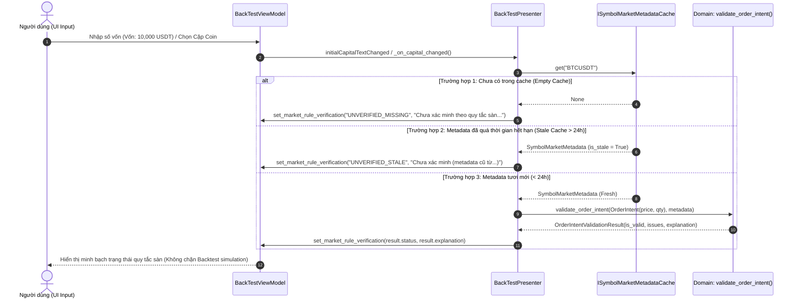

# Thiết kế Kiến trúc: Xác thực Quy tắc Sàn & Cache Metadata Thị trường (BOT-095E1)

Tài liệu này mô tả chi tiết thiết kế kỹ thuật, kiến trúc phân lớp (Clean Architecture), sơ đồ lớp (Class Diagram), luồng dữ liệu (Sequence Diagram) và các nguyên lý bảo vệ tính trung thực dữ liệu cho module `SymbolMarketMetadata`.

---

## 1. Tổng quan Thiết kế (Design Overview)

### Vấn đề giải quyết:
1. **Thiếu thông tin quy tắc sàn**: Trước đây, hệ thống chưa có cấu trúc lưu trữ và xác thực các quy tắc giao dịch thực tế của Binance (`PRICE_FILTER`, `LOT_SIZE`, `NOTIONAL` / `MIN_NOTIONAL`).
2. **Không đồng nhất Notional**: Không được coi vốn ban đầu (Initial Capital) là giá trị danh nghĩa của lệnh (Order Notional) khi chưa tính toán cụ thể số lượng và giá đặt.
3. **Hiệu năng & Trải nghiệm UI**: Không thực hiện cuộc gọi mạng (Network API call) mỗi khi người dùng gõ phím trên giao diện. Cần bộ nhớ đệm an toàn đa luồng trong RAM.

---

## 2. Sơ đồ Kiến trúc 4 Phân lớp (Clean Architecture Class Diagram)

```mermaid
classDiagram
    direction TB

    namespace Domain_Layer {
        class SymbolMarketMetadata {
            +str symbol
            +str status
            +str base_asset
            +str quote_asset
            +PriceFilter price_filter
            +LotSizeFilter lot_size_filter
            +NotionalFilter notional_filter
            +datetime fetched_at
            +is_stale(max_age_seconds) bool
        }
        class PriceFilter {
            +float min_price
            +float max_price
            +float tick_size
            +validate_price(price) str?
        }
        class LotSizeFilter {
            +float min_qty
            +float max_qty
            +float step_size
            +validate_quantity(qty) str?
        }
        class NotionalFilter {
            +float min_notional
            +bool apply_to_market
            +validate_notional(notional) str?
        }
        class OrderIntent {
            +str symbol
            +float price
            +float quantity
            +float notional
        }
        class OrderIntentValidationResult {
            +MetadataVerificationStatus status
            +bool is_valid
            +tuple issues
            +str explanation
        }
        class MetadataVerificationStatus {
            <<enumeration>>
            VERIFIED
            UNVERIFIED_MISSING
            UNVERIFIED_STALE
        }
    }

    namespace Application_Layer {
        class ISymbolMarketMetadataCache {
            <<Interface / Port>>
            +get(symbol) SymbolMarketMetadata?
            +put(metadata) void
            +has(symbol) bool
            +clear() void
        }
    }

    namespace Infrastructure_Layer {
        class InMemorySymbolMarketMetadataCache {
            -Lock _lock
            -dict _cache
            +get(symbol) SymbolMarketMetadata?
            +put(metadata) void
            +has(symbol) bool
            +clear() void
        }
        class BinanceMetadataParser {
            +parse_binance_symbol_metadata(dict) SymbolMarketMetadata
        }
        class BinanceFilterType {
            <<enumeration>>
            PRICE_FILTER
            LOT_SIZE
            NOTIONAL
            MIN_NOTIONAL
        }
        class BinanceMetadataKey {
            <<enumeration>>
            SYMBOL
            STATUS
            BASE_ASSET
            QUOTE_ASSET
            FILTERS
            FILTER_TYPE
            MIN_PRICE
            MAX_PRICE
            TICK_SIZE
            MIN_QTY
            MAX_QTY
            STEP_SIZE
            MIN_NOTIONAL
            NOTIONAL
            APPLY_TO_MARKET
        }
    }

    namespace Presentation_Layer {
        class BackTestPresenter {
            -ISymbolMarketMetadataCache _market_metadata_cache
            -_refresh_market_rule_verification() void
            -_on_capital_changed() void
            -_set_capital_validation_message(value) void
        }
        class BackTestViewModel {
            +str marketRuleVerificationStatus
            +str marketRuleExplanation
            +set_market_rule_verification(status, explanation) void
        }
    }

    %% Quan hệ giữa các thành phần
    SymbolMarketMetadata *-- PriceFilter
    SymbolMarketMetadata *-- LotSizeFilter
    SymbolMarketMetadata *-- NotionalFilter
    OrderIntentValidationResult *-- MetadataVerificationStatus

    InMemorySymbolMarketMetadataCache ..|> ISymbolMarketMetadataCache : Implements
    BinanceMetadataParser ..> SymbolMarketMetadata : Parses / Creates
    BinanceMetadataParser ..> BinanceFilterType : Uses
    BinanceMetadataParser ..> BinanceMetadataKey : Uses

    BackTestPresenter --> ISymbolMarketMetadataCache : Uses Port (DIP)
    BackTestPresenter ..> OrderIntent : Builds Intent
    BackTestPresenter ..> OrderIntentValidationResult : Receives Result
    BackTestPresenter --> BackTestViewModel : Binds State & UI Properties
```

---

## 3. Sơ đồ Luồng Xác thực (Validation & Verification Sequence)

---

## 4. Các Nguyên tắc Thiết kế & Chất lượng Mã nguồn

### 1. Clean Architecture & Port Isolation
- **Domain Layer Pure**: Hoàn toàn không import thư viện ngoài hay framework (chỉ dùng Python standard library `math`, `dataclasses`, `datetime`, `enum`).
- **Application Port**: `ISymbolMarketMetadataCache` đóng vai trò là hợp đồng trừu tượng (Port). `BackTestPresenter` chỉ phụ thuộc vào Interface này, tuân thủ nghiêm ngặt **DIP (Dependency Inversion Principle)**.

### 2. Loại bỏ hoàn toàn Magic Strings & Magic Numbers
- Các chuỗi khóa JSON của sàn (`"PRICE_FILTER"`, `"LOT_SIZE"`, `"minNotional"`,...) được đóng gói trong `BinanceFilterType` và `BinanceMetadataKey`.
- Các giá trị mặc định (`DEFAULT_MIN_PRICE`, `DEFAULT_MAX_PRICE`, `DEFAULT_MIN_NOTIONAL`,...) được khai báo là hằng số định danh ở cấp module.

### 3. Truthful Data & Zero Side-Effects
- Trạng thái xác minh được báo cáo trung thực qua 3 trạng thái rõ ràng:
  - `VERIFIED`: Đã kiểm tra đầy đủ tick size, step size, min notional.
  - `UNVERIFIED_MISSING`: Chưa có dữ liệu sàn trong máy, báo rõ ràng "Chưa xác minh".
  - `UNVERIFIED_STALE`: Dữ liệu đã cũ (> 24h), báo rõ thời gian lấy gần nhất.
- Khi người dùng tương tác với form, quá trình xác thực chỉ truy vấn cache in-memory, **không kích hoạt network I/O**, đảm bảo UI phản hồi tức thì dưới 1ms.
