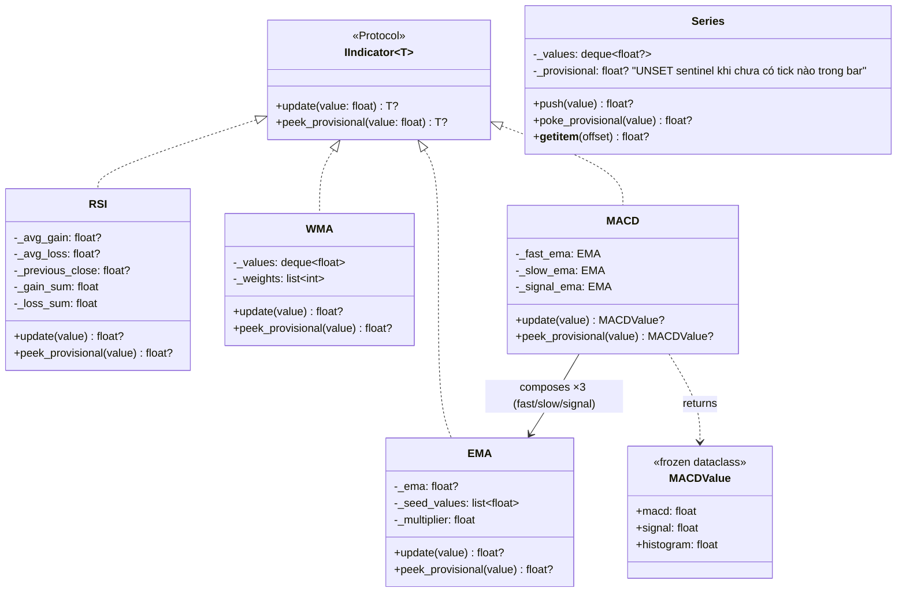
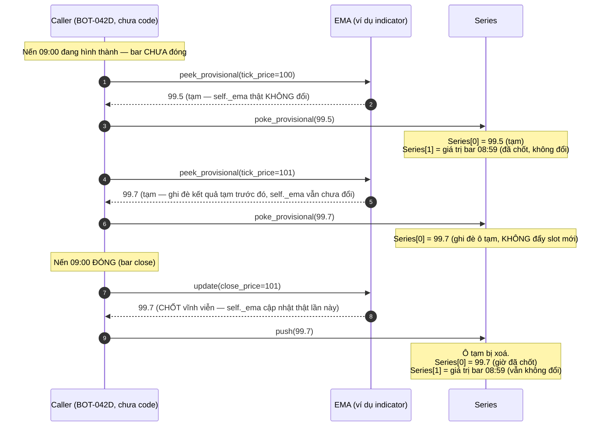

# Thiết kế Kiến trúc: Provisional vs Commit cho Indicator/Series theo Tick (BOT-042)

Tài liệu này mô tả thiết kế kỹ thuật cho việc mở rộng `IIndicator`/`Series` để
tiêu thụ được dữ liệu **tick** (giá đến giữa nến, nến chưa đóng), phục vụ 2
Execution Trigger Rule "trên mỗi tick" và là điều kiện tiên quyết của
`BOT-076` (Realtime Backtest Engine). **Chờ duyệt trước khi code** — đây là
task con `BOT-042A` (Design), các task con B/C/D chỉ bắt đầu sau khi tài
liệu này được duyệt.

> Hướng đã chốt với user (xem `BOT-042` §4): **additive-only**. Không đường
> nào đang chạy hôm nay (`update()`, `push()`, `_process_one()`) bị đổi hành
> vi — toàn bộ là thêm 1 nhánh mới song song, gọi được nhưng không ai bắt
> buộc phải gọi.

---

## 1. Tổng quan Thiết kế (Design Overview)

### Vấn đề giải quyết:
1. **Không có khái niệm "giá trị tạm"**: `IIndicator.update(value)` hiện coi
   mọi lệnh gọi là 1 điểm dữ liệu **đã chốt vĩnh viễn** — gọi nó mỗi tick sẽ
   làm hỏng state (EMA/RSI tính sai vì tưởng mỗi tick là 1 bar mới).
2. **`Series` không phân biệt bar đang hình thành với bar đã đóng** —
   `push()` luôn ghi 1 slot lịch sử mới; gọi mỗi tick sẽ làm `Series[1]`
   (bar trước) trôi sai, khiến `crossed_above`/`crossed_below` so sánh nhầm
   2 tick cùng 1 bar như thể là 2 bar khác nhau → tín hiệu giả hàng loạt.
3. **Không có đường tiêu thụ tick trong `StrategyEngine`** — chỉ có
   `_process_one(candle: MarketData)` nhận nguyên 1 nến đã đóng (nằm ngoài
   phạm vi tài liệu này, xem `BOT-042D`).

### Nguyên lý giải quyết — chìa khoá khiến việc này rẻ hơn vẻ ngoài:

Phần lớn indicator tính được giá trị tạm bằng **O(1)** từ state **đã chốt**
+ giá hiện tại, chỉ cần **không gán ngược vào state**. Ví dụ `EMA.update()`
hiện là:

```python
self._ema = (value - self._ema) * self._multiplier + self._ema
```

Bản tạm chính là **đúng công thức đó nhưng không gán lại `self._ema`** — trả
kết quả, giữ nguyên state. Không cần snapshot/rollback. Đây là **thay đổi
contract** (thêm 1 method mới), không phải thay đổi thuật toán.

---

## 2. Sơ đồ Kiến trúc (Class Diagram)



**Ghi chú thiết kế theo từng lớp:**

- **`EMA`/`RSI`**: `peek_provisional` là bản sao công thức của `update`
  nhưng dùng biến cục bộ thay vì gán lại `self._*`. Trong lúc còn warm-up
  (`self._ema is None` / `self._avg_gain is None`), `peek_provisional` trả
  `None` giống hệt `update` — **không** được âm thầm "seed tạm" bằng
  `_seed_values`/`_gain_sum` vì đó là state chia sẻ, mutate nó dù chỉ để
  đọc tạm cũng phá bất biến "không mutate".
- **`WMA`**: khác biệt duy nhất so với 2 lớp trên — `self._values` là
  `deque(maxlen=period)`, không có "công thức đóng" để tính tạm mà không
  đụng cấu trúc dữ liệu. `peek_provisional` phải dựng 1 view tạm thời
  (`list(self._values)[1:] + [value]` nếu đã đầy, hoặc
  `list(self._values) + [value]` nếu chưa đầy) rồi tính trọng số trên view
  đó — **không** `append()` vào `self._values` thật.
- **`MACD`**: không tự tính gì — `peek_provisional` gọi
  `peek_provisional` của cả 3 `EMA` con theo đúng thứ tự `update()` hiện
  làm (fast, slow, rồi macd_line vào signal). Vì các `EMA` con không bị
  mutate, gọi `peek_provisional` nhiều lần liên tiếp trên `MACD` luôn an
  toàn, không tích luỹ sai lệch.
- **`Series`**: KHÔNG trong `src/domain/indicators/` (nó ở
  `src/domain/scripting/series.py`, thuộc tầng script/strategy, không phải
  indicator) — liệt kê chung ở đây vì cùng chịu tác động của khái niệm
  provisional/commit. `_provisional` dùng sentinel riêng (không phải
  `None`) để phân biệt "chưa có tick nào trong bar này" với "tick báo giá
  trị `None` có chủ đích" (warm-up).

---

## 3. Sơ đồ Luồng (Tick Lifecycle Sequence)



**Điểm mấu chốt của sequence này**: `crossed_above(a, b)` đọc `a[0]`/`a[1]`
— trong lúc bar 09:00 đang hình thành, `a[1]` **luôn** là bar 08:59 đã chốt
(không đổi bởi bao nhiêu tick đi nữa), còn `a[0]` là giá trị tạm mới nhất.
Đây chính là ngữ nghĩa "so bar đang sống với bar đã đóng gần nhất" mà Pine
Script `calc_on_every_tick=true` có — và tự động đúng mà không cần logic
đặc biệt gì trong `crossed_above`/`crossed_below` (2 hàm đó không cần sửa).

**Ca biên — tick đầu tiên của cả run (chưa có bar 08:59 nào trước đó)**:
diagram trên vẽ ca đã có lịch sử; ca cold-start (`Series` rỗng, chưa từng
`push()` lần nào) đã được `__getitem__` xử lý an toàn từ trước
(`index >= len(self._values)` → trả `None`, không raise), đúng bất biến
`test_missing_history_reads_as_none_rather_than_raising` đang giữ. Offset
shift khi có ô tạm (§2) **phải giữ nguyên** bất biến này — `series[1]` ở
tick đầu tiên phải vẫn là `None`, không phải `IndexError`. `crossed_above`
đã tự an toàn với `None` qua `_pair()`, không cần sửa thêm cho ca này.

---

## 4. Các Nguyên tắc Thiết kế & Chất lượng Mã nguồn

### 1. Additive-only — không có "phiên bản 2" của contract cũ
`update()`/`push()` giữ nguyên chữ ký, hành vi, và **toàn bộ test hiện có
phải xanh mà không sửa 1 dòng nào trong test**. `peek_provisional`/
`poke_provisional` là method **hoàn toàn mới**, không ai bị buộc gọi.

### 2. Zero-mutation guarantee cho đường tạm
`peek_provisional` không được gán vào bất kỳ field `self._*` nào ảnh hưởng
tới lần gọi `update()` tiếp theo. Guard test cho từng indicator: gọi
`peek_provisional` N lần bất kỳ, rồi gọi `update()` — kết quả phải giống
hệt như chưa từng gọi `peek_provisional` lần nào.

### 3. O(1), không snapshot/rollback
Không indicator nào cần lưu bản sao toàn bộ state để "thử rồi hoàn tác".
Ngoại lệ duy nhất đáng chú ý là `WMA` (dựng view tạm từ `deque`, vẫn O(period),
không phải O(1) tuyệt đối vì phải duyệt lại `period` phần tử để tính trọng
số — nhưng vẫn không mutate `self._values`).

### 4. Lời hứa cũ bị vô hiệu có chủ đích — phải ghi rõ, không ngầm định
`BOT-020` từng hứa "batch (static) ≡ incremental (live) luôn cho kết quả
giống hệt nhau" vì cả 2 đi qua đúng 1 `update()`. Sau `BOT-042`, Static
(chỉ gọi `update()` lúc đóng bar) và Realtime (gọi `peek_provisional()` mỗi
tick, xen giữa các lần `update()`) **cố ý** có thể dẫn tới quyết định
strategy khác nhau — vì Realtime "thấy" giá trị chỉ báo thay đổi sớm hơn.
Đây **không phải bug**, nhưng phải sửa docstring `BOT-020` nói rõ, việc này
là action item bắt buộc của `BOT-042D`, không phải ghi chú tuỳ chọn.

### 5. Phạm vi KHÔNG đụng trong tài liệu này
`StrategyEngine`, `on_tick`, đường nhận tick vào hệ thống — thuộc
`BOT-042D`, sau khi phần indicator/`Series` này đã có test bảo vệ. Ingestion
dữ liệu tick 1s (lấy từ đâu, lưu thế nào) — user tự làm, ngoài phạm vi toàn
bộ `BOT-042` (xem `BOT-075`).
