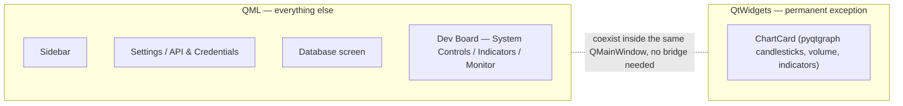
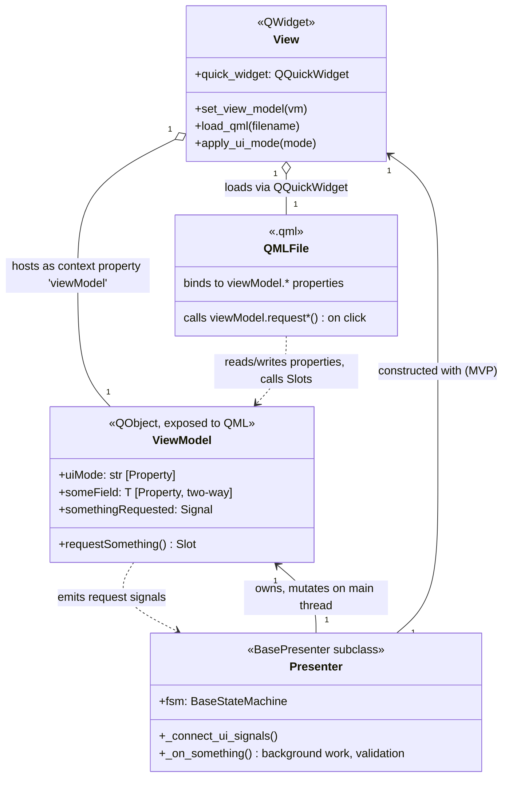
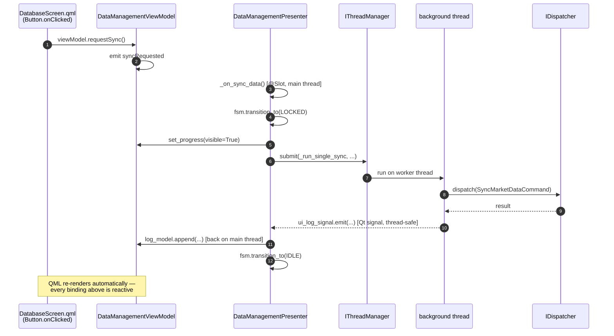
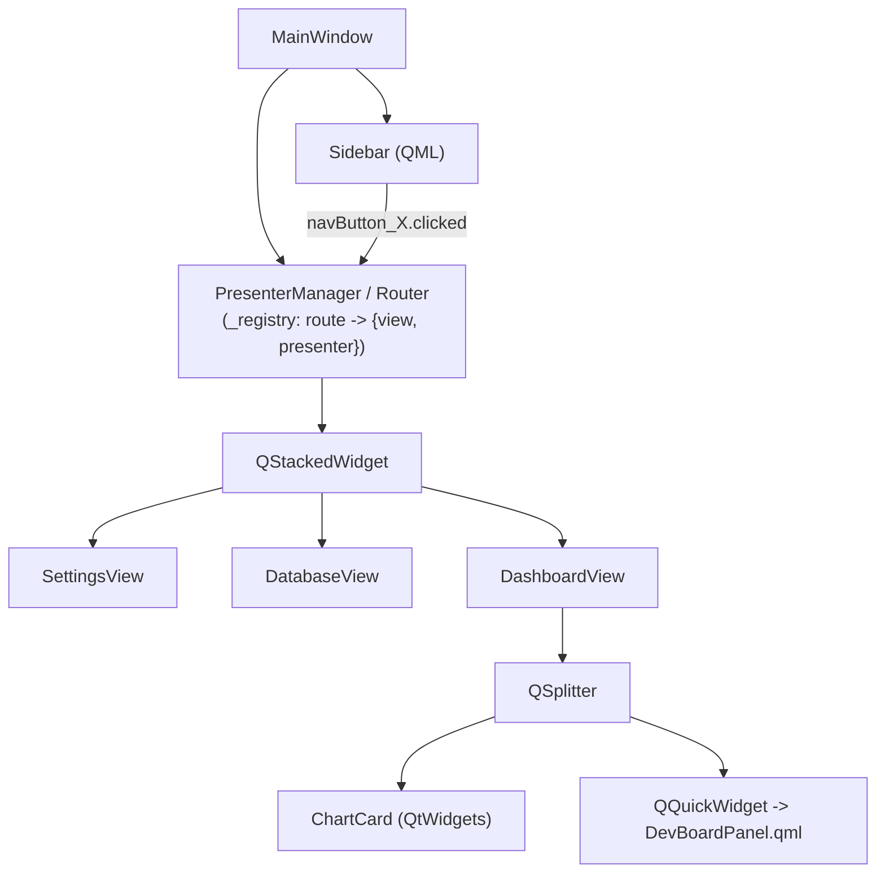
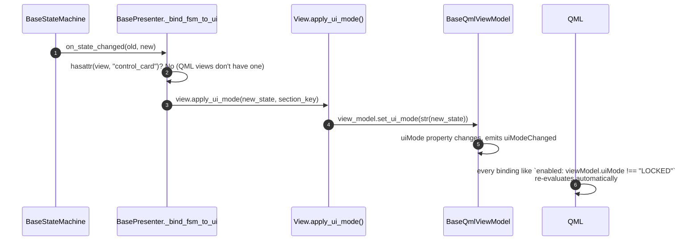
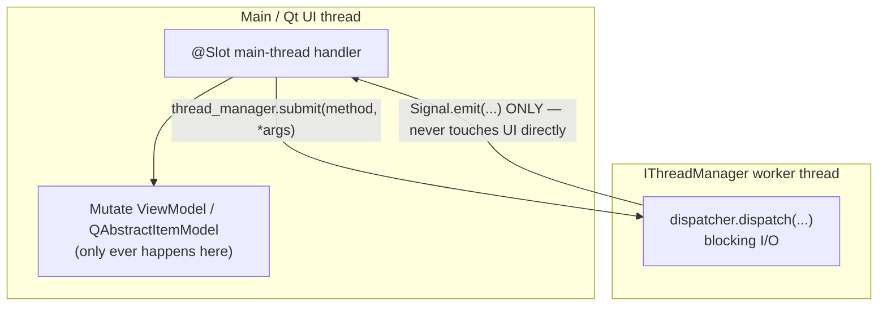
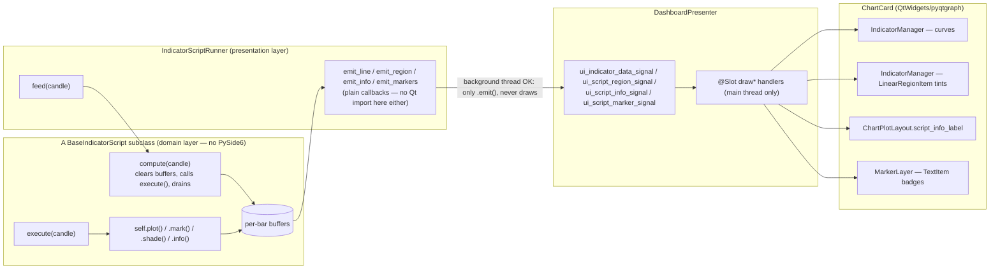

# UI Architecture & Design Philosophy (post-BOT-030)

This documents the desktop UI as it stands after `BOT-030` (full QML
migration). It complements [`architecture.md`](architecture.md), which
covers the CQRS/Event-Driven engine — this file is presentation-layer only.

---

## 1. The one-sentence summary

**Every screen is QML, except the candlestick chart, which is permanently
QtWidgets/pyqtgraph.** Everything else — layout, styling, controls, state
binding — follows a View/ViewModel/Presenter split designed specifically to
make QML screens easy to test without a running GUI and easy to translate
from a visual mockup without drift.

---

## 2. Why QML at all (and why not for the chart)

Two *different* motivations pushed this app toward QML, in two separate
decisions:

1. **Not performance.** An earlier chart pan/zoom stutter was diagnosed and
   fixed — it was an O(N)-per-frame Python algorithm (Y-autorange recompute,
   full-history repaint), not a QtWidgets-vs-QML rendering cost. Rewriting
   the chart in QML would not have fixed it and wasn't attempted.
2. **Mockup-to-code fidelity.** QML's styling is inline and declarative
   (`color:`, `radius:`, `anchors:` live on the component itself). The
   QtWidgets equivalent splits the same information across a Python
   constructor *and* a separate global `style.qss` matched by `objectName` —
   an indirection that is a real source of drift when an AI (or a human)
   translates a visual mockup into code.

**The chart stays QtWidgets/pyqtgraph on purpose, permanently:**
pyqtgraph has no QML equivalent, a full rewrite would be high-risk for zero
proven upside, and the one performance bug that ever existed there is
already fixed. This is a stable architectural boundary, not a
migration-in-progress state.



---

## 3. Layer architecture: View / ViewModel / Presenter

Every QML screen follows the same three-layer split. The **View** is a thin
host with no logic; the **ViewModel** is a pure Qt `QObject` holding state
and signals with zero I/O; the **Presenter** owns orchestration, validation,
and every side effect.



**The rule that keeps this from rotting:** the ViewModel never talks to
`IConfig`/`IDispatcher`/`IThreadManager` directly, and the QML file never
calls anything except `viewModel.*`. A button doesn't call the Presenter —
it calls a `request*()` Slot on the ViewModel, which just re-emits a
Signal; only the Presenter is connected to that Signal. This one extra hop
is what keeps the ViewModel testable as plain Python state and keeps QML
files free of business logic.



---

## 4. Screen inventory

| Screen | Route key | View | ViewModel | QML file(s) |
|---|---|---|---|---|
| Sidebar | *(shell, not routed)* | `components/sidebar/sidebar.py` | `SidebarViewModel` (plain `QObject`, no FSM) | `Sidebar.qml` |
| API & Credentials | `settings` | `SettingsView(QmlHostView)` | `SettingsViewModel` | `SettingsScreen.qml` |
| Database | `data_management` | `DataManagementView(QmlHostView)` | `DataManagementViewModel` | `DatabaseScreen.qml` |
| Dev Board | `dashboard` | `DashboardView(BaseView)` — hybrid `QSplitter` | `DashboardQmlViewModel` | `DevBoardPanel.qml` |
| *(inside Dev Board)* | — | `ChartCard` — **QtWidgets, not QML** | — | — |

Sidebar isn't a routed screen — it's part of `MainWindow`'s permanent
shell, alongside the `QStackedWidget` the router swaps pages into.

---

## 5. Routing: unchanged since `BOT-028`

`PresenterManager` only requires a route's View to be a `QWidget` — it has
never needed to know whether that widget hosts QML or Widgets internally.
This was proven in `BOT-028` and never had to change across the whole
migration:



---

## 6. FSM → UI state: one property instead of a JSON matrix

Before this migration, `UIMatrixMixin` reflected FSM state into widget
`enabled`/`visible` flags via `ui_matrix.json` (a per-screen JSON table of
`{state: {widget_name: bool}}`). QML screens don't use that anymore — the
Presenter's FSM drives a single `uiMode` string property, and each `.qml`
file binds directly to it. `BasePresenter` in `sagittarius_engine` needed
**zero changes** for this: it already duck-typed `view.apply_ui_mode(mode,
section)` as a fallback when the view has no `control_card`, and every
`QmlHostView` (plus `DashboardView`, by hand) implements exactly that
method.



`ui_matrix.json` has since been deleted — once the last QtWidgets screen
(`ControlCard`) moved to QML, nothing read it anymore.

---

## 7. Shared QML infrastructure (`sagittarius_engine.extensions.pyside_mvc`)

Built once, reused by every screen. Originally kept *inside* `Sagittarius_Elite_Warrior`
(`screens/_qml_shared/`) until a second real QML consumer arrived — see §9
— at which point it was promoted into the shared `sagittarius_engine`
framework (`extensions/pyside_mvc/QmlShared/`) and this app switched to
importing it from there. `ThemeBridge` and `IconImageProvider` were
generalized in the move: the engine has no opinion on this app's own color
vocabulary or icon set, so both now take this app's `Palette`/`IconLoader`
as arguments (via `configure_app_qml()`, called once in
`app_bootstrapper.py`) rather than importing them directly.

```mermaid
classDiagram
    class ThemeBridge {
        <<QQmlPropertyMap singleton, sagittarius_engine>>
        exposes whatever palette dict the app passes to configure_app_qml()
    }
    class QmlHostView {
        <<BaseView subclass>>
        +quick_widget: QQuickWidget
        +set_view_model(vm)
        +load_qml(filename)
        +apply_ui_mode(mode)
    }
    class create_quick_widget {
        <<factory function>>
        pins QQuickStyle "Basic"
        registers Theme context property
        registers icons:// image provider
    }
    class BaseQmlViewModel {
        <<QObject base>>
        +uiMode: str [Property, notify]
        +set_ui_mode(mode)
    }
    class IconImageProvider {
        <<QQuickImageProvider>>
        serves image://icons/name/color
    }
    class LogListModel {
        <<QAbstractListModel>>
        +append(message, level)
        +clear() [Slot, callable from QML]
    }
    class LogPanelQml {
        <<LogPanel.qml>>
        header + event-count badge + Clear button + ListView
    }

    QmlHostView --> create_quick_widget : __init__ calls
    DashboardView ..> create_quick_widget : also calls directly<br/>(hybrid QSplitter, not a QmlHostView)
    create_quick_widget --> ThemeBridge : registers as "Theme"
    create_quick_widget --> IconImageProvider : registers as "icons"
    BaseQmlViewModel <|-- SettingsViewModel
    BaseQmlViewModel <|-- DataManagementViewModel
    BaseQmlViewModel <|-- DashboardQmlViewModel
    LogPanelQml --> LogListModel : logModel: viewModel.logModel
    DataManagementViewModel --> LogListModel : owns one (sync log)
    DashboardQmlViewModel --> LogListModel : owns one (system monitor)
```

Key pieces:

- **`ThemeBridge`** — a `QQmlPropertyMap` exposing whatever palette dict
  `configure_app_qml()` was given as `Theme.accent`, `Theme.bgCard`, etc.,
  so no `.qml` file hardcodes a hex color. This app builds that dict from
  `Palette.as_ui_dict()` (`assets/palette.py`) — one Python source of truth
  for both QtWidgets (`style.qss`, hand-kept in sync) and QML.
- **`create_quick_widget()`** — pins the Qt Quick Controls style to
  `"Basic"` (the native "Windows" style silently ignores all
  `background:`/`contentItem:` overrides), adds the engine's `QmlShared`
  QML module to the import path, and wires the `Theme` singleton and the
  icon provider from the app's `configure_app_qml()` call. Both
  `QmlHostView` and the Dev Board's hybrid `DashboardView` call this —
  factored out so the hybrid case doesn't hand-roll a partial copy of the
  setup.
- **`BaseQmlViewModel`** — every screen's ViewModel subclasses this to get
  the `uiMode` property for free (§6).
- **`IconImageProvider`** — bridges an app-supplied `IIconLoader` (this
  app's own Lucide-SVG `IconLoader`: recolor + cache) into QML's
  `image://icons/<name>/<color>` URL scheme; the color-token vocabulary is
  this app's `Palette.as_icon_dict()`, passed in via `configure_app_qml()`.
- **`LogListModel` + `LogPanel.qml`** (`import QmlShared 1.0` in QML) — one
  shared, bounded (500-entry) timestamped log list, used by both the
  Database sync log and the Dev Board's system monitor. Replaced two
  near-identical `MonitorCard`-style widgets with one component.

---

## 8. Threading contract (unchanged by the migration)

QML changed *how* the UI is declared; it changed nothing about how
background work is allowed to touch it. This was true before `BOT-030` and
remains true for every screen:



A background method may **only** call `some_signal.emit(...)`. It never
calls `view_model.some_property = x` or touches a `QAbstractItemModel`
directly — that always happens in a `@Slot`-decorated method connected to
that signal, guaranteed to run on the main thread.

---

## 9. What got promoted, and what's still deliberately local

The shared QML infrastructure described in §7 stayed local to `Sagittarius_Elite_Warrior`
(`screens/_qml_shared/`) through the end of `BOT-030` — a conscious call,
not an oversight: a repo-wide check at the time found no other app using
`pyside_mvc` at all, and promoting a pattern to a shared framework package
with a single real consumer is generalizing before there's a second data
point to generalize *from* (the same trap `BOT-028`'s retro already
flagged once, "wait for QML screen #2"). The trigger for promotion was
always meant to be a second app that actually needs to host QML, not a
count of screens within this one app — and that second app is what
triggered the actual promotion into `sagittarius_engine.extensions.pyside_mvc.QmlShared`
(§7). `ThemeBridge` and `IconImageProvider` couldn't move verbatim, since
their property names and palette imports were this app's own vocabulary,
not the engine's — they were generalized to take that vocabulary as
arguments instead (`configure_app_qml()`).

Two related things were left alone, for the same "wait for a real second
consumer" reason that applied to `_qml_shared` until now:

- **`dev.mode` auto click-logging** (`_ButtonClickWatcher` in
  `sagittarius_engine`) only finds real `QPushButton` instances via
  `QWidget.findChildren()` — it cannot see buttons living inside a
  `QQuickWidget`'s QML scene graph. True since the first QML screen,
  explicitly pinned by a test rather than silently losing coverage. Not
  "fixed" because that would mean changing shared framework code for one
  app's convenience.
- **`UIMatrixMixin`** stays in `sagittarius_engine` even though nothing in
  `Sagittarius_Elite_Warrior` uses it anymore — it's a framework primitive available to a
  future non-QML consumer, not dead code belonging to this app.

---

## 10. Testing philosophy for QML screens

- Prefer **real objects over mocks** wherever they're pure state — a real
  `SettingsViewModel`, a real `LogListModel` — mocking is reserved for
  genuine external dependencies (`IConfig`, `IDispatcher`,
  `IThreadManager`).
- Drive QML the same way a user would: find the item by `objectName` via a
  shared `qml_item`/`walk_qml_items` test helper (Repeater delegates are
  **not** `QObject` children, so `findChild()` alone misses them — this
  helper walks the *visual* `childItems()` tree instead), then
  `.clicked.emit()` it.
- End-to-end tests go through the real `BasePresenter`/FSM chain, not just
  a direct call to the target method — e.g. clicking "Sync" in
  `DatabaseScreen.qml` and asserting the Presenter's FSM actually reached
  `LOCKED`.
- Screenshot-verify visually in addition to assertions, using an offscreen
  `QT_QPA_PLATFORM=offscreen` driver + `window.grab()`, for every phase of
  every screen migration.

---

## 11. Custom indicator scripts (`BOT-032`) — user-extensible chart studies

The Dev Board's RSI/EMA/MACD checkboxes are each ~4 hand-wired places
(`dashboard_presenter.py`, `dashboard_view_model.py`, `DevBoardPanel.qml`).
`BOT-032` adds a **second, user-extensible path** alongside them: a plain
Python class, written like a TradingView Pine Script study, that appears in
the Dev Board's UI automatically — no QML change, no Presenter change —
the moment it's registered.

### Writing a new script — 3 steps

1. **Create a file** under `domain/indicator_scripts/`, subclassing
   `BaseIndicatorScript`. Declare indicators in `setup()`, compute and call
   `self.plot()`/`self.mark()`/`self.shade()`/`self.info()` in `execute()`.
   `dev_indicator_script.py` is the reference — it exercises all 15
   techniques the base class supports, each mapped to its Pine equivalent
   in its own docstring table.
2. **Register it** — one line in `binance_bot_module.py::register()`:
   `script_registry.register("my_script", MyScript)`. Deliberately
   explicit, not an auto-scanned directory (same reasoning as every other
   DI registration in this app — greppable, reviewable, and a guard test
   catches a script class that forgot this step).
3. **Nothing else.** `DashboardPresenter` populates
   `viewModel.scriptModel` from `IndicatorScriptRegistry.available()` at
   construction time, and `DevBoardPanel.qml`'s Repeater renders one
   checkbox per available script — the new study appears in the "CUSTOM
   SCRIPTS" list the next time the app runs.

### Why a script is a plain object, not a signal-emitting one

A script never touches Qt, a chart, or a signal. `self.plot(...)` only
writes into a buffer *inside the script instance itself*; nothing is drawn
by that call. This indirection is what keeps a script pure enough to unit
test by just calling `compute()` and reading the return value, and what
lets the exact same script run identically in a historical batch replay and
a live incremental tick — there is only one code path, `compute()`, and
whether it's called once per stored candle or once per live tick is
invisible to the script.



### What each output primitive draws

| Script call | Chart result | Notes |
|---|---|---|
| `self.plot(value, name, color)` | A curve — overlay on the price plot if `overlay=True`, or its own subplot row if `False` | `value=None` skips the bar (Pine's `na`); no placeholder point is drawn |
| `self.mark(value, text, color, direction)` | A colored label badge at that bar | Always drawn on the main price plot regardless of `overlay` — a marker's value is read against visible price action, not the owning script's own scale |
| `self.shade(color, opacity)` | A background tint spanning that bar | Consecutive same-color/opacity bars merge into one span (`ScriptRegionTracker`) rather than one shape per bar |
| `self.info(label, value, color)` | A row in the shared status panel (top-right of the chart) | Only the most recent bar's rows are shown — same idea as Pine's `table.cell` redrawing every bar |

Curve names are namespaced `f"{script_key}:{line_name}"`
(`indicator_script_runner.qualified_line_name`) so a script's lines can
never collide with RSI/EMA/MACD's bare names, or with another script's line
of the same name.

### Design left open for strategies

`domain/scripting/` (the `Series`/`crossed_above`/`Streak` primitives) is
factored out of `domain/indicator_scripts/` specifically so a future
`BaseStrategyScript` can reuse it without moving files — a strategy is the
same `setup()`/`execute()`/pure-compute shape, just producing `Signal`s
instead of plotted lines. `IndicatorScriptRegistry`'s explicit
`register()`/`create()`/`available()` shape is meant to be copied wholesale
into a `StrategyScriptRegistry`, not generalized into a shared
`ScriptRegistry[T]` ahead of a second real consumer (this repo's established
YAGNI precedent — see `IIndicator` never growing a `reset()` method it
didn't need yet).
