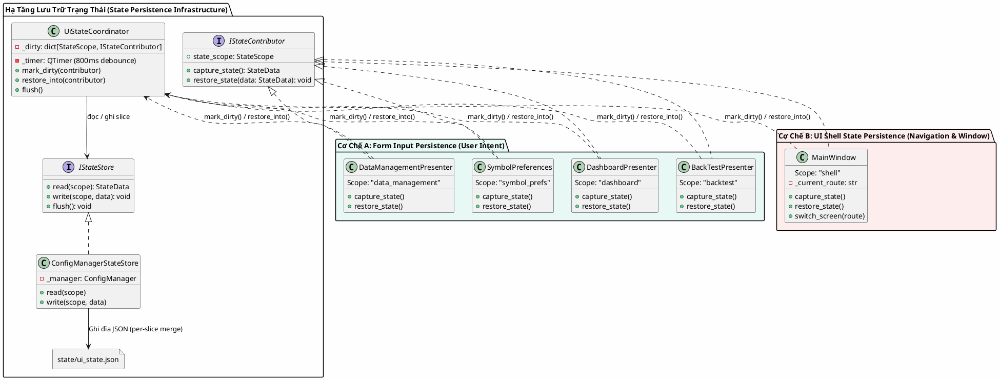
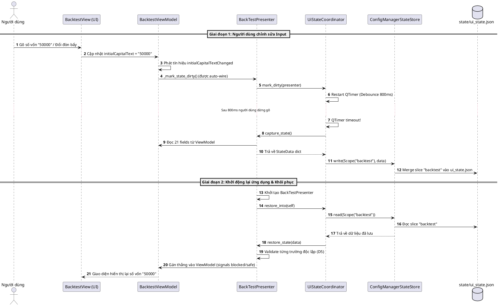
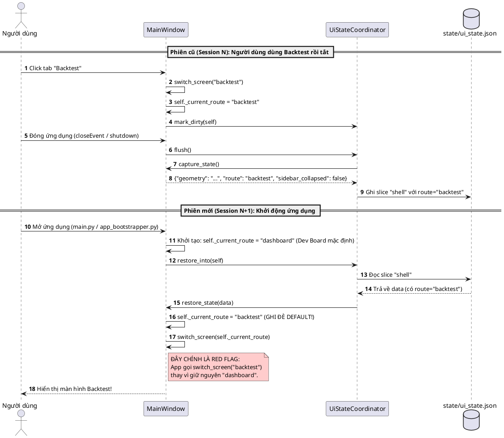

# THIẾT KẾ CHI TIẾT: CƠ CHẾ LƯU FORM INPUT VS UI SHELL STATE

Tài liệu này phân tích chi tiết 2 cơ chế persistence đang cùng hoạt động dưới hạ tầng `UiStateCoordinator` (được triển khai từ `EPIC-010`), chỉ rõ vị trí mã nguồn, sơ đồ PlantUML và nguyên nhân gây ra hành vi mở app bị nhảy vào Backtest.

---

## 1. TỔNG QUAN HỆ THỐNG (SYSTEM OVERVIEW)

Toàn bộ việc lưu trữ trạng thái giao diện hiện tại đều đi qua một hạ tầng chung (`UiStateCoordinator` + `ConfigManagerStateStore`), ghi vào file `state/ui_state.json`. Tuy nhiên, về mặt bản chất nghiệp vụ, hệ thống đang gộp **2 cơ chế hoàn toàn khác nhau**:

1. **Cơ chế A: Form Input Persistence (Dữ liệu đầu vào của người dùng - User Intent)**:
   - Lưu trữ các giá trị người dùng tốn công nhập liệu (vốn ban đầu, symbol, timeframe, strategy, commission, leverage, checklist indicators...).
   - **Mục đích:** Tiện dụng, giúp người dùng không phải nhập lại cấu hình kiểm thử mỗi lần mở màn hình.
   - **Phạm vi:** Nằm cục bộ trong từng màn hình (`backtest`, `dashboard`, `data_management`, `symbol_prefs`).

2. **Cơ chế B: UI Shell State Persistence (Trạng thái vỏ ứng dụng & Điều hướng)**:
   - Lưu trữ trạng thái của cửa sổ `MainWindow`: Kích thước/toạ độ cửa sổ (`geometry`), trạng thái đóng/mở sidebar (`sidebar_collapsed`), và **màn hình mở lần cuối (`current_route`)**.
   - **Mục đích ban đầu (EPIC-010C):** Giữ nguyên không gian làm việc như khi người dùng vừa rời đi.
   - **Tác dụng phụ (Red Flag):** Ghi đè màn hình khởi động mặc định (`_DEFAULT_ROUTE = "dashboard"`), tự động điều hướng sang `backtest` khi vừa mở app.

---

## 2. SƠ ĐỒ KIẾN TRÚC TỔNG THỂ (PLANTUML COMPONENT DIAGRAM)



---

## 3. CHI TIẾT CƠ CHẾ A: FORM INPUT PERSISTENCE

### 3.1 Bản chất hoạt động
* Chỉ lưu trữ **dữ liệu cấu hình nghiệp vụ (Business Inputs)** do người dùng chọn hoặc gõ.
* Tuân thủ triệt để nguyên tắc **"Restore is a request, not a command"**:
  - Không bao giờ gán thẳng vào UI Widget để tránh kích hoạt signal fetch dữ liệu ngầm.
  - Gán vào ViewModel kèm validation độc lập cho từng trường (một trường hỏng/lỗi thời không kéo theo hỏng cả form).
  - Tự động debounce 800ms để không ghi đĩa dồn dập khi đang gõ phím.

### 3.2 Vị trí mã nguồn cụ thể (Code Locations)

| Thành phần | Đường dẫn file & Dòng code | Trách nhiệm |
| :--- | :--- | :--- |
| **Khai báo 21 trường input Backtest** | [`src/presentation/ui/screens/backtest/backtest_state_fields.py:L155-L217`](file:///c:/Users/hoang/Documents/Gemini/Sagittarius-Elite-Warrior/src/presentation/ui/screens/backtest/backtest_state_fields.py#L155-L217) | Định nghĩa bảng `BACKTEST_STATE_FIELDS` (capital, symbol, timeframe, strategy, commission, leverage, time range, timezone...) kèm hàm validate cho từng trường. |
| **Capture & Restore Backtest** | [`src/presentation/ui/screens/backtest/state_persistence.py:L22-L65`](file:///c:/Users/hoang/Documents/Gemini/Sagittarius-Elite-Warrior/src/presentation/ui/screens/backtest/state_persistence.py#L22-L65) | `capture()`: đọc từ ViewModel ra dict. <br>`restore()`: validate từng field rồi gán ngược lại ViewModel. |
| **Auto-wiring bắt thay đổi Input** | [`src/presentation/ui/screens/backtest/signal_wiring.py:L169-L192`](file:///c:/Users/hoang/Documents/Gemini/Sagittarius-Elite-Warrior/src/presentation/ui/screens/backtest/signal_wiring.py#L169-L192) | `connect_state_tracking()`: lặp qua các field và kết nối `<prop>Changed` của ViewModel vào `presenter._mark_state_dirty`. |
| **Dashboard Inputs (Dev Board)** | [`src/presentation/ui/screens/dashboard/dashboard_presenter.py:L614-L645`](file:///c:/Users/hoang/Documents/Gemini/Sagittarius-Elite-Warrior/src/presentation/ui/screens/dashboard/dashboard_presenter.py#L614-L645) | Lưu `symbol`, `interval`, `lookback_days`, `scripts_enabled`, `scripts_touched`. |
| **Database Inputs** | [`src/presentation/ui/screens/data_management/data_management_presenter.py:L453-L485`](file:///c:/Users/hoang/Documents/Gemini/Sagittarius-Elite-Warrior/src/presentation/ui/screens/data_management/data_management_presenter.py#L453-L485) | Lưu `selectedSymbol`, `selectedInterval`. |
| **Symbol Preferences** | [`src/presentation/ui/components/symbol_picker/preferences.py:L153-L162`](file:///c:/Users/hoang/Documents/Gemini/Sagittarius-Elite-Warrior/src/presentation/ui/components/symbol_picker/preferences.py#L153-L162) | Lưu danh sách mã yêu thích (favorites) và gần đây (recents). |

### 3.3 Sơ đồ tuần tự: Vòng đời lưu và khôi phục Input (PlantUML)



---

## 4. CHI TIẾT CƠ CHẾ B: UI SHELL STATE PERSISTENCE (NGUỒN GỐC RED FLAG)

### 4.1 Bản chất hoạt động
* Được sinh ra từ task **EPIC-010C (Shell State)**.
* `MainWindow` được gán làm một `IStateContributor` với scope `"shell"`.
* Lưu 3 thông tin chính:
  1. `geometry`: Toạ độ và kích thước cửa sổ desktop (dạng Base64 QByteArray).
  2. `sidebar_collapsed`: Thanh sidebar bên trái đang mở rộng hay thu gọn (bool).
  3. **`current_route`**: Tên route của màn hình đang hiển thị (string: `"dashboard"`, `"backtest"`, `"database"`, `"settings"`).

### 4.2 Tại sao mở app lại vào thẳng màn hình Backtest?
1. Trong lúc dùng app ở phiên trước, bạn bấm sang tab **Backtest**.
2. Hàm `switch_screen("backtest")` được gọi, cập nhật `self._current_route = "backtest"` và gọi `self._mark_dirty()`.
3. Khi tắt app, `MainWindow.capture_state()` đóng gói `"route": "backtest"` và lưu vào `ui_state.json`.
4. Ở lần khởi động tiếp theo:
   - `MainWindow.__init__` ban đầu đặt `self._current_route = _DEFAULT_ROUTE` (`"dashboard"` - Dev Board).
   - Ngay sau đó, hàm `self._state_coordinator.restore_into(self)` được gọi. Nó đọc file `ui_state.json`, lấy ra `"route": "backtest"` và **ghi đè** lên biến `self._current_route`.
   - Cuối cùng, app thực hiện `self.switch_screen(self._current_route)` -> **Ứng dụng tự động chuyển ngay sang Backtest thay vì hiển thị Dev Board!**

### 4.3 Vị trí mã nguồn cụ thể (Code Locations)

| Hành vi | Đường dẫn file & Dòng code | Đoạn code thực tế |
| :--- | :--- | :--- |
| **Ghi nhận chuyển màn hình** | [`src/presentation/ui/main_window.py:L296-L305`](file:///c:/Users/hoang/Documents/Gemini/Sagittarius-Elite-Warrior/src/presentation/ui/main_window.py#L296-L305) | `switch_screen()` gán `self._current_route = route_name` và gọi `self._mark_dirty()`. |
| **Đóng gói lưu route xuống đĩa** | [`src/presentation/ui/main_window.py:L234-L245`](file:///c:/Users/hoang/Documents/Gemini/Sagittarius-Elite-Warrior/src/presentation/ui/main_window.py#L234-L245) | `capture_state()` lưu key `_ROUTE_KEY: self._current_route`. |
| **Khôi phục ghi đè route** | [`src/presentation/ui/main_window.py:L258-L261`](file:///c:/Users/hoang/Documents/Gemini/Sagittarius-Elite-Warrior/src/presentation/ui/main_window.py#L258-L261) | `restore_state()` đọc `_ROUTE_KEY` và gán lại `self._current_route = route`. |
| **Tự động kích hoạt chuyển màn lúc boot** | [`src/presentation/ui/main_window.py:L202-L204`](file:///c:/Users/hoang/Documents/Gemini/Sagittarius-Elite-Warrior/src/presentation/ui/main_window.py#L202-L204) | Gọi `restore_into(self)` rồi thực thi `self.switch_screen(self._current_route)`. |

### 4.4 Sơ đồ tuần tự: Luồng gây lỗi tự động nhảy màn hình (PlantUML)



---

## 5. SO SÁNH TRỰC DIỆN 2 CƠ CHẾ

| Tiêu chí | Cơ Chế A: Form Input Persistence | Cơ Chế B: UI Shell State Persistence |
| :--- | :--- | :--- |
| **Đối tượng sở hữu** | `BackTestPresenter`, `DashboardPresenter`, `DataManagementPresenter`, `SymbolPreferences` | `MainWindow` (Shell) |
| **Scope trong JSON** | `"backtest"`, `"dashboard"`, `"data_management"`, `"symbol_prefs"` | `"shell"` |
| **Dữ liệu lưu trữ** | Scalar values: `str`, `int`, `float`, `bool`, `list[str]` đại diện cho cấu hình form. | Qt Geometry Base64, boolean sidebar, và string route name. |
| **Tác động hành vi khi mở app** | **Không đổi hành vi:** Màn hình chỉ khôi phục giá trị form khi người dùng chủ động truy cập vào màn hình đó. | **Thay đổi hành vi:** Can thiệp vào luồng boot của app, ép app nhảy sang màn hình khác thay vì màn hình chính. |
| **Đánh giá nghiệp vụ** | Đúng với kỳ vọng của người dùng ("Lưu input để đỡ gõ lại"). | Vi phạm kỳ vọng ("Mở app phải vào trang mặc định Dev Board"). |

---

## 6. PHƯƠNG ÁN KHẮC PHỤC (REFACTORING PROPOSAL)

Để đưa ứng dụng về đúng tôn chỉ **"Chỉ lưu Input, không can thiệp điều hướng màn hình"**, giải pháp rất đơn giản và gọn gàng:

### Thay đổi trong [`src/presentation/ui/main_window.py`](file:///c:/Users/hoang/Documents/Gemini/Sagittarius-Elite-Warrior/src/presentation/ui/main_window.py):

1. **Trong `capture_state()` (L234-L245)**:
   Loại bỏ `_ROUTE_KEY` khỏi dict trả về:
   ```python
   def capture_state(self) -> StateData:
       geometry_b64 = bytes(self.saveGeometry().toBase64().data()).decode("ascii")
       return {
           _GEOMETRY_KEY: geometry_b64,
           # BỎ DÒNG NÀY: _ROUTE_KEY: self._current_route,
           _SIDEBAR_COLLAPSED_KEY: self._sidebar.is_collapsed,
       }
   ```
2. **Trong `restore_state()` (L258-L261)**:
   Loại bỏ khối đọc `_ROUTE_KEY`:
   ```python
   # BỎ KHỐI NÀY:
   # route = data.get(_ROUTE_KEY)
   # if isinstance(route, str) and route in _KNOWN_ROUTES:
   #     self._current_route = route
   ```

### Kết quả đạt được:
* Khi mở app: Luôn luôn kích hoạt `_DEFAULT_ROUTE = "dashboard"` (Dev Board).
* Khi người dùng click sang tab Backtest: Toàn bộ 21 trường input form + indicator scripts đã cấu hình từ trước vẫn được khôi phục 100% nguyên vẹn.
* Giữ được kích thước cửa sổ (`geometry`) và trạng thái sidebar (nếu user muốn).
