# KIẾN TRÚC & THIẾT KẾ CHI TIẾT: SCREEN REGISTRY PATTERN (V2 - ENHANCED)

- **Tài liệu:** Thiết kế Kiến trúc Module Màn hình & Điều hướng Tự động (Screen Registry & Modular Sidebar Pattern)
- **Vị trí lưu trữ:** `Docs/SCREEN-REGISTRY-PATTERN/README.md`
- **Phiên bản:** 2.1 (Bổ sung `ISidebar` Protocol, `Section Sequence`, `select_section()`, `AbstractScreenModule`, và ghi chú thiết kế sau review kiến trúc)
- **Mục tiêu:** Xoá bỏ hoàn toàn thiết kế cứng nhắc (Hard Design) trong `MainWindow`, chuẩn hoá hợp đồng trừu tượng cho Sidebar (`ISidebar`), quản lý phân cấp Section đa tầng (Section Sequence & Item Sequence), và cung cấp `AbstractScreenModule` làm khung chuẩn cho mọi màn hình mới.
- **Trạng thái:** Đề xuất (proposal) — chưa triển khai. Đây là tài liệu Ý TƯỞNG kiến trúc; chi tiết code trong tài liệu là minh hoạ cho ý tưởng, không phải bản implementation cuối cùng.

---

## 1. BỐI CẢNH & CÁC ĐIỂM NÂNG CẤP (UPGRADE MOTIVATIONS)

`MainWindow` hiện tại (`src/presentation/ui/main_window.py`) hard-code hoàn toàn: `_NAV_SECTIONS`/`_BOTTOM_ACTIONS` là hằng module-level, và `_setup_router()` import trực tiếp từng cặp Presenter/View (`dashboard`, `data_management`, `settings`, `backtest`) rồi đăng ký thủ công vào `PresenterManager`. Mỗi màn hình mới đòi hỏi sửa `MainWindow` ở ít nhất 2 chỗ (nav list + router setup) — đây là vấn đề thật, không phải giả định.

Sau khi review thiết kế ban đầu, 3 yêu cầu kiến trúc quan trọng được bổ sung để hoàn thiện hệ thống:

1. **Hợp đồng trừu tượng cho Sidebar (`ISidebar` Protocol):**
   - Trước đây `MainWindow` phụ thuộc trực tiếp vào concrete class `Sidebar` (QWidget).
   - Cần một interface `ISidebar` tường minh để `MainWindow` hoàn toàn độc lập với implementation giao diện của thanh điều hướng (cho phép mock test không cần giao diện đồ hoạ, hoặc đổi kiểu dáng sidebar trong tương lai).
   - Tuân thủ `architecture-rule.md` §2.1: `Protocol` chỉ hợp lệ khi thuộc 1 trong 3 lý do (a) implementer là `QObject` subclass không kế thừa được `ABC`, (b) bị "NO Multiple Inheritance" chặn, (c) implementer bên thứ ba. Với `ISidebar`, lý do đúng là **(b)**: `Sidebar` đã kế thừa `BaseView` (engine, `QObject`-based) nên không thể thêm `ABC` làm base thứ hai — cùng tiền lệ với `ITab` đã có trong repo (`components/sidebar/`). Docstring của `ISidebar` phải ghi rõ lý do này.

2. **Quản lý Section đa tầng (`Section Sequence` & `select_section`):**
   - Khi ứng dụng mở rộng thêm nhiều tính năng (Trading, Backtest, Portfolio, Analytics, AI Signals, System, Admin...), số lượng Section trên Sidebar sẽ tăng lên nhiều.
   - Cần **Section Sequence (thứ tự ưu tiên giữa các nhóm Section)** bên cạnh **Item Sequence (thứ tự các mục con bên trong Section)** để Sidebar luôn hiển thị theo thứ tự mong muốn mà không bị lộn xộn.
   - Hỗ trợ API `select_section(section_key)` trên `ISidebar` để accordion mở/thu gọn nhóm, hoặc focus vào một section cụ thể.
   - **Ghi chú quan trọng:** `components/sidebar/` hiện đã có `SidebarSection` (title + `tuple[ITab, ...]`) — tức cấu trúc hai tầng section→item đã tồn tại một phần. Thiết kế Section Sequence ở tài liệu này nên được xem là **mở rộng** của `SidebarSection`/`ITab` hiện có (thêm field thứ tự), không phải một hệ khái niệm hoàn toàn tách biệt — tránh lặp lại tình trạng "hai hợp đồng cùng ý nghĩa trôi độc lập" mà repo này đã gặp trước đây (xem `CLAUDE.md`, mục cảnh báo về bản-sao-trôi). Quyết định gộp hay tách hai layer này là việc cần chốt ở bước thiết kế chi tiết, không phải khi implement.

3. **`AbstractScreenModule` (Khung chuẩn hoá cho mọi màn hình):**
   - Thay vì chỉ có interface lỏng lẻo, cung cấp một **Abstract Base Class (`AbstractScreenModule`)**.
   - Developer khi viết màn hình mới chỉ cần kế thừa lớp này, override các thuộc tính rõ ràng (`route`, `title`, `icon`, `section`, `create_view`, `create_presenter`). Hệ thống tự động lo việc chuyển đổi thành descriptor và đăng ký vào router.
   - `PresenterManager.register()` ở engine hiện **cố ý duck-typed** (xem ghi chú trong `i_state_contributor.py`) — nghĩa là engine không ép base class cho presenter/view. `AbstractScreenModule` là một lớp **chỉ tồn tại phía Elite** (adapter layer), không đòi hỏi sửa engine; cần xác nhận điều này khi đối chiếu với `Sagittarius_Engine` thật trước khi khoá thiết kế.

---

## 2. SƠ ĐỒ LỚP TỔNG THỂ (PLANTUML CLASS DIAGRAM)

```plantuml
@startuml
allowmixing
skinparam classAttributeIconSize 0
skinparam backgroundColor #FEFEFE
skinparam handwritten false
skinparam packageStyle rectangle

package "Contracts & Ports (Core Abstractions)" #F4F6F6 {
    enum NavLocation {
        TOP_SECTION
        BOTTOM_ACTION
    }

    class SectionDescriptor <<Value Object>> {
        +key: str
        +title: str
        +sequence: int
        +is_collapsible: bool
        +is_expanded: bool
    }

    class NavMetadata <<Value Object>> {
        +title: str
        +icon: str
        +section_key: str
        +section_sequence: int
        +item_sequence: int
        +location: NavLocation
        +is_navigable: bool
    }

    class ScreenDescriptor <<Value Object>> {
        +route: str
        +presenter_class: type
        +view_factory: Callable[[], object]
        +nav: NavMetadata | None
        +is_default: bool
        --
        +has_nav(): bool
    }

    abstract class AbstractScreenModule <<(A,#A9CCE3) Abstract Base Class>> {
        +{abstract} route: str
        +{abstract} title: str
        +{abstract} icon: str
        +section_key: str
        +section_sequence: int
        +item_sequence: int
        +location: NavLocation
        +is_default: bool
        +{abstract} create_view(container: IContainer): BaseView
        +{abstract} create_presenter(view: BaseView, container: IContainer): BasePresenter
        +build_descriptor(container: IContainer): ScreenDescriptor
    }

    interface ISidebar <<(P,#F9E79F) Protocol>> {
        +{abstract} sig_navigate: SignalInstance
        +{abstract} collapsed_changed: SignalInstance
        +{abstract} is_collapsed: bool
        +{abstract} set_collapsed(collapsed: bool): void
        +{abstract} set_active(route_name: str): void
        +{abstract} select_section(section_key: str): void
        +{abstract} set_navigation(sections: Sequence[NavSection], bottom_actions: Sequence[NavItem]): void
    }

    abstract class IScreenRegistry <<(A,#A9CCE3) Interface>> {
        +{abstract} register(descriptor: ScreenDescriptor): None
        +{abstract} register_module(module: AbstractScreenModule, container: IContainer): None
        +{abstract} get(route: str): ScreenDescriptor
        +{abstract} get_all(): Sequence[ScreenDescriptor]
        +{abstract} get_default_route(): str
        +{abstract} build_sidebar_navigation(): tuple[Sequence[NavSection], Sequence[NavItem]]
        +{abstract} bind_to_router(router: PresenterManager): None
    }
}

package "Implementation (Adapters)" #E8F8F5 {
    class ScreenRegistry {
        -_descriptors: dict[str, ScreenDescriptor]
        -_sections: dict[str, SectionDescriptor]
        -_default_route: str | None
        +register(descriptor: ScreenDescriptor): None
        +register_module(module: AbstractScreenModule, container: IContainer): None
        +register_section(section: SectionDescriptor): None
        +get(route: str): ScreenDescriptor
        +get_all(): Sequence[ScreenDescriptor]
        +get_default_route(): str
        +build_sidebar_navigation(): tuple[Sequence[NavSection], Sequence[NavItem]]
        +bind_to_router(router: PresenterManager): None
    }

    class Sidebar <<QWidget>> {
        -_view_model: SidebarViewModel
        +sig_navigate: SignalInstance
        +collapsed_changed: SignalInstance
        +is_collapsed: bool
        +set_collapsed(collapsed: bool): void
        +set_active(route_name: str): void
        +select_section(section_key: str): void
        +set_navigation(sections, bottom_actions): void
    }
}

package "Concrete Modules" #EBF5FB {
    class DashboardScreenModule {
        +route: str = "dashboard"
        +create_view(c): DashboardView
        +create_presenter(v, c): DashboardPresenter
    }
    class BacktestScreenModule {
        +route: str = "backtest"
        +create_view(c): BackTestView
        +create_presenter(v, c): BackTestPresenter
    }
    class DatabaseScreenModule {
        +route: str = "data_management"
        +create_view(c): DataManagementView
        +create_presenter(v, c): DataManagementPresenter
    }
    class SettingsScreenModule {
        +route: str = "settings"
        +create_view(c): SettingsView
        +create_presenter(v, c): SettingsPresenter
    }
}

package "Shell UI" #FDEDEC {
    class MainWindow <<QMainWindow>> {
        -_registry: IScreenRegistry
        -_sidebar: ISidebar
        -_router: PresenterManager
        +switch_screen(route_name: str): None
    }
}

' Quan hệ thừa kế
AbstractScreenModule <|-- DashboardScreenModule
AbstractScreenModule <|-- BacktestScreenModule
AbstractScreenModule <|-- DatabaseScreenModule
AbstractScreenModule <|-- SettingsScreenModule

IScreenRegistry <|.. ScreenRegistry
ISidebar <|.. Sidebar

' Quan hệ dữ liệu
ScreenRegistry o-- "0..*" ScreenDescriptor
ScreenRegistry o-- "0..*" SectionDescriptor
ScreenDescriptor *-- "0..1" NavMetadata
NavMetadata *-- "1" NavLocation
AbstractScreenModule ..> ScreenDescriptor : sinh ra qua build_descriptor()

' Quan hệ Shell
MainWindow o-- IScreenRegistry
MainWindow o-- ISidebar
MainWindow ..> ScreenRegistry : gọi build_sidebar_navigation() & bind_to_router()
@enduml
```



---

## 3. ĐẶC TẢ CHI TIẾT CÁC HỢP ĐỒNG TRỪU TƯỢNG (CONTRACT SPECIFICATIONS)

### 3.1 `SectionDescriptor` & `NavMetadata` (Quản lý thứ tự đa tầng)

Khi số lượng màn hình và Section tăng cao, thứ tự hiển thị cần được giải quyết bằng 2 cấp `sequence`:
1. **Section Sequence:** Quyết định vị trí của nhóm Section trên thanh Sidebar (ví dụ: `TRADING` sequence=10, `DATA` sequence=20, `SYSTEM` sequence=90).
2. **Item Sequence:** Quyết định vị trí của từng nút màn hình bên trong Section đó (ví dụ: trong `TRADING` thì `Dev Board` item_sequence=1, `Backtest` item_sequence=2).

**Quy tắc sở hữu (ownership) của `section_sequence`:** vì nhiều module khác nhau có thể khai `section_key` trùng nhau (nhiều màn hình cùng nhóm), giá trị `section_sequence` hiệu lực của một Section phải có **một nguồn sự thật duy nhất**. Đề xuất: `section_sequence` khai trên từng `AbstractScreenModule` chỉ là gợi ý mặc định cho lần đăng ký đầu tiên; nếu về sau có `register_section()` khai tường minh hoặc phát hiện xung đột giá trị giữa các module cùng section, hệ thống phải báo lỗi rõ ràng thay vì âm thầm lấy giá trị của module đăng ký trước — quyết định "ai thắng" khi có xung đột cần chốt tường minh trong tài liệu, không để phụ thuộc ngầm vào thứ tự gọi `register_module()`.

**Quy tắc tie-break:** khi hai item trong cùng section có `item_sequence` bằng nhau, thứ tự hiển thị cần xác định được (ví dụ fallback theo `route` alphabet) để kết quả sort là deterministic, không phụ thuộc thứ tự dict/insertion.

```python
from dataclasses import dataclass
from enum import Enum

class NavLocation(str, Enum):
    """Vị trí đặt nút điều hướng trên Sidebar."""
    TOP_SECTION = "TOP_SECTION"       # Nằm trong các nhóm Section cuộn phía trên
    BOTTOM_ACTION = "BOTTOM_ACTION"   # Ghim cố định dưới đáy Sidebar (VD: Settings, Logout)

@dataclass(frozen=True, slots=True)
class SectionDescriptor:
    """Đặc tả một nhóm Section trên Sidebar."""
    key: str                          # Mã định danh (VD: "trading", "data", "system")
    title: str                        # Tiêu đề hiển thị (VD: "TRADING", "DATA MANAGEMENT")
    sequence: int = 100               # Trọng số sắp xếp Section (nhỏ hơn xếp trước)
    is_collapsible: bool = False      # Cho phép accordion đóng/mở khi có quá nhiều section
    is_expanded: bool = True          # Trạng thái mở rộng ban đầu

@dataclass(frozen=True, slots=True)
class NavMetadata:
    """Metadata của một mục điều hướng trên Sidebar."""
    title: str                        # Tên hiển thị (VD: "Dev Board", "Backtest Engine")
    icon: str                         # Tên icon Feather/SVG (VD: "layout-dashboard", "bar-chart-2")
    section_key: str = "navigation"   # Mã section chứa mục này
    section_sequence: int = 100       # Thứ tự của section (dùng để sort section)
    item_sequence: int = 100          # Thứ tự của item bên trong section (dùng để sort items)
    location: NavLocation = NavLocation.TOP_SECTION
    is_navigable: bool = True         # True: cho phép click chuyển tab; False: placeholder/disable
```

---

### 3.2 `ISidebar` (Protocol cho Thanh Điều Hướng)

Theo quy tắc `architecture-rule.md` §2.1, vì `Sidebar` đã kế thừa `BaseView` (engine, `QObject`-based) nên không thể thêm `ABC` làm base thứ hai — lý do (b) trong bảng phân loại của rule, cùng tiền lệ với `ITab` đã tồn tại trong repo. Vì vậy `ISidebar` được thiết kế dưới dạng **`typing.Protocol`** với `@runtime_checkable`, và docstring phải nêu rõ lý do (b) này thay vì diễn giải chung chung kiểu "xung đột metaclass Shiboken".

**Ghi chú kiểm chứng hợp đồng:** `presentation/` bị loại khỏi cổng mypy trong repo này (xem `architecture-rule.md` §2.1), nên `Protocol` không có gì tự động ép `Sidebar` phải tuân thủ đúng chữ ký ngoài review bằng mắt. Ý tưởng thiết kế nên đi kèm chủ trương: có một bài test hợp đồng hai chiều (đối chiếu AST/chữ ký giữa `ISidebar` và `Sidebar`) tương tự tiền lệ `test_backtest_view_contract.py` đã có trong repo — chi tiết cách viết test để ở bước implementation, nhưng ý tưởng "cần cơ chế khoá hợp đồng" nên được chốt ngay ở tài liệu thiết kế.

```python
from typing import Protocol, runtime_checkable
from collections.abc import Sequence
from PySide6.QtCore import SignalInstance
from Sagittarius_Elite_Warrior.src.presentation.ui.components.sidebar import NavItem, NavSection

@runtime_checkable
class ISidebar(Protocol):
    """Hợp đồng trừu tượng của thanh Sidebar, tách biệt hoàn toàn khỏi implementation.

    Protocol (không phải ABC) vì Sidebar đã kế thừa BaseView (QObject-based);
    xem architecture-rule.md §2.1 lý do (b).
    """

    @property
    def sig_navigate(self) -> SignalInstance:
        """Tín hiệu phát ra khi người dùng click vào một mục: (route_name: str)."""
        ...

    @property
    def collapsed_changed(self) -> SignalInstance:
        """Tín hiệu phát ra khi sidebar chuyển đổi thu gọn / mở rộng: (is_collapsed: bool)."""
        ...

    @property
    def is_collapsed(self) -> bool:
        """Trạng thái hiện tại: True nếu đang thu gọn (icon-only)."""
        ...

    def set_collapsed(self, collapsed: bool) -> None:
        """Thiết lập trạng thái thu gọn trực tiếp (phục vụ restore state lúc boot)."""
        ...

    def set_active(self, route_name: str) -> None:
        """Highlight mục đang được chọn tương ứng với route_name."""
        ...

    def select_section(self, section_key: str) -> None:
        """Focus hoặc mở rộng (accordion expand) một nhóm section cụ thể khi có nhiều section.

        Ghi chú thiết kế: cần chốt ngữ nghĩa accordion — gọi select_section() có tự
        động thu gọn các section khác (exclusive accordion) hay không, và section
        không collapsible (is_collapsible=False) phản ứng thế nào khi được gọi.
        """
        ...

    def set_navigation(
        self,
        sections: Sequence[NavSection],
        bottom_actions: Sequence[NavItem],
    ) -> None:
        """Cập nhật toàn bộ cấu trúc menu điều hướng từ Registry."""
        ...
```

---

### 3.3 `AbstractScreenModule` (Khung Chuẩn Hoá Cho Mọi Màn Hình)

Đây là lớp **Abstract Base Class (`abc.ABC`)** cốt lõi giúp developer thêm màn hình mới cực kỳ dễ dàng, không cần tự ghép nối các class rời rạc:

```python
from abc import ABC, abstractmethod
from typing import Any
from sagittarius_engine.interfaces.i_container import IContainer
from sagittarius_engine.extensions.pyside_mvc import BasePresenter, BaseView
from .models.screen_descriptor import ScreenDescriptor
from .models.nav_metadata import NavMetadata, NavLocation

class AbstractScreenModule(ABC):
    """Lớp cơ sở chuẩn cho tất cả các Module Màn hình trong ứng dụng."""

    @property
    @abstractmethod
    def route(self) -> str:
        """Định danh route duy nhất của màn hình (VD: 'dashboard', 'backtest')."""
        ...

    @property
    @abstractmethod
    def title(self) -> str:
        """Tiêu đề hiển thị trên menu Sidebar."""
        ...

    @property
    @abstractmethod
    def icon(self) -> str:
        """Tên icon hiển thị."""
        ...

    # ---- Cấu hình vị trí & thứ tự (Có giá trị mặc định hợp lý) ----
    @property
    def section_key(self) -> str:
        """Mã section chứa màn hình này. Mặc định là 'NAVIGATION'."""
        return "NAVIGATION"

    @property
    def section_sequence(self) -> int:
        """Thứ tự sắp xếp của Section trên Sidebar. Mặc định 100."""
        return 100

    @property
    def item_sequence(self) -> int:
        """Thứ tự sắp xếp của màn hình bên trong Section. Mặc định 100."""
        return 100

    @property
    def location(self) -> NavLocation:
        """Vị trí đặt: TOP_SECTION (menu trên) hoặc BOTTOM_ACTION (ghim đáy)."""
        return NavLocation.TOP_SECTION

    @property
    def is_default(self) -> bool:
        """True nếu màn hình này là màn hình mặc định khởi động của ứng dụng."""
        return False

    @property
    def is_navigable(self) -> bool:
        """True nếu màn hình cho phép người dùng click chuyển tab."""
        return True

    # ---- Factory Methods (Khởi tạo View & Presenter) ----
    @abstractmethod
    def create_view(self, container: IContainer) -> BaseView:
        """Hàm khởi tạo View widget khi router kích hoạt."""
        ...

    @abstractmethod
    def create_presenter(self, view: BaseView, container: IContainer) -> BasePresenter:
        """Hàm khởi tạo Presenter (nhận view và DI container)."""
        ...

    # ---- Template Method ----
    def build_descriptor(self, container: IContainer) -> ScreenDescriptor:
        """Tự động đóng gói thành ScreenDescriptor hoàn chỉnh cho Registry."""
        nav = NavMetadata(
            title=self.title,
            icon=self.icon,
            section_key=self.section_key,
            section_sequence=self.section_sequence,
            item_sequence=self.item_sequence,
            location=self.location,
            is_navigable=self.is_navigable,
        )
        return ScreenDescriptor(
            route=self.route,
            presenter_class=lambda v, c: self.create_presenter(v, c),
            view_factory=lambda: self.create_view(container),
            nav=nav,
            is_default=self.is_default,
        )
```

**Ghi chú thiết kế — lazy import:** nhiều màn hình hiện tại (backtest, data_management) có cây import khá nặng (chart rendering, coordinators...). Ý tưởng khi hiện thực hoá `create_view`/`create_presenter` của từng module cụ thể nên giữ nguyên tắc lazy import đã có trong repo (import concrete View/Presenter *bên trong* hàm, không ở top-level của file `module.py`) để `app_bootstrapper.py` không phải trả giá tải toàn bộ cây phụ thuộc của mọi màn hình ngay lúc khởi động, kể cả những màn hình người dùng chưa từng mở.

---

### 3.4 `IScreenRegistry` (Port Điều Phối Màn Hình)

**Hợp đồng lỗi (bổ sung ở mức ý tưởng):** `get(route)` phải quy định rõ hành vi khi route không tồn tại (ví dụ raise lỗi có tên định danh rõ ràng, kèm route bị thiếu trong message), và `get_default_route()` phải quy định rõ hành vi khi chưa có module nào khai `is_default=True` (raise, hay có fallback ngầm định về module đầu tiên đăng ký?). Đây là một phần của "hợp đồng tường minh" mà `architecture-rule.md` yêu cầu, nên nó thuộc về đặc tả Port, không phải chi tiết implementation — cần chốt trước khi ai đó viết `ScreenRegistry`.

```python
from abc import ABC, abstractmethod
from collections.abc import Sequence
from Sagittarius_Elite_Warrior.src.presentation.ui.components.sidebar import NavItem, NavSection
from sagittarius_engine.extensions.pyside_mvc import PresenterManager
from sagittarius_engine.interfaces.i_container import IContainer

from .models.screen_descriptor import ScreenDescriptor
from .models.section_descriptor import SectionDescriptor
from .abstract_screen_module import AbstractScreenModule

class IScreenRegistry(ABC):
    """Cổng quản lý danh mục toàn bộ màn hình và cấu trúc điều hướng của ứng dụng."""

    @abstractmethod
    def register_module(self, module: AbstractScreenModule, container: IContainer) -> None:
        """Đăng ký một module màn hình chuẩn."""
        ...

    @abstractmethod
    def register_section(self, section: SectionDescriptor) -> None:
        """Khai báo rõ thứ tự và tính chất của một nhóm Section (nếu muốn override)."""
        ...

    @abstractmethod
    def get(self, route: str) -> ScreenDescriptor:
        """Lấy descriptor theo route. Raise nếu route chưa được đăng ký."""
        ...

    @abstractmethod
    def get_all(self) -> Sequence[ScreenDescriptor]:
        """Lấy toàn bộ descriptors."""
        ...

    @abstractmethod
    def get_default_route(self) -> str:
        """Trả về route name của màn hình mặc định khởi động. Raise nếu chưa có module nào khai is_default=True."""
        ...

    @abstractmethod
    def build_sidebar_navigation(self) -> tuple[Sequence[NavSection], Sequence[NavItem]]:
        """Tự động phân loại, sắp xếp Section Sequence và Item Sequence cho Sidebar."""
        ...

    @abstractmethod
    def bind_to_router(self, router: PresenterManager) -> None:
        """Đăng ký lazy loading vào router."""
        ...
```

---

## 4. TRIỂN KHAI THỰC TẾ (SCREEN REGISTRY IMPLEMENTATION)

Trọng tâm nằm ở logic **sắp xếp đa tầng (Dual-level Sorting)** trong `build_sidebar_navigation()`:
1. Gom nhóm màn hình theo `section_key`.
2. Sắp xếp các Section theo `section_sequence` tăng dần.
3. Bên trong mỗi Section, sắp xếp các Item theo `item_sequence` tăng dần.

```python
class ScreenRegistry(IScreenRegistry):
    def __init__(self) -> None:
        self._descriptors: dict[str, ScreenDescriptor] = {}
        self._sections: dict[str, SectionDescriptor] = {}
        self._default_route: str | None = None

    def register_module(self, module: AbstractScreenModule, container: IContainer) -> None:
        descriptor = module.build_descriptor(container)
        self.register(descriptor)

        # Tự động ghi nhận SectionDescriptor nếu chưa khai báo trước
        if descriptor.nav and descriptor.nav.location == NavLocation.TOP_SECTION:
            s_key = descriptor.nav.section_key
            if s_key not in self._sections:
                self._sections[s_key] = SectionDescriptor(
                    key=s_key,
                    title=s_key.upper(),
                    sequence=descriptor.nav.section_sequence,
                )

    def register_section(self, section: SectionDescriptor) -> None:
        """Cho phép khai báo thứ tự section chủ động."""
        self._sections[section.key] = section

    def register(self, descriptor: ScreenDescriptor) -> None:
        if descriptor.route in self._descriptors:
            raise ValueError(f"Route '{descriptor.route}' đã tồn tại trong ScreenRegistry!")
        if descriptor.is_default:
            if self._default_route is not None:
                raise ValueError(
                    f"Xung đột màn hình mặc định: '{descriptor.route}' và '{self._default_route}' "
                    "đều khai báo is_default=True."
                )
            self._default_route = descriptor.route
        self._descriptors[descriptor.route] = descriptor

    def build_sidebar_navigation(self) -> tuple[Sequence[NavSection], Sequence[NavItem]]:
        sections_items: dict[str, list[ScreenDescriptor]] = defaultdict(list)
        bottom_descriptors: list[ScreenDescriptor] = []

        for d in self._descriptors.values():
            if not d.has_nav or not d.nav:
                continue
            if d.nav.location == NavLocation.BOTTOM_ACTION:
                bottom_descriptors.append(d)
            else:
                sections_items[d.nav.section_key].append(d)

        # Sắp xếp các Section theo Section Sequence
        sorted_section_keys = sorted(
            sections_items.keys(),
            key=lambda k: self._sections[k].sequence if k in self._sections else 100
        )

        built_sections: list[NavSection] = []
        for s_key in sorted_section_keys:
            screen_list = sections_items[s_key]
            # Sắp xếp các Item bên trong Section theo Item Sequence
            sorted_screens = sorted(screen_list, key=lambda s: s.nav.item_sequence if s.nav else 100)
            items = tuple(
                NavItem(
                    label=s.nav.title,
                    route=s.route,
                    icon_name=s.nav.icon,
                    enabled=s.nav.is_navigable,
                )
                for s in sorted_screens
                if s.nav
            )
            sec_title = self._sections[s_key].title if s_key in self._sections else s_key.upper()
            built_sections.append(NavSection(title=sec_title, items=items))

        # Sắp xếp Bottom Actions theo Item Sequence
        sorted_bottom = sorted(bottom_descriptors, key=lambda s: s.nav.item_sequence if s.nav else 100)
        built_bottom = tuple(
            NavItem(
                label=s.nav.title,
                route=s.route,
                icon_name=s.nav.icon,
                enabled=s.nav.is_navigable,
            )
            for s in sorted_bottom
            if s.nav
        )

        return tuple(built_sections), built_bottom
```

---

## 5. CÁCH CÁC MÀN HÌNH ÁP DỤNG `AbstractScreenModule`

### 5.1 Dev Board Module (`screens/dashboard/module.py`)
```python
class DashboardScreenModule(AbstractScreenModule):
    route = "dashboard"
    title = "Dev Board"
    icon = "layout-dashboard"
    section_key = "NAVIGATION"
    section_sequence = 10      # Nhóm NAVIGATION lên đầu
    item_sequence = 10         # Nằm vị trí đầu tiên trong NAVIGATION
    is_default = True          # Luôn là màn hình mở lúc boot!

    def create_view(self, container: IContainer) -> BaseView:
        return DashboardView()

    def create_presenter(self, view: BaseView, container: IContainer) -> BasePresenter:
        return DashboardPresenter(view, container)
```

### 5.2 Backtest Module (`screens/backtest/module.py`)
```python
class BacktestScreenModule(AbstractScreenModule):
    route = "backtest"
    title = "Backtest Engine"
    icon = "bar-chart-2"
    section_key = "QUANT ENGINE"
    section_sequence = 20      # Nhóm QUANT ENGINE nằm phía dưới NAVIGATION
    item_sequence = 10

    def create_view(self, container: IContainer) -> BaseView:
        config = container.resolve(IConfig)
        return build_backtest_view(config)

    def create_presenter(self, view: BaseView, container: IContainer) -> BasePresenter:
        return BackTestPresenter(view, container)
```

### 5.3 Settings Module (`screens/settings/module.py`)
```python
class SettingsScreenModule(AbstractScreenModule):
    route = "settings"
    title = "API & Credentials"
    icon = "settings"
    location = NavLocation.BOTTOM_ACTION  # Ghim đáy sidebar
    item_sequence = 10

    def create_view(self, container: IContainer) -> BaseView:
        return SettingsView()

    def create_presenter(self, view: BaseView, container: IContainer) -> BasePresenter:
        return SettingsPresenter(view, container)
```

---

## 6. LỘT XÁC `MAINWINDOW` VỚI `ISidebar` & `IScreenRegistry`

`MainWindow` bây giờ hoàn toàn decoupled: Nó không import bất kỳ màn hình cụ thể nào, chỉ giao tiếp qua `IScreenRegistry` và `ISidebar`:

```python
class MainWindow(QMainWindow):
    """Pure Shell Container — Zero Concrete Dependencies."""

    def __init__(
        self,
        app_engine,
        screen_registry: IScreenRegistry,
        sidebar_factory: Callable[[Sequence[NavSection], Sequence[NavItem]], ISidebar],
        *,
        state_coordinator: UiStateCoordinator | None = None,
    ) -> None:
        super().__init__()
        self._app = app_engine
        self._registry = screen_registry
        self._state_coordinator = state_coordinator

        self.setWindowTitle(_WINDOW_TITLE)
        self.resize(*_WINDOW_SIZE)

        # 1. Shell Layout
        central = QWidget()
        self.setCentralWidget(central)
        layout = QHBoxLayout(central)
        layout.setContentsMargins(0, 0, 0, 0)
        layout.setSpacing(0)

        # 2. Dựng Sidebar qua Interface ISidebar (không phụ thuộc concrete Sidebar)
        nav_sections, bottom_actions = self._registry.build_sidebar_navigation()
        self._sidebar: ISidebar = sidebar_factory(nav_sections, bottom_actions)
        self._sidebar.sig_navigate.connect(self.switch_screen)

        # 3. Stacked Area
        self._stacked = QStackedWidget()
        self._stacked.setStyleSheet(_CONTENT_BG_STYLE)
        layout.addWidget(cast(QWidget, self._sidebar))
        layout.addWidget(self._stacked)

        # 4. Tự động nạp Router từ Registry
        self._router = PresenterManager(self._app.context.container, self._stacked)
        self._registry.bind_to_router(self._router)

        # 5. Khôi phục kích thước cửa sổ (KHÔNG khôi phục _current_route)
        if self._state_coordinator is not None:
            self._state_coordinator.restore_into(self)

        # 6. Luôn mở màn hình mặc định đã khai báo (Dev Board)
        self.switch_screen(self._registry.get_default_route())

    def switch_screen(self, route_name: str) -> None:
        self._router.navigate_to(route_name)
        self._sidebar.set_active(route_name)

    def select_section(self, section_key: str) -> None:
        """Hỗ trợ accordion focus hoặc chuyển nhanh tới section."""
        self._sidebar.select_section(section_key)
```

---

## 7. CẤU TRÚC THƯ MỤC CHUẨN

```text
src/presentation/ui/
├── components/
│   └── sidebar/
│       ├── ports/
│       │   └── i_sidebar.py            # ISidebar (Protocol)
│       ├── sidebar.py                  # Concrete Sidebar (triển khai ISidebar)
│       └── ...
├── registry/
│   ├── __init__.py                     # Export IScreenRegistry, ScreenDescriptor...
│   ├── abstract_screen_module.py       # AbstractScreenModule (ABC)
│   ├── models/
│   │   ├── nav_metadata.py             # NavLocation, NavMetadata (Value Object)
│   │   ├── section_descriptor.py       # SectionDescriptor (Value Object)
│   │   └── screen_descriptor.py        # ScreenDescriptor (Value Object)
│   ├── ports/
│   │   └── i_screen_registry.py        # IScreenRegistry (ABC)
│   └── screen_registry.py              # ScreenRegistry (Concrete Adapter)
└── main_window.py                      # Pure Shell Container
```

---

## 8. HƯỚNG DẪN THÊM MÀN HÌNH MỚI CHO DEVELOPER (3 BƯỚC)

Ví dụ: Bạn muốn thêm màn hình **"Portfolio Management"**:

1. **Tạo View & Presenter** trong `screens/portfolio/`.
2. **Kế thừa `AbstractScreenModule`** trong `screens/portfolio/module.py`:
   ```python
   class PortfolioScreenModule(AbstractScreenModule):
       route = "portfolio"
       title = "Portfolio"
       icon = "pie-chart"
       section_key = "PORTFOLIO"
       section_sequence = 30      # Xếp sau QUANT ENGINE (20)
       item_sequence = 10

       def create_view(self, container: IContainer) -> BaseView:
           return PortfolioView()

       def create_presenter(self, view: BaseView, container: IContainer) -> BasePresenter:
           return PortfolioPresenter(view, container)
   ```
3. **Đăng ký module** tại `app_bootstrapper.py`:
   ```python
   screen_registry.register_module(PortfolioScreenModule(), container)
   ```
* **Không cần sửa `main_window.py`**.
* **Không cần cấu hình Sidebar**.
* Section `PORTFOLIO` và mục `Portfolio` tự động xuất hiện trên Sidebar đúng thứ tự!

---

## 9. LỘ TRÌNH TRIỂN KHAI (MIGRATION PLAN)

Vì `AbstractScreenModule` và `IScreenRegistry` là `ABC` thật (không phải Protocol), việc đưa chúng vào không thể làm dở dang: một khi `MainWindow` đổi sang nhận `IScreenRegistry`/`ISidebar` qua constructor, **cả 4 màn hình hiện có** (`dashboard`, `backtest`, `settings`, `data_management`) phải có `*ScreenModule` tương ứng và được đăng ký trong cùng một lần đổi — không thể để `MainWindow` cũ (hard-code) và cơ chế registry mới chạy song song nửa vời.

Đề xuất thứ tự thực hiện (ở mức ý tưởng, chưa phải kế hoạch task chi tiết):

1. Xác nhận với `Sagittarius_Engine` thật: `PresenterManager.register()` chữ ký chính xác, và liệu `ScreenDescriptor`/khái niệm tương đương đã tồn tại sẵn ở engine chưa (tránh định nghĩa trùng ở 2 repo).
2. Chốt quan hệ giữa `NavMetadata`/`SectionDescriptor` (mới) và `ITab`/`SidebarSection` (đã có) — gộp hay tách, và vì sao.
3. Dựng `registry/` (contracts + `ScreenRegistry`) và viết 4 `*ScreenModule` cho các màn hình hiện có, giữ hành vi Sidebar/route y hệt bản hard-code hiện tại (không đổi UX trong lần chuyển đổi này).
4. Đổi `MainWindow` sang nhận `IScreenRegistry`/`ISidebar`/`sidebar_factory` qua constructor, xoá `_NAV_SECTIONS`/`_BOTTOM_ACTIONS`/`_setup_router()` hard-code.
5. Cập nhật `app_bootstrapper.py` để đăng ký 4 module vào registry trước khi dựng `MainWindow`.
6. Chỉ sau khi 4 màn hình hiện có chạy ổn qua registry mới, thêm màn hình mới (VD Portfolio) theo hướng dẫn ở mục 8.

---

## 10. CÂU HỎI THIẾT KẾ CÒN MỞ

Những điểm sau cần người quyết định kiến trúc chốt trước khi bước vào implementation chi tiết (không phải lỗi code, mà là quyết định thiết kế):

- **Gộp hay tách `NavMetadata`/`SectionDescriptor` với `ITab`/`SidebarSection` đã có?** (xem mục 1.2 và 3.1)
- **Ai là nguồn sự thật cho `section_sequence` khi nhiều module cùng khai một `section_key` với giá trị khác nhau?** (xem mục 3.1)
- **Ngữ nghĩa accordion của `select_section()`** — có tự thu gọn các section khác không, và section không collapsible phản ứng ra sao? (xem mục 3.2)
- **`ScreenDescriptor`/khái niệm tương đương đã có sẵn trong `Sagittarius_Engine` chưa?** Nếu có, nên tái dùng thay vì định nghĩa lại ở Elite. (xem mục 1.3, mục 9 bước 1)
- **Hành vi khi `get(route)` không tìm thấy, hoặc chưa module nào khai `is_default=True`** — raise loại lỗi gì? (xem mục 3.4)
