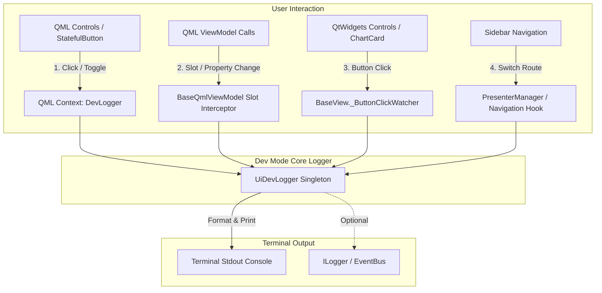

# Nhiệm vụ BOT-092: UI Event Logger ra Terminal ở Dev Mode (Hỗ trợ Tái hiện Bug)

> **Mã định danh:** `BOT-092`  
> **Trạng thái:** Backlog  
> **Độ ưu tiên:** P2 (Developer Experience & Bug Reproduction Infrastructure)  
> **Phạm vi tác động:** `sagittarius_engine` (extensions/pyside_mvc) & `Sagittarius_Elite_Warrior` (presentation/ui) — Sửa cả 2 repo.

---

## 1. Mục tiêu & Vấn đề Cần giải quyết

### 1.1. Hiện trạng & Lỗ hổng
- Khi chạy ứng dụng với cờ `--dev` (qua `scripts/run-ui.ps1 --dev` hoặc `python -m ... --dev`), cờ cấu hình `dev.mode` được kích hoạt (`DEV_MODE_CONFIG_KEY = "dev.mode"`).
- Cơ chế cũ `_ButtonClickWatcher` trong `sagittarius_engine/extensions/pyside_mvc/base_view.py` chỉ quét `QPushButton` qua `QWidget.findChildren(QPushButton)`.
- Khi toàn bộ 4 màn hình (`Dashboard`, `DataManagement`, `Settings`, `Backtest`) và `Sidebar` chuyển sang QML (`QQuickWidget` + QML scene graph), `findChildren(QPushButton)` **hoàn toàn không nhìn thấy** bất kỳ nút bấm hay control nào trong QML.
- Cơ chế cũ chỉ gửi log vào `monitor_card.append_log(...)` (một card UI cũ), **không in ra terminal (stdout)**. Khi app bị crash / treo (segfault, unhandled exception, v.v.), UI biến mất và toàn bộ log trong UI card bị mất trắng.

### 1.2. Mục tiêu mong muốn
- Khi chạy với `run-ui.ps1 --dev`:
  1. Mọi thao tác người dùng (bấm nút QML, bấm nút QtWidgets trên ChartCard, thay đổi ComboBox/Dropdown, Checkbox, nhập text form, chuyển tab Sidebar, đóng/mở popup modal) được **in trực tiếp ra Terminal (stdout)** theo thời gian thực.
  2. Log có định dạng rõ ràng, giàu ngữ nghĩa (tên màn hình, tên action/component, tham số truyền vào, timestamp).
  3. Giúp lập trình viên / QA khi gặp bug có thể nhìn ngay chuỗi thao tác (action sequence) để viết regression test theo đúng quy chuẩn dự án (`.agents/rules/code-rule.md`).
- Khi chạy bình thường (Production mode, không có `--dev`):
  - Hoàn toàn im lặng, không ghi đè hay làm chậm UI event loop (Zero runtime overhead).

---

## 2. Đánh giá Thiết kế (Architecture & Design)

Để đảm bảo vừa bắt được các thao tác ở tầng visual QML, vừa bắt được payload nghiệp vụ từ Python Presenter/ViewModel mà không làm loãng console bằng các event chuột cấp thấp (drag, hover, paint), thiết kế được chia làm **3 tầng bổ trợ (Multi-Tier Architecture)**:



### 2.1. Tầng 1: `UiDevLogger` — Định dạng & Xuất Terminal (`sagittarius_engine`)
- Tạo class tiện ích tập trung `UiDevLogger` (trong `sagittarius_engine.extensions.pyside_mvc.dev_logger`).
- Định dạng output tiêu chuẩn:
  ```text
  [DEV-UI] 22:15:30.124 | [Backtest] Action: requestRun(strategy="Multi-EMA Trend Follower", symbol="BTCUSDT", interval="1h")
  [DEV-UI] 22:15:35.842 | [Sidebar] Navigate: Switched to 'data_management'
  [DEV-UI] 22:15:40.012 | [ChartCard] Clicked: Timeframe '15m'
  [DEV-UI] 22:15:42.500 | [Settings] Property: default_interval = '4h'
  ```
- Tích hợp kiểm tra cờ `dev.mode` (chỉ in khi enabled).

### 2.2. Tầng 2: Interception ở `BaseQmlViewModel` & `PresenterManager` (Ngữ nghĩa cao)
- **ViewModel Slot / Property Hook**:
  - `BaseQmlViewModel` có thể tự động bọc (hoặc cung cấp hook) khi các `@Slot` nhận request từ QML (như `requestLoadHistory`, `requestStartStream`, `requestRun`, `requestBotParamsSave`).
  - Ghi nhận đầy đủ tên phương thức và tham số truyền vào (đã chuẩn hoá qua `from_qml()`).
- **Navigation Hook**:
  - `PresenterManager.navigate_to(route_name)` tự động log màn hình đích khi chuyển trang.

### 2.3. Tầng 3: QML Context Bridge & Shared Controls (`QmlShared`)
- Đăng ký một `DevLogger` QObject vào `rootContext` trong hàm `create_quick_widget()`.
- Trong `StatefulButton.qml` (và các control QML dùng chung):
  - Khi `clicked`, nếu `DevLogger` tồn tại và dev mode bật, gửi tín hiệu log kèm `text` và `objectName`.

### 2.4. Tầng 4: Cập nhật `_ButtonClickWatcher` cho QtWidgets (`base_view.py`)
- Sửa lại `_ButtonClickWatcher._log_click`:
  - Thay vì chỉ duck-type `self._view.monitor_card.append_log()`, chuyển tiếp lời gọi sang `UiDevLogger.log_action(...)` để xuất ra terminal stdout.
  - Phục vụ các nút bấm QtWidgets còn lại (như Timeframe toolbar của `ChartCard`).

---

## 3. Kế hoạch Triển khai (Checklist)

- [ ] **Phase 1: Xây dựng Core Logger trong `sagittarius_engine`**
  - [ ] Tạo `sagittarius_engine/extensions/pyside_mvc/dev_logger.py` (`UiDevLogger`).
  - [ ] Viết unit tests cho `UiDevLogger` (formatting, timestamp, dev_mode toggle).
- [ ] **Phase 2: Hook vào BaseView & QmlShared**
  - [ ] Cập nhật `base_view.py`: `_ButtonClickWatcher` in ra terminal qua `UiDevLogger`.
  - [ ] Đăng ký `DevLogger` vào context QML trong `qml_host_view.py` / `create_quick_widget()`.
  - [ ] Tích hợp vào `StatefulButton.qml`.
- [ ] **Phase 3: Hook vào ViewModel & Navigation Router**
  - [ ] Bổ sung cơ chế auto-log request slots / property changes trong `BaseQmlViewModel`.
  - [ ] Hook `PresenterManager.navigate_to()` để log chuyển màn hình.
- [ ] **Phase 4: Kiểm thử & Xác nhận (Sanity & Regression Tests)**
  - [ ] Cập nhật/thay thế test `test_sanity_dev_mode_click_logging_does_not_reach_qml_buttons` bằng test xác nhận QML click **đã được log ra terminal ở dev mode**.
  - [ ] Assert rằng ở production mode (`dev.mode=False`), terminal hoàn toàn không có log event.
  - [ ] Chạy full test suite ở cả 2 repo (`Sagittarius-Engine` và `Sagittarius_Elite_Warrior`).

---

## 4. Rủi ro & Lưu ý Tuân thủ
1. **Không làm nghẽn UI Thread**: Logging ra stdout là thao tác I/O đồng bộ ngắn, tuy nhiên không format object quá nặng hoặc lặp đệ quy sâu.
2. **Bảo mật dữ liệu nhạy cảm**: Trong `SettingsViewModel`, các field như `API_SECRET` cần được mask (ví dụ: `api_secret="******"`) khi log ra terminal.
3. **Quy tắc 2 Repo**: Mọi thay đổi trong `sagittarius_engine/` cần được commit ở superproject và bump submodule pointer trong app repo.
