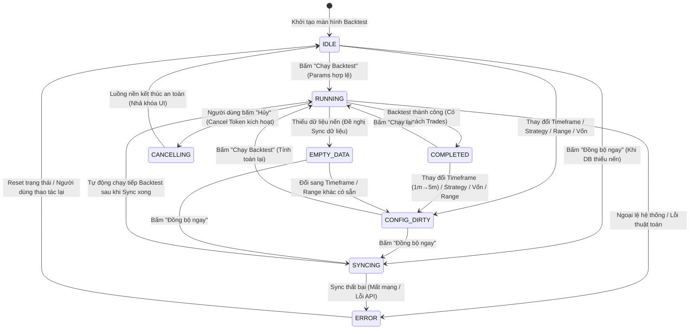

# Epic BOT-095: Hoàn thiện Hệ thống UI Signals, State Machine & Vòng đời Tham số Màn hình Backtest

> **Nguồn gốc**: Phân tích toàn diện luồng tương tác của người dùng trên màn hình Backtest (`BackTestPresenter`, `BackTestViewModel`, `BackTestTopPanel.qml`).
> 
> **Vấn đề cốt lõi phát hiện qua mã nguồn thực tế**:
> Khi người dùng thay đổi các cấu hình đầu vào trên thanh công cụ (như đổi Timeframe từ `1m` sang `5m`, đổi Chiến lược, đổi Khoảng thời gian, hoặc đổi Vốn ban đầu), hệ thống hiện tại **chỉ ghi log suông** (`_logger.log_timeframe_selected`) mà **không có bất kỳ cơ chế quản lý trạng thái Stale/Dirty dữ liệu cũ**. Toàn bộ kết quả chạy trước đó (PnL, Drawdown, Trades, Chart Markers, Equity Curve) vẫn hiển thị nguyên vẹn, gây ra sự sai lệch nghiêm trọng giữa thông số đang chọn trên Toolbar và kết quả hiển thị trên màn hình. Đồng thời, FSM thiếu trạng thái hủy, thiếu nút Stop, thiếu cơ chế preview dữ liệu khi chuyển timeframe, và thiếu validation phản hồi tức thời.

---

## 1. Mục tiêu của Epic

1. **Chuẩn hóa Finite State Machine (`BacktestUiState`)**:
   Mở rộng FSM từ 4 trạng thái sơ sài (`IDLE`, `RUNNING`, `SYNCING`, `ERROR`) thành một máy trạng thái toàn diện, có khả năng quản lý trạng thái dữ liệu cũ (`CONFIG_DIRTY`), trạng thái đang hủy (`CANCELLING`), trạng thái rỗng (`EMPTY_DATA`) và trạng thái hoàn thành (`COMPLETED`).
2. **Loại bỏ hoàn toàn rủi ro Stale Data (Dữ liệu không đồng bộ)**:
   Khi bất kỳ tham số nào trên Toolbar thay đổi so với lần chạy gần nhất, UI lập tức nhận biết, làm mờ dữ liệu cũ và hiển thị thông báo yêu cầu chạy lại rõ ràng.
3. **Thêm khả năng Hủy / Dừng Backtest an toàn**:
   Tích hợp `CancellationToken` và nút Stop/Cancel trên UI, cho phép người dùng dừng một đợt backtest dài mà không làm sập ứng dụng hay rò rỉ kết nối cơ sở dữ liệu.
4. **Xử lý mượt mà khi chuyển đổi Khung thời gian (Timeframe Change Lifecycle)**:
   Khi chọn khung nến mới (`1m` $\rightarrow$ `5m`), hệ thống tự động kiểm tra dữ liệu trong DB (probe), preview nến mới lên biểu đồ nếu có, hoặc gợi ý đồng bộ nếu thiếu.
5. **Real-time Validation & Feedback**:
   Phản hồi lỗi nhập liệu trực tiếp trên các Modal / Ô nhập liệu (Vốn âm, Ngày bắt đầu $\ge$ Ngày kết thúc) thay vì đợi bấm "Chạy" mới báo lỗi.

---

## 2. Thiết kế Kiến trúc & Finite State Machine (FSM Design)

### 2.1. Sơ đồ Chuyển đổi Trạng thái (FSM State Transition Diagram)

### 2.2. Bảng Ma trận Quyền Điều khiển UI theo Trạng thái (Controls Matrix)

| Trạng thái FSM | Nút "Chạy / Hủy" | Toolbar Inputs (TF, Strategy, Vốn, Ngày) | Nút "Đồng bộ ngay" | Bảng Kết quả & Chart Markers |
| :--- | :---: | :---: | :---: | :---: |
| **`IDLE`** | Enabled ("Chạy Backtest") | Enabled | Visible nếu `needsDataSync` | Trống (Initial placeholder) |
| **`CONFIG_DIRTY`** | Enabled ("Chạy lại") *(Khuyến nghị nổi bật)* | Enabled | Visible nếu `needsDataSync` | **Làm mờ nhẹ (Opacity 0.6)** + Cảnh báo Stale |
| **`RUNNING`** | Enabled (**"Hủy Backtest"** - Đỏ) | **Disabled** (Khóa chặt) | Hidden | Loading Spinner / Progress |
| **`CANCELLING`** | **Disabled** ("Đang hủy...") | **Disabled** | Hidden | Giữ nguyên trạng thái dọn dẹp |
| **`SYNCING`** | **Disabled** ("Đang đồng bộ...") | **Disabled** | **Disabled** | Banner "Đang tải dữ liệu từ sàn..." |
| **`COMPLETED`** | Enabled ("Chạy lại") | Enabled | Hidden | **Sáng rõ (Opacity 1.0)** - Kết quả mới nhất |
| **`EMPTY_DATA`** | Enabled | Enabled | **Visible & Focus** | Banner "Không có dữ liệu lịch sử" |
| **`ERROR`** | Enabled | Enabled | Tùy ngữ cảnh lỗi | Banner Báo lỗi đỏ |

---

## 3. Danh sách các Task Con thuộc Epic BOT-095

| Task ID | Tên Nhiệm vụ | Mức độ Ưu tiên | Trọng tâm chính & Files tác động |
| :--- | :--- | :---: | :--- |
| 🔹 **[BOT-095A](BOT-095A_declarative_fsm_engine_foundation.md)** | **Hạ tầng Declarative State Machine & Event Dispatching** | **P1 (Engine Core)** | `sagittarius_engine.extensions.fsm` (`DeclarativeStateMachine`), ma trận `(State, Event) -> NextState`, `dispatch(event)`, `load_matrix()`, bảo vệ Re-entrancy và Thread-Affinity. |
| 🔹 **[BOT-095B](BOT-095B_backtest_fsm_and_stale_data_lifecycle.md)** | **Màn hình Backtest FSM & Quản lý Trạng thái Stale Data (Dirty Tracking)** | **P1 (UI FSM)** | `backtest_fsm_matrix.py`, Dirty Tracking so khớp `BacktestRunConfig`, Amber Banner với Diff Summary, tự động khôi phục `COMPLETED`, và bảo vệ nút Xuất CSV. |
| ✅ **[BOT-095H](../completed/BOT-095H_backtest_action_ownership_and_stale_callback_fencing.md)** | **Quyền sở hữu Action & Chặn Callback Lỗi thời** | **P1 (Async Safety)** | Hoàn thành: `action_id`/generation, immutable config snapshot và terminal outcome; callback cũ không thể ghi đè run mới. **Đã mở khóa C/D/G.** |
| 🔹 **[BOT-095C](BOT-095C_backtest_cancellation_and_stop_button.md)** | **Nút Hủy / Dừng Backtest & Tiến độ Tính toán Realtime (`CancellationToken` & ETA)** | **P1 (UX Safety)** | Nút Cancel khi đang RUNNING, tích hợp CancellationToken ngắt luồng an toàn, thanh Progress Bar % + thời gian còn lại ETA. Phụ thuộc `BOT-095H`. |
| 🔹 **[BOT-095D](BOT-095D_backtest_timeframe_change_and_data_probe.md)** | **1-Click Auto-Sync & Run, Date Range Gap Check & Live Preview** | **P1 (Data Flow)** | Kiểm tra gap theo cadence, UTC và post-sync re-probe; auto-sync/run chỉ tiếp tục action còn sở hữu. Phụ thuộc `BOT-095H`, sau `BOT-095C`. |
| 🔹 **[BOT-095E](BOT-095E_backtest_realtime_input_validation.md)** | **Khung Kiểm định Đầu vào Mở rộng (Pre-Backtest Assertion Pipeline) & Stepper** | **P2 (Validation)** | Khung Assertion Rule mở rộng (OCP), kiểm tra Min Binance Lot Notional $5, viền đỏ cảnh báo tại chỗ, phím tắt Hotkeys / con lăn Stepper trong `BotParamsDialog`. |
| 🔹 **[BOT-095F](BOT-095F_backtest_dynamic_indicator_toggle.md)** | **Toggle Chỉ báo Tham chiếu Động trên Biểu đồ sau Backtest** | **P2 (Visualization)** | Bật/tắt chỉ báo tham chiếu (RSI, MACD, EMA) trên biểu đồ mà không cần chạy lại backtest; fence artifact theo `run_id` của `BOT-095H`. |
| 🔹 **[BOT-095G](BOT-095G_backtest_session_run_history_cache.md)** | **Bộ nhớ đệm Lịch sử Lần chạy (Session Run History Cache)** | **P2 (UX Power)** | Snapshot bất biến có provenance và giới hạn bộ nhớ; phục hồi nhanh Charts, Metrics và Trade Logs. Phụ thuộc `BOT-095H`. |

---

## 4. Kế hoạch Kiểm thử & Tiêu chuẩn Nghiệm thu (Acceptance Criteria)

1. **Unit & Sanity Tests**:
   - 100% các kịch bản chuyển đổi trạng thái FSM (`IDLE` $\rightarrow$ `DIRTY` $\rightarrow$ `RUNNING` $\rightarrow$ `COMPLETED` / `CANCELLING`) được bao phủ bởi Unit Tests trong `tests/unit/presentation/ui/screens/test_backtest_presenter.py`.
   - Toàn bộ Sanity Tests trong `tests/sanity/` pass sạch 100%.
2. **Zero Resource Leak**:
   - Khi hủy một đợt backtest đang chạy (`CANCELLING`), mọi SQLite connection handles và background thread workers phải được dispose sạch sẽ, không sinh ra `ResourceWarning` hay `RuntimeWarning`.
3. **Visual & UX Verification**:
   - Đổi Timeframe hoặc Strategy làm mờ các chỉ số cũ ngay lập tức, không để người dùng đọc nhầm số liệu của phiên trước.
   - Độ trễ hủy/phục hồi UI được benchmark trên fixture công bố; callback cũ
     không được phép cập nhật UI/FSM của action mới.

---

## 5. Phản biện & Bổ sung đã chốt (17/08/2026)

Xem chi tiết tại [Rà soát BOT-095](../reports/BOT-095_review_phan_bien.md).
Các quyết định bắt buộc: tách `BOT-095H` làm nền async safety; `EMPTY_DATA`
chỉ là không có nến (0 trades vẫn là completed); data probe phải phát hiện gap
nội bộ theo cadence; market-rule validation lấy filter theo symbol thay vì
hard-code vốn $5; snapshot history phải immutable và có provenance. Các SLA
`0ms`/`<50ms`/`<100ms` được thay bằng benchmark tái lập được.
