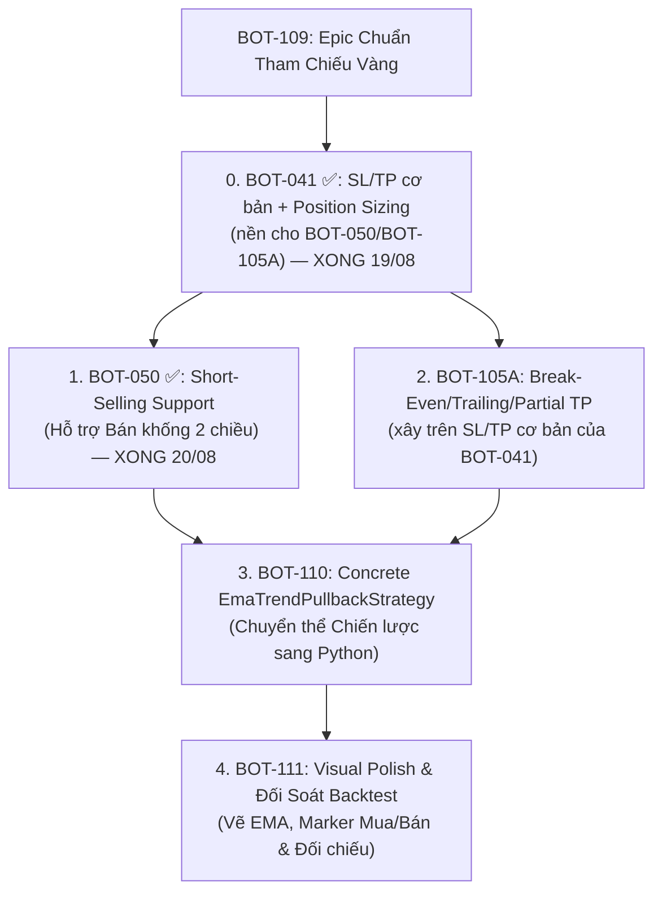

# Epic: Chuẩn Tham Chiếu Vàng — Thực Thi Chiến Lược "EMA Trend Confirm + Pullback + TP%" (Golden Reference Strategy Execution)

**Mã Epic:** `BOT-109`  
**Độ phức tạp:** 🔴 **L (Thinking Agent)**  
**Trạng thái:** 🟡 **Đang triển khai — Bước 0 (`BOT-041`) và Bước 1 (`BOT-050`) đã xong 20/08, tiếp theo là `BOT-110`**  
**Mục tiêu:** Sử dụng chiến lược TradingView Pine Script v6 *"EMA Trend Confirm + Pullback + TP%"* làm **Chuẩn Tham Chiếu Vàng** (Golden Reference Specification) để nâng cấp toàn diện năng lực của engine Backtest, lấp đầy các khoảng trống về Bán khống (Short Selling), Lệnh chốt lời trong nến (Intra-bar TP), và trực quan hóa đa chiều.

---

## 📜 1. Toàn văn Mã Nguồn Pine Script Tham Chiếu (Golden Specification)

```pinescript
//@version=6
strategy("EMA Trend Confirm + Pullback + TP%", overlay=true, initial_capital=10000, default_qty_type=strategy.percent_of_equity, default_qty_value=100, pyramiding=1, calc_on_every_tick=true)

// ============ INPUTS (có thể cấu hình) ============
// Xu hướng dài hạn
emaLongLen       = input.int(200, "🔹 EMA_LONG_NUM", minval=10, maxval=500)
tickConfirm      = input.int(5,   "⏱️ TICK_NUM", minval=1, maxval=20, tooltip="Số nến liên tiếp không chạm EMA để xác nhận xu hướng")
touchSensitivity = input.float(0.0, "📏 Độ nhạy chạm EMA (%)", minval=0.0, maxval=5.0, step=0.1, tooltip="0% = chạm chính xác, >0 cho phép sai số")
enableTouchReset = input.bool(true, "🔄 Reset bộ đếm khi chạm EMA")
enableTouchExit  = input.bool(true, "🚪 Thoát lệnh khi chạm EMA (vùng xám)")

// Entry
emaEntryLen         = input.int(50, "🎯 ENTRY_EMA", minval=10, maxval=500)
pullbackSensitivity = input.float(0.2, "📏 Độ nhạy pullback (%)", minval=0.1, maxval=3.0, step=0.1)
candleConfirmEntry  = input.bool(false, "✅ Chờ nến đóng xác nhận bật lại", tooltip="Bật: chỉ vào lệnh khi nến đóng cửa trở lại đúng hướng. Tắt: vào ngay khi giá chạm EMA và quay đầu (realtime)")

// Chốt lời
takeProfitPercent = input.float(2.0, "💰 TP_Present %", minval=0.5, maxval=20.0, step=0.5) / 100

// Cảnh báo
enableAlerts = input.bool(true, "🔔 Gửi thông báo")

// ============ TÍNH EMA ============
emaLong  = ta.ema(close, emaLongLen)
emaEntry = ta.ema(close, emaEntryLen)

plot(emaLong,  "EMA Long",  color=color.red,  linewidth=2)
plot(emaEntry, "EMA Entry", color=color.blue, linewidth=1)

// ============ PHÁT HIỆN NẾN CHẠM EMA DÀI ============
emaUpper    = emaLong * (1 + touchSensitivity / 100)
emaLower    = emaLong * (1 - touchSensitivity / 100)
touchesLong = (low <= emaUpper and high >= emaLower)   // bóng nến bao trùm EMA

// ============ XU HƯỚNG (ĐẾM & XÁC NHẬN) ============
var int trendSide       = 0
var int consecutiveBars = 0
var int confirmedTrend  = 0

if touchesLong and enableTouchReset
    trendSide       := 0
    consecutiveBars := 0
    confirmedTrend  := 0
else
    above = close > emaLong
    below = close < emaLong
    if above
        if trendSide == 1
            consecutiveBars += 1
        else
            trendSide       := 1
            consecutiveBars := 1
    else if below
        if trendSide == -1
            consecutiveBars += 1
        else
            trendSide       := -1
            consecutiveBars := 1

    if consecutiveBars >= tickConfirm
        confirmedTrend := trendSide

// ============ ENTRY (PULLBACK VỀ EMA ENTRY) ============
entryUpper = emaEntry * (1 + pullbackSensitivity / 100)
entryLower = emaEntry * (1 - pullbackSensitivity / 100)

// Long – giá đã chạm vùng pullback và hiện đang nằm trên EMA Entry
pullbackLong = low <= entryUpper and close > emaEntry
bounceLong   = if candleConfirmEntry
    close > emaEntry and low[1] <= entryUpper
else
    true
longCondition = confirmedTrend == 1 and pullbackLong and bounceLong and close > emaEntry

// Short – giá đã chạm vùng pullback và hiện đang nằm dưới EMA Entry
pullbackShort = high >= entryLower and close < emaEntry
rejectShort   = if candleConfirmEntry
    close < emaEntry and high[1] >= entryLower
else
    true
shortCondition = confirmedTrend == -1 and pullbackShort and rejectShort and close < emaEntry

// ============ THỰC HIỆN LỆNH ============
var float entryPriceLong  = na
var float entryPriceShort = na

if longCondition
    entryPriceLong := close
    strategy.entry("Long", strategy.long, comment="LONG", alert_message=enableAlerts ? "LONG " + syminfo.tickerid + " giá " + str.tostring(close) : "", disable_alert=not enableAlerts)

if shortCondition
    entryPriceShort := close
    strategy.entry("Short", strategy.short, comment="SHORT", alert_message=enableAlerts ? "SHORT " + syminfo.tickerid + " giá " + str.tostring(close) : "", disable_alert=not enableAlerts)

// ============ THOÁT LỆNH ============
tpLongHit   = not na(entryPriceLong)  and close >= entryPriceLong  * (1 + takeProfitPercent)
tpShortHit  = not na(entryPriceShort) and close <= entryPriceShort * (1 - takeProfitPercent)
exitByTouch = enableTouchExit and touchesLong

if strategy.position_size > 0
    if tpLongHit
        strategy.close("Long", comment="TP " + str.tostring(takeProfitPercent*100) + "%", alert_message=enableAlerts ? "TP LONG " + str.tostring(takeProfitPercent*100) + "% giá " + str.tostring(close) : "", disable_alert=not enableAlerts)
    else if exitByTouch
        strategy.close("Long", comment="Chạm EMA Long", alert_message=enableAlerts ? "EXIT LONG chạm EMA" + str.tostring(emaLongLen) : "", disable_alert=not enableAlerts)

if strategy.position_size < 0
    if tpShortHit
        strategy.close("Short", comment="TP " + str.tostring(takeProfitPercent*100) + "%", alert_message=enableAlerts ? "TP SHORT " + str.tostring(takeProfitPercent*100) + "% giá " + str.tostring(close) : "", disable_alert=not enableAlerts)
    else if exitByTouch
        strategy.close("Short", comment="Chạm EMA Long", alert_message=enableAlerts ? "EXIT SHORT chạm EMA" + str.tostring(emaLongLen) : "", disable_alert=not enableAlerts)

if strategy.position_size == 0
    entryPriceLong  := na
    entryPriceShort := na
```

---

## 🗺️ 2. Phân Rã Nhiệm Vụ Thành Phần (Child Tasks Breakdown)

> ✏️ **Sửa lại 2026-08-19** (đánh giá epic trước khi giao việc): kế hoạch gốc
> chỉ liệt kê 4 bước và bỏ sót `BOT-041` — nhưng cả `BOT-050` lẫn `BOT-105A`
> **tự khai** phụ thuộc `BOT-041` trong chính file của chúng, nên thứ tự gốc
> không thể thực thi đúng như viết. Đã thêm `BOT-041` làm bước 0. §2.2 gốc
> cũng mô tả sai nội dung `BOT-105A` (chép nhầm mô tả TP/SL cơ bản — đó là
> scope của `BOT-041`, không phải `BOT-105A`, vốn là break-even/trailing/
> partial-TP xây **trên** nền `BOT-041`) — đã sửa lại đúng theo file thật.

Epic này được chia thành **5 nhiệm vụ tuần tự** (thêm `BOT-041` làm nền cho
2 task đầu), mỗi nhiệm vụ có tiêu chí nghiệm thu độc lập và test suite đầy đủ:



---

### 📌 0. [`BOT-041`](../completed/BOT-041_stop_loss_take_profit_and_risk_sizing.md) ✅: SL/TP Cơ Bản Trong Nến + Position Sizing Theo Rủi Ro

> ✅ **Hoàn thành (19/08)** — `PaperExchange.check_intrabar_stops()` gọi mỗi
> bar từ `RunStaticBacktestCommandHandler`, khớp tại đúng giá mục tiêu, SL
> thắng khi 1 nến chạm cả hai. `PositionSizingType.RISK_PERCENT` mới. 14 test
> mới + mutation-check, 19 test cũ không sửa vẫn pass. Xem file đã đóng để
> biết chi tiết đầy đủ.

- **Vấn đề**: `fill()` hiện chỉ được gọi khi strategy phát signal — kiểm tra
  TP `2.0%` mỗi nến (kể cả nến không có signal) đòi hỏi handler gọi vào
  `PaperExchange` mỗi bar, cơ chế này chưa tồn tại. Đây là **nền bắt buộc**
  cho cả `BOT-050` (SL/TP đảo chiều cho short) lẫn `BOT-105A` (break-even/
  trailing xây trên SL/TP đã có) — làm sau 2 task đó là không thể, task này
  phải đi **trước**.
- **Không thuộc epic này** theo task gốc — `BOT-041` là task Backtest Phase 0
  có sẵn từ trước, epic chỉ tái sử dụng nó làm phụ thuộc. Xem file gốc để
  biết chi tiết đầy đủ (quyết định "SL trước nếu chạm cả hai", dùng
  `high`/`low` chứ không phải `close`, v.v.).

---

### 📌 1. [`BOT-050`](../completed/BOT-050_short_selling_support.md) ✅: Hỗ Trợ Vị Thế Bán Khống (Short-Selling Support)

> ✅ **Hoàn thành (20/08)** — `SignalAction` thêm `SHORT`/`COVER`,
> `PaperExchange` side-aware (PnL/slippage/SL-TP đảo chiều, `equity()`
> mark-to-market Short — gap tự phát hiện khi code, không có trong mô tả
> gốc bên dưới), từ chối mix Long+Short. Tab/nhãn SHORT trong Trade Logs
> hoạt động thật. Xem file đã đóng để biết chi tiết đầy đủ.
- **Vấn đề**: `PaperExchange` hiện tại là Long-Only (coi `SELL` là thoát Long). Khi chiến lược phát tín hiệu `shortCondition`, engine bỏ qua hoặc không mở được vị thế Short.
- **Hạng mục công việc**:
  - `PositionSide` Enum (`LONG`, `SHORT`).
  - ✏️ **Sửa 2026-08-19** (đã hỏi user, xem `BOT-050` §3): **không** overload
    `BUY`/`SELL` cho cả 2 nghĩa. `SignalAction` có thêm `SHORT`/`COVER` —
    `BUY` luôn = mở/thêm Long, `SELL` luôn = đóng Long (không đổi so với
    hôm nay), `SHORT` = mở Short, `COVER` = đóng Short. Strategy tự phát
    đúng action nó muốn, `PaperExchange` không đoán theo vị thế đang mở.
  - Công thức PnL đảo chiều chuẩn xác cho Short: $\text{PnL} = (P_{\text{entry}} - P_{\text{exit}}) \times Q - \text{Phí}$.
  - Trượt giá (Slippage) đúng chiều cho Short: Mở Short bán ở $P - \text{slip}$, Đóng Short mua lại ở $P + \text{slip}$.
  - Entity `Trade` lưu trường `side: PositionSide.SHORT`.
  - Bảng `TradeLogsTable.qml` hiển thị chuẩn dữ liệu cho tab **Bán (SHORT)**.

---

### 📌 2. [`BOT-105A`](BOT-105A_trailing_stop_and_partial_tp.md): Break-Even Stop, Trailing Stop & Chốt Lời Từng Phần

> ✏️ **Sửa 2026-08-19**: mục này trước đây mô tả nhầm — nội dung "TP `2.0%`
> khớp tại `high`/`low`, `take_profit_pct`/`stop_loss_pct` gắn kèm vị thế"
> là scope thật của `BOT-041` (mục §2 bước 0 ở trên), không phải `BOT-105A`.
> Golden strategy này thực ra
> **không dùng** break-even/trailing/partial-TP (`takeProfitPercent` là 1
> mức TP cố định duy nhất, không có nhiều mốc) — `BOT-105A` không phải phụ
> thuộc bắt buộc để chạy đúng chiến lược này, chỉ `BOT-041` mới là bắt buộc.
> Giữ `BOT-105A` trong sơ đồ vì `BOT-110`/`BOT-111` gốc đã liệt kê nó làm
> phụ thuộc, nhưng cân nhắc bỏ hẳn khỏi epic này nếu chỉ cần chạy đúng
> 1:1 golden strategy — xem lại khi bắt đầu code `BOT-110`.

- **Vấn đề thật** (đọc từ file `BOT-105A`, không phải mô tả cũ ở đây):
  giá đạt ngưỡng lời nhất định thì dời SL về entry (break-even), giá tạo
  đỉnh mới thì SL bám theo (trailing), hoặc chốt lời từng phần theo nhiều
  mốc — cả 3 đều **không có** trong golden strategy tham chiếu của epic
  này, xem file `BOT-105A` gốc để biết đầy đủ scope thật của nó.

---

### 📌 3. [`BOT-110`](BOT-110_ema_trend_confirm_pullback_strategy.md): Triển Khai Chiến Lược `EmaTrendPullbackStrategy`
- **Vấn đề**: Cần một lớp chiến lược Python hoàn chỉnh kế thừa `BaseStrategy` khai báo đúng các tham số và logic của Pine Script.
- **Hạng mục công việc**:
  - Tạo `src/domain/strategies/ema_trend_pullback_strategy.py`.
  - Khai báo 10 parameters thông qua `self.input_int`, `self.input_float`, `self.input_bool` (nhóm "Xu hướng dài hạn", "Entry", "Chốt lời").
  - Quản lý state bộ đếm nến qua từng thanh giá: `consecutive_bars`, `trend_side`, `confirmed_trend`.
  - Tính toán 2 đường EMA (`emaLongLen: 200`, `emaEntryLen: 50`) và trả về trong `build_indicators()`.
  - Đăng ký vào `StrategyRegistry` với key `"ema_trend_confirm_pullback"`.

---

### 📌 4. [`BOT-111`](BOT-111_golden_strategy_visual_and_backtest_verification.md): Trực Quan Hóa & Kiểm Thử Đối Soát
- **Vấn đề**: Cần hiển thị trực quan các đường chỉ báo, marker lệnh Long/Short trên biểu đồ và đối soát kết quả chạy Backtest.
- **Hạng mục công việc**:
  - Vẽ 2 đường EMA (200 màu đỏ, 50 màu xanh) trên `ChartCard` / Native Chart.
  - Vẽ marker Tam giác Xanh (Long Entry), Tam giác Đỏ (Short Entry), Marker Thoát lệnh (TP / Touch Exit).
  - Viết bộ test kiểm thử End-to-End (E2E) và Sanity cho màn Backtest với chiến lược mới.
  - Chạy `.\scripts\ci-local.ps1 -Full` bảo đảm 100% tests xanh.

---

## 🎯 3. Thứ Tự Triển Khai Đề Xuất

0. ✅ **Bước 0 — Hoàn thành (19/08)**: [`BOT-041`](../completed/BOT-041_stop_loss_take_profit_and_risk_sizing.md)
   (SL/TP cơ bản trong nến + position sizing theo rủi ro).
1. ✅ **Bước 1 — Hoàn thành (20/08)**: [`BOT-050`](../completed/BOT-050_short_selling_support.md) (Short-Selling trong PaperExchange).
2. 🏁 **Bước 2 (không bắt buộc cho riêng golden strategy này)**: [`BOT-105A`](BOT-105A_trailing_stop_and_partial_tp.md) (break-even/trailing/partial-TP) — xem ghi chú ở §2.2, cân nhắc bỏ nếu chỉ cần chạy đúng chiến lược tham chiếu.
3. 🏁 **Bước 3**: Triển khai [`BOT-110`](BOT-110_ema_trend_confirm_pullback_strategy.md) (Viết Strategy `EmaTrendPullbackStrategy`) — **chốt trước** câu hỏi kiến trúc `StrategyContext`/vị thế ở đầu file `BOT-110`.
4. 🏁 **Bước 4**: Triển khai [`BOT-111`](BOT-111_golden_strategy_visual_and_backtest_verification.md) (UI Marker, Chart & Verification).
