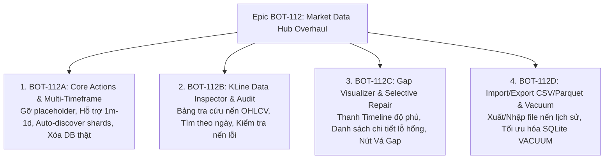

# Epic: Đại Tu Quản Trị Cơ Sở Dữ Liệu Thị Trường — Market Data Hub & Storage Vault Overhaul

**Mã Epic:** `BOT-112`  
**Độ phức tạp:** 🔴 **L (Thinking Agent)**  
**Trạng thái:** 🔴 **Backlog (Chờ triển khai)**  
**Mục tiêu:** Nâng cấp toàn diện màn hình Quản lý Cơ sở Dữ liệu (`Data Management / Sagittarius Storage Vault`) từ một giao diện sơ khai mang tính hình thức thành một **Trung Tâm Dữ Liệu Thị Trường (Market Data Hub)** thực thụ — hỗ trợ đa khung thời gian, auto-discover shards, xóa/bảo trì database thật, kiểm tra & vá lỗ hổng (Gap Visualizer), tra cứu nến (KLine Inspector), và Nhập/Xuất CSV/Parquet.

---

## 🛑 1. Hiện Trạng & Các Vấn Đề Nghiêm Trọng Cần Đại Tu (Gap Analysis)

1. **Nút "Hình thức / Giả lập" (Dummy Placeholders)**:
   - 3 nút trên header (*"Seed 1,000 Records"*, *"Export JSON"*, *"Purge Vault"*) chỉ là placeholder gắn ToolTip *"Not implemented yet"*.
   - Nút *"Clear Local Data"* in log *"Chưa làm"* và khóa FSM ở `CLEARING`.
2. **Hardcode duy nhất khung nến `1m`**:
   - `interval = "1m"` bị gán cứng trong `DataManagementPresenter`, không thể xem hay đồng bộ dữ liệu cho `5m`, `15m`, `1h`, `4h`, `1d`.
3. **Màn hình mặc định rỗng (Empty State)**:
   - Mở màn hình lên bảng Database Status rỗng 0 dòng, bắt người dùng phải bấm nút *"Scan All Status"* bằng tay dù trong máy đã có sẵn hàng chục file `.db`.
4. **Báo Lỗ hổng Dữ liệu (Gaps) mập mờ**:
   - Cột Status chỉ hiện dòng chữ `GAPS DETECTED`, không cho biết thủng nến ở đâu, từ ngày nào đến ngày nào, mất bao nhiêu nến và không có nút vá từng đoạn.
5. **Thiếu Tra Cứu Dữ Liệu Nến (KLine Inspector)**:
   - Không thể xem bảng chi tiết OHLCV của dữ liệu đã lưu để kiểm tra râu nến, giá bất thường hoặc tính toàn vẹn.
6. **Thiếu Nhập / Xuất Dữ Liệu (Import / Export)**:
   - Chưa thể xuất dữ liệu ra file `.csv` / `.parquet` cho Excel/Pandas hoặc nạp file nến từ ngoài vào.

---

## 🗺️ 2. Phân Rã Nhiệm Vụ Thành Phần (Child Tasks Breakdown)

Epic này được chia thành **4 nhiệm vụ độc lập tuần tự**:

---

### 📌 1. [`BOT-112A`](BOT-112A_data_management_core_actions_and_timeframe_support.md): Hoàn Thiện Tác Vụ Cốt Lõi & Hỗ Trợ Đa Khung Thời Gian
- **Phạm vi**:
  - Gỡ bỏ hoàn toàn 3 nút placeholder vô dụng trên Header.
  - Thêm Selector chọn Timeframe (`1m`, `5m`, `15m`, `1h`, `4h`, `1d`) cạnh Symbol.
  - Tự động quét và nạp danh sách Shards (`Auto-Discover`) ngay khi mở màn hình.
  - Triển khai chức năng Xóa Dữ Liệu Thật: Xóa 1 Symbol cụ thể hoặc Xóa toàn bộ Vault có Dialog xác nhận.
  - Tích hợp `SymbolPickerModal` (tìm kiếm nhanh giữa 1.361+ mã Binance).

---

### 📌 2. [`BOT-112B`](BOT-112B_kline_data_inspector_and_integrity_audit.md): Bảng Tra Cứu Nến KLine Inspector & Kiểm Định Dữ Liệu
- **Phạm vi**:
  - Modal/Tab tra cứu nến: Xem danh sách bản ghi `Timestamp`, `Open`, `High`, `Low`, `Close`, `Volume`, `Trades`.
  - Bộ lọc tìm kiếm nhanh theo mốc thời gian cụ thể (`Jump to Date`).
  - Thuật toán kiểm định tính toàn vẹn (Data Integrity Audit): Phát hiện nến lỗi ($High < Low$, $Volume < 0$, Timestamp trùng lặp).

---

### 📌 3. [`BOT-112C`](BOT-112C_gap_detection_visualizer_and_selective_repair.md): Trực Quan Hóa Lỗ Hổng & Vá Từng Đoạn Dữ Liệu (Selective Gap Repair)
- **Phạm vi**:
  - Thanh tiến trình độ phủ dữ liệu (Data Coverage Timeline Bar): Vùng xanh (liên tục), vạch đỏ (thủng dữ liệu).
  - Bảng danh sách chi tiết các lỗ hổng (Gaps list): `Từ ngày` $\rightarrow$ `Đến ngày` (thiếu $N$ nến).
  - Nút **"Vá Lỗ Hổng Này (Fill Gap)"**: Gọi API Binance tải bù đúng khoảng thời gian bị thiếu thay vì đồng bộ lại từ đầu.

---

### 📌 4. [`BOT-112D`](BOT-112D_market_data_import_export_csv_parquet.md): Nhập / Xuất Dữ Liệu & Bảo Trì Ổ Cứng (VACUUM)
- **Phạm vi**:
  - Xuất dữ liệu KLines ra định dạng `.csv`, `.parquet`, `.json` chuẩn cho Pandas/TradingView/Excel.
  - Nhập dữ liệu Offline: Nạp file CSV có sẵn vào SQLite shard.
  - Nút bảo trì **"Tối ưu hóa Database (Vacuum & Optimize)"**: Chạy `VACUUM` và `WAL checkpoint` thu hồi dung lượng đĩa trống.

---

## 🎯 3. Thứ Tự Triển Khai Đề Xuất

1. 🏁 **Bước 1**: Triển khai [`BOT-112A`](BOT-112A_data_management_core_actions_and_timeframe_support.md) (Làm sạch UI, đa Timeframe, Xóa thật & Auto-discover).
2. 🏁 **Bước 2**: Triển khai [`BOT-112C`](BOT-112C_gap_detection_visualizer_and_selective_repair.md) (Gap Visualizer & Vá lỗ hổng).
3. 🏁 **Bước 3**: Triển khai [`BOT-112B`](BOT-112B_kline_data_inspector_and_integrity_audit.md) (KLine Data Inspector).
4. 🏁 **Bước 4**: Triển khai [`BOT-112D`](BOT-112D_market_data_import_export_csv_parquet.md) (Import/Export & Vacuum).
