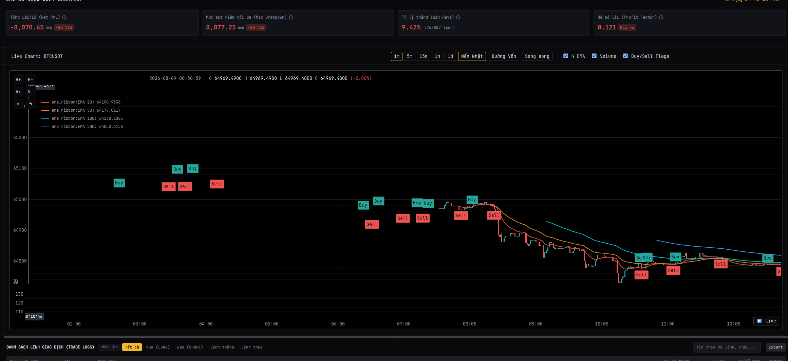

zoom out nhiều, sau đó zoom in lại thì bị vầy


LOG
``` log

Starting PySide6 Trading Bot UI...
2026-08-12 19:13:05,812 - App - INFO - Initializing extension 'ThreadManagerExtension'...
2026-08-12 19:13:05,812 - App - INFO - Initializing extension 'BinanceBotModule'...
2026-08-12 19:13:05,812 - App - INFO - App is booting...
2026-08-12 19:13:05,813 - App - INFO - AsyncRuntime event loop started on background thread.
2026-08-12 19:13:05,814 - App - INFO - Starting extension 'DependencyValidatorExtension'...
2026-08-12 19:13:05,814 - App - INFO - Pre-flight check passed. All critical dependencies found.
2026-08-12 19:13:05,814 - App - INFO - Starting extension 'LoggerExtension'...
2026-08-12 19:13:05,814 - App - INFO - Starting extension 'ThreadManagerExtension'...
2026-08-12 19:13:05,814 - App - INFO - Starting extension 'BinanceBotModule'...
2026-08-12 19:13:05,814 - App - INFO - Starting Hosted Service 'LiveStreamEngineAdapter'...
2026-08-12 19:13:05,815 - App.LiveStreamAdapter - INFO - LiveStreamEngineAdapter started.
2026-08-12 19:13:05,815 - App - INFO - Scheduler started.
2026-08-12 19:13:05,815 - App - INFO - App booted successfully with 4 modules.
2026-08-12 19:13:06,886 - App - INFO - Executing command: SyncMarketDataCommand
2026-08-12 19:13:07,455 - App.Database - INFO - Database Manager initialized at directory: Sagittarius_Elite_Warrior/database
2026-08-12 19:13:07,456 - App.SyncMarketData - INFO - Starting sync for symbols: ['ETHUSDT'] at interval 1m
2026-08-12 19:13:07,456 - App.SyncMarketData - INFO - [ETHUSDT] Syncing from explicit start time: 2026-08-05 12:13:00+00:00
2026-08-12 19:13:07,456 - App.ExchangeClient - INFO - Fetching historical klines for ETHUSDT at 1m from 05 Aug 2026 12:13:00 to 12 Aug 2026 12:13:00
2026-08-12 19:13:12,143 - App.ExchangeClient - INFO - Successfully fetched 10079 klines for ETHUSDT.
2026-08-12 19:13:12,229 - App.Database - INFO - Created dedicated database for symbol ETHUSDT at Sagittarius_Elite_Warrior/database\ETHUSDT.db
2026-08-12 19:13:12,436 - App.SyncMarketData - INFO - [ETHUSDT] Successfully synced 10079 klines.
2026-08-12 19:13:12,439 - App - INFO - Executing query: GetHistoricalKlinesQuery
2026-08-12 19:13:12,506 - App - INFO - Executing command: StartLiveStreamCommand
2026-08-12 19:13:12,506 - App.LiveStreamUseCase - INFO - Executing StartLiveStreamCommand for ['ETHUSDT'] at 1m
2026-08-12 19:13:12,507 - App.LiveStream - INFO - Starting Binance WebSocket stream for ['ETHUSDT'] at 1m
2026-08-12 19:13:12,508 - App.LiveStreamUseCase - INFO - StartLiveStreamCommand executed successfully.
2026-08-12 19:13:14,462 - App.IconLoader - WARNING - Icon not found: 'sliders' (C:\Users\hoang\Documents\Sagittarius-Engine\Sagittarius_Elite_Warrior\src\presentation\ui\assets\icons\sliders.svg) — using blank fallback.
2026-08-12 19:13:14,464 - App.IconLoader - WARNING - Icon not found: 'sliders' (C:\Users\hoang\Documents\Sagittarius-Engine\Sagittarius_Elite_Warrior\src\presentation\ui\assets\icons\sliders.svg) — using blank fallback.
2026-08-12 19:13:14,465 - App.IconLoader - WARNING - Icon not found: 'chevron-down' (C:\Users\hoang\Documents\Sagittarius-Engine\Sagittarius_Elite_Warrior\src\presentation\ui\assets\icons\chevron-down.svg) — using blank fallback.
2026-08-12 19:13:14,467 - App.IconLoader - WARNING - Icon not found: 'chevron-down' (C:\Users\hoang\Documents\Sagittarius-Engine\Sagittarius_Elite_Warrior\src\presentation\ui\assets\icons\chevron-down.svg) — using blank fallback.
2026-08-12 19:13:14,467 - App.IconLoader - WARNING - Icon not found: 'briefcase' (C:\Users\hoang\Documents\Sagittarius-Engine\Sagittarius_Elite_Warrior\src\presentation\ui\assets\icons\briefcase.svg) — using blank fallback.
file:///C:/Users/hoang/Documents/Sagittarius-Engine/Sagittarius_Elite_Warrior/src/presentation/ui/components/BotParamField.qml:19:5: Unable to assign [undefined] to QString
file:///C:/Users/hoang/Documents/Sagittarius-Engine/Sagittarius_Elite_Warrior/src/presentation/ui/components/BotParamField.qml:59:13: Unable to assign [undefined] to QColor
file:///C:/Users/hoang/Documents/Sagittarius-Engine/Sagittarius_Elite_Warrior/src/presentation/ui/components/BotParamField.qml:19:5: Unable to assign [undefined] to QString
file:///C:/Users/hoang/Documents/Sagittarius-Engine/Sagittarius_Elite_Warrior/src/presentation/ui/components/BotParamField.qml:59:13: Unable to assign [undefined] to QColor
2026-08-12 19:13:19,548 - App - INFO - Executing command: RunStaticBacktestCommand
2026-08-12 19:13:19,554 - App.Database - INFO - Created dedicated database for symbol BTCUSDT at Sagittarius_Elite_Warrior/database\BTCUSDT.db
2026-08-12 19:13:19,654 - App.LiveStream - INFO - [Live Stream] ETHUSDT | Price: 1914.88 | Vol: 85.9739 | Closed: False
2026-08-12 19:13:19,655 - App.TradingStrategy - INFO - Processing tick for ETHUSDT at 1914.88
2026-08-12 19:13:21,033 - App.RunStaticBacktest - INFO - Static backtest complete for BTCUSDT: 807 trades, net profit -80.71%
2026-08-12 19:13:21,043 - App - INFO - Executing query: GetHistoricalKlinesQuery
2026-08-12 19:13:25,612 - App.LiveStream - INFO - [Live Stream] ETHUSDT | Price: 1914.88 | Vol: 86.0368 | Closed: False
2026-08-12 19:13:25,612 - App.TradingStrategy - INFO - Processing tick for ETHUSDT at 1914.88
2026-08-12 19:13:27,622 - App.LiveStream - INFO - [Live Stream] ETHUSDT | Price: 1914.88 | Vol: 86.589 | Closed: False
2026-08-12 19:13:27,622 - App.TradingStrategy - INFO - Processing tick for ETHUSDT at 1914.88
2026-08-12 19:13:29,615 - App.LiveStream - INFO - [Live Stream] ETHUSDT | Price: 1915.3 | Vol: 114.8001 | Closed: False
2026-08-12 19:13:29,615 - App.TradingStrategy - INFO - Processing tick for ETHUSDT at 1915.3
2026-08-12 19:13:31,626 - App.LiveStream - INFO - [Live Stream] ETHUSDT | Price: 1915.29 | Vol: 115.1138 | Closed: False
2026-08-12 19:13:31,627 - App.TradingStrategy - INFO - Processing tick for ETHUSDT at 1915.29
2026-08-12 19:13:33,629 - App.LiveStream - INFO - [Live Stream] ETHUSDT | Price: 1915.3 | Vol: 115.1334 | Closed: False
2026-08-12 19:13:33,639 - App.TradingStrategy - INFO - Processing tick for ETHUSDT at 1915.3
2026-08-12 19:13:35,606 - App.LiveStream - INFO - [Live Stream] ETHUSDT | Price: 1915.29 | Vol: 115.1438 | Closed: False
2026-08-12 19:13:35,606 - App.TradingStrategy - INFO - Processing tick for ETHUSDT at 1915.29
2026-08-12 19:13:37,629 - App.LiveStream - INFO - [Live Stream] ETHUSDT | Price: 1915.3 | Vol: 115.165 | Closed: False
2026-08-12 19:13:37,629 - App.TradingStrategy - INFO - Processing tick for ETHUSDT at 1915.3
2026-08-12 19:13:41,612 - App.LiveStream - INFO - [Live Stream] ETHUSDT | Price: 1915.3 | Vol: 115.2479 | Closed: True
2026-08-12 19:13:41,612 - App.TradingStrategy - INFO - Processing tick for ETHUSDT at 1915.3
2026-08-12 19:13:43,633 - App.LiveStream - INFO - [Live Stream] ETHUSDT | Price: 1915.29 | Vol: 0.064 | Closed: False
2026-08-12 19:13:43,634 - App.TradingStrategy - INFO - Processing tick for ETHUSDT at 1915.29
2026-08-12 19:13:45,604 - App.LiveStream - INFO - [Live Stream] ETHUSDT | Price: 1915.3 | Vol: 0.5861 | Closed: False
2026-08-12 19:13:45,604 - App.TradingStrategy - INFO - Processing tick for ETHUSDT at 1915.3
file:///C:/Users/hoang/Documents/Sagittarius-Engine/Sagittarius_Elite_Warrior/src/presentation/ui/components/StrategyComboBox.qml:51:21: Unable to assign [undefined] to QString
file:///C:/Users/hoang/Documents/Sagittarius-Engine/Sagittarius_Elite_Warrior/src/presentation/ui/components/StrategyComboBox.qml:70:25: Unable to assign [undefined] to QString
file:///C:/Users/hoang/Documents/Sagittarius-Engine/Sagittarius_Elite_Warrior/src/presentation/ui/components/StrategyComboBox.qml:78:17: Unable to assign [undefined] to QString


```