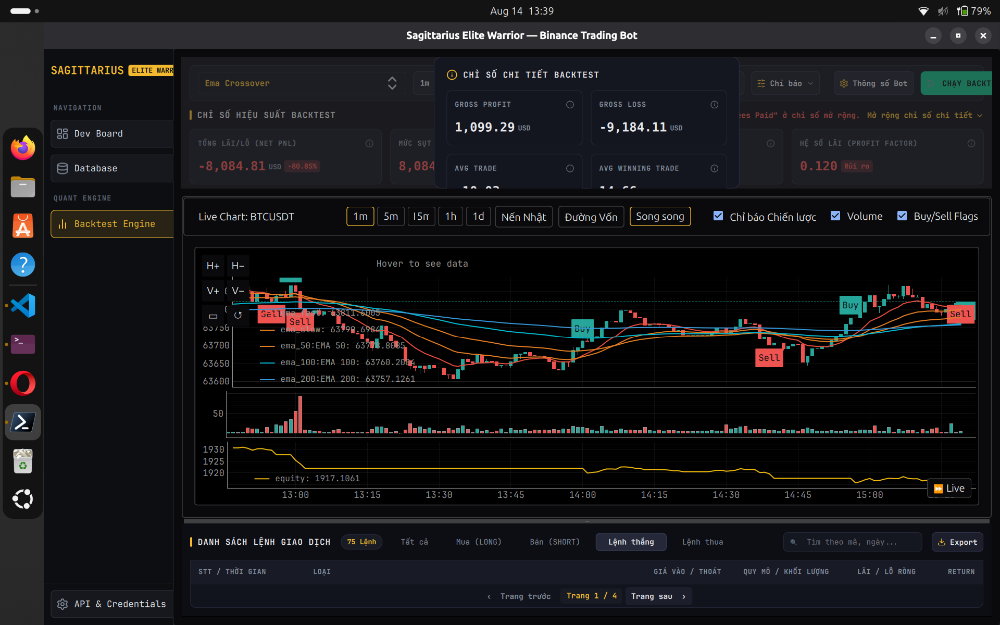
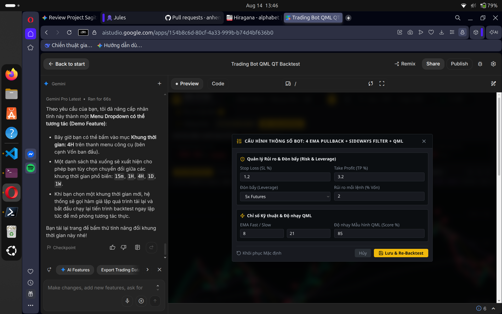

### Vấn đề:
- Bảng danh sách lệnh (`BackTestTradeLogs.qml`) bị lệch cột nghiêm trọng giữa thanh tiêu đề (`tableHeaderRow`) và các hàng dữ liệu (`rowBtn delegate`).
- Nguyên nhân: Tiêu đề cột `GIÁ VÀO / THOÁT` đặt `Layout.fillWidth: true` kèm `horizontalAlignment: Text.AlignRight` khiến chữ bị đẩy dạt sang tận mép phải cạnh `QUY MÔ`, để lại khoảng trống lớn bên trái; trong khi các ô dữ liệu bên dưới lại hiển thị căn trái. Chiều rộng của các cột khác (`LOẠI`, `LÃI / LỖ RÒNG`) giữa Header và Row cũng không khớp nhau (80px vs 64px, 120px vs 110px).

### Đã xử lý (Fixed):
- Cân chỉnh khớp 100% tỷ lệ độ rộng và căn lề (alignment/spacing) giữa Table Header và Data Row:
  - **STT / THỜI GIAN**: `Layout.preferredWidth: 160`, căn trái (`Text.AlignLeft`).
  - **LOẠI**: `Layout.preferredWidth: 70`, căn giữa (`Text.AlignHCenter`).
  - **GIÁ VÀO ➔ GIÁ THOÁT**: `Layout.fillWidth: true`, `Layout.minimumWidth: 200`, căn trái (`Text.AlignLeft`).
  - **QUY MÔ / KHỐI LƯỢNG**: `Layout.preferredWidth: 150`, căn phải (`Text.AlignRight`).
  - **LÃI / LỖ RÒNG**: `Layout.preferredWidth: 120`, căn phải (`Text.AlignRight`).
  - **RETURN**: `Layout.preferredWidth: 80`, căn phải (`Text.AlignRight`).
  - Cả Header và Row dùng chung `leftMargin: 12`, `rightMargin: 12`, `spacing: 8`.
- **Trạng thái**: Đã fix & Sanity UI test PASSED 100%.

Refer:
