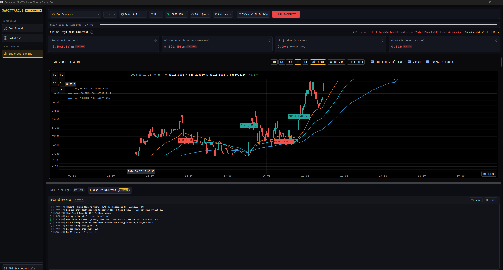

Current screen

Hien tuong block o trang thai nay.

[19:49:52] [Health] Trạng thái hệ thống: HEALTHY (Database: OK, EventBus: OK)
[19:49:57] Bắt đầu chạy Backtest: Ema Crossover (1m) | Cặp: BTCUSDT | Vốn ban đầu: 10,000 USD
[19:50:02] [DataSync] Đồng bộ dữ liệu thành công.
[19:50:04] Đã nạp 5,000 nến lịch sử cho BTCUSDT.
[19:50:04] Hoàn thành Backtest (0.00s): 957 lệnh | Net PnL: -8,583.56 USD | Win Rate: 9.3%
[19:54:04] Đã lưu thông số chiến lược (Ema Crossover): fast_period=20, slow_period=26
[19:54:33] Đã đổi khung thời gian: 5m
[19:54:37] Đã đổi khung thời gian: 15m
[19:54:38] Đã đổi khung thời gian: 1h

Starting PySide6 Trading Bot UI...
2026-08-18 19:49:43,014 - App - INFO - Initializing extension 'ThreadManagerExtension'...
2026-08-18 19:49:43,014 - App - INFO - Initializing extension 'BinanceBotModule'...
2026-08-18 19:49:43,015 - App - INFO - Initializing extension 'HealthExtension'...
2026-08-18 19:49:43,016 - App - INFO - App is booting...
2026-08-18 19:49:43,017 - App - INFO - AsyncRuntime event loop started on background thread.
2026-08-18 19:49:43,017 - App - INFO - Starting extension 'DependencyValidatorExtension'...
2026-08-18 19:49:43,017 - App - INFO - Pre-flight check passed. All critical dependencies found.
2026-08-18 19:49:43,017 - App - INFO - Starting extension 'AssetValidatorExtension'...
2026-08-18 19:49:43,024 - App.AssetValidator - INFO - Pre-flight asset check passed. All required UI assets found.
2026-08-18 19:49:43,025 - App - INFO - Pre-flight asset check passed. All required UI assets found.
2026-08-18 19:49:43,025 - App - INFO - Starting extension 'LoggerExtension'...
2026-08-18 19:49:43,025 - App - INFO - Starting extension 'ThreadManagerExtension'...
2026-08-18 19:49:43,025 - App - INFO - Starting extension 'BinanceBotModule'...
2026-08-18 19:49:43,025 - App - INFO - Starting extension 'HealthExtension'...
2026-08-18 19:49:43,026 - App.Database - INFO - Database Manager initialized at directory: Sagittarius_Elite_Warrior/database
2026-08-18 19:49:43,026 - App - INFO - System Health: HEALTHY (Container: OK, Event_bus: OK, Database: OK)
2026-08-18 19:49:43,026 - App - INFO - Starting Hosted Service 'LiveStreamEngineAdapter'...
2026-08-18 19:49:43,026 - App.LiveStreamAdapter - INFO - LiveStreamEngineAdapter started.
2026-08-18 19:49:43,027 - App - INFO - Scheduler started.
2026-08-18 19:49:43,027 - App - INFO - App booted successfully with 6 modules.
2026-08-18 19:49:45,932 - App - INFO - UI Layer Ready — MainWindow rendered and Qt event loop active.
2026-08-18 19:49:53,151 - App.BacktestChartHostFactory - INFO - Backtest chart host initialized for symbol 'BTCUSDT' with backend 'native' (requested: 'auto').
2026-08-18 19:49:57,827 - App - INFO - Executing query: GetBacktestRangeCoverageQuery
2026-08-18 19:49:58,642 - App.Database - INFO - Created dedicated database for symbol BTCUSDT at Sagittarius_Elite_Warrior\database\BTCUSDT.db
2026-08-18 19:50:01,421 - App - INFO - Executing command: SyncMarketDataCommand
2026-08-18 19:50:01,628 - App.SyncMarketData - INFO - Starting sync for symbols: ['BTCUSDT'] at interval 1m
2026-08-18 19:50:01,645 - App.SyncMarketData - INFO - [BTCUSDT] Syncing from latest timestamp: 2026-08-17 10:04:00+00:00
2026-08-18 19:50:01,645 - App.ExchangeClient - INFO - Fetching historical klines for BTCUSDT at 1m from 17 Aug 2026 10:04:00 to 18 Aug 2026 12:49:57
2026-08-18 19:50:02,061 - App.ExchangeClient - INFO - Successfully fetched 1605 klines for BTCUSDT.
2026-08-18 19:50:02,097 - App.SyncMarketData - INFO - [BTCUSDT] Successfully synced 1605 klines.
2026-08-18 19:50:02,098 - App - INFO - Executing query: GetBacktestRangeCoverageQuery
2026-08-18 19:50:02,214 - App - INFO - Executing query: GetBacktestRangeCoverageQuery
2026-08-18 19:50:02,328 - App - INFO - Executing command: RunStaticBacktestCommand
2026-08-18 19:50:02,328 - App.RunStaticBacktest - INFO - BACKTEST_TRACE action=handler_execute_start symbol='BTCUSDT' timeframe='1m' strategy='ema_crossover' start=None end=datetime.datetime(2026, 8, 18, 12, 48, 57, 799041, tzinfo=datetime.timezone.utc) has_params=False
2026-08-18 19:50:03,142 - App.RunStaticBacktest - INFO - BACKTEST_TRACE action=handler_klines_loaded count=51898
2026-08-18 19:50:03,142 - App.RunStaticBacktest - INFO - BACKTEST_TRACE action=handler_simulation_start
2026-08-18 19:50:03,142 - App.RunStaticBacktest - INFO - BACKTEST_TRACE action=handler_out_of_sample_split in_sample=36329 out_of_sample=15569
2026-08-18 19:50:03,962 - App.RunStaticBacktest - INFO - BACKTEST_TRACE action=handler_complete trades=957 net_profit_percent=-85.83558226592147 out_of_sample=True
2026-08-18 19:50:03,962 - App.RunStaticBacktest - INFO - Static backtest complete for BTCUSDT: 957 trades, net profit -85.84%
2026-08-18 19:50:03,973 - App - INFO - Executing query: GetHistoricalKlinesQuery
2026-08-18 19:50:03,973 - App.QueryHandler - INFO - BACKTEST_TRACE action=query_execute_start symbol='BTCUSDT' timeframe='1m' limit=5000 start=None end=datetime.datetime(2026, 8, 18, 12, 48, 57, 799041, tzinfo=datetime.timezone.utc) order_by_desc=True
2026-08-18 19:50:04,044 - App.QueryHandler - INFO - BACKTEST_TRACE action=query_execute_complete symbol='BTCUSDT' rows=5000
2026-08-18 19:50:04,261 - App - ERROR - [UI Thread Bridge Error] Exception in _on_chart_data_ready: marker timestamp does not align with any candle
2026-08-18 19:50:04,267 - App - ERROR - [UI Thread Bridge Error] Exception in _on_chart_strategy_line: indicator data has a leading gap with no prior value to hold
2026-08-18 19:50:04,271 - App - ERROR - [UI Thread Bridge Error] Exception in _on_chart_strategy_line: indicator data has a leading gap with no prior value to hold
2026-08-18 19:50:04,276 - App - ERROR - [UI Thread Bridge Error] Exception in _on_chart_script_line: indicator data has a leading gap with no prior value to hold
2026-08-18 19:50:04,276 - App.BackTestPresenter - WARNING - Native Backtest chart does not support script regions; rebuilding with the Python host.
2026-08-18 19:50:04,278 - App.BacktestChartHostFactory - INFO - Backtest chart host initialized for symbol 'BTCUSDT' with backend 'python' (requested: 'python').
2026-08-18 19:54:04,682 - App - ERROR - [UI Thread Bridge Error] Exception in _on_bot_params_save_requested: ResourceScope teardown failed (1 sub-exception)