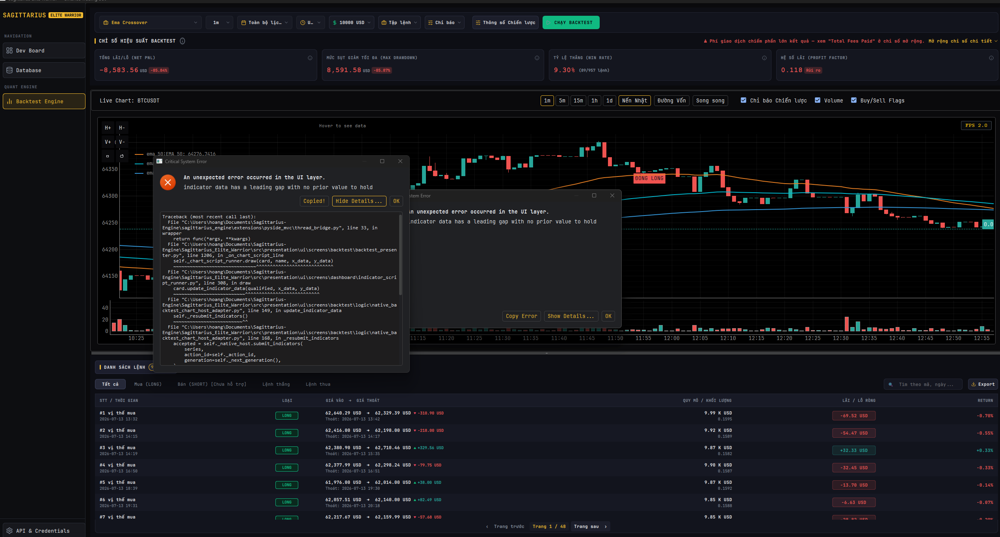

Error: indicator data has a leading gap with no prior value to hold

Traceback:
Traceback (most recent call last):
  File "C:\Users\hoang\Documents\Sagittarius-Engine\sagittarius_engine\extensions\pyside_mvc\thread_bridge.py", line 33, in wrapper
    return func(*args, **kwargs)
  File "C:\Users\hoang\Documents\Sagittarius-Engine\Sagittarius_Elite_Warrior\src\presentation\ui\screens\backtest\backtest_presenter.py", line 1206, in _on_chart_script_line
    self._chart_script_runner.draw(card, name, x_data, y_data)
    ~~~~~~~~~~~~~~~~~~~~~~~~~~~~~~^^^^^^^^^^^^^^^^^^^^^^^^^^^^
  File "C:\Users\hoang\Documents\Sagittarius-Engine\Sagittarius_Elite_Warrior\src\presentation\ui\screens\dashboard\indicator_script_runner.py", line 308, in draw
    card.update_indicator_data(qualified, x_data, y_data)
    ~~~~~~~~~~~~~~~~~~~~~~~~~~^^^^^^^^^^^^^^^^^^^^^^^^^^^
  File "C:\Users\hoang\Documents\Sagittarius-Engine\Sagittarius_Elite_Warrior\src\presentation\ui\screens\backtest\logic\native_backtest_chart_host_adapter.py", line 149, in update_indicator_data
    self._resubmit_indicators()
    ~~~~~~~~~~~~~~~~~~~~~~~~~^^
  File "C:\Users\hoang\Documents\Sagittarius-Engine\Sagittarius_Elite_Warrior\src\presentation\ui\screens\backtest\logic\native_backtest_chart_host_adapter.py", line 168, in _resubmit_indicators
    accepted = self._native_host.submit_indicators(
        series,
        action_id=self._action_id,
        generation=self._next_generation(),
    )
  File "C:\Users\hoang\Documents\Sagittarius-Engine\Sagittarius_Elite_Warrior\src\presentation\ui\screens\backtest\logic\native_backtest_chart_adapter.py", line 361, in submit_indicators
    native_series = tuple(
                    ^^^^^
  File "C:\Users\hoang\Documents\Sagittarius-Engine\Sagittarius_Elite_Warrior\src\presentation\ui\screens\backtest\logic\native_backtest_chart_adapter.py", line 362, in <genexpr>
    build_native_indicator_series(
    ~~~~~~~~~~~~~~~~~~~~~~~~~~~~~^
        self._candle_timestamps_ms, x_data, y_data, rgba=rgba
        ^^^^^^^^^^^^^^^^^^^^^^^^^^^^^^^^^^^^^^^^^^^^^^^^^^^^^
    )
    ^
  File "C:\Users\hoang\Documents\Sagittarius-Engine\Sagittarius_Elite_Warrior\src\presentation\ui\screens\backtest\logic\native_backtest_chart_adapter.py", line 175, in build_native_indicator_series
    raise ValueError(
        "indicator data has a leading gap with no prior value to hold"
    )
ValueError: indicator data has a leading gap with no prior value to hold

LOG:
Starting PySide6 Trading Bot UI (dev mode)...
Dev mode enabled — button clicks are auto-logged for real QPushButtons only (e.g. ChartCard's timeframe toolbar); QML screens are not instrumented (see BaseView._ButtonClickWatcher).
2026-08-18 19:57:42,168 - App - INFO - Initializing extension 'ThreadManagerExtension'...
2026-08-18 19:57:42,168 - App - INFO - Initializing extension 'BinanceBotModule'...
2026-08-18 19:57:42,169 - App - INFO - Initializing extension 'HealthExtension'...
2026-08-18 19:57:42,169 - App - INFO - App is booting...
2026-08-18 19:57:42,170 - App - INFO - AsyncRuntime event loop started on background thread.
2026-08-18 19:57:42,170 - App - INFO - Starting extension 'DependencyValidatorExtension'...
2026-08-18 19:57:42,171 - App - INFO - Pre-flight check passed. All critical dependencies found.
2026-08-18 19:57:42,171 - App - INFO - Starting extension 'AssetValidatorExtension'...
2026-08-18 19:57:42,172 - App.AssetValidator - INFO - Pre-flight asset check passed. All required UI assets found.
2026-08-18 19:57:42,172 - App - INFO - Pre-flight asset check passed. All required UI assets found.
2026-08-18 19:57:42,173 - App - INFO - Starting extension 'LoggerExtension'...
2026-08-18 19:57:42,173 - App - INFO - Starting extension 'ThreadManagerExtension'...
2026-08-18 19:57:42,173 - App - INFO - Starting extension 'BinanceBotModule'...
2026-08-18 19:57:42,173 - App - INFO - Starting extension 'HealthExtension'...
2026-08-18 19:57:42,174 - App.Database - INFO - Database Manager initialized at directory: Sagittarius_Elite_Warrior/database
2026-08-18 19:57:42,174 - App - INFO - System Health: HEALTHY (Container: OK, Event_bus: OK, Database: OK)
2026-08-18 19:57:42,174 - App - INFO - Starting Hosted Service 'LiveStreamEngineAdapter'...
2026-08-18 19:57:42,174 - App.LiveStreamAdapter - INFO - LiveStreamEngineAdapter started.
2026-08-18 19:57:42,174 - App - INFO - Scheduler started.
2026-08-18 19:57:42,174 - App - INFO - App booted successfully with 6 modules.
2026-08-18 19:57:43,141 - App - INFO - UI Layer Ready — MainWindow rendered and Qt event loop active.
2026-08-18 19:57:44,395 - App.BacktestChartHostFactory - INFO - Backtest chart host initialized for symbol 'BTCUSDT' with backend 'native' (requested: 'auto').
2026-08-18 19:57:47,375 - App.BackTestPresenter - INFO - BACKTEST_TRACE action=run_requested strategy='ema_crossover' timeframe='1m' capital='10000' preset='all'
2026-08-18 19:57:47,376 - App.BackTestPresenter - INFO - BACKTEST_TRACE action=run_config_built symbol='BTCUSDT' strategy='ema_crossover' timeframe='1m' start=None end=None has_params=False
2026-08-18 19:57:47,377 - App.BackTestPresenter - INFO - BACKTEST_TRACE action=run_transitioned state=<BacktestUiState.RUNNING: 'RUNNING'>
2026-08-18 19:57:47,377 - App.BackTestPresenter - INFO - BACKTEST_TRACE action=run_submit_start strategy='ema_crossover' timeframe='1m' start=None end=datetime.datetime(2026, 8, 18, 12, 56, 47, 377844, tzinfo=datetime.timezone.utc) has_params=False removed_strategy_lines=0
2026-08-18 19:57:47,378 - App.BackTestPresenter - INFO - BACKTEST_TRACE action=run_snapshot_scripts script_keys=['ema_20', 'ema_50', 'ema_100', 'ema_200']
2026-08-18 19:57:47,389 - App.BackTestPresenter - INFO - BACKTEST_TRACE action=action_started action_id=1 kind='BACKTEST' config='ETHUSDT | 1m | ema_crossover | Vốn: 10,000 USD' previous_state='IDLE'
2026-08-18 19:57:47,390 - App.BackTestPresenter - INFO - BACKTEST_TRACE action=run_worker_submitted
2026-08-18 19:57:47,390 - App.BackTestPresenter - INFO - BACKTEST_TRACE action=worker_start action_id=1 strategy='ema_crossover' timeframe='1m'
2026-08-18 19:57:47,391 - App - INFO - Executing query: GetBacktestRangeCoverageQuery
2026-08-18 19:57:47,425 - App.Database - INFO - Created dedicated database for symbol BTCUSDT at Sagittarius_Elite_Warrior\database\BTCUSDT.db
2026-08-18 19:57:47,541 - App.BackTestPresenter - INFO - BACKTEST_TRACE action=action_finished action_id=1 kind='BACKTEST' outcome='EMPTY'
2026-08-18 19:57:47,542 - App.BackTestPresenter - INFO - BACKTEST_TRACE action=sync_requested
2026-08-18 19:57:47,542 - App.BackTestPresenter - INFO - BACKTEST_TRACE action=action_superseded action_id=1 kind='BACKTEST' outcome='EMPTY'
2026-08-18 19:57:47,543 - App.BackTestPresenter - INFO - BACKTEST_TRACE action=action_started action_id=2 kind='SYNC' config='ETHUSDT | 1m | ema_crossover | Vốn: 10,000 USD' previous_state='EMPTY_DATA'
2026-08-18 19:57:47,543 - App.BackTestPresenter - INFO - BACKTEST_TRACE action=sync_worker_submitted
2026-08-18 19:57:47,543 - App.BackTestPresenter - INFO - BACKTEST_TRACE action=sync_worker_start action_id=2 timeframe='1m' start=None end=datetime.datetime(2026, 8, 18, 12, 56, 47, 377844, tzinfo=datetime.timezone.utc)
2026-08-18 19:57:47,544 - App.BackTestPresenter - INFO - BACKTEST_TRACE action=sync_dispatch symbol='BTCUSDT' timeframe='1m'
2026-08-18 19:57:47,544 - App - INFO - Executing command: SyncMarketDataCommand
2026-08-18 19:57:47,691 - App.SyncMarketData - INFO - Starting sync for symbols: ['BTCUSDT'] at interval 1m
2026-08-18 19:57:47,696 - App.SyncMarketData - INFO - [BTCUSDT] Syncing from latest timestamp: 2026-08-18 12:48:00+00:00
2026-08-18 19:57:47,696 - App.ExchangeClient - INFO - Fetching historical klines for BTCUSDT at 1m from 18 Aug 2026 12:48:00 to 18 Aug 2026 12:57:47
2026-08-18 19:57:47,955 - App.ExchangeClient - INFO - Successfully fetched 9 klines for BTCUSDT.
2026-08-18 19:57:47,972 - App.SyncMarketData - INFO - [BTCUSDT] Successfully synced 9 klines.
2026-08-18 19:57:47,972 - App - INFO - Executing query: GetBacktestRangeCoverageQuery
2026-08-18 19:57:48,100 - App.BackTestPresenter - INFO - BACKTEST_TRACE action=action_finished action_id=2 kind='SYNC' outcome='SUCCEEDED'
2026-08-18 19:57:48,100 - App.BackTestPresenter - INFO - BACKTEST_TRACE action=sync_succeeded
2026-08-18 19:57:48,102 - App.BackTestPresenter - INFO - BACKTEST_TRACE action=run_submit_start strategy='ema_crossover' timeframe='1m' start=None end=datetime.datetime(2026, 8, 18, 12, 56, 47, 377844, tzinfo=datetime.timezone.utc) has_params=False removed_strategy_lines=0
2026-08-18 19:57:48,103 - App.BackTestPresenter - INFO - BACKTEST_TRACE action=run_snapshot_scripts script_keys=['ema_20', 'ema_50', 'ema_100', 'ema_200']
2026-08-18 19:57:48,103 - App.BackTestPresenter - INFO - BACKTEST_TRACE action=action_superseded action_id=2 kind='SYNC' outcome='SUCCEEDED'
2026-08-18 19:57:48,103 - App.BackTestPresenter - INFO - BACKTEST_TRACE action=action_started action_id=3 kind='BACKTEST' config='ETHUSDT | 1m | ema_crossover | Vốn: 10,000 USD' previous_state='RUNNING'
2026-08-18 19:57:48,104 - App.BackTestPresenter - INFO - BACKTEST_TRACE action=run_worker_submitted
2026-08-18 19:57:48,104 - App.BackTestPresenter - INFO - BACKTEST_TRACE action=worker_start action_id=3 strategy='ema_crossover' timeframe='1m'
2026-08-18 19:57:48,104 - App - INFO - Executing query: GetBacktestRangeCoverageQuery
2026-08-18 19:57:48,215 - App.BackTestPresenter - INFO - BACKTEST_TRACE action=worker_dispatch_run_static_backtest symbol='BTCUSDT' timeframe='1m'
2026-08-18 19:57:48,216 - App - INFO - Executing command: RunStaticBacktestCommand
2026-08-18 19:57:48,216 - App.RunStaticBacktest - INFO - BACKTEST_TRACE action=handler_execute_start symbol='BTCUSDT' timeframe='1m' strategy='ema_crossover' start=None end=datetime.datetime(2026, 8, 18, 12, 56, 47, 377844, tzinfo=datetime.timezone.utc) has_params=False
2026-08-18 19:57:49,074 - App.RunStaticBacktest - INFO - BACKTEST_TRACE action=handler_klines_loaded count=51906
2026-08-18 19:57:49,074 - App.RunStaticBacktest - INFO - BACKTEST_TRACE action=handler_simulation_start
2026-08-18 19:57:49,075 - App.RunStaticBacktest - INFO - BACKTEST_TRACE action=handler_out_of_sample_split in_sample=36334 out_of_sample=15572
2026-08-18 19:57:49,868 - App.RunStaticBacktest - INFO - BACKTEST_TRACE action=handler_complete trades=957 net_profit_percent=-85.83558226592147 out_of_sample=True
2026-08-18 19:57:49,868 - App.RunStaticBacktest - INFO - Static backtest complete for BTCUSDT: 957 trades, net profit -85.84%
2026-08-18 19:57:49,878 - App.BackTestPresenter - INFO - BACKTEST_TRACE action=worker_result_ready trades=957 net_profit_percent=-85.83558226592147
2026-08-18 19:57:49,878 - App.BackTestPresenter - INFO - BACKTEST_TRACE action=chart_query_dispatch symbol='BTCUSDT' timeframe='1m' limit=5000
2026-08-18 19:57:49,878 - App - INFO - Executing query: GetHistoricalKlinesQuery
2026-08-18 19:57:49,878 - App.QueryHandler - INFO - BACKTEST_TRACE action=query_execute_start symbol='BTCUSDT' timeframe='1m' limit=5000 start=None end=datetime.datetime(2026, 8, 18, 12, 56, 47, 377844, tzinfo=datetime.timezone.utc) order_by_desc=True
2026-08-18 19:57:49,973 - App.QueryHandler - INFO - BACKTEST_TRACE action=query_execute_complete symbol='BTCUSDT' rows=5000
2026-08-18 19:57:49,978 - App.BackTestPresenter - INFO - BACKTEST_TRACE action=chart_query_ready raw_klines=5000 mapped_klines=5000 mapped_volume=5000
2026-08-18 19:57:49,995 - App.BackTestPresenter - INFO - BACKTEST_TRACE action=chart_scripts_rebuild script_keys=['ema_20', 'ema_50', 'ema_100', 'ema_200']
2026-08-18 19:57:50,063 - App.BackTestPresenter - INFO - BACKTEST_TRACE action=chart_scripts_fed raw_klines=5000
2026-08-18 19:57:50,273 - App.BackTestPresenter - INFO - BACKTEST_TRACE action=chart_data_ready klines=5000 volume=5000 trades=957
2026-08-18 19:57:50,286 - App - ERROR - [UI Thread Bridge Error] Exception in _on_chart_data_ready: marker timestamp does not align with any candle
2026-08-18 19:57:50,288 - App - ERROR - [UI Thread Bridge Error] Exception in _on_chart_data_ready_for_action: marker timestamp does not align with any candle
2026-08-18 19:57:50,300 - App - ERROR - Uncaught UI Exception: marker timestamp does not align with any candle
Traceback (most recent call last):
  File "C:\Users\hoang\Documents\Sagittarius-Engine\sagittarius_engine\extensions\pyside_mvc\thread_bridge.py", line 33, in wrapper
    return func(*args, **kwargs)
  File "C:\Users\hoang\Documents\Sagittarius-Engine\Sagittarius_Elite_Warrior\src\presentation\ui\screens\backtest\backtest_presenter.py", line 1069, in _on_chart_data_ready_for_action
    self._on_chart_data_ready(result, klines, volume)
    ~~~~~~~~~~~~~~~~~~~~~~~~~^^^^^^^^^^^^^^^^^^^^^^^^
  File "C:\Users\hoang\Documents\Sagittarius-Engine\sagittarius_engine\extensions\pyside_mvc\thread_bridge.py", line 33, in wrapper
    return func(*args, **kwargs)
  File "C:\Users\hoang\Documents\Sagittarius-Engine\Sagittarius_Elite_Warrior\src\presentation\ui\screens\backtest\backtest_presenter.py", line 1173, in _on_chart_data_ready
    self.view.on_backtest_data_ready(result, klines, volume)
    ~~~~~~~~~~~~~~~~~~~~~~~~~~~~~~~~^^^^^^^^^^^^^^^^^^^^^^^^
  File "C:\Users\hoang\Documents\Sagittarius-Engine\Sagittarius_Elite_Warrior\src\presentation\ui\screens\backtest\backtest_view.py", line 299, in on_backtest_data_ready
    self._render_chart()
    ~~~~~~~~~~~~~~~~~~^^
  File "C:\Users\hoang\Documents\Sagittarius-Engine\Sagittarius_Elite_Warrior\src\presentation\ui\screens\backtest\backtest_view.py", line 398, in _render_chart
    card.set_script_markers(
    ~~~~~~~~~~~~~~~~~~~~~~~^
        _TRADE_FLAGS_KEY, trade_flag_markers(self._last_result)
        ^^^^^^^^^^^^^^^^^^^^^^^^^^^^^^^^^^^^^^^^^^^^^^^^^^^^^^^
    )
    ^
  File "C:\Users\hoang\Documents\Sagittarius-Engine\Sagittarius_Elite_Warrior\src\presentation\ui\screens\backtest\logic\native_backtest_chart_host_adapter.py", line 197, in set_script_markers
    accepted = self._native_host.submit_markers(
        markers,
        action_id=self._action_id,
        generation=self._next_generation(),
    )
  File "C:\Users\hoang\Documents\Sagittarius-Engine\Sagittarius_Elite_Warrior\src\presentation\ui\screens\backtest\logic\native_backtest_chart_adapter.py", line 385, in submit_markers
    native_markers = sorted(
        (
    ...<3 lines>...
        key=lambda marker: marker.candle_index,
    )
  File "C:\Users\hoang\Documents\Sagittarius-Engine\Sagittarius_Elite_Warrior\src\presentation\ui\screens\backtest\logic\native_backtest_chart_adapter.py", line 387, in <genexpr>
    build_native_marker(marker, self._candle_timestamps_ms)
    ~~~~~~~~~~~~~~~~~~~^^^^^^^^^^^^^^^^^^^^^^^^^^^^^^^^^^^^
  File "C:\Users\hoang\Documents\Sagittarius-Engine\Sagittarius_Elite_Warrior\src\presentation\ui\screens\backtest\logic\native_backtest_chart_adapter.py", line 199, in build_native_marker
    raise ValueError("marker timestamp does not align with any candle")
ValueError: marker timestamp does not align with any candle

2026-08-18 19:57:50,338 - App - ERROR - [UI Thread Bridge Error] Exception in _on_chart_strategy_line: indicator data has a leading gap with no prior value to hold
2026-08-18 19:57:50,339 - App - ERROR - [UI Thread Bridge Error] Exception in _on_chart_strategy_line_for_action: indicator data has a leading gap with no prior value to hold
2026-08-18 19:57:50,341 - App - ERROR - Uncaught UI Exception: indicator data has a leading gap with no prior value to hold
Traceback (most recent call last):
  File "C:\Users\hoang\Documents\Sagittarius-Engine\sagittarius_engine\extensions\pyside_mvc\thread_bridge.py", line 33, in wrapper
    return func(*args, **kwargs)
  File "C:\Users\hoang\Documents\Sagittarius-Engine\Sagittarius_Elite_Warrior\src\presentation\ui\screens\backtest\backtest_presenter.py", line 1081, in _on_chart_strategy_line_for_action
    self._on_chart_strategy_line(name, color, x_data, y_data)
    ~~~~~~~~~~~~~~~~~~~~~~~~~~~~^^^^^^^^^^^^^^^^^^^^^^^^^^^^^
  File "C:\Users\hoang\Documents\Sagittarius-Engine\sagittarius_engine\extensions\pyside_mvc\thread_bridge.py", line 33, in wrapper
    return func(*args, **kwargs)
  File "C:\Users\hoang\Documents\Sagittarius-Engine\Sagittarius_Elite_Warrior\src\presentation\ui\screens\backtest\backtest_presenter.py", line 1195, in _on_chart_strategy_line
    card.update_indicator_data(name, x_data, y_data)
    ~~~~~~~~~~~~~~~~~~~~~~~~~~^^^^^^^^^^^^^^^^^^^^^^
  File "C:\Users\hoang\Documents\Sagittarius-Engine\Sagittarius_Elite_Warrior\src\presentation\ui\screens\backtest\logic\native_backtest_chart_host_adapter.py", line 149, in update_indicator_data
    self._resubmit_indicators()
    ~~~~~~~~~~~~~~~~~~~~~~~~~^^
  File "C:\Users\hoang\Documents\Sagittarius-Engine\Sagittarius_Elite_Warrior\src\presentation\ui\screens\backtest\logic\native_backtest_chart_host_adapter.py", line 168, in _resubmit_indicators
    accepted = self._native_host.submit_indicators(
        series,
        action_id=self._action_id,
        generation=self._next_generation(),
    )
  File "C:\Users\hoang\Documents\Sagittarius-Engine\Sagittarius_Elite_Warrior\src\presentation\ui\screens\backtest\logic\native_backtest_chart_adapter.py", line 361, in submit_indicators
    native_series = tuple(
                    ^^^^^
  File "C:\Users\hoang\Documents\Sagittarius-Engine\Sagittarius_Elite_Warrior\src\presentation\ui\screens\backtest\logic\native_backtest_chart_adapter.py", line 362, in <genexpr>
    build_native_indicator_series(
    ~~~~~~~~~~~~~~~~~~~~~~~~~~~~~^
        self._candle_timestamps_ms, x_data, y_data, rgba=rgba
        ^^^^^^^^^^^^^^^^^^^^^^^^^^^^^^^^^^^^^^^^^^^^^^^^^^^^^
    )
    ^
  File "C:\Users\hoang\Documents\Sagittarius-Engine\Sagittarius_Elite_Warrior\src\presentation\ui\screens\backtest\logic\native_backtest_chart_adapter.py", line 175, in build_native_indicator_series
    raise ValueError(
        "indicator data has a leading gap with no prior value to hold"
    )
ValueError: indicator data has a leading gap with no prior value to hold

2026-08-18 19:57:50,363 - App - ERROR - [UI Thread Bridge Error] Exception in _on_chart_strategy_line: indicator data has a leading gap with no prior value to hold
2026-08-18 19:57:50,364 - App - ERROR - [UI Thread Bridge Error] Exception in _on_chart_strategy_line_for_action: indicator data has a leading gap with no prior value to hold
2026-08-18 19:57:50,366 - App - ERROR - Uncaught UI Exception: indicator data has a leading gap with no prior value to hold
Traceback (most recent call last):
  File "C:\Users\hoang\Documents\Sagittarius-Engine\sagittarius_engine\extensions\pyside_mvc\thread_bridge.py", line 33, in wrapper
    return func(*args, **kwargs)
  File "C:\Users\hoang\Documents\Sagittarius-Engine\Sagittarius_Elite_Warrior\src\presentation\ui\screens\backtest\backtest_presenter.py", line 1081, in _on_chart_strategy_line_for_action
    self._on_chart_strategy_line(name, color, x_data, y_data)
    ~~~~~~~~~~~~~~~~~~~~~~~~~~~~^^^^^^^^^^^^^^^^^^^^^^^^^^^^^
  File "C:\Users\hoang\Documents\Sagittarius-Engine\sagittarius_engine\extensions\pyside_mvc\thread_bridge.py", line 33, in wrapper
    return func(*args, **kwargs)
  File "C:\Users\hoang\Documents\Sagittarius-Engine\Sagittarius_Elite_Warrior\src\presentation\ui\screens\backtest\backtest_presenter.py", line 1195, in _on_chart_strategy_line
    card.update_indicator_data(name, x_data, y_data)
    ~~~~~~~~~~~~~~~~~~~~~~~~~~^^^^^^^^^^^^^^^^^^^^^^
  File "C:\Users\hoang\Documents\Sagittarius-Engine\Sagittarius_Elite_Warrior\src\presentation\ui\screens\backtest\logic\native_backtest_chart_host_adapter.py", line 149, in update_indicator_data
    self._resubmit_indicators()
    ~~~~~~~~~~~~~~~~~~~~~~~~~^^
  File "C:\Users\hoang\Documents\Sagittarius-Engine\Sagittarius_Elite_Warrior\src\presentation\ui\screens\backtest\logic\native_backtest_chart_host_adapter.py", line 168, in _resubmit_indicators
    accepted = self._native_host.submit_indicators(
        series,
        action_id=self._action_id,
        generation=self._next_generation(),
    )
  File "C:\Users\hoang\Documents\Sagittarius-Engine\Sagittarius_Elite_Warrior\src\presentation\ui\screens\backtest\logic\native_backtest_chart_adapter.py", line 361, in submit_indicators
    native_series = tuple(
                    ^^^^^
  File "C:\Users\hoang\Documents\Sagittarius-Engine\Sagittarius_Elite_Warrior\src\presentation\ui\screens\backtest\logic\native_backtest_chart_adapter.py", line 362, in <genexpr>
    build_native_indicator_series(
    ~~~~~~~~~~~~~~~~~~~~~~~~~~~~~^
        self._candle_timestamps_ms, x_data, y_data, rgba=rgba
        ^^^^^^^^^^^^^^^^^^^^^^^^^^^^^^^^^^^^^^^^^^^^^^^^^^^^^
    )
    ^
  File "C:\Users\hoang\Documents\Sagittarius-Engine\Sagittarius_Elite_Warrior\src\presentation\ui\screens\backtest\logic\native_backtest_chart_adapter.py", line 175, in build_native_indicator_series
    raise ValueError(
        "indicator data has a leading gap with no prior value to hold"
    )
ValueError: indicator data has a leading gap with no prior value to hold

2026-08-18 19:57:50,388 - App - ERROR - [UI Thread Bridge Error] Exception in _on_chart_script_line: indicator data has a leading gap with no prior value to hold
2026-08-18 19:57:50,390 - App - ERROR - Uncaught UI Exception: indicator data has a leading gap with no prior value to hold
Traceback (most recent call last):
  File "C:\Users\hoang\Documents\Sagittarius-Engine\sagittarius_engine\extensions\pyside_mvc\thread_bridge.py", line 33, in wrapper
    return func(*args, **kwargs)
  File "C:\Users\hoang\Documents\Sagittarius-Engine\Sagittarius_Elite_Warrior\src\presentation\ui\screens\backtest\backtest_presenter.py", line 1206, in _on_chart_script_line
    self._chart_script_runner.draw(card, name, x_data, y_data)
    ~~~~~~~~~~~~~~~~~~~~~~~~~~~~~~^^^^^^^^^^^^^^^^^^^^^^^^^^^^
  File "C:\Users\hoang\Documents\Sagittarius-Engine\Sagittarius_Elite_Warrior\src\presentation\ui\screens\dashboard\indicator_script_runner.py", line 308, in draw
    card.update_indicator_data(qualified, x_data, y_data)
    ~~~~~~~~~~~~~~~~~~~~~~~~~~^^^^^^^^^^^^^^^^^^^^^^^^^^^
  File "C:\Users\hoang\Documents\Sagittarius-Engine\Sagittarius_Elite_Warrior\src\presentation\ui\screens\backtest\logic\native_backtest_chart_host_adapter.py", line 149, in update_indicator_data
    self._resubmit_indicators()
    ~~~~~~~~~~~~~~~~~~~~~~~~~^^
  File "C:\Users\hoang\Documents\Sagittarius-Engine\Sagittarius_Elite_Warrior\src\presentation\ui\screens\backtest\logic\native_backtest_chart_host_adapter.py", line 168, in _resubmit_indicators
    accepted = self._native_host.submit_indicators(
        series,
        action_id=self._action_id,
        generation=self._next_generation(),
    )
  File "C:\Users\hoang\Documents\Sagittarius-Engine\Sagittarius_Elite_Warrior\src\presentation\ui\screens\backtest\logic\native_backtest_chart_adapter.py", line 361, in submit_indicators
    native_series = tuple(
                    ^^^^^
  File "C:\Users\hoang\Documents\Sagittarius-Engine\Sagittarius_Elite_Warrior\src\presentation\ui\screens\backtest\logic\native_backtest_chart_adapter.py", line 362, in <genexpr>
    build_native_indicator_series(
    ~~~~~~~~~~~~~~~~~~~~~~~~~~~~~^
        self._candle_timestamps_ms, x_data, y_data, rgba=rgba
        ^^^^^^^^^^^^^^^^^^^^^^^^^^^^^^^^^^^^^^^^^^^^^^^^^^^^^
    )
    ^
  File "C:\Users\hoang\Documents\Sagittarius-Engine\Sagittarius_Elite_Warrior\src\presentation\ui\screens\backtest\logic\native_backtest_chart_adapter.py", line 175, in build_native_indicator_series
    raise ValueError(
        "indicator data has a leading gap with no prior value to hold"
    )
ValueError: indicator data has a leading gap with no prior value to hold

2026-08-18 19:57:50,407 - App.BackTestPresenter - INFO - BACKTEST_TRACE action=native_chart_unsupported_feature_fallback feature='script regions'
2026-08-18 19:57:50,408 - App.BackTestPresenter - WARNING - Native Backtest chart does not support script regions; rebuilding with the Python host.
2026-08-18 19:57:50,408 - App.BacktestChartHostFactory - INFO - Backtest chart host initialized for symbol 'BTCUSDT' with backend 'python' (requested: 'python').
2026-08-18 19:57:50,513 - App.BackTestPresenter - INFO - BACKTEST_TRACE action=run_succeeded trades=957 net_profit_percent=-85.83558226592147
2026-08-18 19:57:50,554 - App.BackTestPresenter - INFO - BACKTEST_TRACE action=action_finished action_id=3 kind='BACKTEST' outcome='SUCCEEDED'

