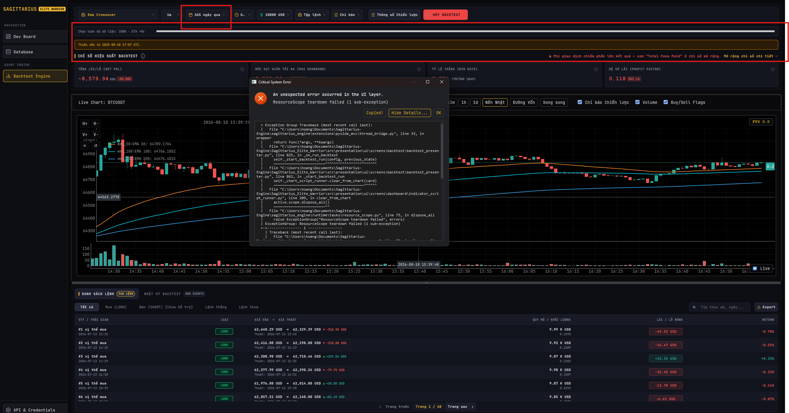

Error: ResourceScope teardown failed (1 sub-exception)

Traceback:
  + Exception Group Traceback (most recent call last):
  |   File "C:\Users\hoang\Documents\Sagittarius-Engine\sagittarius_engine\extensions\pyside_mvc\thread_bridge.py", line 33, in wrapper
  |     return func(*args, **kwargs)
  |   File "C:\Users\hoang\Documents\Sagittarius-Engine\Sagittarius_Elite_Warrior\src\presentation\ui\screens\backtest\backtest_presenter.py", line 825, in _on_run_backtest
  |     self._start_backtest_run(config, previous_state)
  |     ~~~~~~~~~~~~~~~~~~~~~~~~^^^^^^^^^^^^^^^^^^^^^^^^
  |   File "C:\Users\hoang\Documents\Sagittarius-Engine\Sagittarius_Elite_Warrior\src\presentation\ui\screens\backtest\backtest_presenter.py", line 862, in _start_backtest_run
  |     self._chart_script_runner.clear_from_chart(card)
  |     ~~~~~~~~~~~~~~~~~~~~~~~~~~~~~~~~~~~~~~~~~~^^^^^^
  |   File "C:\Users\hoang\Documents\Sagittarius-Engine\Sagittarius_Elite_Warrior\src\presentation\ui\screens\dashboard\indicator_script_runner.py", line 209, in clear_from_chart
  |     active.scope.dispose_all()
  |     ~~~~~~~~~~~~~~~~~~~~~~~~^^
  |   File "C:\Users\hoang\Documents\Sagittarius-Engine\sagittarius_engine\runtime\tasks\resource_scope.py", line 75, in dispose_all
  |     raise ExceptionGroup("ResourceScope teardown failed", errors)
  | ExceptionGroup: ResourceScope teardown failed (1 sub-exception)
  +-+---------------- 1 ----------------
    | Traceback (most recent call last):
    |   File "C:\Users\hoang\Documents\Sagittarius-Engine\sagittarius_engine\runtime\tasks\resource_scope.py", line 70, in dispose_all
    |     registration.dispose()
    |     ~~~~~~~~~~~~~~~~~~~~^^
    |   File "C:\Users\hoang\Documents\Sagittarius-Engine\Sagittarius_Elite_Warrior\src\presentation\ui\screens\backtest\logic\native_backtest_chart_host_adapter.py", line 175, in remove_indicator
    |     self._resubmit_indicators()
    |     ~~~~~~~~~~~~~~~~~~~~~~~~~^^
    |   File "C:\Users\hoang\Documents\Sagittarius-Engine\Sagittarius_Elite_Warrior\src\presentation\ui\screens\backtest\logic\native_backtest_chart_host_adapter.py", line 183, in _resubmit_indicators
    |     accepted = self._native_host.submit_indicators(
    |         series,
    |         action_id=self._action_id,
    |         generation=self._next_generation(),
    |     )
    |   File "C:\Users\hoang\Documents\Sagittarius-Engine\Sagittarius_Elite_Warrior\src\presentation\ui\screens\backtest\logic\native_backtest_chart_adapter.py", line 358, in submit_indicators
    |     self._assert_owning_gui_thread()
    |     ~~~~~~~~~~~~~~~~~~~~~~~~~~~~~~^^
    |   File "C:\Users\hoang\Documents\Sagittarius-Engine\Sagittarius_Elite_Warrior\src\presentation\ui\screens\backtest\logic\native_backtest_chart_adapter.py", line 315, in _assert_owning_gui_thread
    |     if QThread.currentThread() is not self._widget.thread():
    |                                       ~~~~~~~~~~~~~~~~~~~^^
    | RuntimeError: libshiboken: Internal C++ object (PySide6.QtQuickWidgets.QQuickWidget) already deleted.
    +------------------------------------
