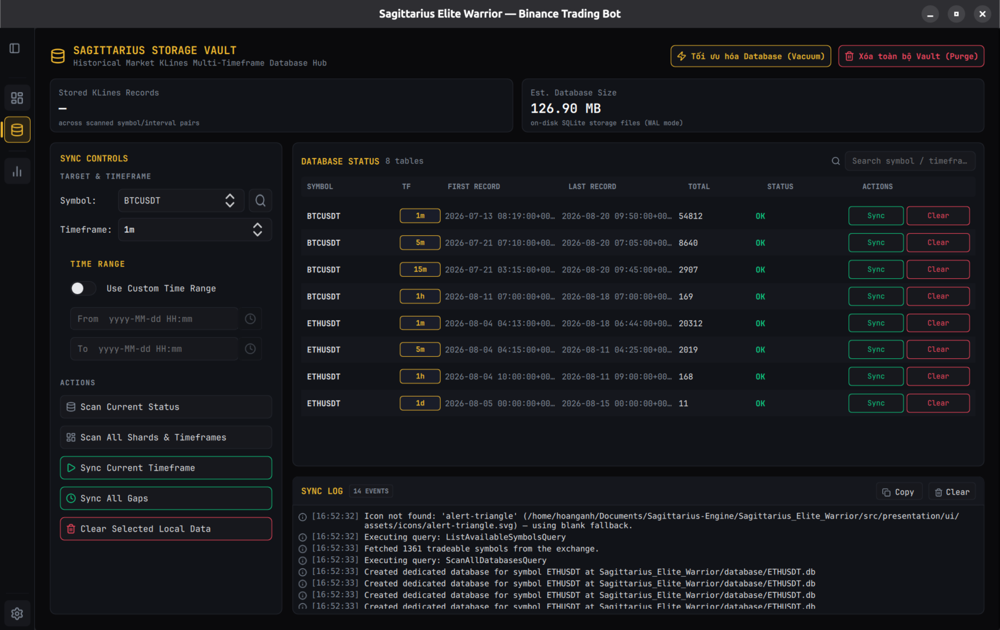

# BUG-018 — Storage Vault's "Stored KLines Records" tile stays "—" forever, because startup auto-discovery ends with an illegal `IDLE -> IDLE` FSM transition

**Reported:** 2026-08-20, user opened the Database screen and pasted the app
log plus a screenshot (`image-9.png`): the tile reads `—` while the table
right below it lists 8 healthy symbol/timeframe rows totalling ~88k candles.
**Severity:** P2 — no data loss and nothing is mis-synced, but the screen's
headline number is permanently wrong on every single app start, and an
`ERROR`-level traceback is printed on every open.
**Status:** ✅ Fixed 2026-08-20 — reproduced with regression tests confirmed
failing for the right reason (same traceback as the user's log), then fixed.

## Symptom

```
2026-08-20 16:52:33,245 - App - DEBUG - ScanAllDatabasesQuery completed successfully.
FSM Error: Transition IDLE -> IDLE rejected.
2026-08-20 16:52:33,338 - App - ERROR - [UI Thread Bridge Error] Exception in _unlock_ui: Invalid transition from 'IDLE' to 'IDLE'.
2026-08-20 16:52:33,338 - App - ERROR - Uncaught UI Exception: Invalid transition from 'IDLE' to 'IDLE'.
Traceback (most recent call last):
  File ".../pyside_mvc/thread_bridge.py", line 33, in wrapper
    return func(*args, **kwargs)
  File ".../data_management/data_management_presenter.py", line 196, in _unlock_ui
    self.fsm.transition_to(UIMode.IDLE)
  File ".../fsm/state_machine.py", line 102, in transition_to
    raise InvalidStateTransitionError(old_state.name, new_state.name)
sagittarius_engine.extensions.fsm.exceptions.InvalidStateTransitionError: Invalid transition from 'IDLE' to 'IDLE'.
```



Note in the screenshot that **`Est. Database Size` is correct (126.90 MB)
while `Stored KLines Records` is `—`**. That asymmetry is the tell, and it
points straight at the root cause: size is read from disk, records are summed
from the table rows.

## Root cause

`DataManagementPresenter.__init__` ends with
`self._thread_manager.submit(self._run_auto_discover)` — startup shard
auto-discovery (`BOT-112A`) — **without transitioning the FSM**, deliberately:
the worker first calls `ListAvailableSymbolsQuery` against Binance (1361
symbols, ~1s and unbounded on a slow network) and the whole screen gates its
controls on `viewModel.uiMode === "IDLE"`, so locking it would freeze the
screen at every launch.

But that worker's `finally` block emitted `ui_unlock_signal`, whose slot
`_unlock_ui` unconditionally calls `self.fsm.transition_to(UIMode.IDLE)`. The
transition matrix has no `IDLE -> IDLE` edge, so from a still-IDLE FSM this
raises `InvalidStateTransitionError`. `@safe_ui_action` catches it and logs —
which is why the app doesn't crash — but the slot has already been aborted
**one line before `self._refresh_stats()`**, so the tile is never recomputed.

`_refresh_stats()` does run once earlier, at the end of `__init__` — but that
is *before* the background scan has produced any rows, so `total_records == 0`
and it writes the `—` placeholder. Nothing recomputes it afterwards. The
value only ever corrects itself if the user manually clicks Scan or Sync.

Two consequences worth separating, because the second one is worse and was
not what the user reported:

1. **The dash.** Stats never refresh after auto-discovery.
2. **A false unlock.** The screen stays interactive during auto-discovery *by
   design*, so the user can start a sync before it finishes. When
   auto-discovery then emitted its unlock, the FSM was in `SYNCING` — a
   perfectly legal `SYNCING -> IDLE` transition — silently re-enabling every
   control in the middle of a running sync.

`_run_vacuum` has the identical defect: `_on_vacuum` also submits without
locking, and the worker also ended with an unlock emit.

## Fix

`data_management_presenter.py`:

1. New `ui_stats_refresh_signal` + `_on_stats_refresh_requested` slot that
   recomputes the tiles **without touching the FSM**. `_run_auto_discover` and
   `_run_vacuum` now emit that instead of `ui_unlock_signal` — a worker that
   never took a lock must never release one. This fixes both the dash and the
   false mid-sync unlock.
2. `_unlock_ui` guards its transition with
   `if self.fsm.current_state is not UIMode.IDLE`. "Restore the UI to IDLE" is
   a request for an *end state*, not for a transition; already being there is
   success. Kept even after fix 1, because a bulk sync can legitimately reach
   this slot twice (`_handle_bulk_sync_progress` emits on completion, and
   `_run_bulk_sync`'s error path emits again) — and the second arrival would
   hit exactly the same crash.

The `IDLE -> IDLE` edge was **not** added to the matrix: a self-transition
would re-fire every `on_exit`/`on_enter` callback for the state, which is a
different behaviour from "already there, nothing to do".

## Regression tests

`tests/unit/presentation/ui/screens/test_data_management_presenter.py`, 5 new
tests, all confirmed failing before the fix with the user's exact traceback
(`assert '—' == '2,640'` for the headline symptom):

- startup auto-discovery refreshes the stat tiles;
- startup auto-discovery does not unlock a sync started meanwhile;
- VACUUM refreshes the stat tiles;
- `_unlock_ui` from a locked state still returns to IDLE (guards the guard);
- `_unlock_ui` is idempotent when already IDLE.

22/22 tests in the file pass after the fix.
