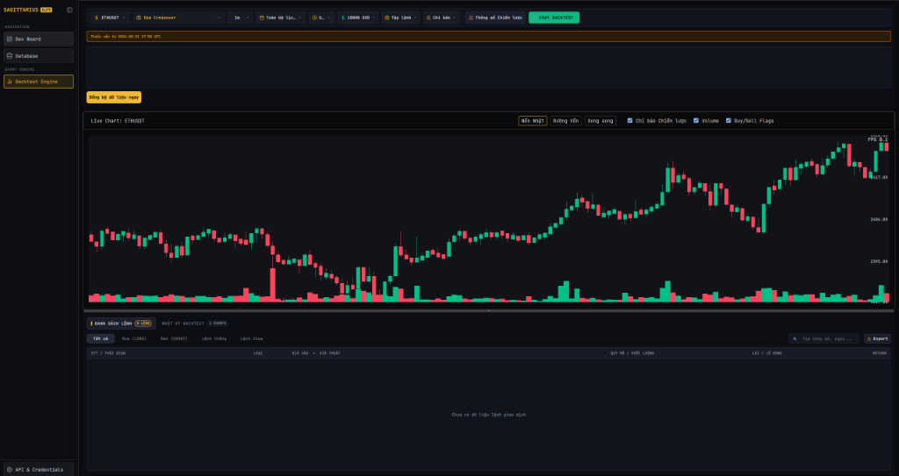

# BUG-032 — Chart tự động vẽ nến và volume khi chưa nhấn "Chạy Backtest"

**Reported date:** 2026-08-22
**Severity:** 🟡 **P2** (Trải nghiệm người dùng / Hành vi hiển thị dữ liệu)
**Status:** ✅ **Fixed 2026-08-22** — root-caused, regression-tested, verified qua `ci-local.ps1 -Full` (build native + lint + mypy + 1764 unit + 50 sanity, tất cả pass).

---

## 1. Hiện tượng (Symptom)

Khi người dùng mở màn hình **Backtest Engine** hoặc chọn đổi sang một Symbol khác (ví dụ: `ETHUSDT`) trên thanh công cụ:
- Nút **"CHẠY BACKTEST"** chưa được bấm (bảng Trade Logs bên dưới vẫn ở trạng thái rỗng `0 LỆNH`, "Chưa có dữ liệu lệnh giao dịch").
- Trên giao diện xuất hiện banner cảnh báo thiếu nến (`Thiếu nến từ 2026-08-21 17:58 UTC.`) kèm nút `Đồng bộ dữ liệu ngay`.
- Tuy nhiên, vùng biểu đồ chính (Live Chart) đã tự động thực thi query nến lịch sử và render đầy đủ đồ thị nến (candlesticks) cùng volume bars của symbol đó trước khi bất kỳ lệnh backtest nào được chạy.



### Bằng chứng Log thực tế (Captured Log Evidence)

```text
2026-08-22 01:12:28,085 - App - DEBUG - [PresenterManager] Lazy Loading Screen: backtest
2026-08-22 01:12:28,122 - App.BacktestChartHostFactory - INFO - Backtest chart host initialized for symbol 'BTCUSDT' with backend 'native' (requested: 'auto').
2026-08-22 01:12:28,281 - App - DEBUG - [PresenterManager] Successfully booted backtest (True Lazy Load)
2026-08-22 01:12:28,281 - App - DEBUG - [PresenterManager] Navigating to backtest
2026-08-22 01:12:31,306 - App - INFO - Executing query: ListAvailableSymbolsQuery
2026-08-22 01:12:31,307 - App - DEBUG - Payload: ListAvailableSymbolsQuery()
2026-08-22 01:12:31,571 - App.QueryHandler - DEBUG - Handling ListAvailableSymbolsQuery
2026-08-22 01:12:32,097 - App.QueryHandler - INFO - Fetched 1354 tradeable symbols from the exchange.
2026-08-22 01:12:32,097 - App - DEBUG - ListAvailableSymbolsQuery completed successfully.
2026-08-22 01:12:44,199 - App.BacktestChartHostFactory - INFO - Backtest chart host initialized for symbol 'ETHUSDT' with backend 'native' (requested: 'auto').
2026-08-22 01:12:44,202 - App - INFO - Executing query: GetHistoricalKlinesQuery
2026-08-22 01:12:44,202 - App - DEBUG - Payload: GetHistoricalKlinesQuery(symbol='ETHUSDT', interval='1m', limit=200000, start_time=None, end_time=datetime.datetime(2026, 8, 21, 18, 12, 44, 201967, tzinfo=datetime.timezone.utc), order_by_desc=True)
2026-08-22 01:12:44,202 - App.QueryHandler - INFO - BACKTEST_TRACE action=query_execute_start symbol='ETHUSDT' timeframe='1m' limit=200000 start=None end=datetime.datetime(2026, 8, 21, 18, 12, 44, 201967, tzinfo=datetime.timezone.utc) order_by_desc=True
2026-08-22 01:12:44,202 - App.QueryHandler - DEBUG - Handling GetHistoricalKlinesQuery for ETHUSDT at 1m (limit=200000)
2026-08-22 01:12:44,290 - App.Database - INFO - Created dedicated database for symbol ETHUSDT at Sagittarius_Elite_Warrior\database\ETHUSDT.db
2026-08-22 01:12:44,422 - App.QueryHandler - INFO - BACKTEST_TRACE action=query_execute_complete symbol='ETHUSDT' rows=10098
2026-08-22 01:12:44,422 - App - DEBUG - GetHistoricalKlinesQuery completed successfully.
2026-08-22 01:12:44,423 - App - INFO - Executing query: GetBacktestRangeCoverageQuery
2026-08-22 01:12:44,423 - App - DEBUG - Payload: GetBacktestRangeCoverageQuery(symbol='ETHUSDT', interval='1m', start_time=None, end_time=datetime.datetime(2026, 8, 21, 18, 12, 44, 201967, tzinfo=datetime.timezone.utc), now=datetime.datetime(2026, 8, 21, 18, 12, 44, 201967, tzinfo=datetime.timezone.utc))
2026-08-22 01:12:44,442 - App - DEBUG - GetBacktestRangeCoverageQuery completed successfully.
```

---

## 2. Kỳ vọng (Expected Behavior)

- Khi mới mở màn hình Backtest hoặc khi đổi cấu hình/symbol trên toolbar mà **chưa nhấn "CHẠY BACKTEST"**:
  - Cần xác định rõ hành vi nghiệp vụ mong muốn:
    - **Lựa chọn A (Preview Mode):** Biểu đồ chỉ hiển thị khung trống / empty placeholder với thông báo hướng dẫn hoặc chỉ kiểm tra phạm vi dữ liệu (`GetBacktestRangeCoverageQuery`), không tự động tải và vẽ toàn bộ nến khi chưa có phiên backtest.
    - **Lựa chọn B (Kèm trạng thái rõ ràng):** Nếu chủ đích là tính năng "Preview KLines" để người dùng xem trước đồ thị giá thì cần có nhãn hoặc trạng thái phân biệt rõ ràng giữa "Đồ thị xem trước (Chưa Backtest)" và "Kết quả Backtest (Có điểm Vào/Ra lệnh)".

---

## 3. Root cause

Không phải side-effect ngẫu nhiên — đây là tính năng "Live Chart Preview" có
chủ đích, bắt nguồn từ `BOT-095D` (2026-08-17, acceptance criterion #3:
*"Preview nến tức thì: Đổi khung 1m sang 5m có data → Chart cập nhật nến 5m
ngay lập tức"*) và mở rộng sang symbol-change ở `BOT-102`.

`_request_chart_preview()`
([`backtest_presenter.py:1602`](../../../src/presentation/ui/screens/backtest/backtest_presenter.py))
được gọi từ `_on_symbol_selection_changed`, `_on_timeframe_changed`,
`_on_time_range_changed`, `_on_custom_time_changed` — tải nến thật rồi render
qua `_on_preview_data_ready` → `view.on_preview_data_ready()`
([`backtest_view.py:315`](../../../src/presentation/ui/screens/backtest/backtest_view.py)),
gọi **đúng** `card.render_historical_data()`/`render_historical_volume()`
mà kết quả backtest thật cũng dùng
(`_on_chart_data_ready` → `view.on_backtest_data_ready()` →
[`backtest_view.py:389`](../../../src/presentation/ui/screens/backtest/backtest_view.py)).

Lỗ hổng thật: không có state/label nào phân biệt 2 trường hợp. FSM
(`backtest_fsm_matrix.py`) không có state `PREVIEW`; ViewModel và QML không
có property/label nào tên "preview" trước khi sửa. Người dùng nhìn thấy 2
kiểu dữ liệu **giống hệt nhau** trên chart.

## 4. Fix

Giữ nguyên tính năng Live Chart Preview (đã acceptance-test ở `BOT-095D`),
thêm state + badge phân biệt rõ ràng (Lựa chọn B trong mục 2):

- **`backtest_view_model.py`**: thêm property `isChartPreview` (đọc-only từ
  QML, cùng convention với `needsDataSync`) + signal `isChartPreviewChanged`
  + slot `set_chart_preview_mode(bool)`.
- **`backtest_presenter.py`**:
  - `_on_preview_data_ready()` gọi `set_chart_preview_mode(True)` sau khi
    render preview (kể cả qua nhánh fallback Python khi native từ chối
    snapshot).
  - `_on_chart_data_ready()` (nơi duy nhất render `BacktestResult` thật) gọi
    `set_chart_preview_mode(False)` — xoá cờ preview ngay khi kết quả thật
    lên chart.
- **`BackTestTopPanel.qml`**: thêm banner `backtestChartPreviewBanner`
  (cùng vị trí/style với `backtestStaleWarningBanner`/
  `backtestCoverageWarningBanner` đã có), `visible: viewModel.isChartPreview`,
  nội dung: *"Đồ thị xem trước — chưa chạy Backtest. Nhấn "CHẠY BACKTEST" để
  xem kết quả thật."*

Không đổi gì ở tầng chart-host/native — badge là QML/ViewModel thuần, không
chạm interface `IBacktestChartHost`.

## 5. Regression test

[`tests/unit/presentation/ui/screens/test_backtest_presenter.py::test_chart_preview_flag_distinguishes_preview_from_real_backtest_result`](../../../tests/unit/presentation/ui/screens/test_backtest_presenter.py) —
gọi `_on_preview_data_ready()` thật (không mock `view.on_preview_data_ready`)
với dữ liệu kline hợp lệ, assert `view_model.isChartPreview is True`; sau đó
gọi `_on_chart_data_ready()` thật với 1 `BacktestResult`, assert
`view_model.isChartPreview is False`.

Xác nhận FAIL trước fix: `AttributeError: 'BackTestViewModel' object has no
attribute 'isChartPreview'`. Sau fix: PASS, cùng với 3 test liên quan khác
(`test_preview_result_updates_coverage_and_chart_but_stale_result_is_fenced`,
`test_preview_data_ready_falls_back_to_python_when_native_rejects_the_snapshot`,
`test_backtest_data_ready_falls_back_to_python_when_native_rejects_the_snapshot`)
và toàn bộ `ci-local.ps1 -Full` (build native, ruff lint/format, mypy, 1764
unit test, 50 sanity test).
