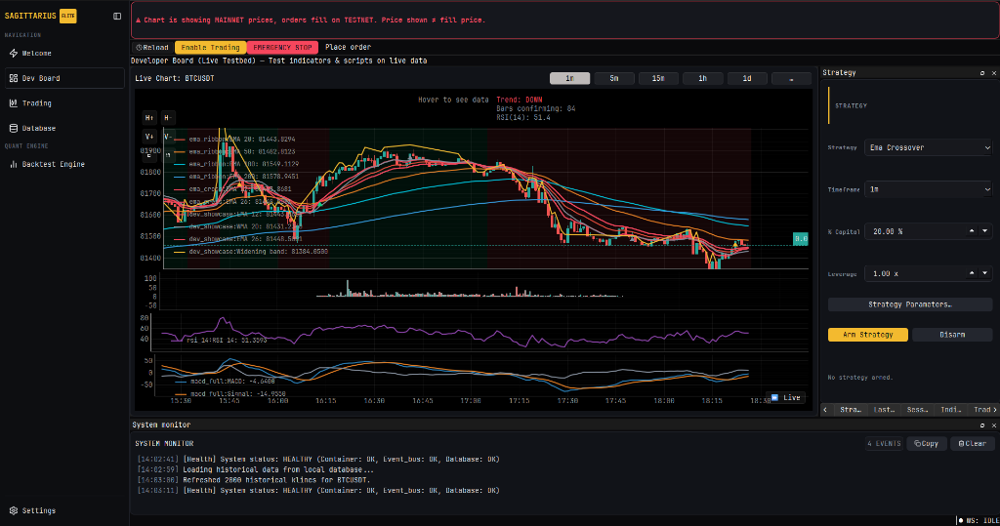

# BUG-132 — Chart subplots (volume, equity, indicators) zoom out of sync with candlestick chart and lack zoom limits

- **Reported:** 2026-09-21 (User chat)
- **Severity:** 🟡 P2 — User zooming on volume or equity subplot causes severe divergence from candles (bars squashed or stretched arbitrarily), with no minimum zoom-in limit.
- **Status:** ✅ Fixed (2026-09-21)
- **Environment:** Windows, Python 3.14.6, PySide6 6.11.1, pyqtgraph

## Reproduction
1. Open Dev Board or Backtest screen with candlestick chart and volume/equity subplots.
2. Hover mouse over the volume subplot (or equity subplot).
3. Scroll mouse wheel to zoom in or out.
4. **Expected:** Subplot zoom remains locked and strictly synchronized with the main candlestick chart, respecting zoom-in (e.g. minimum 5 candles) and zoom-out bounds.
5. **Actual:** Volume/equity subplot zooms independently to arbitrary extremes (e.g., 500x zoom-out or microscopic zoom-in), breaking horizontal alignment with the candlestick chart. Scrolling wheel on the candlestick chart then snaps all charts back into alignment.

## Symptom


The volume bars and subplots desynchronize on mouse wheel zoom. Volume plot can zoom much further than candle chart, leaving volume bars clumped in the middle with blank borders or over-expanded while candles stay clamped to view bounds.

## Root cause
Three interacting mechanisms caused the divergence:
1. `ChartCard._apply_view_bounds()` in `src/support/charting/chart_card/chart_card.py` only applied view limits (`setLimits`) to `self.plot_layout.main_plot`, ignoring all subplots in `self.plot_layout.sub_plots` (`_volume_plot`, indicator subplots, equity subplot). While subplots were linked via `setXLink(main_plot)`, pyqtgraph's bidirectional link logic allows an unconstrained plot to drag or scale its linked target only up to the target's limit while continuing to update its own unconstrained range, causing range divergence.
2. `ChartCard._apply_view_bounds()` never specified `minXRange` (minimum zoom-in width). When zooming in continuously, charts could zoom infinitely into fractions of a second between candles. In addition, when `_max_visible_seconds` was `None`, no `maxXRange` fallback was set on plots.
3. `CachedFrameInteractionController` in `src/support/charting/chart_card/cached_frame_interaction.py`:
   - In `begin_zoom(viewport_position)`, it checked `self._position_is_in_main_plot(viewport_position)`. If the user scrolled the wheel while hovering over a subplot, `begin_zoom` returned `False`, completely bypassing cached frame interaction and falling back to unconstrained native pyqtgraph ViewBox wheel events on the subplot.
   - `update_zoom` did not clamp `_preview_scale` according to `minXRange`/`maxXRange`.

## Fix
1. **`src/support/charting/chart_card/chart_card.py`**:
   - Added `_MIN_VISIBLE_CANDLES = 5` and `_DEFAULT_MAX_ZOOM_OUT_CANDLES = 2000`.
   - Updated `_apply_view_bounds()` to apply bounds across all plots (`self.plot_layout.plots`):
     - `minXRange = _MIN_VISIBLE_CANDLES * bar_seconds`
     - `maxXRange = self._max_visible_seconds` with fallback to `max(history_span, default_max)`
     - Bounded `xMin` and `xMax` with margin.
   - Called `self._apply_view_bounds()` in `add_subplot_indicator()` to ensure dynamically added subplots immediately receive identical bounds.
2. **`src/support/charting/chart_card/plot_layout.py`**:
   - In `ChartPlotLayout.add_subplot()`, inherited `xMin`, `xMax`, `minXRange`, `maxXRange` from `main_plot.vb.state["limits"]` safely with None checks so newly instantiated subplots never start unconstrained.
3. **`src/support/charting/chart_card/cached_frame_interaction.py`**:
   - Added `_plot_at_position(viewport_position)` to recognize wheel zoom events occurring over any subplot.
   - Updated `begin_zoom` to target the hovered plot and compute anchor ratio horizontally across the shared plot width.
   - Clamped `_preview_scale` in `update_zoom` using `minXRange` and `maxXRange` from `main_plot`.

## Regression test
- `tests/unit/support/charting/test_chart_view_bounds.py::test_subplots_have_identical_x_limits_to_main_plot` — Verifies all subplots inherit identical `xLimits` and `xRange` from `main_plot`. Failed before fix: subplots had default unconstrained limits `{'xLimits': [-1e+307, 1e+307], 'xRange': [None, None]}`.
- `tests/unit/support/charting/test_chart_view_bounds.py::test_chart_has_minimum_zoom_in_limit` — Verifies `minXRange` is set and positive. Failed before fix: `minXRange` was `None`.
- `tests/unit/support/charting/test_chart_view_bounds.py::test_volume_subplot_zoom_stays_synchronized_with_main_plot` — Verifies zooming in and out on `_volume_plot.vb` keeps view width synchronized with `main_plot` within `< 1e-3` tolerance and bounded by candle count. Failed before fix: volume plot zoomed to `500.0` while main plot was clamped to `210.0`.

## Verification
- Ran regression tests:
  ```powershell
  $env:PYTHONPATH=".."; .venv/Scripts/python -m pytest tests/unit/support/charting/test_chart_view_bounds.py -v
  ```
  Result: 6 passed in 1.25s.
- Ran entire charting unit suite:
  ```powershell
  $env:PYTHONPATH=".."; .venv/Scripts/python -m pytest tests/unit/support/charting/ -v
  ```
  Result: 199 passed, 0 failed in 6.88s.
