# DESIGN — Remembering the user's last values (UI State Persistence)

**Belongs to:** [`EPIC-010`](../README.md)
**Date:** 2026-08-25
**Status:** 🔵 **Proposed** — not approved, not a line of code written.

> [!IMPORTANT]
> **Read the status tag, not the prose.** Every claim in this file carries one.
> The lesson comes from `EPIC-009`: a rule that reads like a settled decision
> but was never approved, never enforced, and outlived the thing it described.
>
> | Tag | Meaning |
> | :--- | :--- |
> | ✅ **Established** | Checked against the real tree; cites `file:line`; not an opinion |
> | 🔵 **Proposed** | Converged on during analysis; **not** approved; may change |
> | ❓ **Open** | Blocks implementation until answered |

---

## 1. Context — a real, measured problem

### 1.1 Current state: exactly **one** persistence path exists ✅ Established

The entire app writes to disk in exactly one place:

```text
SettingsPresenter._on_save()          settings_presenter.py:88-117
  → IConfig.set() × 5 keys
  → ConfigManager.save()               settings_presenter.py:109-116
  → src/config/user_config.json        (loaded writable=True at app_bootstrapper.py:130)
```

Repo-wide grep: **no `QSettings`**, **no `saveGeometry`/`restoreGeometry`/
`saveState`**, and **no other `config.set()` anywhere in `src/presentation/`**.
Everything else is re-initialised from a module constant, a config default, or an
empty string on **every single launch**.

### 1.2 Scale of the loss: ~45 user-set values, gone on every restart ✅ Established

| Screen | User-set values lost | Most painful examples |
| :--- | :---: | :--- |
| Dev Board | 6 | symbol, interval, start/end date, which indicator scripts are enabled |
| Backtest | ~25 | strategy, capital, timeframe, date range, execution mode, commission, leverage, TP% |
| Database | 8 | symbol, interval, custom time range, search text |
| Shell / MainWindow | 4 | window size, current screen, sidebar collapsed |
| Chart | 3 | zoom/pan, follow-latest, chart type |

Only the Settings screen's **5 keys** survive a restart.

### 1.3 Three derived symptoms that existed **before** this epic ✅ Established

1. **Duplicated constants for one concept.** `"ETHUSDT"` is an independent
   literal in **3 places**: `dashboard_view_model.py:26`,
   `dashboard_presenter.py:45`, `backtest_presenter.py:176`. `"1m"` appears in
   **4+ places**: `dashboard_presenter.py:46`, `backtest_view_model.py:48`,
   `chart_toolbar.py:6`, plus inline throughout `data_management_view_model.py`.
2. **Three screens disagree on what "default" means.** Only
   `BackTestPresenter.__init__` (`:326-329`) reads `DEFAULT_SYMBOLS`/
   `DEFAULT_INTERVAL` from config. The Dev Board and Database screens **ignore
   those two keys entirely** and hardcode their own literals. Meaning:
   *changing Settings today already produces inconsistent defaults across screens.*
3. **A script the user turned off turns itself back on.**
   `IndicatorScriptListModel` has a `_user_touched` flag (`list_model.py:59`),
   but that flag is never persisted, so any script with `default_enabled = True`
   comes back enabled next launch — **erasing the exact intent the user just
   expressed**.

> Points 1 and 2 mean this epic is **not only** about adding persistence. It is
> forced to answer "where does a value's default come from" — a question that
> currently has three contradictory answers inside one app.

---

## 2. Structural model — deriving failure modes from structure, not from bug history

`EPIC-009` rejected the "extract rules from mistakes that already happened"
method because *a design derived from history can only remember; it cannot
predict*. The correct method is reused here: take the **lifecycle of one
persisted value** as the structure, then every arrow in that lifecycle is a place
it can break.

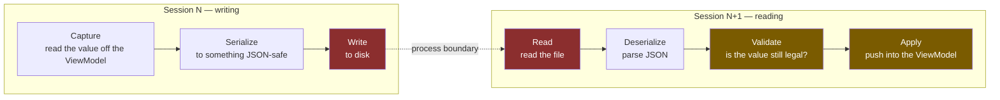

### 2.1 The 12-failure-mode catalogue 🔵 Proposed

| # | Stage | Failure mode | Consequence if the design ignores it |
| :-: | :--- | :--- | :--- |
| 1 | Capture | Reading a value **mid-keystroke** | Persists `"2026-08-2"` (a truncated date); next restore yields garbage |
| 2 | Capture | Persisting **activity** instead of **intent** (FSM in `LIVE`) | Opening the app silently connects to the network — breaks the `BOT-062` decision |
| 3 | Capture | Persisting **dead** controls (`cboMarket`, `cboStrategy` — wired to nothing) | Freezes an unfinished UI into the schema permanently |
| 4 | Serialize | A value that is not JSON-safe (`datetime`, `Decimal`, `Enum`) | `TypeError` right on the shutdown path |
| 5 | Write | Crash **mid-write** | Truncated file → next launch fails to parse |
| 6 | Write | Two app instances overwriting each other | State lost, nobody notices |
| 7 | Write | Write fails (disk full, read-only, permissions) | Exception on the shutdown path — **exactly the `BUG-048` class** |
| 8 | Boundary | File deleted/moved between sessions | Must be treated as legal, must not error |
| 9 | Read | Corrupt file / malformed JSON | **Must never block boot** |
| 10 | Deserialize | Schema changed between versions (key renamed/removed) | Reads an old shape, applies it wrongly |
| 11 | Validate | Value **no longer legal** (symbol delisted, strategy deleted, timeframe dropped) | Restores into a choice that does not exist |
| 12 | Apply | Restore **triggers side effects** (set symbol → signal → fetch) | Boot finishes and the app goes off doing work nobody asked for |

Modes **2**, **3** and **12** are the three a "just persist everything, it's
easier" design will certainly miss — and all three have real evidence in this
repo (see §3.3, §1.3, §5.2).

---

## 3. Scope — what to persist, and what to **never** persist

### 3.1 The classification principle 🔵 Proposed

> **Persist the user's *intent*. Never persist the system's *activity*.**

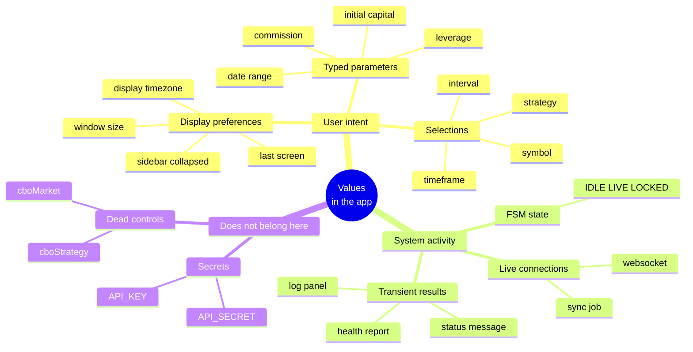

### 3.2 Rollout tiers 🔵 Proposed

Tiered by **value delivered / risk taken**, not by screen — so Phase 1 ships
something useful without having to touch the hard parts.

| Tier | Values | Why it sits here |
| :--- | :--- | :--- |
| **T1 — first** | Dev Board `symbol`+`interval`; Database `symbol`+`interval`; last route; window size/position; sidebar collapsed | Completely harmless — if it is wrong the user just picks again; **this is 80% of the "the app remembers me" feeling** |
| **T2 — after T1 runs for real** | Backtest: strategy, capital, timeframe, date preset, execution mode, commission/leverage/TP; enabled indicator scripts (with `_user_touched`); chart toolbar toggles | Many values, needs careful validation (a strategy can vanish from the registry) |
| **T3 — deferred, needs its own decision** | Splitter sizes; chart zoom/pan; trade-log filter/page/search | See §3.4 — genuine conflicts with current code |
| **❌ NEVER** | FSM state; running stream; `API_KEY`/`API_SECRET`; status message; `cboMarket`/`cboStrategy`; gap-inspector transients | See §3.3 |

### 3.3 Why "never persist FSM/stream" is a rule, not a preference ✅ Established

`BOT-062` **deliberately** flipped `DEV_BOARD_AUTOSTART_ENABLED` to default
`False`, with the reason written straight into the code
(`dashboard_presenter.py:375-383`):

> *"opening the Dev Board must not silently start a live connection unless the
> user has opted in"*

Persisting FSM state and restoring back into `LIVE` would **route around that
exact decision through the back door**: the user never enabled autostart, yet the
app connects anyway because "it was connected last time". This is failure mode
#2, and the repo already contains an explicit precedent against it.

Likewise `API_KEY`/`API_SECRET` already have a home (`user_config.json`, the
Settings screen). The new mechanism **must not** touch it — see §4.1.

### 3.4 T3 is deferred for real technical reasons, not laziness ✅ Established

**Chart zoom/pan:** every `render_historical_data` forces the viewport back to
"the last 150 candles" (`chart_card.py:339-366`,
`_DEFAULT_INITIAL_VISIBLE_CANDLES = 150` at `:34`). So zoom/pan is **already**
reset on every Load History / Start Live / symbol change — not just on restart.
Persisting a raw x-range across restarts would **collide with that same reset
path** unless threaded through `_set_initial_view_range`. That is a change to
chart behaviour, and must be its own task, not smuggled into a persistence epic.

**Splitter sizes:** `dashboard_view.py:59-61` sets `[900, 400]` on **every
construction**. Because presenters are lazy and are not torn down when you leave
a screen, the splitter resets on the *first screen switch*, not only on restart.
Fixing that is fixing a layout bug — a different thing from persisting a value.

---

## 4. Evaluating the options — 7 decisions

### 4.1 D1 — Where does it get stored?

| | Option | Pro | Con |
| :-: | :--- | :--- | :--- |
| **A** | Reuse **the same file** `user_config.json` through the existing `ConfigManager` | Nothing new to write | See the 5 blockers below |
| **B** | Separate `ui_state.json` + a **hand-written store** | Full control, atomic writes possible | ~150 lines of hand-written I/O; **adds a second paradigm to the project** |
| **B2** | Separate `ui_state.json` but backed by a **second `ConfigManager` instance** | Separate file (clears all 5 of A's blockers) **while keeping exactly one mechanism** project-wide | Writes are not atomic (§4.1.3) |
| **C** | `QSettings` | Native desktop; `saveGeometry()` handles multi-monitor correctly | See §4.1.2 |
| **D** | SQLite (a DB already exists) | Transactional | Massively overweight for ~45 scalars; chains "UI memory" to the market DB's lifecycle — which `BUG-030` shows is already fragile |

**Five blockers against option A** ✅ Established — these are what decided it:

1. **`user_config.json` is git-tracked.** `git check-ignore` exits 1; it appears
   in `git ls-files`. Writing state on every combobox change means a permanently
   dirty `git status`.
2. **It holds `API_KEY`/`API_SECRET`.** A secrets-bearing file being written
   automatically and frequently by a background mechanism is a genuine
   operational risk: it raises the odds of real credentials being swept into the
   repo by a `git add .`.
3. **Flat namespace, no provenance.** `_load()` is a shallow `dict.update`; after
   the merge it is **impossible to tell** whether a key came from
   `app_config.json`, `user_config.json`, or a `load_dict` layer. Mixing "user
   preference" with "hint from last session" in one flat space destroys that
   distinction permanently.
4. **`save()` silently clobbers a corrupt file.** It re-reads the file, swallows
   `JSONDecodeError` into `existing = {}`, then overwrites. So a corrupt
   `ui_state` could **wipe the user's real preferences**. And it is **not
   atomic** — no tmp+rename, no lock, no backup.
5. **The Sanity tier loads that very real file with `writable=True`**
   (`tests/sanity/conftest.py:110-111`). It is safe today *only because* no test
   triggers a save. An auto-save mechanism would turn every test run into an
   overwrite of the config inside the developer's repo.

**Why the file must be separate regardless** (applies to B, B2 and C alike):
**preference and hint have opposite failure semantics.** A preference is
something the user *deliberately declared* and expects honoured verbatim. A hint
is a *side effect of using the app*; the user never asked for it, and it must be
allowed to be **discarded silently** whenever it looks doubtful. Two things with
opposite failure policies must not share one file.

A bonus that follows: *"delete `ui_state.json` to reset"* becomes a one-line,
zero-risk support instruction.

---

#### 4.1.1 Consistency — why B loses to B2

> **A correct objection (raised by the user, 2026-08-25):** *"we already have
> `ConfigManager`; adding another mechanism costs the project its consistency."*

That objection **applies to option B too**, not just to QSettings — and that is
the crux. The first draft chose B, which is also a second mechanism. So the right
question is not *"one mechanism or two"* (it will be two either way, since A is
blocked), but:

> **How many *concepts* does a developer have to learn?**

Consistency is about the **paradigm**, not the class count:

| Option | Store files | **Paradigms** a dev must learn | The debugging story |
| :--- | :---: | :---: | :--- |
| A | 1 | 1 | But the contradiction moves **inside the file**, invisible — worse |
| B | 2 | **2** (ConfigManager + hand-written I/O) | Two different read/write paths |
| **B2** | 2 | **1** | Identical: flat JSON, `get`/`set`/`save`, readable with `cat` |
| C (QSettings) | 2 | **2** + varies by OS | Linux: an INI outside the repo. Windows: **the registry, not a file** |

**B2 = "the same idea, applied to a different lifetime".** Any developer who
understands `user_config.json` understands `ui_state.json` in 30 seconds.

#### 4.1.2 Evaluating `QSettings` — measured, not recalled ✅ Established

Run for real on this container (PySide6 6.11.1):

```text
--- QSettings BEFORE any org/app name is set ---
  fileName: '/root/.config/Unknown Organization/PySideApp.conf'
  organizationName: ''
--- after setOrganizationName/setApplicationName ---
  fileName: /root/.config/Sagittarius/EliteWarrior.conf
  format:   Format.NativeFormat
--- saveGeometry() ---
  type: QByteArray | bytes: 66
```

Four consequences:

1. **The app currently does NOT set `organizationName`** (measured: empty
   string). Adopt QSettings and forget that step, and it **silently** writes to
   `Unknown Organization/PySideApp.conf` — wrong place, no error, nobody notices.
2. **`NativeFormat` on Windows is the registry, not a file.** This repo has a
   read-the-file debugging rule written straight into `CLAUDE.md`: *"Don't trust
   the console — read the log file."* A store you cannot `grep`, cannot `cat`,
   and cannot attach to a bug report runs against the project's own diagnostic
   culture.
3. **It writes to `~/.config/`, outside the repo** → any test touching QSettings
   writes to the developer's real machine unless `QSettings.setPath()` is called.
   That is exactly the landmine from blocker 5 above
   (`tests/sanity/conftest.py`), just relocated.
4. **Where QSettings genuinely wins:** `saveGeometry()` returns a 66-byte
   `QByteArray` that `restoreGeometry()` understands — Qt handles multi-monitor,
   DPI changes, and windows landing off-screen. Storing raw `x/y/w/h` as JSON
   carries a **real risk**: restoring a window onto a monitor that is no longer
   plugged in.

> **Handling point 4 without QSettings:** validate that the restored rect
> intersects one of `QGuiApplication.screens()`; if it does not, drop it and use
> the default. About 5 lines — and it is **more in the spirit of D5** than
> `restoreGeometry()` is, because D5 says a restored value is *a request that
> must be checked*, whereas an opaque blob restores blind.

#### 4.1.3 B2 — verified experimentally ✅ Established

A probe run against the engine's real `ConfigManager`, 4 hypotheses, **all 4
PASS**. The probe is **kept in the repo** so the next person can re-check with
one command instead of having to trust the prose here:

```bash
PYTHONPATH=. .venv/bin/python scripts/ui_state_store_feasibility_probe.py
# exit 0 = B2 still viable; non-zero = D1 must be revisited, the engine changed
```

| Hypothesis | Result |
| :--- | :--- |
| **H1** — a nested `dict` slice survives `set()` + `save()` | ✅ writes nested JSON correctly, reads back intact |
| **H2** — a session that only opens the Dev Board writes the `dashboard` slice and leaves `backtest` **untouched** | ✅ **D2 comes for free, nothing to hand-write** — `save()` writes only `_dirty` onto the file's existing contents |
| **H3** — a truncated JSON file (simulating a crash mid-write) | ✅ `get()` returns the default, **does not raise** — `JsonSource.read()` swallows `JSONDecodeError` → `{}` |
| **H4** — two instances stay isolated | ✅ `user_config.json` untouched; the state store's `get("API_KEY")` → `None` |

So B2 **already provides** three things option B would have to hand-write:
slice-merge (D2), fail-safe corruption handling (mode #9), and credential
isolation.

**The accepted cost — writes are not atomic.** `save()` opens the file with
`open(path, "w")`, no tmp+rename. A crash **mid-write** truncates the file. But
per H3, the consequence is *the next launch falls back to defaults everywhere* —
the user loses their memory once, and the app still boots normally. **For
*hint*-class data that is an acceptable loss** — which is exactly the
"preference vs hint" logic above, applied consistently: hints are allowed to be
lost.

> ⚠️ `architecture-rule.md` §7.1 requires that an accepted cost **has a test
> locking the current behaviour**, not merely a note. So `EPIC-010A` must carry a
> test locking exactly H3: *truncated file → boot yields defaults, no raise*.

> ### ✅ Decision: **B2** 🔵 Proposed — changed from the first draft (which chose B)
>
> A separate `state/ui_state.json`, but backed by a **second `ConfigManager`
> instance**, sitting behind D3's `IUiStateStore` port.
> The port keeps its role: the socket for `NullUiStateStore` in the Sanity tier,
> and the thing that **stops the `isinstance(self.config, ConfigManager)` wart**
> — which `SettingsPresenter:109` already has to do — from spreading to four more
> presenters.
> If atomic writes ever genuinely become necessary, switching to
> `JsonFileUiStateStore` is **one line at the composition root** — precisely what
> the port is for.

**File location:** `state/ui_state.json` at the repo root, adding `state/` to
`.gitignore` — consistent with `logs/` (line 147) and `database/` (line 139),
which already do exactly that.
❓ **Open:** a properly packaged, installed app should move to
`QStandardPaths.AppConfigLocation`. D3's port makes that a one-class change.

### 4.2 D2 — Document structure: per-screen slices, **merge on write**

**This is the easiest decision to get wrong, and the reason is lazy loading.** ✅ Established

`PresenterManager.navigate_to()` is *TRUE LAZY INITIALIZATION*
(`presenter_manager.py:70-86`): a presenter is only constructed when the user
first navigates to that screen. `PresenterManager.shutdown()` likewise only
iterates presenters that **were** constructed.

The fatal consequence:

> If the **whole document** is written in one go at shutdown, then a session
> where the user only opened the Dev Board writes a document containing **only
> the Dev Board slice** — **wiping out** the Backtest and Database slices saved
> by an earlier session.

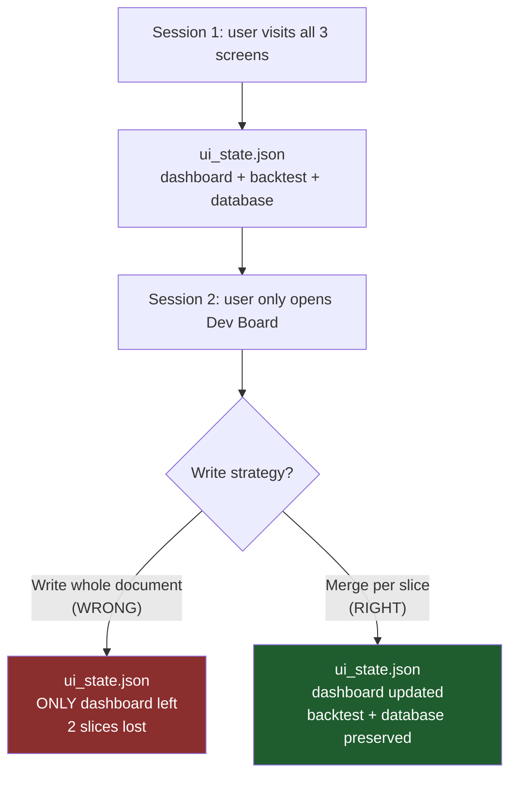

> **Decision:** the document is split into **slices keyed by route**; each write
> **merges a single slice** and never replaces the whole document. Slices for
> screens that were never opened are left untouched. 🔵 Proposed

### 4.3 D3 — Which layer does the port live in?

The architecture rule is strict: `src/domain/` and `src/application/` may import
exactly 2 Shared Kernel symbols from the engine; everything else goes through a
port.

But the right question is: **is "the symbol the user last looked at" a business
fact?** No. No use case needs it. No trading decision depends on it. Pushing it
down into `src/application/ports/` would create a `SaveUiState` use case that
**no business layer consumes** — pure ceremony.

On the other hand `architecture-rule.md` §7.2 says **always encourage
abstraction**; a class must be a *contract*.

Those two are not in conflict if the port lives **in the Presentation layer**.
And there is solid precedent for that in this very repo ✅ Established:

| ABC living in Presentation | File |
| :--- | :--- |
| `BaseFeed` — named explicitly in `architecture-rule.md` §7.1 as "a landing place with a name" | `common/base_feed.py` |
| `ViewportCulledLayer` — born out of `BUG-024` | `components/chart_card/viewport_culled_layer.py` |
| `IBacktestChartHost` | `screens/backtest/logic/backtest_chart_host.py` |
| `TabInterface` | `components/sidebar/tab_interface.py` |

> **Decision:** the `IUiStateStore` port lives at `src/presentation/ui/state/`.
> The Application layer **knows nothing** about this epic. 🔵 Proposed

### 4.4 D4 — When does it write?

| Option | Assessment |
| :--- | :--- |
| Write on every change | A disk write per keystroke in the date field — far too many, and it walks straight into failure mode #1 (persisting a half-typed value) |
| **Write only at shutdown** | **Not safe in this app** — see the evidence below |
| **Debounce + a final flush** | ✅ Chosen |

**Evidence against "write only at shutdown"** ✅ Established — from the docstring
of `teardown()` itself (`app_bootstrapper.py:205-213`):

> *"Three filed bugs — `BUG-007`, `BUG-023`, `BUG-041`, two of them P1 — were all
> found by a person watching a real process refuse to exit."*

Plus `BUG-048`: an exception after boot once **hung the process outright**. An app
with a history of *not reaching its shutdown path* must not stake its entire
memory on that path.

> **Decision:** debounce ~800ms after the last change, plus one **best-effort**
> flush inside `teardown()`. A write failure must **never** propagate — swallow
> it, log it, carry on (this is the `BUG-048` lesson: the shutdown path is not
> allowed to throw). 🔵 Proposed

### 4.5 D5 — Restore semantics: a restored value is a **request**, not a command

Symbols come from DB auto-discovery
(`data_management_presenter.py:102,177,306`); strategies come from
`StrategyRegistry.available()`; timeframes come from the `TimeFrame` enum.
**All three can change between two sessions.**

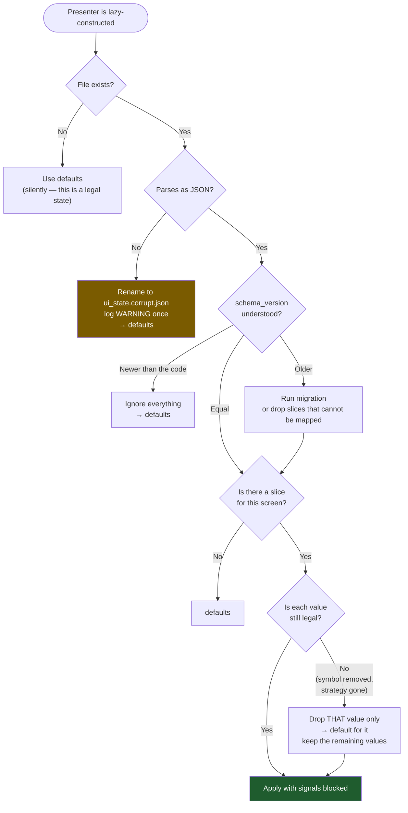

Two things matter in the diagram above:

- **Validate per value, not per slice.** A deleted strategy must not drag down
  the capital figure the user typed.
- **Who validates?** *The screen's own presenter*, not the central service. The
  service must not know what a `TimeFrame` is or which strategies exist — that is
  the "no business facts inside the mechanism" principle `EPIC-009` C3 settled.

### 4.6 D6 — Apply must not cause side effects ⚠️ Failure mode #12

`_cbo_symbol.currentTextChanged` is wired directly into a handler
(`data_management_view.py:302,349-351`). Restoring by setting text on the widget
will **fire that signal** → the presenter believes the user just chose something
→ it goes and fetches data.
**Result: opening the app makes it go off doing work nobody asked for.**

> **Decision:** restore writes into the **ViewModel**, not the widget; or, where a
> widget must be touched, wrap it in `QSignalBlocker`. There is a dedicated test
> locking this (§6). 🔵 Proposed

### 4.7 D7 — Schema & write safety

The repo already has the right precedent: `BOT-115` (backtest report persistence)
settled on *"JSON with a `schema_version`, **never `pickle`** (a report file is
untrusted input)"*. ✅ Established — the same principles apply here:

| Problem | Solution under **B2** | Who handles it? |
| :--- | :--- | :--- |
| Crash mid-write (#5) | **Accepted cost** (§4.1.3): truncated file → next launch falls back to defaults. Hints are allowed to be lost. **Must carry a test locking this behaviour** (`architecture-rule.md` §7.1) | — |
| Two instances overwriting (#6) | Last-writer-wins, **deliberately**, stated in the docstring. No file locking — the complexity is not worth "it forgot the symbol" | — |
| Write fails (#7) | `UiStateService` catches `OSError`/`ValueError` around `save()`, logs **once**, moves to `Degraded` (§5.5). **Never throws onto the shutdown path** — the `BUG-048` lesson | We write it |
| Corrupt file (#9) | ✅ **Free** — `JsonSource.read()` swallows `JSONDecodeError` → `{}` → defaults (measured, H3) | ConfigManager |
| Slice merge (D2) | ✅ **Free** — `save()` writes only `_dirty` onto the file's existing contents (measured, H2) | ConfigManager |
| Schema change (#10) | `schema_version: int` is an ordinary key in the file. A version **newer** than the code → ignore all slices. Unknown keys → ignore, no error | We write it |
| Not JSON-safe (#4) | A slice accepts only `str/int/float/bool/list/dict` — `save()`'s `json.dump` raises `TypeError` otherwise. A recursive test locks every `capture_state()` | We write it |

> The "Who handles it?" column is why B2 beats B: **the two heaviest rows are
> already provided**, rather than being code we have to write and then test
> ourselves.

---

## 5. Proposed architecture

### 5.1 Position in the system

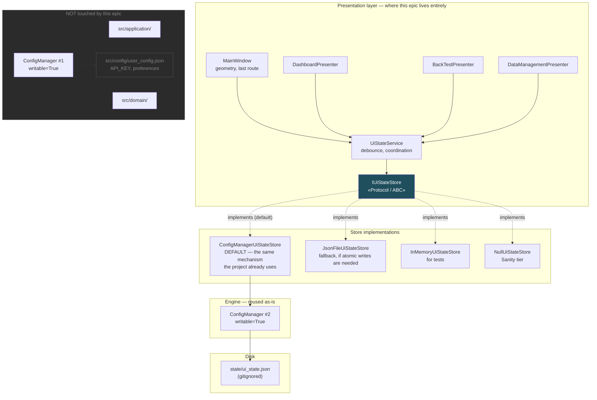

### 5.2 The contracts (class diagram)

```mermaid
classDiagram
    class IUiStateStore {
        <<interface>>
        +read() UiStateDocument
        +write_slice(key: str, data: Mapping) None
        +flush() None
    }

    class ConfigManagerUiStateStore {
        -_cm: ConfigManager
        +read() UiStateDocument
        +write_slice(key, data) None
        +flush() None
        note "DEFAULT (B2). Wraps a second
        ConfigManager instance pointed at
        state/ui_state.json. Slice-merge and
        fail-safe corruption come FREE."
    }

    class JsonFileUiStateStore {
        -_path: Path
        -_atomic_write(doc) None
        note "FALLBACK. Only build this if
        atomic writes genuinely matter —
        one line at the composition root."
    }

    class InMemoryUiStateStore {
        -_doc: UiStateDocument
        note "For unit/integration tests"
    }

    class NullUiStateStore {
        note "read() always empty, write() no-op.
        For the Sanity tier — tests must not
        write to the real disk."
    }

    class UiStateDocument {
        +schema_version: int
        +slices: dict~str, dict~
        +slice_for(key) Mapping
        +merged_with(key, data) UiStateDocument
    }

    class IUiStateContributor {
        <<Protocol>>
        +state_key: str
        +capture_state() dict
        +restore_state(data: Mapping) None
    }

    class UiStateService {
        -_store: IUiStateStore
        -_debounce_ms: int
        -_timers: dict
        +restore_into(c: IUiStateContributor) None
        +mark_dirty(c: IUiStateContributor) None
        +flush() None
    }

    class DashboardPresenter {
        +state_key = "dashboard"
        +capture_state() dict
        +restore_state(data) None
    }

    class BackTestPresenter {
        +state_key = "backtest"
    }

    class DataManagementPresenter {
        +state_key = "data_management"
    }

    class ShellStateContributor {
        +state_key = "shell"
        note "geometry + last route"
    }

    IUiStateStore <|.. ConfigManagerUiStateStore
    IUiStateStore <|.. JsonFileUiStateStore
    IUiStateStore <|.. InMemoryUiStateStore
    IUiStateStore <|.. NullUiStateStore
    UiStateService o-- IUiStateStore
    IUiStateStore ..> UiStateDocument
    IUiStateContributor <|.. DashboardPresenter
    IUiStateContributor <|.. BackTestPresenter
    IUiStateContributor <|.. DataManagementPresenter
    IUiStateContributor <|.. ShellStateContributor
    UiStateService ..> IUiStateContributor
```

> **`IUiStateContributor` is a `typing.Protocol`, NOT an ABC to inherit from.**
> `architecture-rule.md` §2 forbids multiple inheritance, and presenters already
> inherit `BasePresenter`. A Protocol is satisfied structurally and never touches
> the MRO. Precedent: `PresenterManager.register` is deliberately duck-typed too
> — *"this router deliberately does not require that base"*
> (`presenter_manager.py:104-115`). ✅ Established

### 5.3 Restore flow (lazy-aware)

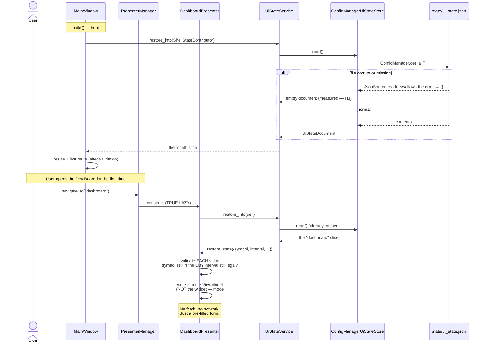

### 5.4 Save flow (debounce + slice merge)

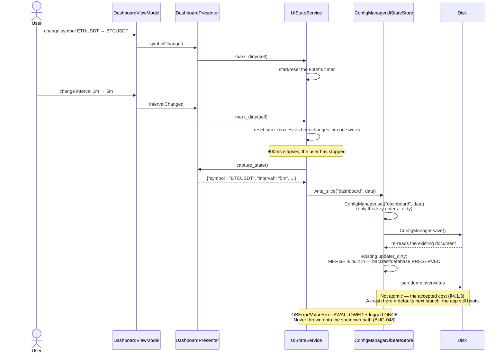

### 5.5 The writer's state machine

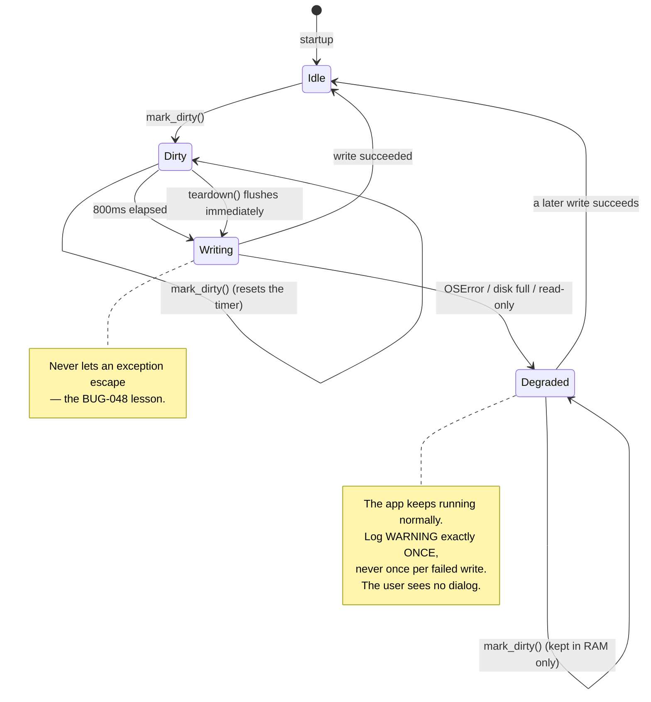

### 5.6 Document schema

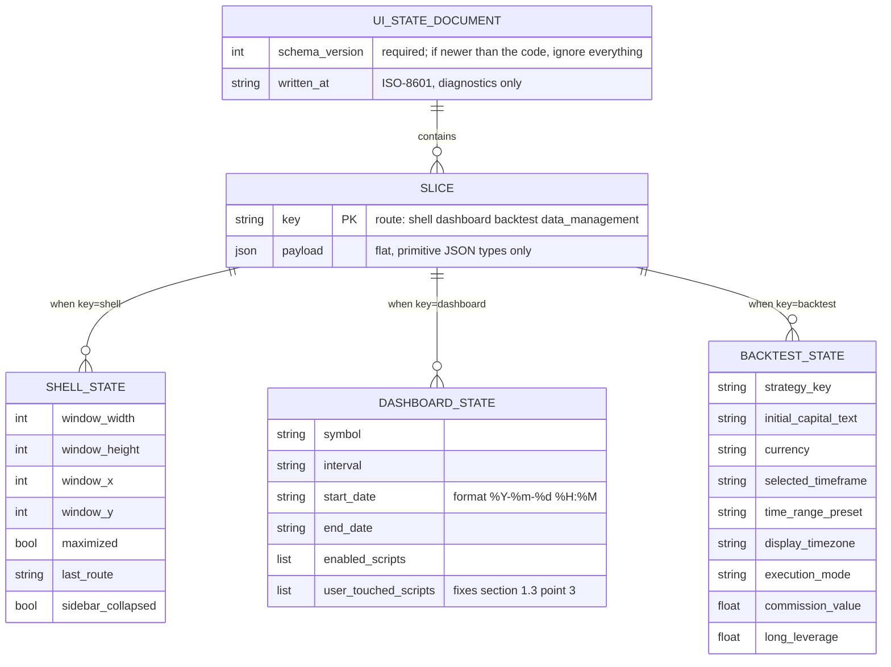

A real example file:

```json
{
  "schema_version": 1,
  "written_at": "2026-08-25T14:03:11Z",
  "slices": {
    "shell": {
      "window_width": 1600, "window_height": 900,
      "last_route": "backtest", "sidebar_collapsed": false
    },
    "dashboard": {
      "symbol": "BTCUSDT", "interval": "5m",
      "enabled_scripts": ["ema_20"], "user_touched_scripts": ["rsi_14"]
    }
  }
}
```

---

## 6. Test strategy

| Tier | Proves what | Example tests |
| :--- | :--- | :--- |
| **Unit** | `ConfigManagerUiStateStore` survives every mode in §2.1 | missing file → empty doc; **truncated JSON → empty doc, NO raise** (locks the accepted cost in §4.1.3 — required by `architecture-rule.md` §7.1); future `schema_version` → ignored; `OSError` on write → does not throw; **merge preserves unrelated slices** (D2) |
| **Unit** | The store **cannot** see the real config | `store.read()` contains no `API_KEY`; writing state does not touch `user_config.json` (measured — H4) |
| **Unit** | Every contributor round-trips | `capture_state()` → `restore_state()` yields the original values; an illegal value is dropped **individually**, not taking the slice with it |
| **Unit** | Only JSON-safe types (mode #4) | recursive assertion over the output of every `capture_state()` |
| **Integration** | **Restore causes no side effects** (mode #12) | restore the Dev Board slice → assert `dispatch` was never called |
| **Integration** | Lazy-aware | open only the Dev Board then shut down → the `backtest` slice on disk is **intact** |
| **Sanity** | Boot is not at the mercy of the state file | inject a corrupt `ui_state.json` → the app still boots clean (`diagnostic_guard` already catches this) |
| **Sanity** | **Tests must not write to the real disk** | the Sanity tier uses `NullUiStateStore`; assert no file was created |

> The second-to-last row is mandatory: `tests/sanity/conftest.py:110-111`
> currently loads the **real** `user_config.json` with `writable=True`. This epic
> must not make that situation worse. ✅ Established

---

## 7. Roadmap

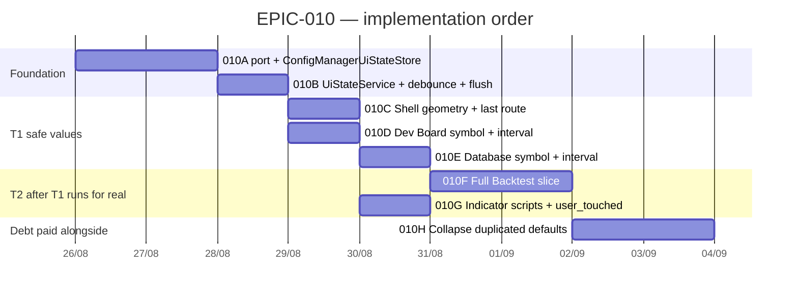

**`010H` is not a side quest.** §1.3 shows `"ETHUSDT"` and `"1m"` each have 3-4
independent copies, and three screens disagree about whether to read config at
all. Layering a "last value" tier on top of an already-contradictory default
foundation produces a **three-level precedence order nobody has defined**:
`ui_state` → `user_config` → module constants. That order must be settled, or
this epic will breed a "I changed Settings and nothing happened" bug.

> 🔵 **Proposed precedence:** `ui_state` (what the user did most recently) **>**
> `user_config` `DEFAULT_*` (what the user declared in Settings) **>** module
> constants (the safe floor). With one mandatory consequence: **changing a value
> in Settings must delete the corresponding key from `ui_state`** — otherwise the
> user changes Settings and sees nothing happen.

### 7.1 Experience, before / after


---

## 8. Risks & open questions

| # | Risk | Mitigation |
| :-: | :--- | :--- |
| R1 | "Sticky" state confuses the user — they cannot tell why the app will not go back to defaults | Add a "Restore defaults" action in Settings (deletes `ui_state.json`). Precedent exists: `BOT-047` already has a "Khôi phục Mặc định" button |
| R2 | Restoring a value that is **syntactically** valid but nonsensical (a start_date 6 months back → Load History pulls an enormous range) | Dates are T2, not T1. Consider persisting a **duration** rather than an absolute timestamp |
| R3 | The debounce timer is a `QTimer` → it must live on the main thread | Parent `UiStateService` to `MainWindow`; add a thread-affinity test (`BUG-031` is the precedent for this bug class) |
| R4 | The epic sprawls into "fix the default architecture" | `010H` is separated out and can be deferred — but the precedence order in §7 must be settled **before** `010D` |

### Questions the user must decide ❓

1. **Scope of the first pass:** do T1 only (5 values, completely safe) and then
   reassess, or do T1+T2 (~30 values) in one go?
2. **Dev Board dates:** persist an **absolute timestamp** (reopening shows the
   same dates as before, but they age) or a **duration** (always "the last 7
   days", sliding with the present)? The code currently computes `now - 7 days`
   on every construction.
3. **File location:** `state/ui_state.json` inside the repo (easy to inspect,
   easy to delete, matches the `logs/`+`database/` habit) or
   `QStandardPaths.AppConfigLocation` (the proper desktop convention, but hard to
   find when debugging)?
