# DESIGN — Cơ chế ghi nhớ giá trị cuối (UI State Persistence)

**Thuộc:** [`EPIC-010`](../README.md)
**Ngày:** 2026-08-25
**Trạng thái:** 🔵 **Proposed** — chưa phê duyệt, chưa viết dòng code nào.

> [!IMPORTANT]
> **Đọc nhãn trạng thái, đừng đọc văn xuôi.** Mọi khẳng định trong file này đều
> có nhãn. Bài học lấy từ `EPIC-009`: một luật viết ra nghe như đã chốt nhưng
> thật ra chưa bao giờ được duyệt, chưa bao giờ được enforce, và sống lâu hơn
> cả thứ nó mô tả.
>
> | Nhãn | Nghĩa |
> | :--- | :--- |
> | ✅ **Đã kiểm chứng** | Đối chiếu với cây code thật; có `file:line`; không phải ý kiến |
> | 🔵 **Đề xuất** | Đã hội tụ khi phân tích; **chưa** duyệt; có thể đổi |
> | ❓ **Còn mở** | Chặn implementation cho tới khi có câu trả lời |

---

## 1. Bối cảnh — vấn đề thật, đo được

### 1.1 Hiện trạng: đúng **một** đường persistence tồn tại ✅ Đã kiểm chứng

Toàn bộ app hiện chỉ có một chỗ ghi xuống đĩa:

```text
SettingsPresenter._on_save()          settings_presenter.py:88-117
  → IConfig.set() × 5 key
  → ConfigManager.save()               settings_presenter.py:109-116
  → src/config/user_config.json        (load writable=True tại app_bootstrapper.py:130)
```

Grep toàn repo: **không có `QSettings`**, **không có `saveGeometry`/`restoreGeometry`/
`saveState`**, và **không có `config.set()` nào khác trong `src/presentation/`**.
Mọi thứ còn lại được khởi tạo lại từ hằng số module, default trong config, hoặc
chuỗi rỗng ở **mỗi lần khởi động**.

### 1.2 Quy mô mất mát: ~45 giá trị người dùng đặt, mất sạch mỗi lần mở lại ✅ Đã kiểm chứng

| Màn | Số giá trị user đặt bị mất | Ví dụ đau nhất |
| :--- | :---: | :--- |
| Dev Board | 6 | symbol, interval, start/end date, danh sách indicator script bật |
| Backtest | ~25 | strategy, vốn, timeframe, khoảng thời gian, execution mode, commission, leverage, TP% |
| Database | 8 | symbol, interval, custom time range, search text |
| Shell / MainWindow | 4 | kích thước cửa sổ, màn hình đang mở, sidebar thu gọn |
| Chart | 3 | zoom/pan, follow-latest, chart type |

Chỉ **5 key** của màn Settings là sống sót qua restart.

### 1.3 Ba triệu chứng phái sinh, đã tồn tại **trước** khi có epic này ✅ Đã kiểm chứng

1. **Hằng số trùng lặp cho cùng một khái niệm.** `"ETHUSDT"` là literal độc lập ở
   **3 nơi**: `dashboard_view_model.py:26`, `dashboard_presenter.py:45`,
   `backtest_presenter.py:176`. `"1m"` ở **4+ nơi**: `dashboard_presenter.py:46`,
   `backtest_view_model.py:48`, `chart_toolbar.py:6`, và inline khắp
   `data_management_view_model.py`.
2. **Ba màn bất đồng về "default" nghĩa là gì.** Chỉ `BackTestPresenter.__init__`
   (`:326-329`) đọc `DEFAULT_SYMBOLS`/`DEFAULT_INTERVAL` từ config. Dev Board và
   Database **bỏ qua hoàn toàn** 2 key đó và hardcode literal riêng. Nghĩa là:
   *sửa Settings hôm nay đã tạo ra default không nhất quán giữa các màn rồi.*
3. **Script bị user tắt sẽ tự bật lại.** `IndicatorScriptListModel` có cờ
   `_user_touched` (`list_model.py:59`) nhưng cờ đó không được lưu, nên script
   có `default_enabled = True` quay lại bật ở lần mở sau — **xoá đúng ý định user
   vừa thể hiện**.

> Điểm 1 và 2 nghĩa là: epic này **không chỉ** thêm tính năng lưu. Nó buộc phải
> trả lời "default của một giá trị đến từ đâu" — câu hỏi hiện đang có 3 đáp án
> mâu thuẫn trong cùng một app.

---

## 2. Mô hình cấu trúc — suy ra failure mode từ cấu trúc, không từ lịch sử bug

`EPIC-009` đã bác bỏ phương pháp "rút luật từ những lỗi đã xảy ra" vì *thiết kế
suy từ lịch sử chỉ biết nhớ, không biết đoán*. Ở đây dùng lại phương pháp đúng:
lấy **vòng đời của một giá trị được lưu** làm cấu trúc, rồi mỗi mũi tên trong
vòng đời là một chỗ hỏng.

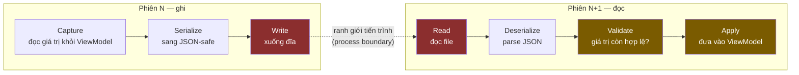

### 2.1 Danh mục 12 failure mode 🔵 Đề xuất

| # | Giai đoạn | Chế độ hỏng | Hậu quả nếu thiết kế bỏ qua |
| :-: | :--- | :--- | :--- |
| 1 | Capture | Đọc giá trị **giữa lúc user đang gõ dở** | Lưu `"2026-08-2"` (ngày cụt), lần sau restore ra rác |
| 2 | Capture | Lưu **hoạt động** thay vì **ý định** (FSM đang `LIVE`) | Mở app là tự nối mạng — phá đúng quyết định `BOT-062` |
| 3 | Capture | Lưu control **chết** (`cboMarket`, `cboStrategy` — không nối gì) | Đóng băng vĩnh viễn một UI chưa hoàn thiện vào schema |
| 4 | Serialize | Giá trị không JSON-safe (`datetime`, `Decimal`, `Enum`) | `TypeError` ngay đường shutdown |
| 5 | Write | Crash **giữa lúc ghi** | File cụt → lần mở sau parse lỗi |
| 6 | Write | Hai instance app ghi đè nhau | Mất state, không ai biết |
| 7 | Write | Ghi thất bại (đĩa đầy, read-only, permission) | Exception trên đường shutdown — **đúng lớp `BUG-048`** |
| 8 | Boundary | File bị xoá/đổi chỗ giữa 2 phiên | Phải coi là hợp lệ, không được lỗi |
| 9 | Read | File hỏng / JSON sai cú pháp | **Không bao giờ được chặn boot** |
| 10 | Deserialize | Schema đổi giữa 2 version (key đổi tên/bỏ) | Đọc ra hình dạng cũ, apply sai |
| 11 | Validate | Giá trị **không còn hợp lệ** (symbol bị delist, strategy bị xoá, timeframe bỏ) | Restore vào một lựa chọn không tồn tại |
| 12 | Apply | Restore **kích hoạt side effect** (set symbol → signal → fetch) | Boot xong tự đi làm việc user không yêu cầu |

Mode **2**, **3** và **12** là ba cái mà một thiết kế "cứ lưu hết cho tiện" chắc
chắn trượt — và cả ba đều có bằng chứng thật trong repo này (xem §3.3, §1.3, §5.2).

---

## 3. Phạm vi — lưu cái gì, và **tuyệt đối không** lưu cái gì

### 3.1 Nguyên tắc phân loại 🔵 Đề xuất

> **Lưu *ý định* của người dùng. Không bao giờ lưu *hoạt động* của hệ thống.**

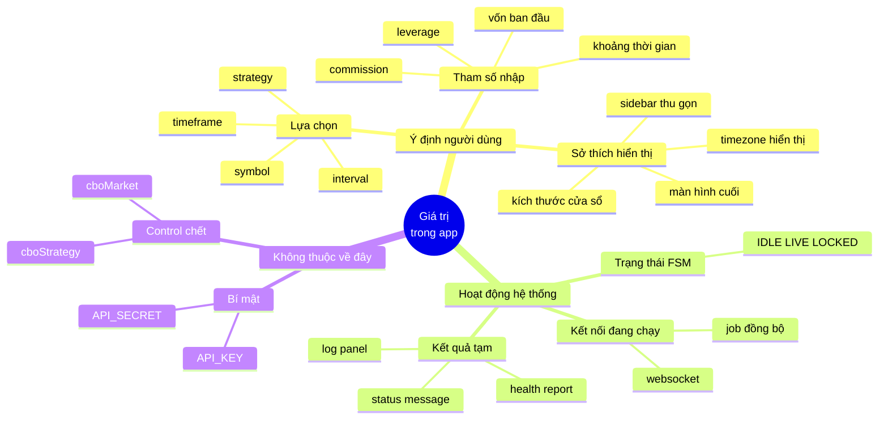

### 3.2 Phân tầng triển khai 🔵 Đề xuất

Chia tầng theo **giá trị mang lại / rủi ro**, không theo màn hình — để Phase 1
ship được thứ hữu ích ngay mà chưa cần đụng chỗ khó.

| Tầng | Giá trị | Vì sao xếp ở đây |
| :--- | :--- | :--- |
| **T1 — làm trước** | Dev Board `symbol`+`interval`; Database `symbol`+`interval`; route cuối; kích thước/vị trí cửa sổ; sidebar thu gọn | Vô hại tuyệt đối, sai thì user chỉ chọn lại; **đây là 80% cảm giác "app nhớ tôi"** |
| **T2 — sau khi T1 chạy thật** | Backtest: strategy, vốn, timeframe, preset thời gian, execution mode, commission/leverage/TP; danh sách indicator script bật (kèm `_user_touched`); toggle toolbar chart | Nhiều giá trị, cần validate kỹ (strategy có thể bị xoá khỏi registry) |
| **T3 — hoãn, cần quyết định riêng** | Splitter sizes; zoom/pan chart; trade-log filter/page/search | Xem §3.4 — có xung đột thật với code hiện tại |
| **❌ KHÔNG BAO GIỜ** | FSM state; stream đang chạy; `API_KEY`/`API_SECRET`; status message; `cboMarket`/`cboStrategy`; gap-inspector transient | Xem §3.3 |

### 3.3 Vì sao "không bao giờ lưu FSM/stream" là luật, không phải sở thích ✅ Đã kiểm chứng

`BOT-062` đã **chủ động** đổi `DEV_BOARD_AUTOSTART_ENABLED` về mặc định `False`,
với lý do ghi thẳng trong code (`dashboard_presenter.py:375-383`):

> *"opening the Dev Board must not silently start a live connection unless the
> user has opted in"*

Lưu FSM state rồi restore lại `LIVE` sẽ **lách qua chính quyết định đó bằng cửa
sau**: user không bật autostart, nhưng app vẫn tự nối mạng vì "lần trước đang
nối". Đây là failure mode #2, và nó có tiền lệ chống lại rõ ràng trong repo.

Tương tự, `API_KEY`/`API_SECRET` đã có nhà riêng (`user_config.json`, màn
Settings). Cơ chế mới **không được** đụng vào — xem §4.1.

### 3.4 T3 hoãn vì lý do kỹ thuật thật, không phải vì lười ✅ Đã kiểm chứng

**Zoom/pan chart:** mọi lần `render_historical_data` đều ép viewport về "150 nến
cuối" (`chart_card.py:339-366`, `_DEFAULT_INITIAL_VISIBLE_CANDLES = 150` tại
`:34`). Nghĩa là zoom/pan **đã** bị reset ở mỗi lần Load History / Start Live /
đổi symbol — không riêng gì restart. Lưu x-range thô xuyên restart sẽ **đâm vào
đúng đường reset đó** trừ khi luồn qua `_set_initial_view_range`. Đó là một thay
đổi hành vi chart, phải là task riêng, không nhét vào epic persistence.

**Splitter sizes:** `dashboard_view.py:59-61` set `[900, 400]` ở **mỗi lần
construct**. Vì presenter là lazy và không bị huỷ khi rời màn, splitter reset khi
*chuyển màn lần đầu*, không chỉ khi restart. Sửa cái đó là sửa bug bố cục, khác
việc lưu giá trị.

---

## 4. Đánh giá phương án — 7 quyết định

### 4.1 D1 — Lưu ở đâu?

| | Phương án | Ưu | Nhược |
| :-: | :--- | :--- | :--- |
| **A** | Tái dùng **chính file** `user_config.json` qua `ConfigManager` hiện có | Không phải viết gì mới | Xem 5 điểm chặn bên dưới |
| **B** | File riêng `ui_state.json` + **store tự viết** | Kiểm soát hoàn toàn, ghi atomic được | Thêm ~150 dòng I/O tự viết; **thêm một paradigm thứ hai vào dự án** |
| **B2** | File riêng `ui_state.json` nhưng dùng **một instance `ConfigManager` thứ hai** | Tách file (giải quyết cả 5 điểm chặn của A) **nhưng vẫn đúng một cơ chế** trong toàn dự án | Ghi không atomic (§4.1.3) |
| **C** | `QSettings` | Native desktop, `saveGeometry()` xử lý đa màn hình đúng | Xem §4.1.2 |
| **D** | SQLite (đã có sẵn DB) | Transactional | Quá nặng cho ~45 scalar; buộc "trí nhớ UI" vào vòng đời DB thị trường — mà `BUG-030` cho thấy vòng đời đó đang mong manh |

**Năm điểm chặn phương án A** ✅ Đã kiểm chứng — đây là lý do quyết định:

1. **`user_config.json` được git track.** `git check-ignore` trả exit 1; nó nằm
   trong `git ls-files`. Ghi state mỗi lần user đổi combobox = `git status` bẩn
   liên tục.
2. **Nó chứa `API_KEY`/`API_SECRET`.** Một file mang bí mật mà bị ghi tự động,
   thường xuyên, bởi một cơ chế nền là rủi ro vận hành thật: tăng xác suất
   credential thật bị `git add .` vào repo.
3. **Namespace phẳng, không có provenance.** `_load()` là `dict.update` nông; sau
   khi merge **không thể biết** một key đến từ `app_config.json`, `user_config.json`
   hay `load_dict`. Trộn "sở thích user" với "gợi ý phiên trước" vào cùng một
   không gian phẳng là mất khả năng phân biệt vĩnh viễn.
4. **`save()` âm thầm ghi đè file hỏng.** Nó đọc lại file, nuốt `JSONDecodeError`
   thành `existing = {}`, rồi ghi đè. Nghĩa là một `ui_state` hỏng có thể **xoá
   luôn preference thật** của user. Và nó **không atomic** — không tmp+rename,
   không lock, không backup.
5. **Tầng Sanity đang nạp đúng file thật đó với `writable=True`**
   (`tests/sanity/conftest.py:110-111`). Hiện an toàn *chỉ vì* không test nào gọi
   save. Một cơ chế auto-save sẽ biến mỗi lần chạy test thành một lần ghi đè
   config trong repo của dev.

**Vì sao vẫn phải tách file** (áp cho cả B, B2 và C): **preference và hint có
ngữ nghĩa hỏng ngược nhau.** Preference là thứ user *chủ động khai báo* và mong
được tôn trọng nguyên văn. Hint là *tác dụng phụ của việc dùng app*, user không
yêu cầu, và phải được phép **vứt đi im lặng** khi nghi ngờ. Hai thứ có chính sách
hỏng ngược nhau thì không được ở chung một file.

Phần thưởng kèm theo: *"xoá `ui_state.json` để reset"* là một câu hướng dẫn hỗ
trợ một dòng, không rủi ro.

---

#### 4.1.1 Tính nhất quán — vì sao B thua B2

> **Phản biện đúng (user nêu 2026-08-25):** *"đã có `ConfigManager` rồi mà còn
> thêm cơ chế nữa thì dự án mất tính nhất quán."*

Phản biện này **cũng áp cho phương án B**, không riêng gì QSettings — đó là điểm
mấu chốt. Bản thiết kế đầu tiên chọn B, tức cũng đang thêm cơ chế thứ hai. Vậy
câu hỏi đúng không phải *"một cơ chế hay hai"* (đằng nào cũng hai, vì A bị chặn),
mà là:

> **Thêm bao nhiêu *khái niệm* mà một dev phải học?**

Nhất quán là chuyện **paradigm**, không phải chuyện đếm số class:

| Phương án | Số file store | Số **paradigm** dev phải học | Câu chuyện debug |
| :--- | :---: | :---: | :--- |
| A | 1 | 1 | Nhưng mâu thuẫn **chui vào trong file**, vô hình — tệ hơn |
| B | 2 | **2** (ConfigManager + I/O tự viết) | Hai đường đọc/ghi khác nhau |
| **B2** | 2 | **1** | Y hệt nhau: JSON phẳng, `get`/`set`/`save`, `cat` ra đọc được |
| C (QSettings) | 2 | **2** + khác theo OS | Linux: INI ngoài repo. Windows: **registry, không phải file** |

**B2 = "cùng một ý tưởng, áp cho một vòng đời khác".** Dev nào hiểu
`user_config.json` thì hiểu `ui_state.json` trong 30 giây.

#### 4.1.2 Đánh giá `QSettings` — đo thật, không phán từ trí nhớ ✅ Đã kiểm chứng

Chạy thật trên container này (PySide6 6.11.1):

```text
--- QSettings khi CHƯA set org/app name ---
  fileName: '/root/.config/Unknown Organization/PySideApp.conf'
  organizationName: ''
--- sau khi setOrganizationName/setApplicationName ---
  fileName: /root/.config/Sagittarius/EliteWarrior.conf
  format:   Format.NativeFormat
--- saveGeometry() ---
  type: QByteArray | bytes: 66
```

Bốn hệ quả:

1. **App hiện KHÔNG set `organizationName`** (đo được: chuỗi rỗng). Dùng QSettings
   mà quên set thì nó **âm thầm** ghi vào `Unknown Organization/PySideApp.conf` —
   sai chỗ, không lỗi, không ai biết.
2. **`NativeFormat` trên Windows là registry, không phải file.** Repo này có luật
   debug bằng file ghi thẳng trong `CLAUDE.md`: *"Không tin console — đọc file
   log."* Một store không `grep` được, không `cat` được, không đính vào bug report
   được là đi ngược văn hoá chẩn đoán của chính dự án.
3. **Ghi ra `~/.config/`, ngoài repo** → mọi test chạm QSettings sẽ ghi vào máy
   thật của dev, trừ khi gọi `QSettings.setPath()`. Đây đúng cái mìn đã nêu ở
   điểm 5 bên trên (`tests/sanity/conftest.py`), chỉ đổi chỗ nổ.
4. **Điểm QSettings thật sự thắng:** `saveGeometry()` trả `QByteArray` 66 byte mà
   `restoreGeometry()` hiểu — Qt tự lo đa màn hình, đổi DPI, cửa sổ nằm ngoài
   vùng nhìn thấy. Lưu `x/y/w/h` thô bằng JSON **có rủi ro thật**: khôi phục cửa
   sổ về một màn hình không còn cắm nữa.

> **Xử lý điểm 4 mà không cần QSettings:** validate rect khôi phục có giao với
> `QGuiApplication.screens()` nào không; không giao thì bỏ, dùng mặc định. Khoảng
> 5 dòng, và nó **đúng tinh thần D5 hơn** cả `restoreGeometry()` — D5 nói giá trị
> đọc lên là *lời đề nghị phải kiểm tra*, còn blob nhị phân thì khôi phục mù.

#### 4.1.3 B2 — đã kiểm chứng bằng thực nghiệm ✅ Đã kiểm chứng

Probe chạy thật với `ConfigManager` của engine, 4 giả thuyết, **cả 4 PASS**.
Probe được **giữ lại trong repo** để lần sau kiểm lại bằng một lệnh, thay vì
phải tin văn xuôi ở đây:

```bash
PYTHONPATH=. .venv/bin/python scripts/ui_state_store_feasibility_probe.py
# exit 0 = B2 còn khả thi; khác 0 = D1 phải xem lại vì engine đã đổi
```

| Giả thuyết | Kết quả |
| :--- | :--- |
| **H1** — slice lồng (`dict`) sống sót qua `set()` + `save()` | ✅ ghi xuống JSON lồng đúng, đọc lại đúng |
| **H2** — phiên chỉ mở Dev Board, ghi slice `dashboard` → slice `backtest` **còn nguyên** | ✅ **D2 có sẵn, không phải tự viết** — `save()` chỉ ghi `_dirty` lên nội dung file hiện có |
| **H3** — file JSON cụt (mô phỏng crash giữa lúc ghi) | ✅ `get()` trả default, **không raise** — `JsonSource.read()` nuốt `JSONDecodeError` → `{}` |
| **H4** — hai instance độc lập | ✅ `user_config.json` không bị đụng; state store `get("API_KEY")` → `None` |

Nghĩa là B2 **đạt sẵn** ba thứ mà phương án B phải tự viết: merge theo slice (D2),
fail-safe khi file hỏng (mode #9), và cách ly credential.

**Cái giá phải trả — ghi không atomic.** `save()` mở file bằng `open(path, "w")`,
không tmp+rename. Crash **giữa** lúc ghi → file cụt. Nhưng theo H3, hậu quả là
*lần mở sau về hết mặc định* — user mất trí nhớ một lần, app vẫn boot bình
thường. **Với dữ liệu hạng *hint* thì đây là mất mát chấp nhận được** — và đó
chính là logic "preference vs hint" ở trên, áp nhất quán: hint được phép mất.

> ⚠️ `architecture-rule.md` §7.1 quy định: cái giá đã chấp nhận trả **phải có một
> test khoá hành vi hiện tại**, không được chỉ ghi chú. Vậy `EPIC-010A` bắt buộc
> có test khoá đúng H3: *file cụt → boot ra mặc định, không raise*.

> ### ✅ Quyết định: **B2** 🔵 Đề xuất — đổi so với bản nháp đầu (vốn chọn B)
>
> File riêng `state/ui_state.json`, nhưng backend là **một instance
> `ConfigManager` thứ hai**, đặt sau port `IUiStateStore` của D3.
> Port giữ nguyên vai trò: chỗ cắm `NullUiStateStore` cho tầng Sanity, và **chặn
> việc lặp lại wart `isinstance(self.config, ConfigManager)`** mà
> `SettingsPresenter:109` đang phải làm ở 4 presenter nữa.
> Nếu sau này thật sự cần ghi atomic, đổi sang `JsonFileUiStateStore` là **thay
> một dòng ở composition root** — đúng công dụng của port.

**Vị trí file:** `state/ui_state.json` ở gốc repo, thêm `state/` vào `.gitignore`
— nhất quán với `logs/` (dòng 147) và `database/` (dòng 139) đang làm đúng vậy.
❓ **Còn mở:** app đóng gói để cài đặt thật thì nên chuyển sang
`QStandardPaths.AppConfigLocation`. Port ở D3 khiến việc đổi này là thay 1 class.

### 4.2 D2 — Cấu trúc tài liệu: slice theo màn, **merge khi ghi**

**Đây là quyết định dễ làm sai nhất, và lý do nằm ở lazy loading.** ✅ Đã kiểm chứng

`PresenterManager.navigate_to()` là *TRUE LAZY INITIALIZATION*
(`presenter_manager.py:70-86`): presenter chỉ được dựng khi user vào màn đó lần
đầu. `PresenterManager.shutdown()` cũng chỉ duyệt những presenter **đã** dựng.

Hệ quả chí mạng:

> Nếu ghi **cả tài liệu** một lượt lúc shutdown, thì một phiên mà user chỉ mở Dev
> Board sẽ ghi ra tài liệu **chỉ có slice của Dev Board** — **xoá sạch** slice
> Backtest và Database mà phiên trước đã lưu.

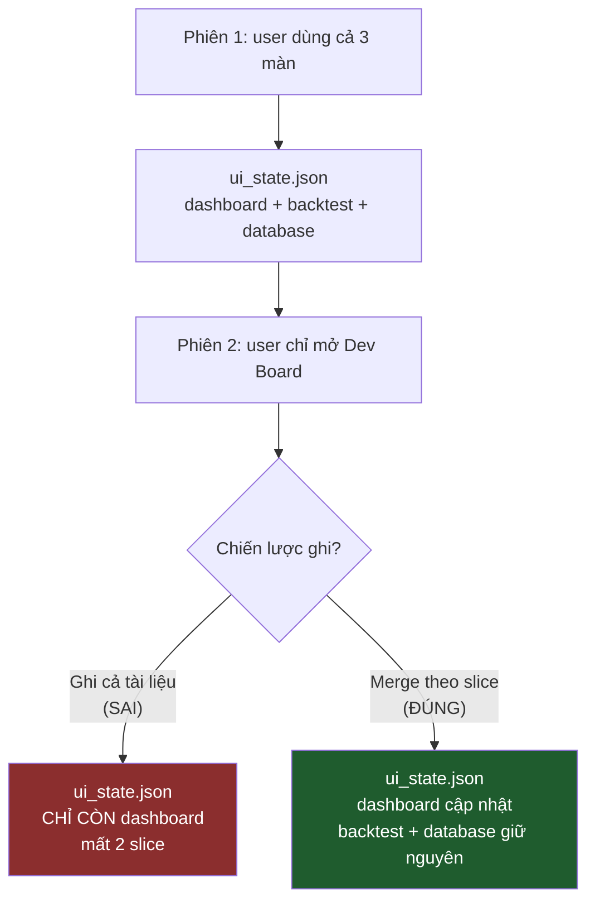

> **Quyết định:** tài liệu chia **slice theo route**; mỗi lần ghi chỉ **merge một
> slice**, không bao giờ thay cả tài liệu. Slice của màn chưa mở được giữ nguyên
> không đụng tới. 🔵 Đề xuất

### 4.3 D3 — Port đặt ở tầng nào?

Luật kiến trúc rất chặt: `src/domain/` và `src/application/` chỉ được import đúng
2 ký hiệu Shared Kernel của engine; mọi thứ khác phải qua port.

Nhưng câu hỏi đúng là: **"symbol user xem lần cuối" có phải sự thật nghiệp vụ
không?** Không. Không use case nào cần nó. Không quyết định giao dịch nào phụ
thuộc nó. Đưa nó xuống `src/application/ports/` là tạo một use case
`SaveUiState` mà **không tầng nghiệp vụ nào tiêu thụ** — nghi lễ thuần tuý.

Mặt khác `architecture-rule.md` §7.2 nói **luôn khuyến khích abstraction**, class
phải là một *hợp đồng*.

Hai điều đó không mâu thuẫn nếu đặt port **trong tầng Presentation**. Và điều này
có tiền lệ vững trong chính repo ✅ Đã kiểm chứng:

| ABC sống ở Presentation | File |
| :--- | :--- |
| `BaseFeed` — được `architecture-rule.md` §7.1 nêu đích danh là "chỗ hạ cánh có tên" | `common/base_feed.py` |
| `ViewportCulledLayer` — sinh ra từ `BUG-024` | `components/chart_card/viewport_culled_layer.py` |
| `IBacktestChartHost` | `screens/backtest/logic/backtest_chart_host.py` |
| `TabInterface` | `components/sidebar/tab_interface.py` |

> **Quyết định:** port `IUiStateStore` đặt tại `src/presentation/ui/state/`.
> Tầng Application **không biết gì** về epic này. 🔵 Đề xuất

### 4.4 D4 — Ghi lúc nào?

| Phương án | Đánh giá |
| :--- | :--- |
| Ghi mỗi lần đổi | Ghi đĩa mỗi ký tự user gõ vào ô ngày — quá nhiều, và dính failure mode #1 (ghi giá trị đang gõ dở) |
| **Chỉ ghi lúc shutdown** | **Không an toàn trong app này** — xem bằng chứng dưới |
| **Debounce + flush cuối** | ✅ Chọn |

**Bằng chứng chống "chỉ ghi lúc shutdown"** ✅ Đã kiểm chứng — docstring của
chính `teardown()` (`app_bootstrapper.py:205-213`) ghi:

> *"Three filed bugs — `BUG-007`, `BUG-023`, `BUG-041`, two of them P1 — were all
> found by a person watching a real process refuse to exit."*

Cộng thêm `BUG-048`: một exception sau boot từng **treo hẳn tiến trình**. Một app
có tiền sử *không đến được đường shutdown* thì không được đặt toàn bộ trí nhớ của
nó lên đúng đường đó.

> **Quyết định:** debounce ~800ms sau thay đổi cuối cùng, cộng một lần flush
> **best-effort** trong `teardown()`. Lỗi ghi **không bao giờ** được propagate ra
> ngoài — nuốt, log, đi tiếp (đây chính là bài học `BUG-048`: đường shutdown
> không được phép ném). 🔵 Đề xuất

### 4.5 D5 — Ngữ nghĩa restore: giá trị đọc lên là **lời đề nghị**, không phải mệnh lệnh

Symbol đến từ auto-discovery trong DB (`data_management_presenter.py:102,177,306`);
strategy đến từ `StrategyRegistry.available()`; timeframe đến từ enum `TimeFrame`.
**Cả ba đều có thể đổi giữa hai phiên.**

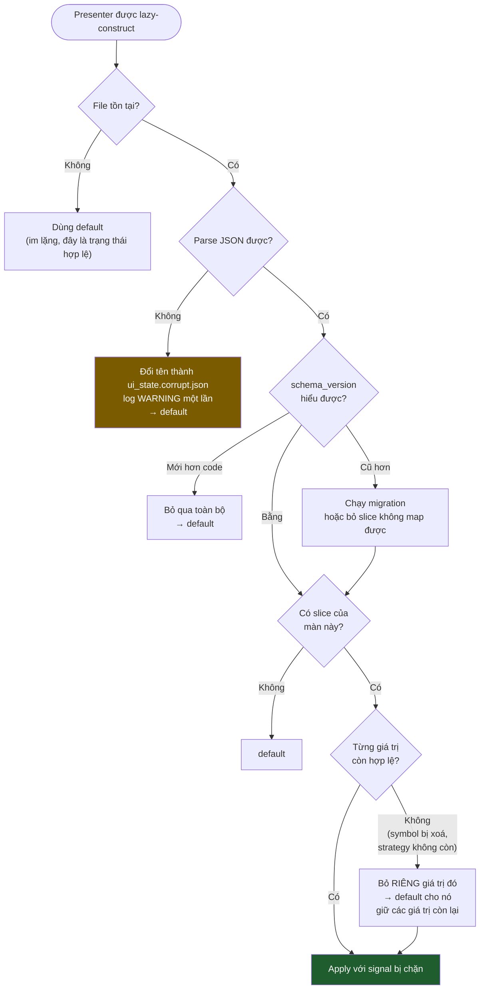

Hai điểm quan trọng trong sơ đồ trên:

- **Validate ở mức từng giá trị, không phải cả slice.** Strategy bị xoá không
  được kéo theo việc quên luôn số vốn user đã nhập.
- **Ai validate?** *Chính presenter của màn đó*, không phải service trung tâm.
  Service không được biết `TimeFrame` là gì hay strategy nào tồn tại — đó là
  nguyên tắc "không nhét sự thật nghiệp vụ vào cơ chế" mà `EPIC-009` C3 đã chốt.

### 4.6 D6 — Apply không được gây side effect ⚠️ Failure mode #12

`_cbo_symbol.currentTextChanged` đang nối thẳng vào handler
(`data_management_view.py:302,349-351`). Restore bằng cách set text lên widget sẽ
**bắn signal** → presenter tưởng user vừa chọn → đi fetch dữ liệu.
**Kết quả: mở app lên là tự đi làm việc user không yêu cầu.**

> **Quyết định:** restore ghi vào **ViewModel**, không ghi vào widget; hoặc nếu
> buộc phải chạm widget thì bọc `QSignalBlocker`. Có test khoá riêng cho điều
> này (§6). 🔵 Đề xuất

### 4.7 D7 — Schema & an toàn ghi

Repo đã có tiền lệ đúng cho việc này: `BOT-115` (persistence báo cáo backtest) đã
chốt *"JSON có `schema_version`, **không bao giờ `pickle`** (file report là input
không tin cậy)"*. ✅ Đã kiểm chứng — áp dụng nguyên tắc y hệt:

| Vấn đề | Giải pháp với **B2** | Ai lo? |
| :--- | :--- | :--- |
| Ghi bị crash giữa chừng (#5) | **Cái giá chấp nhận trả** (§4.1.3): file cụt → lần mở sau về mặc định. Hint được phép mất. **Bắt buộc có test khoá đúng hành vi này** (`architecture-rule.md` §7.1) | — |
| Hai instance ghi đè (#6) | Last-writer-wins, **có chủ đích**, ghi rõ trong docstring. Không làm file lock — độ phức tạp không xứng với "quên mất symbol" | — |
| Ghi thất bại (#7) | `UiStateService` bắt `OSError`/`ValueError` quanh `save()`, log **một lần**, chuyển sang `Degraded` (§5.5). **Không bao giờ ném ra đường shutdown** — bài học `BUG-048` | Ta viết |
| File hỏng (#9) | ✅ **Có sẵn** — `JsonSource.read()` nuốt `JSONDecodeError` → `{}` → mặc định (đã đo, H3) | ConfigManager |
| Merge theo slice (D2) | ✅ **Có sẵn** — `save()` chỉ ghi `_dirty` lên nội dung file hiện có (đã đo, H2) | ConfigManager |
| Schema đổi (#10) | `schema_version: int` là một key thường trong file. Version **mới hơn** code → bỏ qua toàn bộ slice. Key lạ → bỏ qua, không lỗi | Ta viết |
| Không JSON-safe (#4) | Slice chỉ chấp nhận `str/int/float/bool/list/dict` — `json.dump` của `save()` sẽ ném `TypeError` nếu sai. Có test khoá đệ quy trên mọi `capture_state()` | Ta viết |

> Cột "Ai lo?" là lý do B2 thắng B: **hai dòng nặng nhất đã có sẵn**, không phải
> code ta phải viết rồi tự test.

---

## 5. Kiến trúc đề xuất

### 5.1 Vị trí trong hệ thống

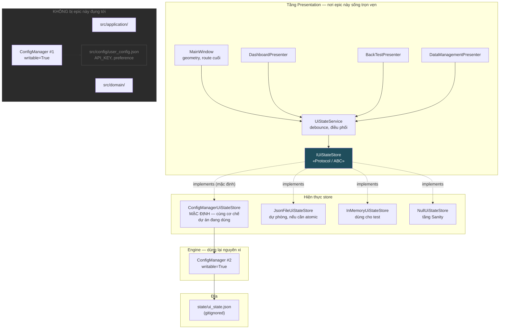

### 5.2 Hợp đồng (class diagram)

```mermaid
classDiagram
    class IUiStateStore {
        <<interface>>
        +read() UiStateDocument
        +write_slice(key: str, data: Mapping) None
        +flush() None
    }

    class ConfigManagerUiStateStore {
        -_cm: ConfigManager
        +read() UiStateDocument
        +write_slice(key, data) None
        +flush() None
        note "MẶC ĐỊNH (B2). Bọc một instance
        ConfigManager thứ hai trỏ vào
        state/ui_state.json. Merge theo slice
        và fail-safe khi hỏng là CÓ SẴN."
    }

    class JsonFileUiStateStore {
        -_path: Path
        -_atomic_write(doc) None
        note "DỰ PHÒNG. Chỉ dựng nếu ghi
        atomic thật sự cần thiết —
        đổi 1 dòng ở composition root."
    }

    class InMemoryUiStateStore {
        -_doc: UiStateDocument
        note "Dùng cho unit/integration test"
    }

    class NullUiStateStore {
        note "read() luôn rỗng, write() no-op.
        Dùng cho tầng Sanity — test không
        được ghi ra đĩa thật."
    }

    class UiStateDocument {
        +schema_version: int
        +slices: dict~str, dict~
        +slice_for(key) Mapping
        +merged_with(key, data) UiStateDocument
    }

    class IUiStateContributor {
        <<Protocol>>
        +state_key: str
        +capture_state() dict
        +restore_state(data: Mapping) None
    }

    class UiStateService {
        -_store: IUiStateStore
        -_debounce_ms: int
        -_timers: dict
        +restore_into(c: IUiStateContributor) None
        +mark_dirty(c: IUiStateContributor) None
        +flush() None
    }

    class DashboardPresenter {
        +state_key = "dashboard"
        +capture_state() dict
        +restore_state(data) None
    }

    class BackTestPresenter {
        +state_key = "backtest"
    }

    class DataManagementPresenter {
        +state_key = "data_management"
    }

    class ShellStateContributor {
        +state_key = "shell"
        note "geometry + route cuối"
    }

    IUiStateStore <|.. ConfigManagerUiStateStore
    IUiStateStore <|.. JsonFileUiStateStore
    IUiStateStore <|.. InMemoryUiStateStore
    IUiStateStore <|.. NullUiStateStore
    UiStateService o-- IUiStateStore
    IUiStateStore ..> UiStateDocument
    IUiStateContributor <|.. DashboardPresenter
    IUiStateContributor <|.. BackTestPresenter
    IUiStateContributor <|.. DataManagementPresenter
    IUiStateContributor <|.. ShellStateContributor
    UiStateService ..> IUiStateContributor
```

> **`IUiStateContributor` là `typing.Protocol`, KHÔNG phải ABC để kế thừa.**
> `architecture-rule.md` §2 cấm multiple inheritance, mà presenter đã kế thừa
> `BasePresenter` rồi. Protocol thoả cấu trúc, không đụng MRO. Tiền lệ:
> `PresenterManager.register` cũng cố ý duck-typed — *"this router deliberately
> does not require that base"* (`presenter_manager.py:104-115`). ✅ Đã kiểm chứng

### 5.3 Luồng restore (lazy-aware)

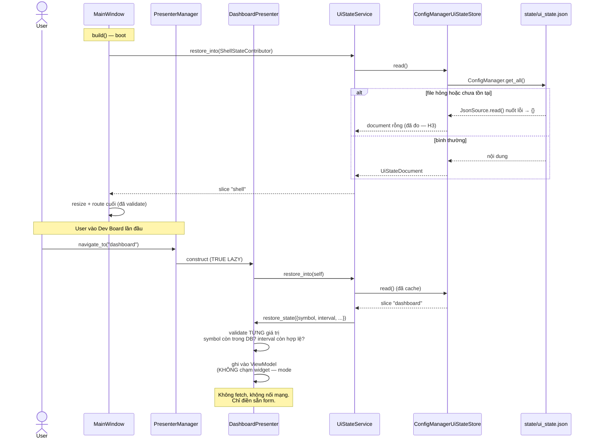

### 5.4 Luồng lưu (debounce + merge theo slice)

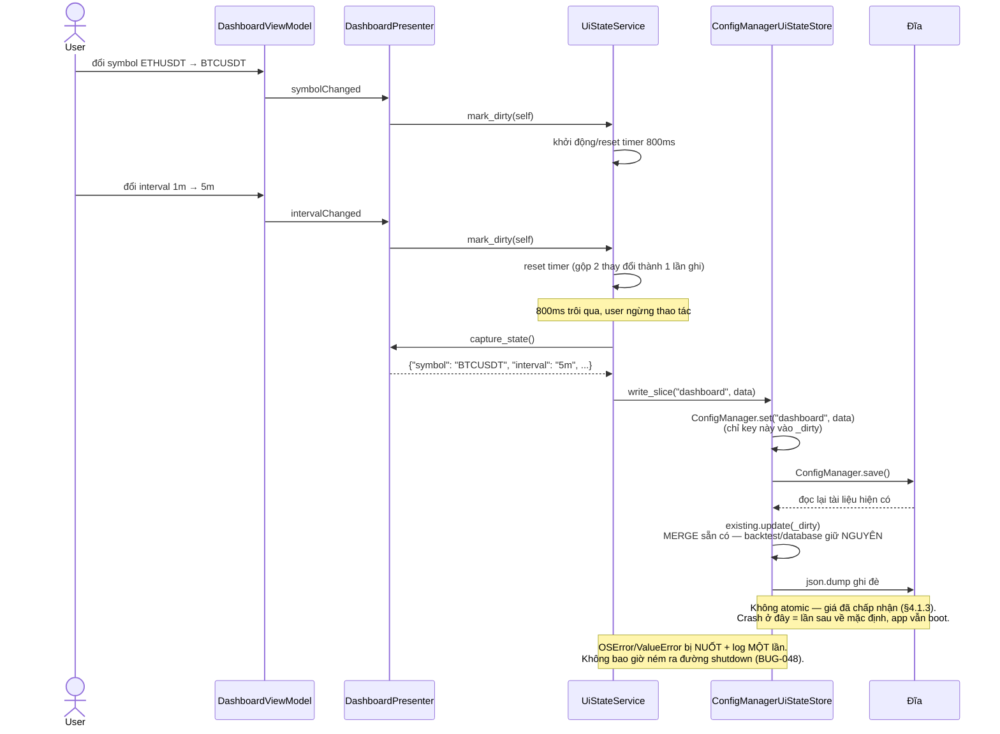

### 5.5 Máy trạng thái của bộ ghi

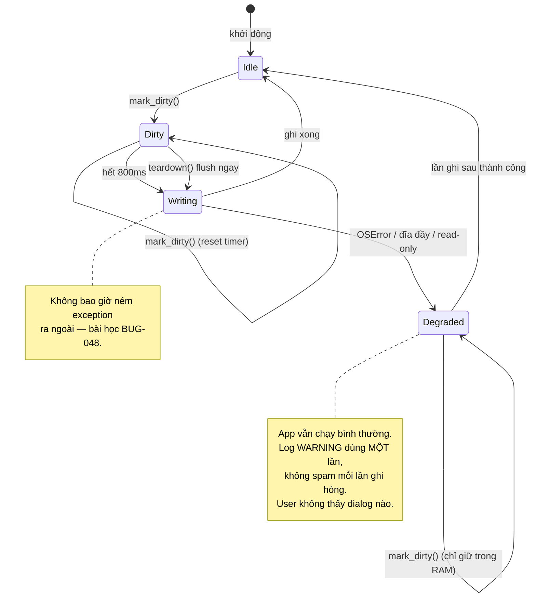

### 5.6 Schema tài liệu

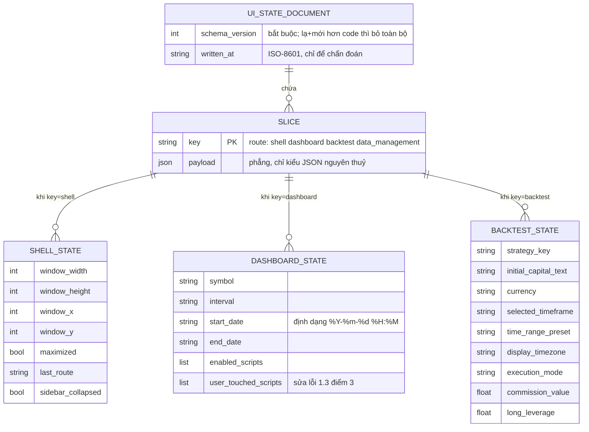

Ví dụ file thật:

```json
{
  "schema_version": 1,
  "written_at": "2026-08-25T14:03:11Z",
  "slices": {
    "shell": {
      "window_width": 1600, "window_height": 900,
      "last_route": "backtest", "sidebar_collapsed": false
    },
    "dashboard": {
      "symbol": "BTCUSDT", "interval": "5m",
      "enabled_scripts": ["ema_20"], "user_touched_scripts": ["rsi_14"]
    }
  }
}
```

---

## 6. Chiến lược test

| Tầng | Chứng minh cái gì | Ví dụ test |
| :--- | :--- | :--- |
| **Unit** | `ConfigManagerUiStateStore` chịu được mọi mode ở §2.1 | file thiếu → doc rỗng; **JSON cụt → doc rỗng, KHÔNG raise** (khoá cái giá ở §4.1.3 — bắt buộc theo `architecture-rule.md` §7.1); `schema_version` tương lai → bỏ qua; `OSError` khi ghi → không ném; **merge giữ nguyên slice không liên quan** (D2) |
| **Unit** | Store **không** thấy được config thật | `store.read()` không chứa `API_KEY`; ghi state không đụng `user_config.json` (đã đo — H4) |
| **Unit** | Mỗi contributor round-trip đúng | `capture_state()` → `restore_state()` ra đúng giá trị ban đầu; giá trị không hợp lệ bị bỏ **riêng lẻ**, không kéo cả slice |
| **Unit** | Chỉ chứa kiểu JSON-safe (mode #4) | assert đệ quy trên output của mọi `capture_state()` |
| **Integration** | **Restore không gây side effect** (mode #12) | restore Dev Board slice → assert `dispatch` **không** được gọi lần nào |
| **Integration** | Lazy-aware | chỉ mở Dev Board rồi shutdown → slice `backtest` trên đĩa **còn nguyên** |
| **Sanity** | Boot không bị file state chi phối | tiêm `ui_state.json` hỏng → app vẫn boot sạch (`diagnostic_guard` đang bắt sẵn) |
| **Sanity** | **Test không được ghi ra đĩa thật** | tầng Sanity dùng `NullUiStateStore`; assert không file nào được tạo |

> Hàng áp chót là bắt buộc: `tests/sanity/conftest.py:110-111` đang nạp
> `user_config.json` **thật** với `writable=True`. Epic này không được làm tình
> trạng đó tệ thêm. ✅ Đã kiểm chứng

---

## 7. Lộ trình


**`010H` không phải việc phụ.** §1.3 cho thấy `"ETHUSDT"` và `"1m"` đang có
3-4 bản sao độc lập, và 3 màn bất đồng về việc có đọc config hay không. Thêm một
tầng "giá trị cuối" lên trên một nền default đã mâu thuẫn sẽ tạo ra **thứ tự ưu
tiên 3 tầng mà không ai định nghĩa**: `ui_state` → `user_config` → hằng số module.
Phải chốt rõ thứ tự đó, nếu không epic này sẽ đẻ ra bug "tôi đổi Settings mà nó
không ăn".

> 🔵 **Đề xuất thứ tự ưu tiên:** `ui_state` (điều user làm gần nhất) **>**
> `user_config` `DEFAULT_*` (điều user khai báo ở Settings) **>** hằng số module
> (đáy an toàn). Kèm hệ quả bắt buộc: **đổi giá trị ở Settings phải xoá key tương
> ứng trong `ui_state`**, nếu không user sẽ đổi Settings mà không thấy gì xảy ra.

### 7.1 Trải nghiệm trước / sau

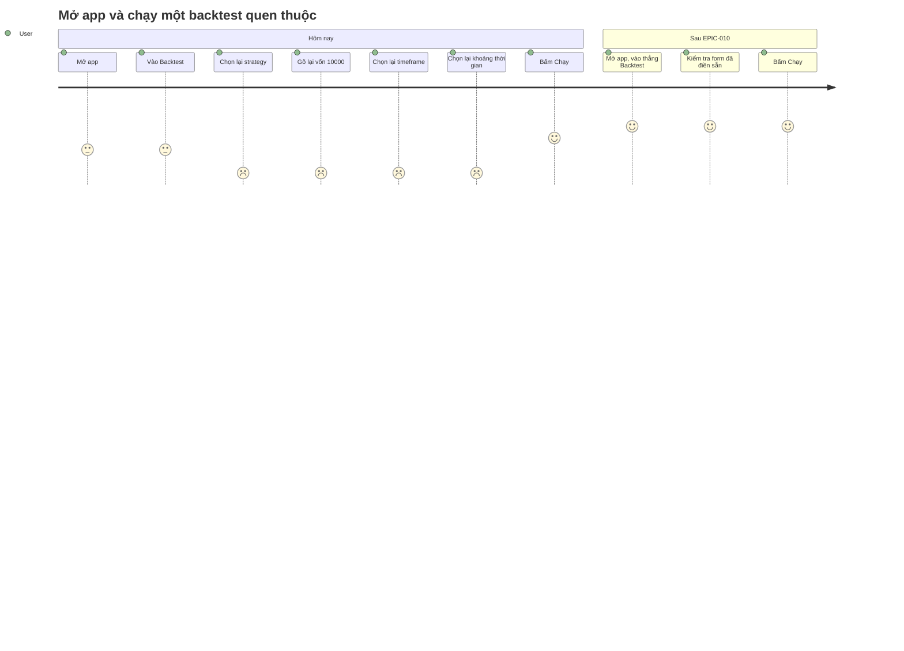

---

## 8. Rủi ro & câu hỏi còn mở

| # | Rủi ro | Giảm thiểu |
| :-: | :--- | :--- |
| R1 | State "dính" làm user bối rối — không hiểu vì sao app không về mặc định | Thêm "Khôi phục mặc định" ở Settings (xoá `ui_state.json`). Đã có tiền lệ: `BOT-047` có nút "Khôi phục Mặc định" |
| R2 | Restore một giá trị hợp lệ **về cú pháp** nhưng vô lý (start_date 6 tháng trước → Load History kéo về khối lượng khổng lồ) | Ngày là T2, không phải T1. Cân nhắc lưu **độ dài khoảng** thay vì mốc tuyệt đối |
| R3 | Debounce timer là `QTimer` → phải sống trên main thread | `UiStateService` parent vào `MainWindow`; có test khoá thread affinity (`BUG-031` là tiền lệ lớp lỗi này) |
| R4 | Epic phình sang việc "sửa kiến trúc default" | `010H` được tách riêng, có thể hoãn — nhưng thứ tự ưu tiên ở §7 phải chốt **trước** `010D` |

### Câu hỏi cần user quyết ❓

1. **Phạm vi phiên đầu:** làm T1 (5 giá trị, an toàn tuyệt đối) rồi đánh giá, hay
   làm luôn T1+T2 (~30 giá trị)?
2. **Ngày tháng trên Dev Board:** lưu **mốc tuyệt đối** (mở lại thấy đúng ngày cũ,
   nhưng ngày càng cũ dần) hay **độ dài khoảng** (luôn là "7 ngày gần nhất", tự
   trượt theo hiện tại)? Hiện tại code tính `now - 7 days` mỗi lần dựng.
3. **Vị trí file:** `state/ui_state.json` trong repo (dễ xem, dễ xoá, hợp thói
   quen `logs/`+`database/`) hay `QStandardPaths.AppConfigLocation` (đúng chuẩn
   desktop, nhưng khó tìm khi debug)?
