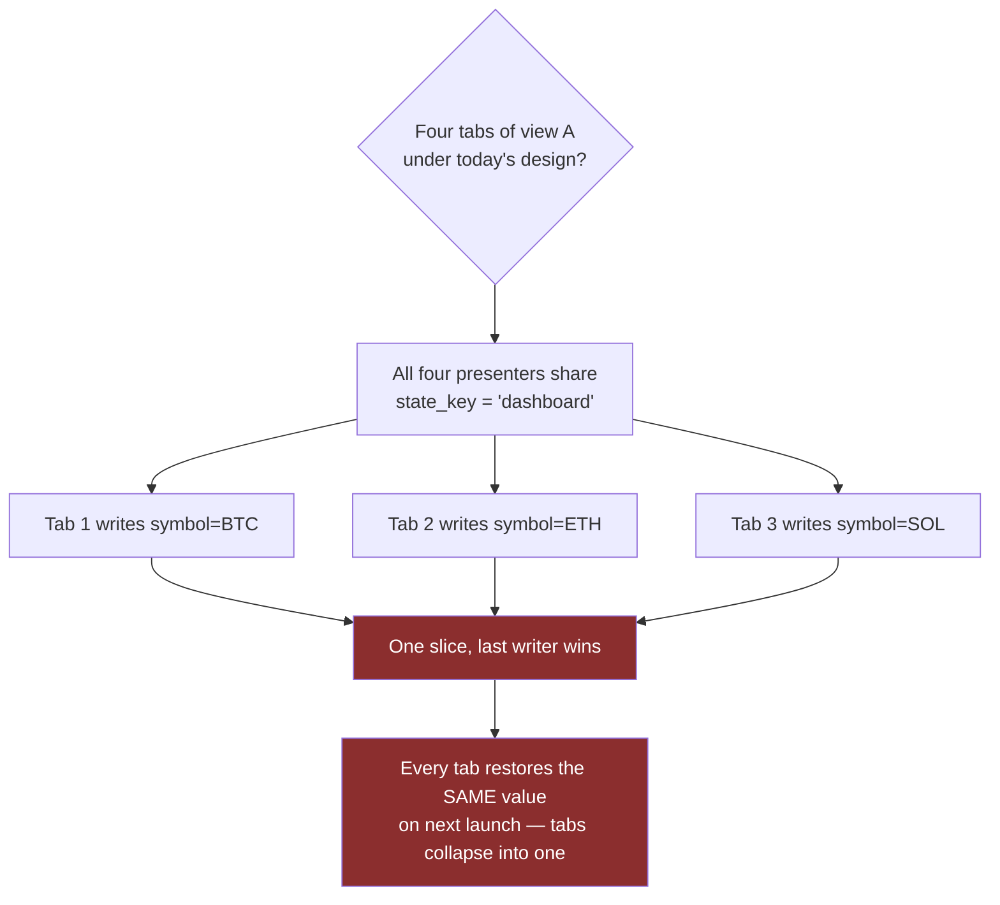
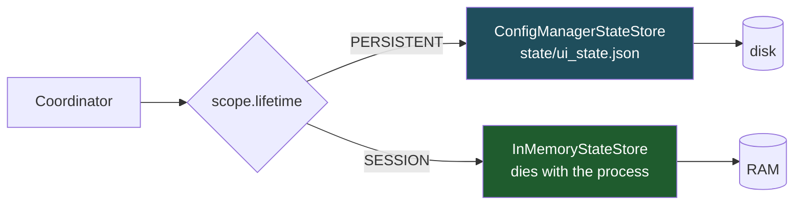
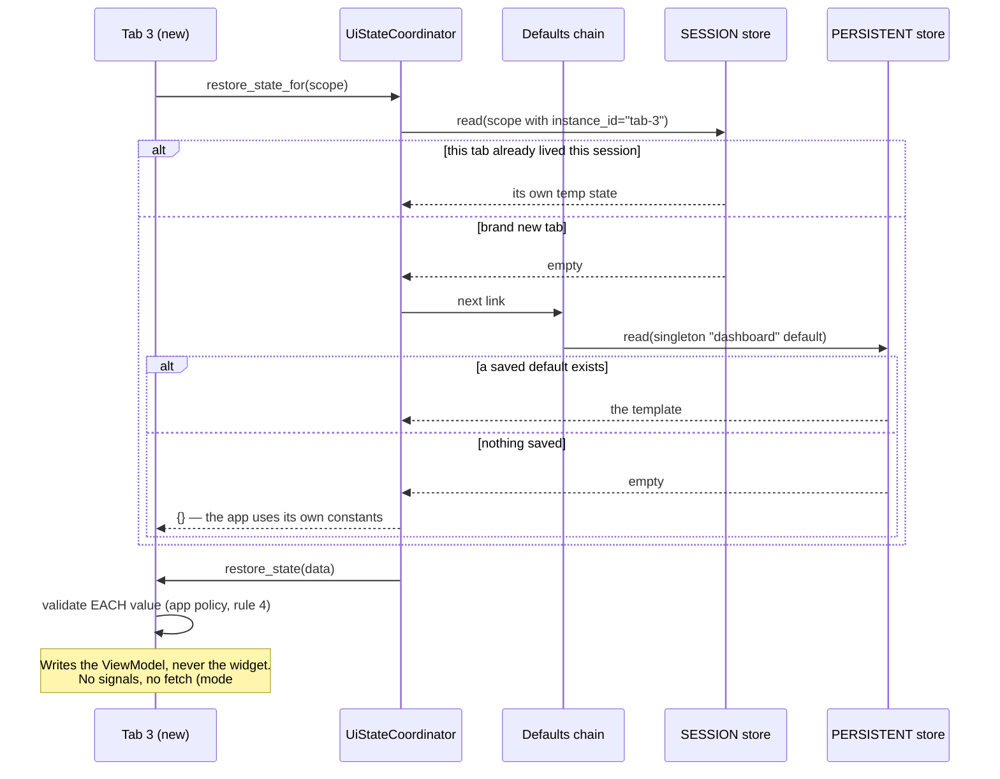

# DESIGN — `UiStateExtension`: promoting UI state persistence into the Engine

**Belongs to:** [`EPIC-010`](../README.md)
**Date:** 2026-08-26
**Status:** 🔵 **Proposed** — not approved, not a line of code written.

> [!IMPORTANT]
> **This document supersedes D1's *location* and D3 of
> [`DESIGN_2026-08-25_ui_state_persistence.md`](DESIGN_2026-08-25_ui_state_persistence.md),
> and adds a model that document does not have at all.**
>
> | From the 2026-08-25 design | Fate here |
> | :--- | :--- |
> | D1 — a second `ConfigManager` behind a port | ✅ **Kept**, unchanged. The probe still governs |
> | D1 — the port lives in the app | ⛔ **Superseded** — it moves to the Engine (§3) |
> | D3 — port in `src/presentation/ui/state/` | ⛔ **Superseded** by §3 |
> | D2 slice-merge, D4 debounce, D5 restore-is-a-request, D6 no-side-effects, D7 schema | ✅ **Kept**, and now generalised by §4 |
> | 12-failure-mode catalogue | ✅ Kept, **extended to 15** (§6) |
>
> Status tags carry the same meaning as the first document: ✅ **Established**
> (checked against the tree, cites `file:line`), 🔵 **Proposed**, ❓ **Open**.

---

## 1. What changed, and who found it

Two things arrived after the first design was reviewed, both from the user:

1. **This mechanism belongs in the Engine, not the app.** The Engine already owns
   `BasePresenter`, `PresenterManager`, `BaseView`, `QtEventBridge` — the whole
   MVP scaffolding lives in `extensions/pyside_mvc/`. A presenter's memory
   belongs in the same place.
2. **A route is not an identity.** *"What if a view is managed as tabs — same
   view A, four tabs of view A?"* This is a real hole in the first design, not a
   hypothetical. It is addressed in §2.

Point 2 is the more important one, because it breaks an assumption the first
document never stated out loud.

---

## 2. The gap: a route is not an identity ✅ Established

The first design keys every slice by **route name** (`dashboard`, `backtest`).
That silently assumes **one presenter instance per route** — an assumption
inherited from the Engine, where it is currently true:

```python
# presenter_manager.py:48-54 — one instance, per route, forever
self._registry[name] = {
    "presenter_class": presenter_class,
    "view_factory": view_factory,
    "view_instance": None,
    "presenter_instance": None,   # <- exactly one
    "stacked_index": -1,
}
```

So **tabs are structurally impossible in the Engine today.** That cuts both ways
and decides the whole approach:



> **The decision this forces** 🔵 Proposed
>
> **Make the *key* carry identity from day one. Do NOT build the tab machinery.**
>
> The reasoning is asymmetric, and that asymmetry is the whole argument:
>
> - Adding identity to the key **later** rewrites every stored key and every call
>   site — a data migration plus a breaking Engine API change, across two repos.
> - Adding identity **now** costs one optional field on a value object, and
>   nothing else changes while every scope stays a singleton.
>
> Building a tab manager now would be the opposite trade: expensive, and
> speculative about a feature that does not exist. That is exactly the mistake
> `architecture-rule.md` §7.2 names — `EPIC-006`'s four stub cards, *"đoán sai
> hình dạng của thứ chưa tồn tại"*. We make the **shape** extensible without
> guessing the **machinery**.

---

## 3. Where it lives: an Engine extension

`app.use(UiStateExtension(...))`, matching the `DiagnosticsExtension` pattern the
Engine added most recently.

### 3.1 Four boundary rules, each with named precedent ✅ Established

| # | Rule | Precedent in the Engine |
| :-: | :--- | :--- |
| 1 | `BasePresenter` **must not** call `restore_state()` inside `__init__`. The child calls it at the end of its own `__init__`, beside `_connect_ui_signals()` | `BasePresenter`'s own docstring: *"Avoids the 'Template Method Trap' by NOT calling overridable methods in `__init__`"* |
| 2 | The store is an **optional** dependency. A guarded resolve falling back to a null store — never a bare `resolve()` | `std_container.py:237` raises `DependencyResolutionError` when unregistered. `DatabaseExtension` degrades gracefully without SQLAlchemy, locked by `test_core_boot_does_not_require_persistence_extension` |
| 3 | Extension→extension coupling must be **declared and optional**; `pyside_mvc` must still work with no state extension registered | `ExtensionDescriptor.optional_dependencies` exists for exactly this |
| 4 | The framework provides **mechanism**; the application declares **policy**. The Engine never decides whether a value is still valid | `DiagnosticsExtension`: *"Declared by the application; the framework never decides an event is legitimately unheard on its behalf"* |

Rule 4 is the load-bearing one. The Engine cannot know whether `"SOLUSDT"` is
still a tradeable symbol or whether a strategy key still resolves. Validation
stays in the application's `restore_state()`, exactly as D5 said.

### 3.2 No second registry 🔵 Proposed

`PresenterManager` already owns the presenter lifecycle: it constructs lazily,
and `shutdown()` iterates every instantiated presenter preferring `dispose()`.

A state service with **its own** presenter registry would create two lists that
can drift — a presenter registered with the router but not the store, or the
reverse. That failure has a track record in this repository: nine drifted
`conftest` copies (`EPIC-009`), the bug board drifting from its own directory,
and `EPIC-009` itself missing from the epic table while being complete.

> **Decision:** presenters do not register anywhere. `BasePresenter` already
> receives the container, so it *pulls* the coordinator; and `dispose()` — which
> is framework-owned and always runs (`base_presenter.py:196`) — is where a
> session scope is discarded. One lifecycle owner, no second list.

---

## 4. The model: Scope = key + instance + lifetime

This is what the first design lacked entirely.

### 4.1 Two independent axes 🔵 Proposed

| Axis | Values | Decides |
| :--- | :--- | :--- |
| **Identity** | singleton (`instance_id = None`) · per-instance (`instance_id = "tab-3"`) | *Which* slice |
| **Lifetime** | `PERSISTENT` · `SESSION` | *Which store*, and when it dies |

Crossing them gives the four real cases:

| | `PERSISTENT` | `SESSION` |
| :--- | :--- | :--- |
| **singleton** | Window geometry, last route, the **default** template for a new tab | A singleton screen's scratch state, dies with the process |
| **per-instance** | ❓ Reopening the same 4 tabs — **deferred**, see §7 | **Tab 3's own state — "temp"**, dies when tab 3 is disposed |

The user's *"default vs temp"* maps onto this precisely: **default** is the
persistent singleton slice a new instance seeds from; **temp** is the session
per-instance slice that dies with the instance.

### 4.2 The insight that simplifies everything 🔵 Proposed

> **`SESSION` state never touches disk.**

Temp state dies with its instance, so writing it to a file and deleting it again
is pure cost — plus a whole class of orphan-cleanup bugs (a crash leaves temp
slices on disk forever, and nothing knows which instance owned them).

So there is no "temp file", no reaping, no TTL. Two stores behind one interface,
routed by lifetime:



This also answers the user's question — *"does `StateStoreLocator` already have
that mechanism?"* — honestly: **no, and it should not.** Deciding *which store*
is routing, not locating. The locator answers "which file, where, and how do I
delete it" for the persistent store only. Splitting those two keeps each with one
reason to change (`architecture-rule.md` §5).

A bonus worth naming: `InMemoryStateStore` is **the same class the tests already
need** as a double. The session store costs almost nothing new.

### 4.3 Where a new instance's initial state comes from 🔵 Proposed

A chain, tried in order — and a chain is the extension point, because a new link
can be inserted without touching any consumer:



Note this is the same shape as the 3-level precedence already proposed in §7 of
the first design (`ui_state` > `user_config DEFAULT_*` > module constants). One
chain concept, used twice — not two mechanisms.

---

## 5. The contracts

Deliberately small. The repo's own standard applies with double force here,
because this is framework API across two repos: *"widening this port later
requires a reason, while starting wide would never be narrowed back"*
(`i_config_reader.py`).


### 5.1 Why `StateScope` is a value object, not a string

A bare `"dashboard"` key cannot grow. `StateScope` can gain `instance_id`,
`lifetime`, and later a workspace id without any consumer changing — and `mypy`
catches every site that has not been updated when it does. That is
`architecture-rule.md` §7's rule applied literally: *the deferred thing must
exist as a **type**, not as a sentence in a document.*

### 5.2 `discard()` is a first-class operation, not a side effect

The user's *"temp dies when the view is destroyed"* needs an explicit verb.
`BasePresenter.dispose()` is framework-owned, always runs
(`base_presenter.py:196`), and already unsubscribes everything the presenter
registered — so it is the natural place. `discard()` on a `PERSISTENT` scope is
a legal no-op; only the session store acts on it.

---

## 6. Failure modes added by this design 🔵 Proposed

The first document's 12 stand unchanged. Identity and lifetime add three:

| # | Stage | Failure mode | Guard |
| :-: | :--- | :--- | :--- |
| 13 | Capture | **Instances fight over the shared default.** Four tabs each auto-write the singleton default; the last one to change wins and silently redefines what a new tab looks like | A per-instance scope **never** auto-writes the default. Promoting to default is an explicit action only. Locked by a test |
| 14 | Boundary | **Orphan instance slices.** A crash leaves `tab-7`'s persistent slice on disk with nothing that will ever own it again — an unbounded leak | Avoided structurally by §4.2: per-instance state is `SESSION` and never reaches disk. If §7's deferred feature is ever built, it must ship reaping *in the same change* |
| 15 | Apply | **Identity reuse.** A new tab is assigned `tab-3`, inherits a dead tab-3's state, and the user sees a stranger's form | Instance ids must be unique for the process lifetime, never a reused index. The Engine must not derive an id from tab position |

Mode 15 is the reason instance-id generation belongs to whoever owns the tab
container, and why the Engine must not quietly invent one from an index.

---

## 7. What gets built, and what is only a landing place

The whole point of §2's asymmetry, made concrete:

| | Built now | Deferred — landing place only |
| :--- | :--- | :--- |
| `StateScope` with `instance_id` | ✅ the field exists | every scope passes `None` |
| `Lifetime` | ✅ both members | only `PERSISTENT` has real consumers |
| `InMemoryStateStore` | ✅ (it is the test double anyway) | no app code requests `SESSION` yet |
| `IStateDefaultsProvider` | ✅ ABC + one link | the chain has one link |
| Tab manager / multi-instance router | ❌ nothing | `PresenterManager` stays one-per-route |
| Restoring "the 4 tabs I had open" | ❌ nothing | needs `PERSISTENT` + per-instance + an ordered open-set + reaping (mode 14) |

> ❓ **Open, and it must stay open.** Reopening a previous session's tabs is a
> materially larger feature than remembering values: it needs stable identity
> across restarts, an ordered set of open instances, and orphan reaping. It is
> named here so nobody assumes this design already covers it.

---

## 8. Sequencing 🔵 Proposed

Not "Engine first" in one move. This session lost time **twice** to
Engine/app version drift — `BUG-044` (a published Engine that would not import)
and a `colour_source_names` parameter that appeared mid-merge. Two-repo
coordination is a real, measured cost here, not a theoretical one.

| Step | Repo | Why this order |
| :-: | :--- | :--- |
| 1 | **Engine** — `StateScope`, `Lifetime`, `IStateStore`, `NullStateStore`, `InMemoryStateStore` | Pure types plus two trivial stores. No consumer, no risk, and it fixes the key shape before anything depends on it |
| 2 | **Engine** — `IStateContributor` no-op defaults on `BasePresenter` + guarded resolve (rule 2) | Additive. Every existing presenter keeps working untouched |
| 3 | **Elite** — `ConfigManagerStateStore` + locator + coordinator, wired for ONE screen | The shape gets proven by a real consumer before it is frozen into framework API |
| 4 | **Engine** — promote 3 once it has run for real | The `EPIC-007` pattern: *"đưa hình dạng lên Engine"* after it is established |

Steps 1-2 are safe to do first precisely because they contain no policy — they
are the part §2 proved must not wait.

---

## 9. Questions still open ❓

The three from the first design still stand (first-pass scope, absolute date vs
duration, file location). This design adds one:

4. **Who mints an instance id?** Whoever owns the tab container — which does not
   exist yet. Until it does, every scope is a singleton and the question is
   dormant. It must be answered **before** the first tabbed screen ships, not
   after (mode 15).
