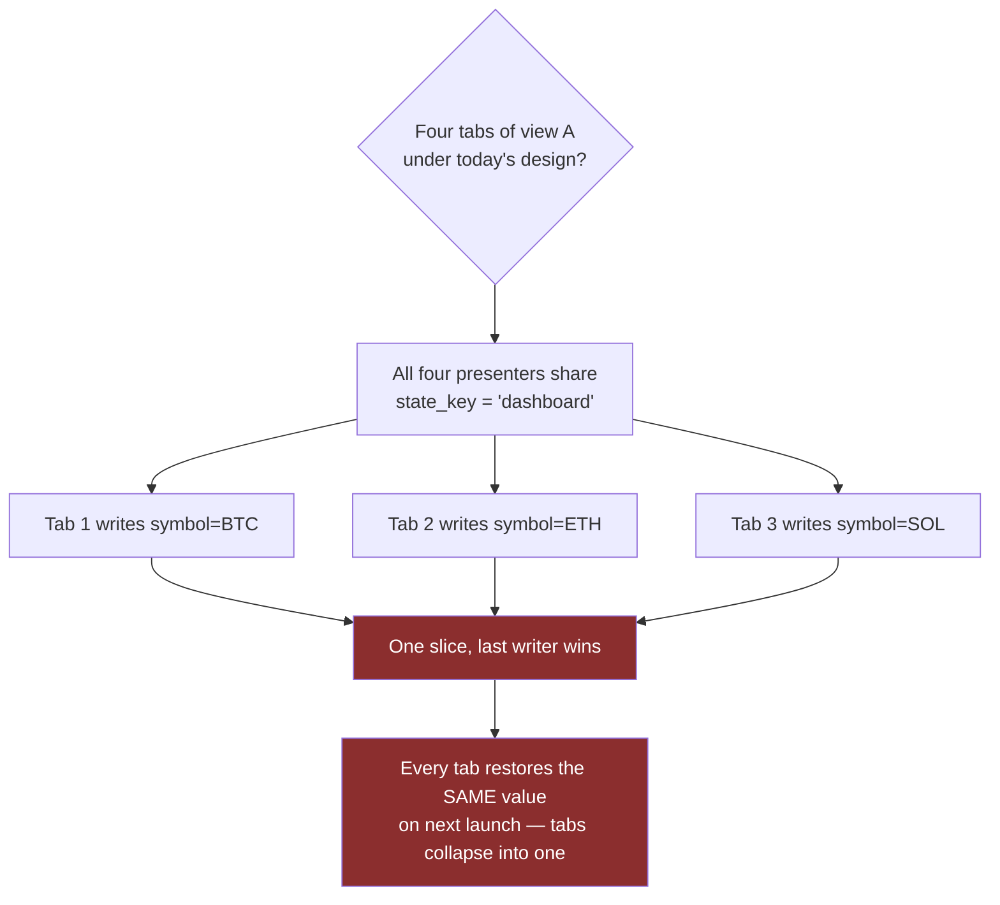
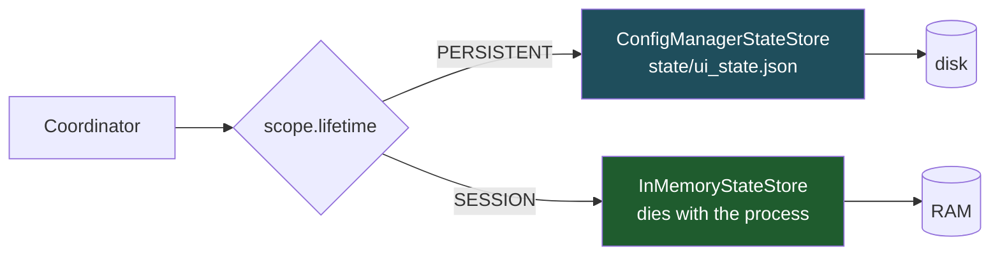
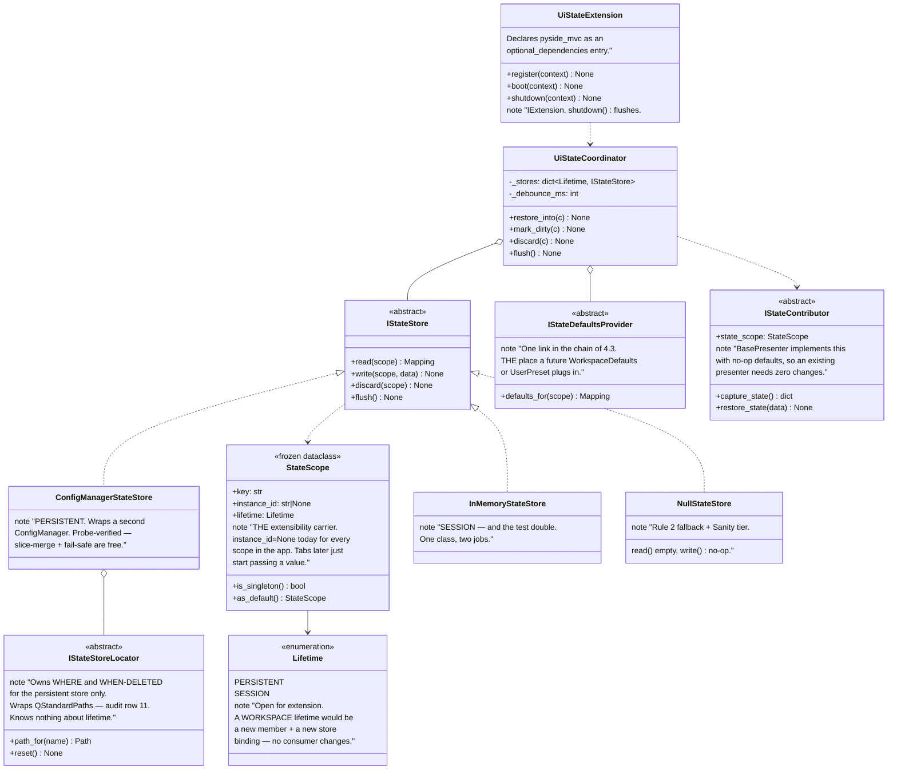
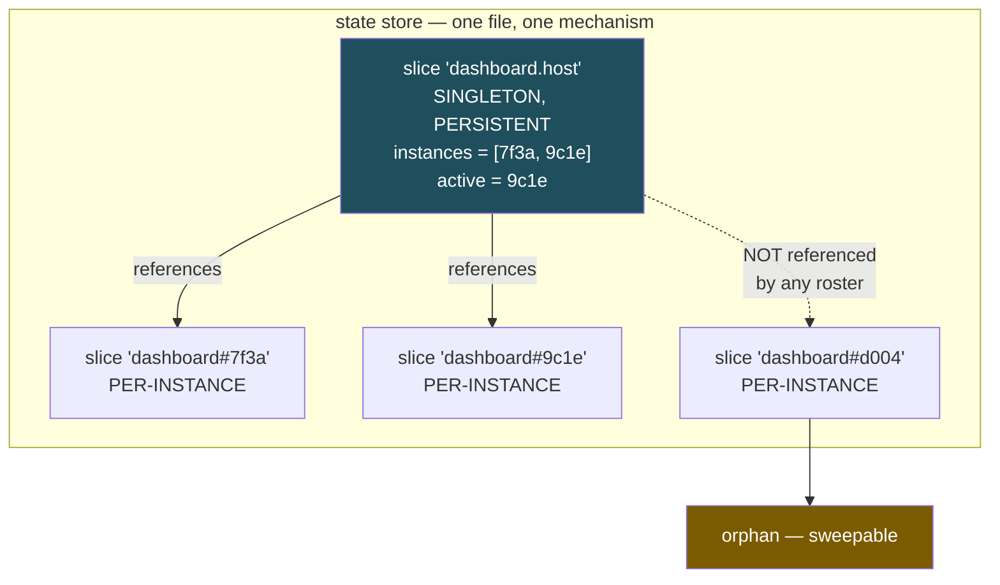

# DESIGN — `UiStateExtension`: promoting UI state persistence into the Engine

**Belongs to:** [`EPIC-010`](../README.md)
**Date:** 2026-08-26
**Status:** 🔵 **Proposed** — not approved, not a line of code written.

> [!IMPORTANT]
> **This document supersedes D1's *location* and D3 of
> [`DESIGN_2026-08-25_ui_state_persistence.md`](DESIGN_2026-08-25_ui_state_persistence.md),
> and adds a model that document does not have at all.**
>
> | From the 2026-08-25 design | Fate here |
> | :--- | :--- |
> | D1 — a second `ConfigManager` behind a port | ✅ **Kept**, unchanged. The probe still governs |
> | D1 — the port lives in the app | ⛔ **Superseded** — it moves to the Engine (§3) |
> | D3 — port in `src/presentation/ui/state/` | ⛔ **Superseded** by §3 |
> | D2 slice-merge, D4 debounce, D5 restore-is-a-request, D6 no-side-effects, D7 schema | ✅ **Kept**, and now generalised by §4 |
> | 12-failure-mode catalogue | ✅ Kept, **extended to 16** (§6, plus mode 16 in §5.5.5) |
>
> Status tags carry the same meaning as the first document: ✅ **Established**
> (checked against the tree, cites `file:line`), 🔵 **Proposed**, ❓ **Open**.

---

## 1. What changed, and who found it

Two things arrived after the first design was reviewed, both from the user:

1. **This mechanism belongs in the Engine, not the app.** The Engine already owns
   `BasePresenter`, `PresenterManager`, `BaseView`, `QtEventBridge` — the whole
   MVP scaffolding lives in `extensions/pyside_mvc/`. A presenter's memory
   belongs in the same place.
2. **A route is not an identity.** *"What if a view is managed as tabs — same
   view A, four tabs of view A?"* This is a real hole in the first design, not a
   hypothetical. It is addressed in §2.

Point 2 is the more important one, because it breaks an assumption the first
document never stated out loud.

### 1.1 The general concept is multiplicity, not tabs ✅ Established by review

An earlier draft of this document said "tab container" throughout. That was too
specific, and the user corrected it: *"if we use tab, we could use the idea …
think about we could apply that to tab, or just a new window."*

Tabs are one **instance of the problem**, not the problem. The general shape:

> **Multiplicity introduces identity. Whatever introduces the multiplicity owns
> the identity.**

An *instance owner* is anything that can produce more than one live copy of the
same state owner at the same time:

| Form of multiplicity | Instance owner |
| :--- | :--- |
| Tabs of one screen | the tab widget |
| A second top-level window | whatever opens windows |
| Split panes, side-by-side compare | the splitter/pane host |
| MDI sub-windows | the MDI area |
| A detached / popped-out panel | whoever detached it |

None of these exist in this app today, and the design must not name any of them
in its rules. The rule is stated in terms of a **relationship** — *whoever
constructs an instance owns its identity* — so it holds for all of them and for
forms nobody has thought of.

**The generalisation immediately paid for itself**, which is why it is recorded
rather than quietly applied: following "or just a new window" reveals that the
`shell` slice has *the same defect*. The first design treats window geometry as a
singleton, so two windows would both write `shell.window_width` and clobber each
other — the identical failure the tab example exposes for `dashboard`. So
multiplicity is **not a presenter-only concern**; it applies to any state owner,
including the shell itself.

**Identity may also nest** — window 2 → tab 3 → panel A. `instance_id` is a
`str`, which can carry a composed path, so nothing here forecloses that. ❓ Its
format is therefore deliberately **unconstrained**: no rule in this design may
assume an id is flat, opaque, or free of separators.

---

## 2. The gap: a route is not an identity ✅ Established

The first design keys every slice by **route name** (`dashboard`, `backtest`).
That silently assumes **one presenter instance per route** — an assumption
inherited from the Engine, where it is currently true:

```python
# presenter_manager.py:48-54 — one instance, per route, forever
self._registry[name] = {
    "presenter_class": presenter_class,
    "view_factory": view_factory,
    "view_instance": None,
    "presenter_instance": None,   # <- exactly one
    "stacked_index": -1,
}
```

So **tabs are structurally impossible in the Engine today.** That cuts both ways
and decides the whole approach:



> **The decision this forces** 🔵 Proposed
>
> **Make the *key* carry identity from day one. Do NOT build any multiplicity
> machinery** — no tab host, no second window, no pane splitter.
>
> The reasoning is asymmetric, and that asymmetry is the whole argument:
>
> - Adding identity to the key **later** rewrites every stored key and every call
>   site — a data migration plus a breaking Engine API change, across two repos.
> - Adding identity **now** costs one optional field on a value object, and
>   nothing else changes while every scope stays a singleton.
>
> Building a tab manager now would be the opposite trade: expensive, and
> speculative about a feature that does not exist. That is exactly the mistake
> `architecture-rule.md` §7.2 names — `EPIC-006`'s four stub cards, *"đoán sai
> hình dạng của thứ chưa tồn tại"*. We make the **shape** extensible without
> guessing the **machinery**.

---

## 3. Where it lives: an Engine extension

`app.use(UiStateExtension(...))`, matching the `DiagnosticsExtension` pattern the
Engine added most recently.

### 3.1 Four boundary rules, each with named precedent ✅ Established

| # | Rule | Precedent in the Engine |
| :-: | :--- | :--- |
| 1 | `BasePresenter` **must not** call `restore_state()` inside `__init__`. The child calls it at the end of its own `__init__`, beside `_connect_ui_signals()` | `BasePresenter`'s own docstring: *"Avoids the 'Template Method Trap' by NOT calling overridable methods in `__init__`"* |
| 2 | The store is an **optional** dependency. A guarded resolve falling back to a null store — never a bare `resolve()` | `std_container.py:237` raises `DependencyResolutionError` when unregistered. `DatabaseExtension` degrades gracefully without SQLAlchemy, locked by `test_core_boot_does_not_require_persistence_extension` |
| 3 | Extension→extension coupling must be **declared and optional**; `pyside_mvc` must still work with no state extension registered | `ExtensionDescriptor.optional_dependencies` exists for exactly this |
| 4 | The framework provides **mechanism**; the application declares **policy**. The Engine never decides whether a value is still valid | `DiagnosticsExtension`: *"Declared by the application; the framework never decides an event is legitimately unheard on its behalf"* |

Rule 4 is the load-bearing one. The Engine cannot know whether `"SOLUSDT"` is
still a tradeable symbol or whether a strategy key still resolves. Validation
stays in the application's `restore_state()`, exactly as D5 said.

### 3.2 No second registry 🔵 Proposed

`PresenterManager` already owns the presenter lifecycle: it constructs lazily,
and `shutdown()` iterates every instantiated presenter preferring `dispose()`.

A state service with **its own** presenter registry would create two lists that
can drift — a presenter registered with the router but not the store, or the
reverse. That failure has a track record in this repository: nine drifted
`conftest` copies (`EPIC-009`), the bug board drifting from its own directory,
and `EPIC-009` itself missing from the epic table while being complete.

> **Decision:** presenters do not register anywhere. `BasePresenter` already
> receives the container, so it *pulls* the coordinator; and `dispose()` — which
> is framework-owned and always runs (`base_presenter.py:196`) — is where a
> session scope is discarded. One lifecycle owner, no second list.

---

## 4. The model: Scope = key + instance + lifetime

This is what the first design lacked entirely.

### 4.1 Two independent axes 🔵 Proposed

| Axis | Values | Decides |
| :--- | :--- | :--- |
| **Identity** | singleton (`instance_id = None`) · per-instance (`instance_id = <opaque str>`) | *Which* slice |
| **Lifetime** | `PERSISTENT` · `SESSION` | *Which store*, and when it dies |

Crossing them gives the four real cases:

| | `PERSISTENT` | `SESSION` |
| :--- | :--- | :--- |
| **singleton** | Last route; the **default** template a new instance seeds from; window geometry *while there is one window* (§1.1) | A single-copy screen's scratch state, dies with the process |
| **per-instance** | ❓ Restoring a whole multi-instance layout — **deferred**, see §7 | **One copy's own state — "temp"**, dies when that copy is disposed |

The user's *"default vs temp"* maps onto this precisely: **default** is the
persistent singleton slice a new instance seeds from; **temp** is the session
per-instance slice that dies with the instance.

> ⚠️ **"Singleton" is a statement about today, not a property.** Window geometry
> is in the singleton column only because the app has one window. The moment a
> second one can exist it moves to the per-instance row — which is precisely why
> §2 puts identity in the key now, rather than treating today's singletons as
> permanent.

### 4.2 The insight that simplifies everything 🔵 Proposed

> **`SESSION` state never touches disk.**

Temp state dies with its instance, so writing it to a file and deleting it again
is pure cost — plus a whole class of orphan-cleanup bugs (a crash leaves temp
slices on disk forever, and nothing knows which instance owned them).

So there is no "temp file", no reaping, no TTL. Two stores behind one interface,
routed by lifetime:



This also answers the user's question — *"does the locator already have
that mechanism?"* — honestly: **no, and it should not.** Deciding *which store*
is routing, not locating. The locator answers "which file, where, and how do I
delete it" for the persistent store only. Splitting those two keeps each with one
reason to change (`architecture-rule.md` §5).

A bonus worth naming: `InMemoryStateStore` is **the same class the tests already
need** as a double. The session store costs almost nothing new.

### 4.3 Where a new instance's initial state comes from 🔵 Proposed

A chain, tried in order — and a chain is the extension point, because a new link
can be inserted without touching any consumer:


Note this is the same shape as the 3-level precedence already proposed in §7 of
the first design (`ui_state` > `user_config DEFAULT_*` > module constants). One
chain concept, used twice — not two mechanisms.

---

## 5. The contracts

Deliberately small. The repo's own standard applies with double force here,
because this is framework API across two repos: *"widening this port later
requires a reason, while starting wide would never be narrowed back"*
(`i_config_reader.py`).



### 5.1 Why `StateScope` is a value object, not a string

A bare `"dashboard"` key cannot grow. `StateScope` can gain `instance_id`,
`lifetime`, and later a workspace id without any consumer changing — and `mypy`
catches every site that has not been updated when it does. That is
`architecture-rule.md` §7's rule applied literally: *the deferred thing must
exist as a **type**, not as a sentence in a document.*

### 5.2 `discard()` is a first-class operation, not a side effect

The user's *"temp dies when the view is destroyed"* needs an explicit verb.
`BasePresenter.dispose()` is framework-owned, always runs
(`base_presenter.py:196`), and already unsubscribes everything the presenter
registered — so it is the natural place. `discard()` on a `PERSISTENT` scope is
a legal no-op; only the session store acts on it.

### 5.3 Instance identity — what the Engine has today ✅ Established

Surveyed before designing anything. The Engine has **no instance-id API for
long-lived UI objects**, and four things that look like one but are not:

| Candidate | Mechanism | Bound to | Stable across restart? | Usable here? |
| :--- | :--- | :--- | :---: | :--- |
| `BackgroundTask._id` | `uuid.uuid4()` in `__init__` (`background_task.py:31`) | the task object | ❌ | Not identity for a view, but **the house style to copy** |
| `BaseEvent.event_id` | `uuid.uuid4()` default_factory (`base_event.py:71`) | the event object | ❌ | Same — style precedent |
| `ScopeContext` (DI) | `ContextVar`, `with container.create_scope():` | the **execution context** | ❌ | ⛔ **No** — see below |
| `ResourceScope` | plain object, `add()`/`dispose_all()` | one "run" of a long-lived object | ❌ | ⛔ No id at all — but its *philosophy* backs §5.2 |

> ⛔ **`ScopeContext` is the trap, and its name invites the mistake.** It is
> `ContextVar`-backed and **block-scoped** — the scope ends when the `with`
> block ends. A tab lives across thousands of event-loop turns; you cannot hold
> one open inside a `with`. It also binds to the thread/async context, not to an
> object, so two tabs on the same thread would share a scope. Structurally wrong,
> not merely awkward.

`ResourceScope`'s docstring is still worth quoting, because it argues for §5.2's
`discard()` being a real operation: *"teardown is a property of a data structure
instead of a convention every new call-site has to remember."*

### 5.4 D9 — Who mints the id 🔵 Proposed

**The requirement collapsed once §4.2 decided per-instance state is `SESSION`.**
Two different ids were hiding under one question:

| | Needs | Who can supply it |
| :--- | :--- | :--- |
| **SESSION id** (what we build) | unique in this process, never reused | anyone — including the presenter itself |
| **PERSISTENT id** (deferred, §7) | *stable across restarts*, rebindable, reapable | only the instance owner (§1.1) — and no form of multiplicity exists yet |

So the answer for what we are actually building:

> **`BasePresenter` mints its own `uuid4` in `__init__`. No new Engine API.**

Why this wins, against the alternatives considered:

| Option | Verdict |
| :--- | :--- |
| **`PresenterManager` mints it** | ⛔ It is a *router* over a `QStackedWidget` — one visible screen, `navigate_to(name)` is its whole API, one `presenter_instance` per route. Making it multi-instance **is** the machinery §2 deferred, and needs a signature change |
| **A new instance-owner / registry in the Engine** | ⛔ That is the deferred machinery outright, for whichever form of multiplicity it assumed |
| **The application mints it** | 🟠 Works, but every app invents its own convention and mode #15 is easy to get wrong. Better as the *override*, not the default |
| **`BasePresenter` self-mints `uuid4`** | ✅ Unique by construction, **kills mode #15 structurally** (a uuid is never reused, so a new tab can never inherit a dead one's state), matches the Engine's two existing id precedents, and costs one private field |

**No new interface here, deliberately.** An `IInstanceIdProvider` ABC would be
the speculative abstraction `architecture-rule.md` §7.2 warns about — there is no
second implementer and no requirement it would serve. The seam is one
**overridable property**, not a port:

- `BasePresenter.__init__` sets `self._instance_uid = str(uuid.uuid4())` —
  additive, no signature change, so every existing subclass and
  `PresenterManager`'s `presenter_class(view, container)` call keep working.
- `state_scope` is a property built from it. Whatever instance owner appears
  first — a tab host, a second window, a pane splitter — overrides that one
  property to supply a stable id. That is the §7.1 landing place, at the cost of
  a property rather than a port.

> **Why the rule is stated as a relationship, not as a component.** *Whoever
> constructs an instance owns its identity* holds for every form of multiplicity
> in §1.1, including ones nobody has proposed. A rule naming a tab host would
> have to be rewritten the first time someone opens a second window instead —
> and rewriting a rule about identity, after ids are already on disk, is exactly
> what mode #15 punishes.

The *stable* id policy that D9 leaves open is answered by D10 below.

### 5.5 D10 — The stable, across-restart id 🔵 Proposed

The reframe that dissolves it:

> **Identity across a restart cannot be *derived*. It has to be *recorded*.**

Nothing intrinsic about a freshly created instance connects it to a dead one
from a previous run — the object, its widgets and its memory are all gone. So
there is no clever id-generation scheme to find. The id does not need to be
*derivable*; it needs to be **replayable**.

Which means the answer is: **keep the `uuid4`, and persist the roster.**

| Session | What happens |
| :--- | :--- |
| **N** | Instance owner creates copies; each gets an opaque `uuid4`. The owner records its **roster** — the ordered list of live ids — and each instance stores its own slice under its uuid |
| **N+1** | The owner reads its roster, recreates that many instances, and **assigns them the recorded ids**. Each instance then pulls its own slice exactly as any singleton does |

Continuity comes from the roster, not from the id. The id stays opaque, unique,
and never reused — so mode #15 stays closed.

#### 5.5.1 The roster needs no new machinery 🔵 Proposed

The instance owner is the only thing that knows "I have four of these, in this
order". So **the roster is simply the instance owner's own state slice** — a
singleton `PERSISTENT` scope, captured and restored through the same
`IStateContributor` contract every screen already uses.



No new subsystem, no registry, no id service. The owner is a contributor like
any other; its captured value happens to be a list of ids.

#### 5.5.2 Reaping becomes exact, not heuristic 🔵 Proposed

Mode #14 (orphan slices) reopens the moment per-instance state becomes
`PERSISTENT`. The roster closes it precisely:

> **Rosters are the GC roots. A per-instance slice whose id appears in no roster
> is garbage.**

That is mark-and-sweep, with no TTL to tune, no "last seen" timestamp to guess
at, and no heuristic that can be wrong. And the sweep is a pure **store**
operation — it reads roster slices by naming convention and never needs a live
object — so lazy construction does not affect it.

#### 5.5.3 One ordering invariant, and it is the whole safety argument 🔵 Proposed

Writes are not atomic (§4.1.3's accepted cost), so a crash can land one slice and
not another. The two directions are **not** equally safe:

| Crash leaves | Result |
| :--- | :--- |
| A roster referencing a slice that was never written | Harmless — D5 already says a missing value falls back to defaults |
| An instance slice whose roster entry was never written | **Dangerous** — the next sweep sees an unreferenced slice and deletes live state |

> **Invariant: the roster is written before the instance slices it references.**
> That removes the dangerous direction entirely rather than guarding against it.
> A test must lock this ordering, per `architecture-rule.md` §7.1.

#### 5.5.4 Alternatives, and why they lose

| Approach | Verdict |
| :--- | :--- |
| **Derive the id from content** (hash the tab's symbol) | ⛔ Two instances showing the same symbol collide; and changing the symbol silently makes it "a different instance" that loses its own state |
| **Derive from position or index** (`tab-0`, `tab-1`) | ⛔ Mode #15 in its purest form — close or reorder one and every later instance inherits a stranger's state. This is the classic version of this bug |
| **User-named instances** | 🟠 Stable and human-recoverable, but needs UI plus uniqueness enforcement, and most users never name anything. Worth having **later as a separate feature** (named workspaces/presets) layered on top — not as the identity mechanism |
| **`uuid4` + persisted roster** | ✅ Nothing to derive, no collision possible, reaping is exact, and it reuses the slice mechanism wholesale |

#### 5.5.5 Failure mode 16

| # | Stage | Failure mode | Guard |
| :-: | :--- | :--- | :--- |
| 16 | Boundary | **A lost roster orphans everything it owned.** One partial write and N instances' state becomes unreferenced, then swept | §5.5.3's ordering invariant makes the dangerous direction unreachable. Additionally, the sweep must be **conservative** — never run on a boot where the store reported a degraded read (H3), because "everything looks unreferenced" is exactly what a degraded read looks like |

> **This remains deferred.** D10 settles the *policy* so it is no longer a
> blocker and so nobody has to invent one under time pressure later. It does not
> authorise building any of it — §7's table is unchanged, and no instance owner
> exists to build it for.

---

## 5.6 What Qt already solves — and the resulting trim ✅ Established

> **Review question:** *"Isn't this too complex? Does Qt have something that
> helps here?"* Both halves deserved a real answer, so the Qt surface was
> enumerated by reflection over `PySide6` rather than recalled.

### 5.6.1 The measurement

`saveGeometry`/`restoreGeometry` exist on **`QWidget`**, so every widget in the
app inherits them. `saveState`/`restoreState`, however, exist on exactly **four**
classes:

| Class | What its state blob holds |
| :--- | :--- |
| `QMainWindow` | dock and toolbar layout |
| `QSplitter` | splitter sizes |
| `QHeaderView` | column widths, order, sort |
| `QFileDialog` | its own sidebar/view state |

Also present: `QSessionManager`, plus `QGuiApplication.sessionId()`,
`isSessionRestored()`, `commitDataRequest`, `saveStateRequest`.

### 5.6.2 The dividing line

> **Qt persists widget *chrome*. It cannot persist application *values*.**

Qt has no idea what `"ETHUSDT"` means, so nothing in the list above can store the
selected symbol, the typed capital, or which strategy is chosen. Mapping it onto
the tiers from the first design:

| Tier item | Qt covers it? |
| :--- | :--- |
| Window size / position / maximised | ✅ `saveGeometry` |
| Splitter sizes (was **T3**) | ✅ `QSplitter.saveState` |
| Table column widths (was **T3**) | ✅ `QHeaderView.saveState` |
| Dev Board / Database symbol + interval (**T1**) | ❌ application values |
| Last route, sidebar collapsed (**T1**) | ❌ |
| Backtest strategy / capital / commission (**T2**) | ❌ |
| Chart zoom & pan (**T3**) | ❌ pyqtgraph, not Qt |

**Qt covers most of what was deferred, and none of what was prioritised.** That
is a useful result in both directions: T3 gets cheaper, T1 does not shrink.

### 5.6.3 Correction — the geometry blob argument was wrong ⛔ Supersedes §4.1.2 point 4

§4.1.2 concluded that hand-storing `x/y/w/h` and validating the rect against
`QGuiApplication.screens()` was *"more in the spirit of D5"* than Qt's opaque
`QByteArray`. On re-examination that was **special pleading**: `restoreGeometry()`
performs its own off-screen and DPI sanity checks, so the hand-rolled version
buys no extra safety while costing code and getting multi-monitor wrong in ways
Qt already handles.

> **Revised:** store the `QByteArray` from `saveGeometry()` / `QSplitter.saveState()`
> as base64 inside the ordinary slice. **Let Qt own what Qt owns.** The cost is
> honest and small — one opaque field per widget, unreadable in the JSON, and
> tied to Qt's own format version. D5 still applies to everything Qt does not
> understand, which is every application value.

### 5.6.4 `QSessionManager` — related, but a different problem

It exists, and it is the right thing to name here so nobody later asks why it was
skipped. It handles **OS-initiated session end** — the desktop session is closing
and asks applications to save and declare a restart command. It requires platform
session-manager support, and it says nothing about identity *within* one
application.

It does not answer D10, whose case is the ordinary one: the user quit normally
and reopened the app tomorrow. No session manager is involved in that at all.

### 5.6.5 The complexity answer: reuse, don't cut 🔵 Proposed

An earlier revision answered the complexity concern by cutting three
abstractions. The user rejected that and gave a better rule:

> *"Don't cut them. But show me: wherever a problem already has a library, apply
> it — don't write code."*

That is the right instinct, and it is a **stronger** answer than cutting, because
the abstractions were never the weight. The weight is hand-written mechanism.
So: every abstraction in §5 stays, and §5.6.6 audits each *problem* against what
already exists.

The complexity concern still gets its honest half:

> **The document is complex. The first increment is not.**

Of the 16 failure modes, **13-16 all concern a feature that is not being built**;
D10 authorises no code at all.

### 5.6.6 Problem-by-problem reuse audit ✅ Established

Every row measured on this container (PySide6 6.11.1, Python 3.12.3), not
recalled. **"Write" appears eight times, and six of those are a handful of lines.**

| # | Problem | Already solved by | Verified how |
| :-: | :--- | :--- | :--- |
| 1 | Persist JSON, merge one slice, leave others alone | ✅ `ConfigManager.save()` — writes only `_dirty` onto the file's current contents | probe H1/H2 |
| 2 | Corrupt file must not block boot | ✅ `JsonSource.read()` swallows `JSONDecodeError` → `{}` | probe H3 |
| 3 | Dirty tracking (which keys changed) | ✅ `ConfigManager._dirty` | source read |
| 4 | Window size / position / maximised / off-screen / DPI | ✅ `QWidget.saveGeometry()` / `restoreGeometry()` | §5.6.1 |
| 5 | Splitter sizes | ✅ `QSplitter.saveState()` / `restoreState()` | §5.6.1 |
| 6 | Table column widths, order, sort | ✅ `QHeaderView.saveState()` / `restoreState()` | §5.6.1 |
| 7 | Dock / toolbar layout | ✅ `QMainWindow.saveState()` / `restoreState()` | §5.6.1 |
| 8 | **Debounce** — coalesce a burst of changes into one write | ✅ **`QTimer` natively.** `setSingleShot(True)`, then `start()` on every change *restarts* the countdown | measured: 3 rapid `start()` calls → **1** `timeout` |
| 9 | **Restore without firing signals** (mode #12) | ✅ **`QSignalBlocker`** | measured: value applied, **0** signals emitted |
| 10 | Putting a Qt binary blob into JSON | ✅ `QByteArray.toBase64()` / `fromBase64()` | measured: round-trip exact |
| 11 | Per-user config directory | ✅ `QStandardPaths.AppConfigLocation` — yields `.../Sagittarius/EliteWarrior` once org/app name is set | measured |
| 12 | Unique, never-reused instance id | ✅ `uuid.uuid4()` (stdlib) — and the Engine's own house style | `BackgroundTask:31`, `BaseEvent:71` |
| 13 | Immutable value object | ✅ `dataclasses.dataclass(frozen=True)` (stdlib) | — |
| 14 | Closed set of lifetimes | ✅ `enum.Enum` (stdlib) | — |
| 15 | Main-thread enforcement | ✅ Engine's `@ui_mutator` / `set_thread_affinity_dev_mode` | `safety/thread_affinity.py:30` |
| 16 | Atomic write, if ever wanted | ✅ `os.replace()` (stdlib) — not needed now (§4.1.3) | — |
| 17 | Presenter lifecycle + teardown hook | ✅ `PresenterManager` + `BasePresenter.dispose()` | §3.2 |
| — | **`StateScope` / `Lifetime` definitions** | ✍️ write — ~20 lines of dataclass + enum | |
| — | **`IStateStore` + the 3 implementations** | ✍️ write — but `ConfigManagerStateStore` is a thin wrapper over row 1-3; `InMemory` and `Null` are ~10 lines each | |
| — | **`StateStoreLocator`** | ✍️ write — wraps row 11 plus a `reset()` that deletes the file | |
| — | **`IStateContributor` + no-op defaults** | ✍️ write — a Protocol and two empty methods | |
| — | **`UiStateCoordinator`** | ✍️ write — but debounce is row 8, so it is bookkeeping, not timing logic |
| — | **`IStateDefaultsProvider` + the chain** | ✍️ write — the §4.3 resolution order | |
| — | **`UiStateExtension`** | ✍️ write — `register`/`boot`/`shutdown` wiring |
| — | **Per screen: `capture_state` / `restore_state`** | ✍️ write — ~10 lines each, and this is the part **no library can ever supply**, because it is application policy (rule 4) |

**What the audit changes, concretely:**

- **Row 8 removes the piece that sounded hardest.** "Debounce with coalescing"
  reads like real machinery; it is `setSingleShot(True)` plus calling `start()`
  again. `UiStateCoordinator` shrinks to bookkeeping.
- **Row 9 turns mode #12 from a discipline into a mechanism.** D6 said *"restore
  the ViewModel, not the widget"* partly to dodge signals. With `QSignalBlocker`
  measured to work, touching a widget is safe when it is genuinely needed —
  though writing the ViewModel stays preferred, because it also keeps restore
  testable without a widget tree.
- **Rows 4-7 + 10 mean nothing is hand-rolled for chrome**, per §5.6.3.
- **The last row is the floor.** Validation and capture are policy; no library
  can know whether `"SOLUSDT"` is still tradeable. That is rule 4 restated as a
  cost estimate.

---

## 6. Failure modes added by this design 🔵 Proposed

The first document's 12 stand unchanged. Identity and lifetime add three:

| # | Stage | Failure mode | Guard |
| :-: | :--- | :--- | :--- |
| 13 | Capture | **Instances fight over the shared default.** Every live copy auto-writes the singleton default; the last one to change wins and silently redefines what a *new* copy looks like | A per-instance scope **never** auto-writes the default. Promoting to default is an explicit action only. Locked by a test |
| 14 | Boundary | **Orphan instance slices.** A crash leaves instance `7`'s persistent slice on disk with nothing that will ever own it again — an unbounded leak | Avoided structurally by §4.2 today: per-instance state is `SESSION` and never reaches disk. When §7's deferred feature is built, D10 §5.5.2 closes it exactly — rosters are GC roots, an unreferenced slice is garbage |
| 15 | Apply | **Identity reuse.** A new instance is handed a dead instance's id, inherits its state, and the user sees a stranger's form | Solved structurally by §5.4: a `uuid4` is never reused, so no new instance can collide with a dead one. **Never derive an id from a position, index, or ordinal** — those are exactly the values that get reused |

Modes 14 and 15 are both closed by *structure* rather than by discipline —
`SESSION`-only per-instance state means no disk orphans, and `uuid4` means no
reuse. That is deliberate: a guard that depends on nobody making a mistake is
not a guard. Mode 16, added by D10, follows the same rule: rather than guarding
against a bad write order, §5.5.3 makes the bad order unreachable.

---

## 7. What gets built, and what is only a landing place

The whole point of §2's asymmetry, made concrete:

| | Built now | Deferred — landing place only |
| :--- | :--- | :--- |
| `StateScope` with `instance_id` | ✅ the field exists | every scope passes `None` |
| `Lifetime` | ✅ both members | only `PERSISTENT` has real consumers |
| `InMemoryStateStore` | ✅ (it is the test double anyway) | no app code requests `SESSION` yet |
| `IStateDefaultsProvider` | ✅ ABC + the §4.3 chain | more links (workspace, preset) plug in without touching consumers |
| `IStateStoreLocator` | ✅ ABC, wrapping `QStandardPaths` (audit row 11) | a second location strategy swaps one class |
| Qt-owned chrome — geometry, splitters, headers | ✅ store Qt's own blob (§5.6.3) | nothing hand-rolled; this also makes most of **T3 cheap** |
| Any instance owner — tab host, second window, pane splitter (§1.1) | ❌ nothing | `PresenterManager` stays one-per-route |
| Restoring a whole multi-instance layout | ❌ nothing | **policy settled by D10** (§5.5) — uuid + persisted roster, rosters as GC roots. Still needs an instance owner to exist before any of it is built |

> ❓ **Open, and it must stay open.** Restoring a previous session's *layout* —
> whichever form it took, tabs or windows or panes — is a materially larger
> feature than remembering values: it needs stable identity across restarts, an
> ordered set of open instances, and orphan reaping. It is named here so nobody
> assumes this design already covers it.

---

## 8. Sequencing 🔵 Proposed

Not "Engine first" in one move. This session lost time **twice** to
Engine/app version drift — `BUG-044` (a published Engine that would not import)
and a `colour_source_names` parameter that appeared mid-merge. Two-repo
coordination is a real, measured cost here, not a theoretical one.

| Step | Repo | Why this order |
| :-: | :--- | :--- |
| 1 | **Engine** — `StateScope`, `Lifetime`, `IStateStore`, `NullStateStore`, `InMemoryStateStore` | Pure types plus two trivial stores. No consumer, no risk, and it fixes the key shape before anything depends on it |
| 2 | **Engine** — `IStateContributor` no-op defaults on `BasePresenter` + guarded resolve (rule 2) | Additive. Every existing presenter keeps working untouched |
| 3 | **Elite** — `ConfigManagerStateStore` + locator + coordinator, wired for ONE screen | The shape gets proven by a real consumer before it is frozen into framework API |
| 4 | **Engine** — promote 3 once it has run for real | The `EPIC-007` pattern: *"đưa hình dạng lên Engine"* after it is established |

Steps 1-2 are safe to do first precisely because they contain no policy — they
are the part §2 proved must not wait.

---

## 9. Questions still open ❓

The three from the first design still stand (first-pass scope, absolute date vs
duration, file location).

4. ~~**Who mints an instance id?**~~ → **Answered as D9 (§5.4).** The Engine was
   surveyed: it has no such API, and the three things that resemble one
   (`ScopeContext`, `ResourceScope`, and the `uuid4` used by `BackgroundTask` /
   `BaseEvent`) are either structurally unusable or style precedents only. For
   the `SESSION` scope we are actually building, `BasePresenter` self-minting a
   `uuid4` is sufficient and needs **no new Engine API**.

5. ~~**The stable, across-restart id policy.**~~ → **Answered as D10 (§5.5).**
   Identity across a restart cannot be derived, only recorded — so the `uuid4`
   stays and the **roster** is persisted, which also turns reaping into exact
   mark-and-sweep with rosters as GC roots. Settled as *policy* only; §7's table
   is unchanged and nothing is built.

**No blocking questions remain on identity.**

### 9.1 The three product decisions — settled 2026-08-26 🟢 Approved

| Question | Decision | Consequence |
| :--- | :--- | :--- |
| **First-pass scope** | Foundation + T1 + everything Qt covers for free — `010A`…`010E`, then stop and run it for real | `010F`/`010G` (T2) wait on that evaluation. `010H` unchanged |
| **Dev Board dates** | **Duration**, not absolute timestamps — persist `lookback_days`, recompute `now - N days` on restore | Preserves today's behaviour exactly (`dashboard_view_model.py:77-79` already computes `now - 7 days` per construction) and removes risk **R2**: a stale absolute window making Load History fetch an enormous range. Superseded later if the Dev Board gains a preset picker like Backtest's `time_range_preset` + `custom_start/end` |
| **File location** | `state/ui_state.json` in the repo, `state/` added to `.gitignore` | Consistent with `logs/` (line 147) and `database/` (line 139); greppable, `cat`-able, delete-to-reset. `QStandardPaths` stays the documented future move behind `IStateStoreLocator` — and is **not usable today** regardless: measured, the app sets no `organizationName`, so it returns a bare `/root/.config` |

**The design is closed.** Nothing in `010A`…`010E` is waiting on an answer.
