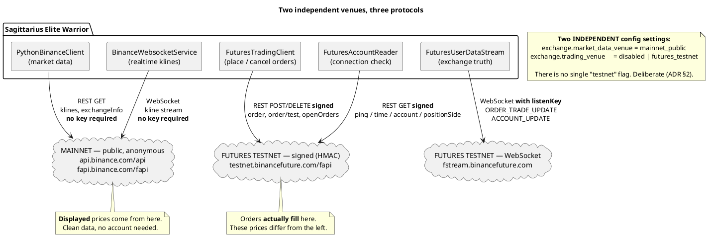
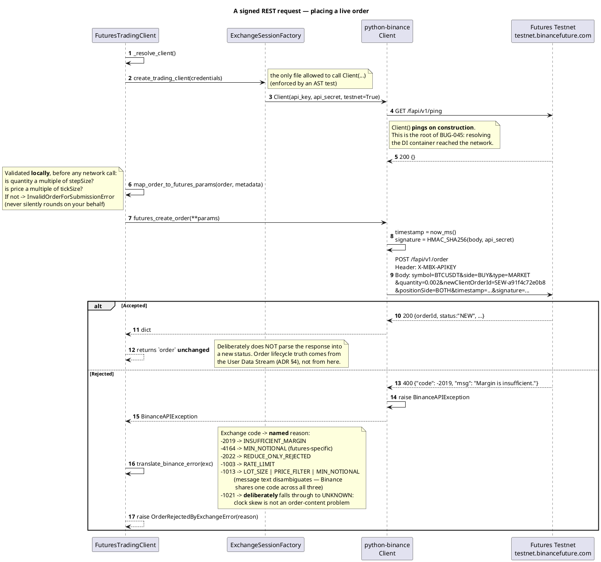
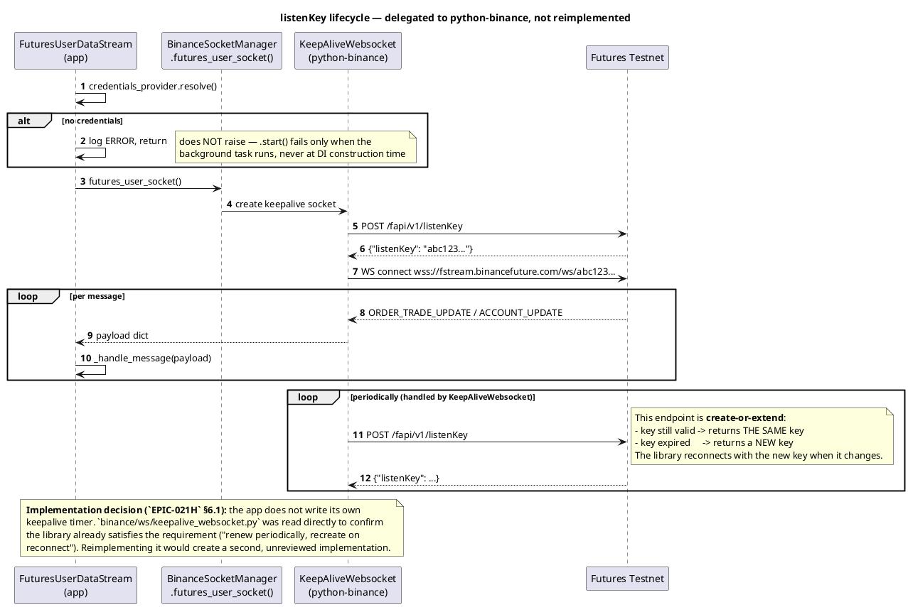
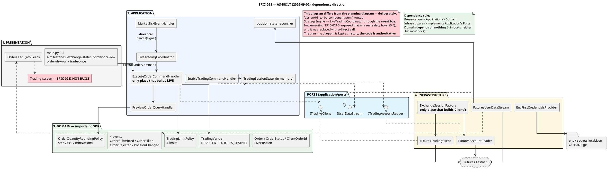
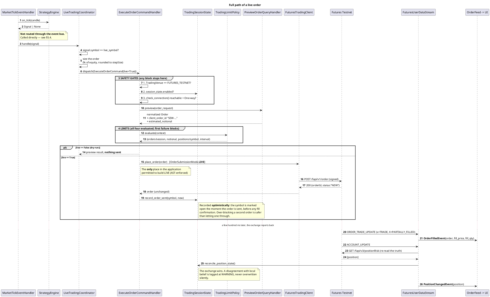
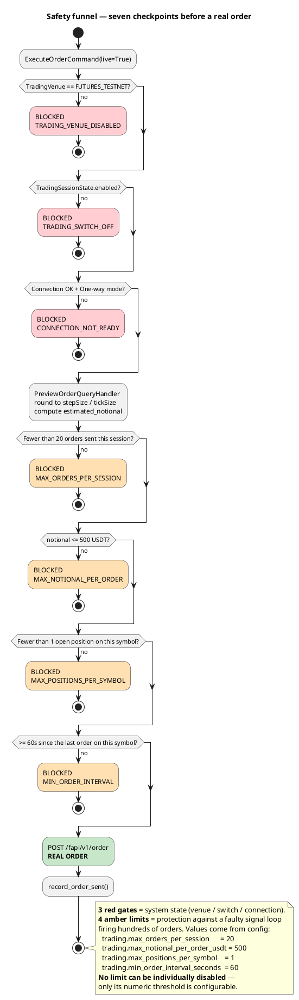
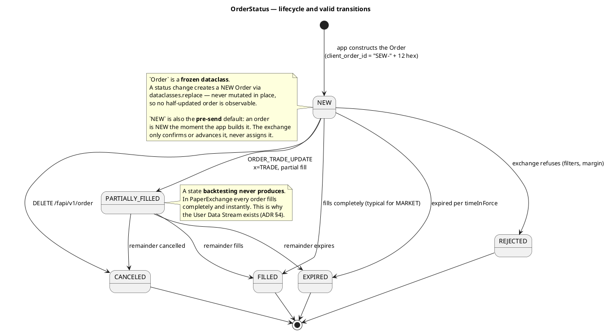
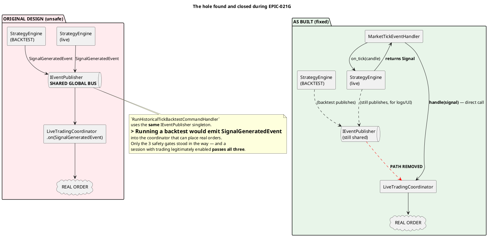
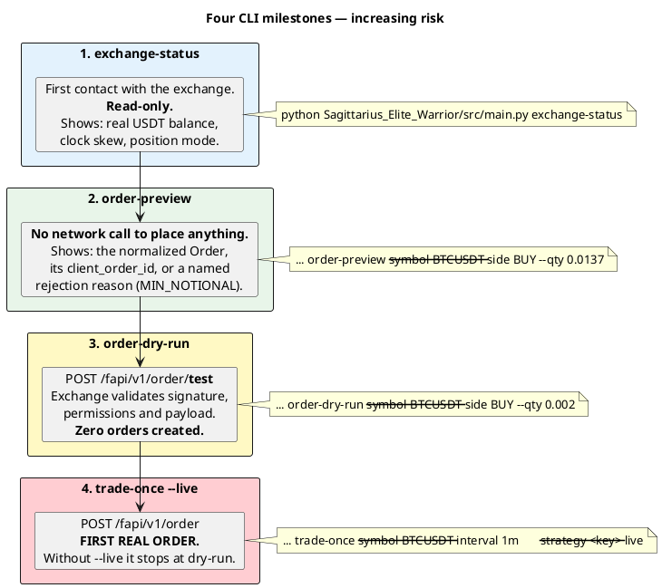
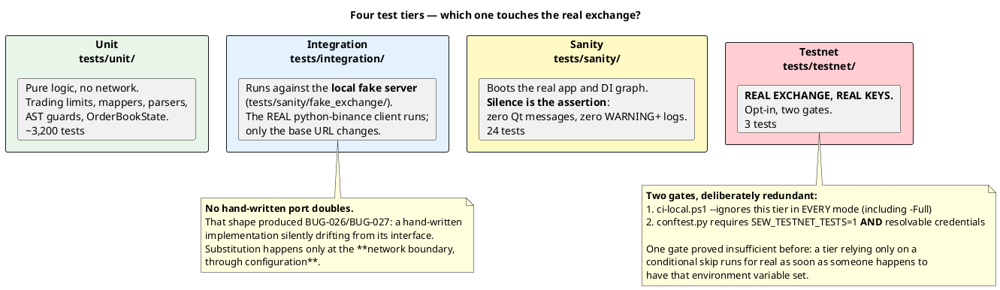

# Binance Futures Testnet — Engineering Guide

> **Audience:** engineers joining the live trading feature with no prior crypto-exchange background.
> **Source:** written from the code itself. Where a task file or a planning diagram contradicts the
> code, this guide follows the **code** and says so.
> **Date:** 2026-09-02 · **Epic status:** 10 of 12 sub-tasks complete (`EPIC-021I`, `EPIC-021K` remain).
>
> **Language note:** this file is in English by explicit request, unlike the rest of `Tasks/`
> (`CLAUDE.md` sets Vietnamese as the default for task documents).

| Question | Section |
| :--- | :--- |
| What is testnet, how does it differ from mainnet? | 1 |
| How does the app talk to the exchange? | 2 |
| Which component owns what? | 3 |
| How does a candle become a filled order? | 4 |
| Why so many safety layers? | 5 |
| How do I run this today? | 6 |
| What is still missing? | 7 |

Required companion reading: [`DECISION_2026-09-01_moi_truong_san_va_duong_di_lenh.md`](DECISION_2026-09-01_moi_truong_san_va_duong_di_lenh.md)
(the ADR — **why** these decisions were made) and [`README.md`](README.md) (task breakdown and status).

---

# 1. What Futures Testnet is

## 1.1 A parallel exchange running on play money

Binance operates two fully separate systems:

| | Mainnet | Futures Testnet |
| :--- | :--- | :--- |
| REST host | `https://fapi.binance.com/fapi` | `https://testnet.binancefuture.com/fapi` |
| WebSocket host | `wss://fstream.binance.com/` | `wss://fstream.binancefuture.com/` |
| Account | your real Binance account | a **separate** account, registered at `testnet.binancefuture.com` |
| API keys | real keys | **separate keys — not interchangeable** |
| Funds | real | fake USDT, granted by the exchange |
| Prices | real market | testnet's own order book — **drifts from real prices** |
| Data durability | permanent | **periodically reset** (keys, positions and history are wiped) |

Three practical consequences:

1. **A mainnet key used against testnet returns `-2015`** (mapped to `KEY_EXPIRED` in this app).
   The key is not expired in the literal sense; it is simply invalid on this system. This is the
   single most common first-day mistake.
2. **A testnet reset produces sudden `-2015` failures** on a setup that worked yesterday. This is
   not an application bug. `EPIC-021D` classifies six distinct failure kinds precisely for this
   reason (§2.2).
3. **Testnet prices differ from mainnet prices.** This app reads **chart data from mainnet**
   (public, no key required, clean history) but **places orders on testnet**. The price you see is
   therefore not the price you fill at. This is deliberate (ADR §2); `EPIC-021K` will add a
   permanent warning banner for it.

## 1.2 Why USD-M Futures rather than Spot

ADR §1 records a technical rationale, not a preference:

- The repository's simulated matching model (`PaperExchange`) has been a **futures** model for a
  long time: `PositionSide.SHORT`, `long_leverage`/`short_leverage`, and a `MarginRiskPolicy` that
  computes margin.
- `SignalAction` already contains `SHORT`/`COVER`, and `EmaTrendPullbackStrategy` genuinely emits
  SHORT signals.
- **Spot cannot short.** Choosing Spot would leave half of the validated backtest behaviour with no
  path to the exchange — precisely the backtest/live divergence `StrategyEngine` was designed to
  prevent.

**Accepted cost:** futures introduce position mode, margin type, per-symbol leverage, funding rate
and liquidation risk. The epic handles the first three explicitly. Funding rate and liquidation
modelling are recorded as **not implemented** (ADR §6, see §7).

COIN-M and Options are out of scope. `python-binance` exposes endpoints for both; the existence of
a library method is not a reason to support a product.

## 1.3 Five concepts you must know to read the code

| Concept | Meaning | Why the app cares |
| :--- | :--- | :--- |
| **Position mode** | `One-way` (one position per symbol, long or short) vs `Hedge` (both directions simultaneously) | The epic **assumes One-way throughout**. Detecting Hedge **refuses to proceed** rather than degrading (`HEDGE_MODE_UNSUPPORTED`) |
| **Margin type** | `Cross` (shared account balance) vs `Isolated` (margin locked per position) | Read and displayed only; the app does not change it |
| **Leverage** | per-symbol multiplier | The live path currently hardcodes `1.0`; a control belongs to `EPIC-021I` |
| **Liquidation price** | price at which the exchange force-closes the position | Read from the exchange and displayed (`LivePosition.liquidation_price`); **not modelled locally** |
| **Filters** | per-symbol constraints: `stepSize` (quantity increment), `tickSize` (price increment), `minNotional` (minimum order value) | Violating any of them returns `-1013`. The app rounds **before sending** (`EPIC-021C`) |

Real BTCUSDT testnet filters: `stepSize=0.001`, `tickSize=0.10`, `minNotional=100`. Quantity must
be a multiple of `0.001`, price a multiple of `0.10`, and `quantity × price ≥ 100 USDT`. An order
of `0.0137 BTC` is rejected; it must be rounded **down** to `0.013`.

## 1.4 Venue map



---

# 2. Protocols

The app does not implement an HTTP client. It uses `python-binance`, and exactly one file is
permitted to construct `binance.client.Client` — `ExchangeSessionFactory`, enforced by an AST test
that scans all of `src/` and `scripts/`. You still need the protocol details to read logs and debug.

## 2.1 REST: two request classes

| Class | Key required | Examples | Caller |
| :--- | :---: | :--- | :--- |
| **Public** | No | `GET /fapi/v1/klines`, `/exchangeInfo`, `/ping` | `PythonBinanceClient`, `FuturesMetadataProvider` |
| **Signed** | **Yes** | `POST /fapi/v1/order`, `GET /fapi/v2/account`, `/fapi/v3/positionRisk` | `FuturesTradingClient`, `FuturesAccountReader` |

A signed request carries three additional elements, all handled by `python-binance`:

1. Header `X-MBX-APIKEY: <api_key>`.
2. Parameters `timestamp` (milliseconds) and `recvWindow` (default 5000 ms). The exchange rejects
   the request if `timestamp` deviates from server time by more than `recvWindow` → `-1021`
   (`CLOCK_SKEW`).
3. Parameter `signature` — **HMAC-SHA256** over the full query string or form body, keyed with
   `api_secret`. A mismatch returns `-1022` (`BAD_SIGNATURE`).

> **Detail that catches people out:** `python-binance` sends `GET` parameters as a **query string**,
> but `POST`/`PUT`/`DELETE` parameters as a **form body** (`application/x-www-form-urlencoded`) —
> not JSON. The repository's fake server (`tests/sanity/fake_exchange/server.py`) parses both forms
> for exactly this reason, which is why the real client runs against it unmodified.



## 2.2 WebSocket 1 — public klines

`BinanceWebsocketService` streams realtime candles from **mainnet** without a key. Losing it only
freezes the chart. That difference in failure consequence is why it stays a separate file from the
stream below.

## 2.3 WebSocket 2 — User Data Stream

This is the channel through which the exchange **reports what happened to your money**. Two message
types matter:

| Message | Emitted when | App response |
| :--- | :--- | :--- |
| `ORDER_TRADE_UPDATE` | order status changes: `NEW` → `PARTIALLY_FILLED` → `FILLED`, or `CANCELED`/`EXPIRED` | Parse into an `Order`; if it is a real execution (`x == "TRADE"`), publish `OrderFilledEvent` |
| `ACCOUNT_UPDATE` | balance or position changes | Re-read the authoritative position over REST, publish `PositionChangedEvent`, reconcile local state |

**Why the order response is not sufficient:** `POST /fapi/v1/order` only confirms *"the exchange
accepted the request"*. A MARKET order may fill across **several price levels**, fill **partially**,
be cancelled later for insufficient margin, or the position may be changed by **another actor**
(a manual trade on the web UI, a second app instance). `PARTIALLY_FILLED` is a state **backtesting
never produces** — in simulation every order fills completely and instantly.

The `listenKey` is the stream's access token:



> **Failure mode worth understanding:** reconnecting with an expired listenKey **succeeds at the
> socket level but delivers nothing** — the worst class of silent failure. The app believes it is
> tracking orders while it is actually blind.

## 2.4 Every endpoint the app calls

Verified by reading the installed `python-binance` source, not copied from Binance documentation
(published docs do not always match a given library version's paths and versions):

| Method | Path | `python-binance` call | Caller |
| :--- | :--- | :--- | :--- |
| GET | `/fapi/v1/ping` | `Client()` constructor | every client (pings on construction) |
| GET | `/fapi/v1/time` | `futures_time()` | `FuturesAccountReader` (clock skew) |
| GET | `/fapi/v1/exchangeInfo` | `futures_exchange_info()` | `FuturesMetadataProvider` (filters) |
| GET | `/fapi/v1/klines` | kline generator | candle data |
| GET | `/fapi/v2/account` | `futures_account()` — **v2** | USDT balance |
| GET | `/fapi/v1/positionSide/dual` | `futures_get_position_mode()` | Hedge-mode detection |
| GET | `/fapi/v3/positionRisk` | `futures_position_information()` — **v3** | `get_positions()` |
| GET | `/fapi/v1/openOrders` | `futures_get_open_orders()` | `get_open_orders()` |
| POST | `/fapi/v1/order/test` | `futures_create_test_order()` | **dry-run** (`VALIDATE_ONLY`) |
| POST | `/fapi/v1/order` | `futures_create_order()` | **live order** (`LIVE`) |
| DELETE | `/fapi/v1/order` | `futures_cancel_order()` | cancel one |
| DELETE | `/fapi/v1/allOpenOrders` | `futures_cancel_all_open_orders()` | cancel all |
| POST/PUT | `/fapi/v1/listenKey` | `futures_stream_get_listen_key()` / `_keepalive()` | User Data Stream |

> Two version numbers are easy to get wrong: `account` is **v2**, `positionRisk` is **v3**. The task
> draft specified v2 for `positionRisk` — that was **incorrect**; the code follows `client.py`.

---

# 3. Architecture

## 3.1 As-built component map



## 3.2 Four ports, and why trading is separate from market data

| Port | Responsibility | Implementation |
| :--- | :--- | :--- |
| `IExchangeClient` | **read-only** market data (klines, symbol list) | `PythonBinanceClient` |
| `ITradingAccountReader` | **read-only** account state (balance, position mode, clock skew). **Never raises**; always returns an `ExchangeConnectionStatus` with a named failure | `FuturesAccountReader` |
| `ITradingClient` | **writes**: place/cancel orders, read positions and open orders | `FuturesTradingClient` |
| `IUserDataStream` | open/close the exchange-truth channel | `FuturesUserDataStream` |

> **Why not add `place_order` to `IExchangeClient`?** Because the two have completely different
> failure consequences: a broken kline read freezes a chart; a broken order path loses money.
> Merging them would hand **order-placing capability** to every consumer that only needs chart data.
> This is `architecture-rule.md` §5.5 applied directly: *"does changing one force a change to the
> other?"* — no.

**A DI constraint that caused three near-crashes during the epic:**

`ITradingClient` is registered **conditionally** (only when `TradingVenue != DISABLED`). Therefore
`EnableTradingCommandHandler`, `ExecuteOrderCommandHandler` and `FuturesUserDataStream` do **not**
depend on it directly. They take `session_factory`, `credentials_provider` and `metadata_provider`
(always available) and **construct** `FuturesTradingClient` internally. Otherwise they would not be
**constructible** while trading is disabled — yet they are exactly the components that must report
"trading is disabled". By contrast, `IUserDataStream` is registered **unconditionally**: it is
read-only, in the same risk class as `ITradingAccountReader`.

---

# 4. The order path

## 4.1 From candle to filled order



## 4.2 The safety funnel



Boundary semantics are deliberate (`trading_limit_policy.py`):

| Limit | Operator | Behaviour at the boundary |
| :--- | :---: | :--- |
| `max_orders_per_session` | `<` | Exactly 20 sent → order 21 is **blocked** |
| `max_notional_per_order` | `<=` | notional exactly 500 → **allowed** |
| `max_positions_per_symbol` | `<` | exactly 1 open position → new order **blocked** |
| `min_order_interval` | `>=` | exactly 60 s since the last order → **allowed**; no prior order → always allowed |

## 4.3 Order lifecycle



The matrix is enforced by `is_valid_transition(current, target)`, not by convention. Two details:

- **The four terminal states have no valid target — including themselves.** Re-observing an
  unchanged terminal status is the caller's idempotency concern, not a transition.
- **There is no `PARTIALLY_FILLED → PARTIALLY_FILLED`.** A further partial fill does not pass
  through this function; it is a new `OrderFilledEvent` carrying that fill's own
  `fill_price`/`fill_quantity`, read from `"L"`/`"l"` in the payload — **not** the running totals
  `"ap"`/`"z"`.

## 4.4 `VALIDATE_ONLY` vs `LIVE`

```
OrderSubmissionMode.VALIDATE_ONLY  ->  POST /fapi/v1/order/test   (validated, NO order created)
OrderSubmissionMode.LIVE           ->  POST /fapi/v1/order        (REAL order)
```

This is a **constructor parameter** of `FuturesTradingClient`, deliberately not a per-call flag: one
instance serves exactly one mode for its lifetime, so no call site can pass the wrong flag by
mistake.

`/fapi/v1/order/test` validates **everything** — signature, key permissions, and the full payload
against the symbol's filters — but never reaches the matching engine. That is what makes
`order-dry-run` such a valuable checkpoint: it proves the entire path is correct except for
committing funds.

---

# 5. Safety design

## 5.1 `TradingVenue` has no `MAINNET` member

```python
class TradingVenue(str, Enum):
    DISABLED = "disabled"
    FUTURES_TESTNET = "futures_testnet"
```

Mainnet trading is not "disabled by configuration" — it **does not exist as a value in the type**.
Enabling it requires a code change and review, not a JSON edit. The guard is the **type system**,
not configuration (ADR §3).

An invalid or missing config value resolves to `DISABLED` with a WARNING log — never to
`FUTURES_TESTNET`.

## 5.2 The trading switch always starts OFF

`TradingSessionState` is an in-memory singleton that deliberately **does not read** the persisted
`trading.enabled` value at boot. This is the one intentional exception to `EPIC-010`'s "remember the
user's last setting" convention:

> Starting the application must never leave it ready to send orders.

## 5.3 Enabling trading is a consequential action

`EnableTradingCommand` is not a checkbox. On enable:

1. Read the **entire account** (`get_positions()` / `get_open_orders()` with **no symbol filter**).
2. If the exchange reports **any** open position, **refuse to enable** and return that list. The app
   never adopts or closes a position it did not open.
3. Only on a flat account does it call `enable()` and `IUserDataStream.start()`.

## 5.4 A real hazard that was caught: backtests could have placed live orders

This is the most serious safety finding of the epic, and worth knowing across the team.



The fix: `StrategyEngine.on_tick()` **already returns** the `Signal` to its caller.
`MarketTickEventHandler` passes that value directly to `LiveTradingCoordinator.handle(signal)`,
never touching the bus. No backtest code path can now reach this class.

Note that this was **not** found by a failing test. It was found by reading
`RunHistoricalTickBacktestCommandHandler`'s construction code before wiring things together. The
lesson: for money-handling paths, trace the call graph yourself rather than trusting the diagram.

## 5.5 Automated guards

| Guard | Prohibits | File |
| :--- | :--- | :--- |
| AST scan | Anything but `ExecuteOrderCommandHandler` referencing `OrderSubmissionMode.LIVE` | `test_order_submission_mode_live_is_restricted.py` |
| AST scan | Anything but `ExchangeSessionFactory` calling `binance.client.Client(...)` | `test_only_the_session_factory_constructs_binance_client.py` |
| AST scan | `ui/qml/` importing `ui/screens/` (`EPIC-021L`, closes `BUG-082`) | `test_qml_library_does_not_import_screens.py` |

All three scan **AST nodes**, not text — so a docstring that *explains* the rule does not violate it.
All three carry a mutation-verification test proving the guard actually fires on a violation.

## 5.6 Secrets never enter git

Resolution order (`EnvFirstCredentialsProvider`): **environment variables** → `secrets.local.json`
(gitignored) → none. `ExchangeCredentials` is designed so that `repr()`, `str()`, f-strings and
tracebacks **all** redact the secret, with a test covering each of the four paths.

---

# 6. Getting started

## 6.1 Obtain testnet keys

1. Register at `https://testnet.binancefuture.com` (a **separate** account from your real Binance one).
2. Create an API key pair.
3. The exchange grants fake USDT automatically (typically ~15,000).
4. Verify **position mode is One-way** in Preferences. Hedge mode causes the app to refuse to run.

## 6.2 Configure

**Option 1 — environment variables (preferred; nothing written to disk):**

```bash
export BINANCE_FUTURES_TESTNET_API_KEY="..."
export BINANCE_FUTURES_TESTNET_API_SECRET="..."
```

**Option 2 — file (gitignored):** `src/config/secrets.local.json`

Then enable the trading venue in `src/config/user_config.json`:

```json
{ "exchange": { "trading_venue": "futures_testnet" } }
```

Check which source currently wins (works even with no key configured):

```bash
PYTHONPATH=. .venv/bin/python Sagittarius_Elite_Warrior/scripts/epic021b_credentials_probe.py
```

## 6.3 The four CLI milestones — run them in this order



> ⚠️ **`trade-once` does not currently call `EnableTradingCommand`.** It dispatches
> `ExecuteOrderCommand` directly, and safety gate 2 requires `session_state.enabled == True`. No CLI
> command turns that switch on yet — that arrives with the **Trading screen (`EPIC-021I`)**. This is
> a known gap recorded in `EPIC-021H` §6.6, not a bug. Running `--live` today will always block at
> `TRADING_SWITCH_OFF`.

Watch the exchange report order lifecycle in a second terminal:

```bash
PYTHONPATH=. .venv/bin/python \
  Sagittarius_Elite_Warrior/scripts/epic021h_user_stream_probe.py --seconds 120
```

## 6.4 Test tiers — know what each one proves



Full gate (never touches the real exchange):

```powershell
.\scripts\ci-local.ps1 -Full
```

Testnet tier, run intentionally:

```powershell
$env:SEW_TESTNET_TESTS = "1"
.\scripts\ci-local.ps1 -TestnetOnly
```

Missing either condition **skips with a distinguishable reason** rather than failing:

```text
SKIPPED [1] thiếu SEW_TESTNET_TESTS=1 — tier này không chạy trong CI thường
SKIPPED [1] có SEW_TESTNET_TESTS=1 nhưng không tìm thấy credentials Futures Testnet
```

(Verbatim output; the skip messages in `conftest.py` are Vietnamese. They read: *"SEW_TESTNET_TESTS=1
is missing — this tier does not run in normal CI"* and *"SEW_TESTNET_TESTS=1 is set but no Futures
Testnet credentials were found"*. Distinguishing the two is deliberate: merged into one message, you
would not know **which** precondition you are missing.)

> **Reading CI results (`ONBOARDING.md` §5):** `ci-local.ps1` prints `LOG_FILE:`. You must `grep`
> that file for `FAILED|ERROR|Traceback|ResourceWarning` before declaring the run green. Under
> offscreen rendering, Qt emits many **harmless** `TypeError` lines to stderr **after** pytest's
> summary, so piping through `tail` shows you that noise instead of the real result.

---

# 7. What remains

## 7.1 Two open sub-tasks

| Task | Scope | Blocked by |
| :--- | :--- | :--- |
| **`EPIC-021I`** | **Trading screen**: positions table, open-orders table, trading switch, account card | Waiting on the mockup (the task file requires asking rather than regenerating one) |
| **`EPIC-021K`** | Global environment banner, **Emergency Stop**, chart trade markers | `EPIC-021I` |

`EPIC-021I` also delivers the entry point for `EnableTradingCommand` — the missing link described in
§6.3.

## 7.2 Explicitly not modelled (ADR §6)

- **Funding rate** — perpetual futures charge funding every 8 hours. Not computed.
- **Liquidation modelling** — the app **reads and displays** `liquidationPrice` from the exchange but
  does not compute it or warn as price approaches it.
- **Changing leverage or margin type from the app** — read-only.
- **Multi-symbol live trading** — `StrategyEngine` holds mutable incremental indicator state (EMA and
  similar). Feeding it candles from two symbols **corrupts that state**. Multi-symbol requires one
  engine per symbol.

---

# Appendix A — File map

| Layer | File | Responsibility |
| :--- | :--- | :--- |
| Domain | `domain/trading/order.py` | `Order` frozen dataclass |
| | `domain/trading/order_status.py` | `OrderStatus` + transition matrix |
| | `domain/trading/client_order_id.py` | generates `SEW-` + 12 hex (≤36 chars) |
| | `domain/trading/live_position.py` | `LivePosition`, `LiquidationPrice` |
| | `domain/trading/order_submission_mode.py` | `VALIDATE_ONLY` \| `LIVE` |
| | `domain/trading/order_rejection_reason.py` | 7 named rejection reasons |
| | `domain/trading/policies/trading_limit_policy.py` | the 4 limits |
| | `domain/value_objects/trading_venue.py` | `DISABLED` \| `FUTURES_TESTNET` |
| | `domain/value_objects/exchange_connection_status.py` | 6 `ConnectionFailureKind` values |
| | `domain/events/order_*.py`, `position_changed_event.py` | 4 events |
| Application | `application/ports/i_trading_client.py` | write port |
| | `application/ports/i_trading_account_reader.py` | account read port |
| | `application/ports/i_user_data_stream.py` | stream port |
| | `application/services/trading_session_state.py` | in-memory state, always starts off |
| | `application/services/live_trading_coordinator.py` | Signal → ExecuteOrderCommand |
| | `application/services/position_state_reconciler.py` | exchange wins; disagreement logged WARNING |
| | `application/use_cases/trading/enable_trading/` | enable + reconcile |
| | `application/use_cases/trading/execute_order/` | 3 gates + 4 limits + LIVE submission |
| | `application/event_handlers/.../market_tick_event_handler.py` | direct call to the coordinator |
| Infrastructure | `infrastructure/binance/exchange_session_factory.py` | **only** place that builds `Client()` |
| | `infrastructure/binance/futures_trading_client.py` | place/cancel orders, read positions |
| | `infrastructure/binance/futures_account_reader.py` | `check_connection()` |
| | `infrastructure/binance/futures_user_data_stream.py` | User Data Stream |
| | `infrastructure/binance/futures_order_payload_mapper.py` | domain ↔ Binance payload |
| | `infrastructure/binance/binance_error_translator.py` | error code → named reason |
| | `infrastructure/binance/user_data_event_parser.py` | stream message parsing |
| | `infrastructure/credentials/env_first_credentials_provider.py` | env → file → none |
| Presentation | `presentation/ui/common/order_feed.py` | the 4th Feed |
| | `presentation/cli/{order_preview,order_dry_run,trade_once}_cmd.py` | the CLI milestones |
| Test | `tests/sanity/fake_exchange/` | fake server speaking Binance's protocol |
| | `tests/testnet/` | opt-in tier against the real exchange |
| Script | `scripts/epic021{a,b,c}_*_probe.py`, `epic021h_user_stream_probe.py` | 4 observation probes |

---

# Appendix B — Rendering the diagrams

Every diagram is PlantUML source in a ` ```plantuml ` block. **All ten were rendered while writing
this guide** (PlantUML 1.2024.7 + Graphviz 2.43); none contain syntax errors.

- **VS Code:** the *PlantUML* extension (jebbs) → `Alt+D`.
- **Online:** paste into `https://www.plantuml.com/plantuml`.
- **CLI** — extract all ten from this file and render them at once:

  ```bash
  # requires: java + graphviz (apt-get install -y graphviz)
  #           plantuml.jar from github.com/plantuml/plantuml/releases
  mkdir -p /tmp/kt && cd /tmp/kt
  python3 - <<'PY'
  import re, pathlib
  doc = pathlib.Path("Tasks/epics/EPIC-021_ket_noi_binance_futures_testnet/"
                     "KNOWLEDGE_TRANSFER_tu_0_den_hero.md").read_text(encoding="utf-8")
  for i, b in enumerate(re.findall(r"```plantuml\n(.*?)```", doc, re.S), 1):
      n = re.search(r"@startuml\s+(\S+)", b)
      pathlib.Path(f"{n.group(1) if n else i}.puml").write_text(b, encoding="utf-8")
  PY
  java -jar plantuml.jar -tpng -nometadata *.puml
  ```

> **Graphviz is mandatory** for the component and state diagrams (KT01, KT04, KT07, KT08, KT09,
> KT10). Without it PlantUML still produces PNG files, but they contain an **error message** rather
> than a diagram — a silent trap worth knowing. Sequence and activity diagrams (KT02, KT03, KT05,
> KT06) do not need it.
>
> Syntax check without rendering: `java -jar plantuml.jar -checkonly *.puml` (no output means no
> errors).

> **Note on `design/*.puml`:** those are the **planning** diagrams, drawn before implementation.
> `03_to_be_component.puml` in particular routes signals through the event bus — the hazard
> described in §5.4. The diagrams in this guide are **as-built**.
