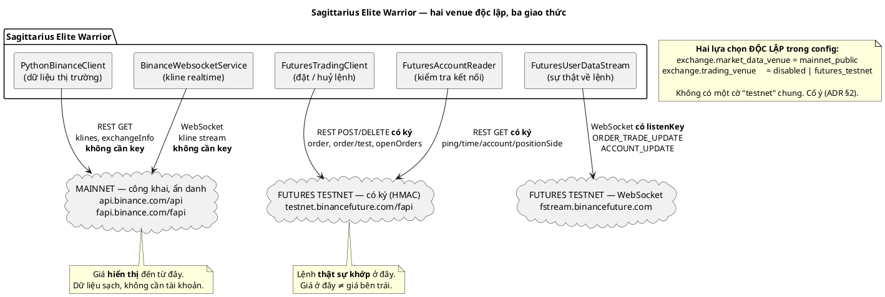
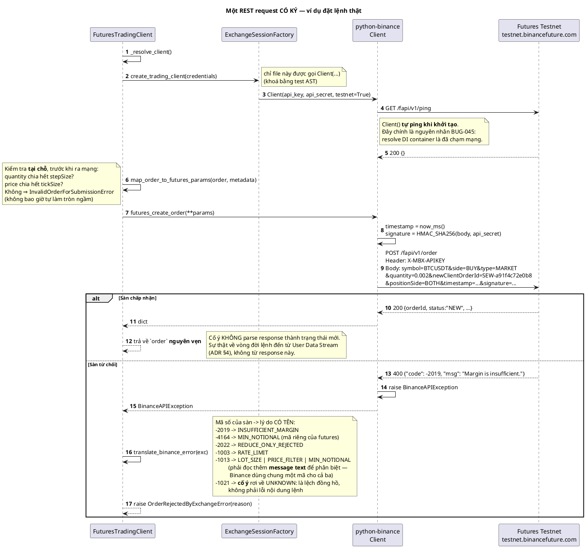
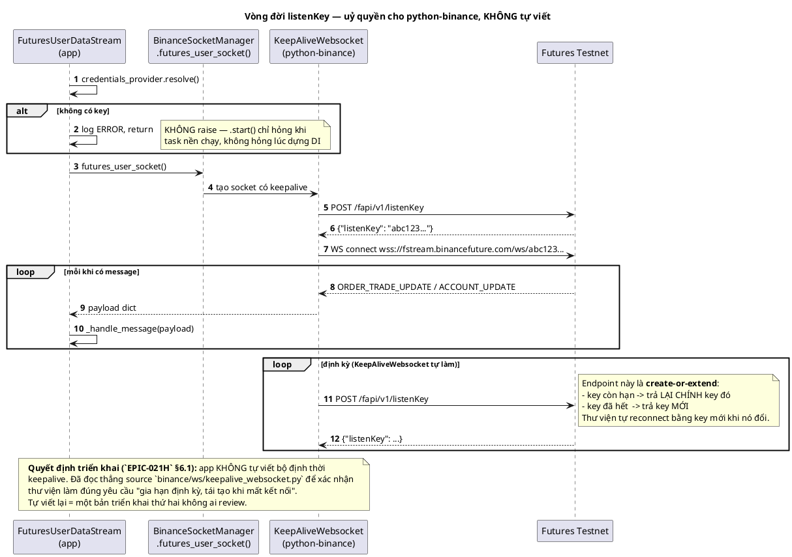
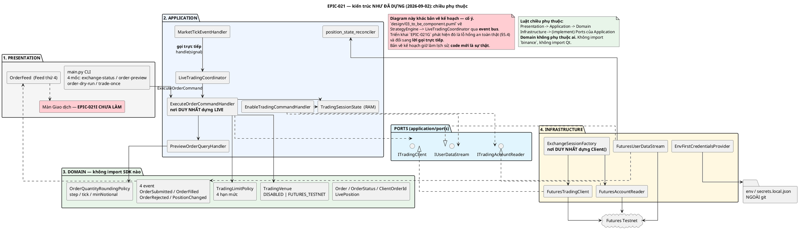
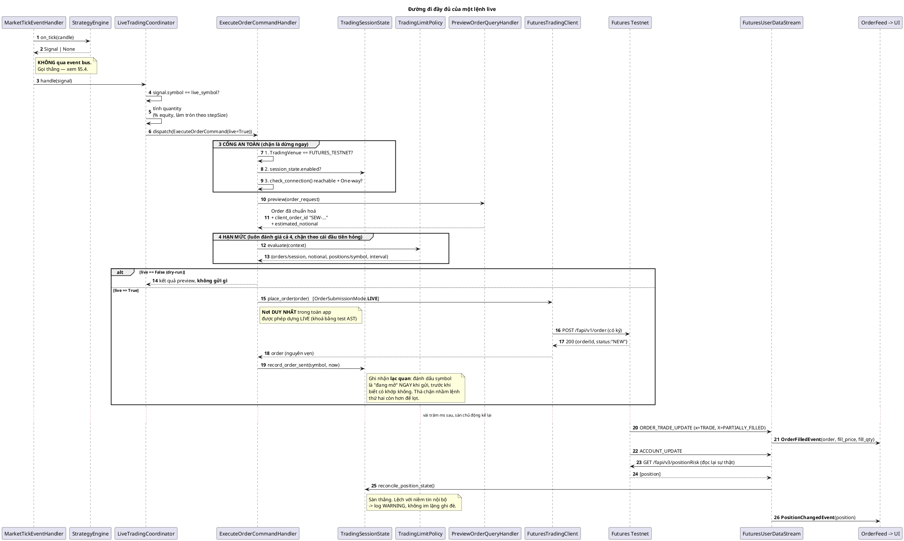
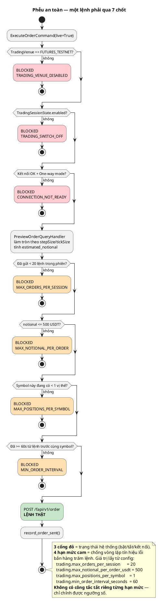
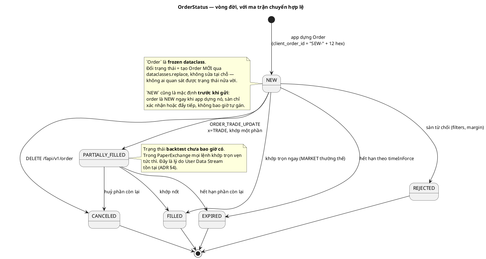
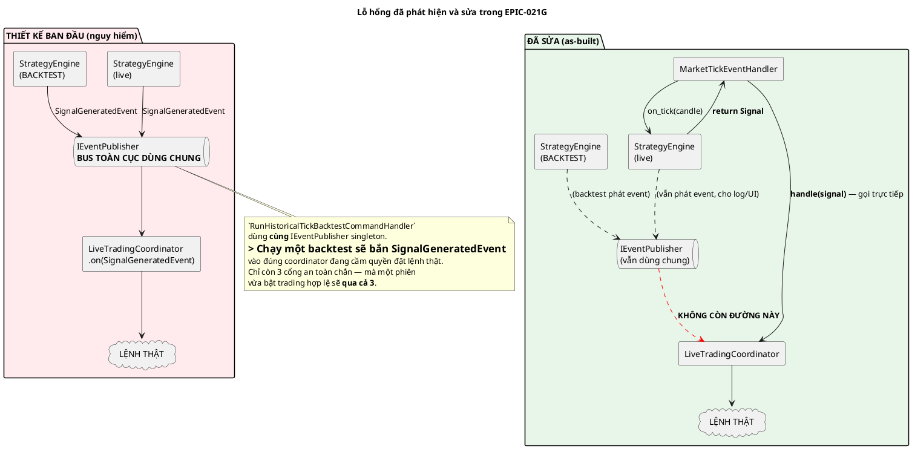
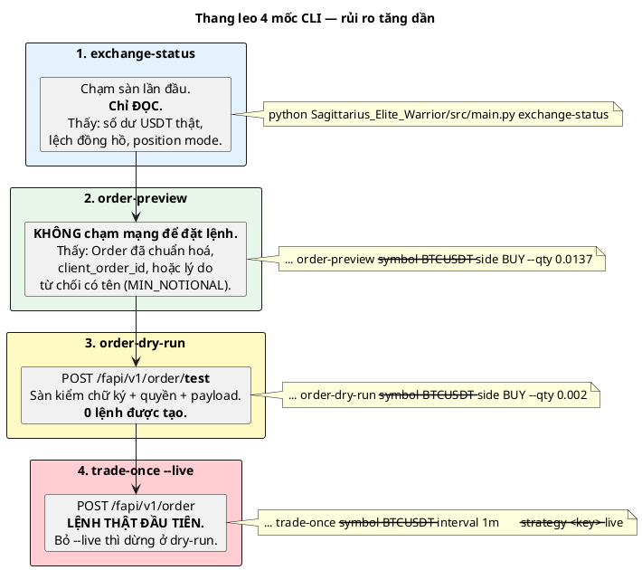
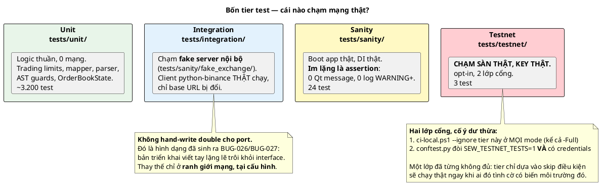

# Từ 0 đến Hero — Giao dịch Binance Futures Testnet trong Sagittarius Elite Warrior

> **Đối tượng:** tech lead / dev chưa từng làm việc với sàn crypto, cần hiểu **toàn bộ** tính năng
> giao dịch testnet của app này: sàn hoạt động ra sao, app nói chuyện với nó bằng giao thức gì,
> component nào chịu trách nhiệm gì, một lệnh đi qua những đâu, và bắt đầu dev từ lệnh nào.
>
> **Nguồn:** viết từ **code thật** đang có trong repo (đã đọc lại từng file khi soạn, không viết
> theo trí nhớ hay theo task file — chỗ nào task file khác code, tài liệu này lấy **code**).
>
> **Ngày:** 2026-09-02 · **Trạng thái epic:** 10/12 task con xong (còn `EPIC-021I`, `EPIC-021K`).

---

## 0. Đọc theo thứ tự nào

| Bạn muốn biết | Đọc phần |
| :--- | :--- |
| Testnet là cái gì, khác mainnet chỗ nào | **I** |
| App gửi HTTP/WebSocket kiểu gì tới sàn | **II** |
| File nào giữ trách nhiệm nào | **III** |
| Một lệnh đi từ nến đến khớp như thế nào | **IV** |
| Vì sao thiết kế nhiều rào chắn thế | **V** |
| Tôi muốn chạy thử ngay bây giờ | **VI** |
| Còn thiếu gì để xong epic | **VII** |

Tài liệu gốc bắt buộc đọc kèm: [`DECISION_2026-09-01_moi_truong_san_va_duong_di_lenh.md`](DECISION_2026-09-01_moi_truong_san_va_duong_di_lenh.md)
(ADR — **vì sao** chọn như vậy) và [`README.md`](README.md) (bảng 12 task con + trạng thái).

---

# PHẦN I — NỀN TẢNG: Binance Futures Testnet là gì

## 1.1 Testnet là bản sao của sàn thật, chạy bằng tiền giả

Binance vận hành **hai hệ thống tách biệt hoàn toàn**:

| | Mainnet | Futures Testnet |
| :--- | :--- | :--- |
| Host REST | `https://fapi.binance.com/fapi` | `https://testnet.binancefuture.com/fapi` |
| Host WebSocket | `wss://fstream.binance.com/` | `wss://fstream.binancefuture.com/` |
| Tài khoản | tài khoản Binance thật của bạn | tài khoản **riêng**, đăng ký ở `testnet.binancefuture.com` |
| API key | key thật | key **riêng, không dùng chéo được** |
| Tiền | thật | USDT giả, sàn tự cấp |
| Giá | thị trường thật | sổ lệnh riêng của testnet — **trôi lệch giá thật** |
| Độ bền dữ liệu | vĩnh viễn | **bị reset định kỳ** (mất key, mất vị thế, mất lịch sử) |

Ba hệ quả thực tế cho dev:

1. **Key mainnet dùng cho testnet sẽ trả `-2015`** (`KEY_EXPIRED` trong app này) — không phải
   "key hết hạn" theo nghĩa đen, mà là "key này không hợp lệ ở hệ thống này". Đây là lỗi phổ biến
   số một khi mới bắt đầu.
2. **Testnet reset ⇒ 401/`-2015` đột ngột** dù hôm qua vẫn chạy. Không phải bug của app.
   `EPIC-021D` phân biệt tường minh 6 nhóm lỗi (§2.2 bên dưới) đúng vì lý do này.
3. **Giá testnet ≠ giá mainnet.** App này lấy **dữ liệu chart từ mainnet** (công khai, không cần
   key, dữ liệu sạch) nhưng **đặt lệnh trên testnet** — nên giá bạn nhìn thấy không phải giá bạn
   khớp. Đó là một quyết định có chủ đích (ADR §2), và `EPIC-021K` sẽ dựng banner cảnh báo
   thường trực về nó.

## 1.2 Vì sao **USD-M Futures**, không phải Spot

Quyết định của ADR §1, có lý do kỹ thuật cứng chứ không phải sở thích:

- Mô hình khớp lệnh mô phỏng của repo (`PaperExchange`) **đã là mô hình futures từ lâu**:
  có `PositionSide.SHORT`, `long_leverage`/`short_leverage`, `MarginRiskPolicy` tính margin.
- `SignalAction` đã có `SHORT`/`COVER`, và `EmaTrendPullbackStrategy` **đang thật sự phát tín
  hiệu SHORT**.
- Spot **không short được** ⇒ một nửa hành vi backtest đã kiểm chứng sẽ không có đường ra sàn.
  Backtest và live sẽ nói hai ngôn ngữ khác nhau — đúng loại lệch mà `StrategyEngine` được thiết
  kế để không bao giờ xảy ra.

**Cái giá đã chấp nhận:** futures kéo theo position mode, margin type, leverage, funding rate,
và khả năng bị **thanh lý**. Epic xử lý 3 cái đầu tường minh; funding rate và mô hình thanh lý
được ghi nhận **chưa làm** (ADR §6) — xem Phần VII.

**COIN-M và Options nằm ngoài phạm vi** — `python-binance` có endpoint cho chúng, nhưng "thư viện
có hàm" không phải lý do để hỗ trợ.

## 1.3 Từ vựng bắt buộc (5 khái niệm, thiếu cái nào cũng đọc code không hiểu)

| Khái niệm | Nghĩa | Vì sao app quan tâm |
| :--- | :--- | :--- |
| **Position mode** | `One-way` (một symbol = một vị thế, LONG hoặc SHORT) vs `Hedge` (giữ đồng thời cả hai chiều) | Toàn bộ epic **giả định One-way**. Phát hiện Hedge ⇒ **từ chối chạy tiếp**, không chạy nửa vời (`HEDGE_MODE_UNSUPPORTED`) |
| **Margin type** | `Cross` (dùng chung số dư toàn tài khoản) vs `Isolated` (khoá margin riêng từng vị thế) | Chỉ **đọc và hiển thị**; app chưa tự đổi |
| **Leverage** | đòn bẩy theo từng symbol (vd 10x) | Đường live hiện hardcode `1.0` — nút chỉnh thuộc `EPIC-021I` |
| **Liquidation price** | giá mà tại đó sàn tự đóng vị thế do hết margin | Đọc từ sàn và hiển thị (`LivePosition.liquidation_price`); **app không tự mô hình hoá** |
| **Filters** | ràng buộc mỗi symbol: `stepSize` (bội số khối lượng), `tickSize` (bội số giá), `minNotional` (giá trị tối thiểu 1 lệnh) | Sai bất kỳ cái nào ⇒ sàn trả `-1013`. App làm tròn **trước khi gửi** (`EPIC-021C`) |

Ví dụ filters thật của `BTCUSDT` trên testnet: `stepSize=0.001`, `tickSize=0.10`,
`minNotional=100`. Nghĩa là: khối lượng phải là bội của `0.001`; giá phải là bội của `0.10`; và
`khối lượng × giá ≥ 100 USDT`. Gửi `0.0137 BTC` sẽ bị từ chối — phải làm tròn **xuống** `0.013`.

## 1.4 Bản đồ tổng thể: hai venue, ba giao thức



---

# PHẦN II — GIAO THỨC: app nói chuyện với sàn thế nào

App **không tự viết HTTP client**. Nó dùng thư viện `python-binance`, và chỉ một file duy nhất
được phép khởi tạo `binance.client.Client` — `ExchangeSessionFactory`, khoá bằng một test AST
quét toàn `src/`+`scripts/`. Nhưng bạn vẫn phải hiểu giao thức bên dưới để đọc log và debug.

## 2.1 REST: hai loại request

| Loại | Cần key? | Ví dụ | Ai gọi trong app |
| :--- | :---: | :--- | :--- |
| **Public** | Không | `GET /fapi/v1/klines`, `GET /fapi/v1/exchangeInfo`, `GET /fapi/v1/ping` | `PythonBinanceClient`, `FuturesMetadataProvider` |
| **Signed** | **Có** | `POST /fapi/v1/order`, `GET /fapi/v2/account`, `GET /fapi/v3/positionRisk` | `FuturesTradingClient`, `FuturesAccountReader` |

Request **signed** phải mang thêm 3 thứ, và `python-binance` tự làm cả 3:

1. Header `X-MBX-APIKEY: <api_key>`
2. Tham số `timestamp` (millis) và `recvWindow` (mặc định 5000ms) — sàn từ chối nếu
   `timestamp` lệch quá `recvWindow` so với giờ server ⇒ lỗi `-1021` (`CLOCK_SKEW`).
3. Tham số `signature` = **HMAC-SHA256** của toàn bộ query string / form body, ký bằng
   `api_secret`. Sai ⇒ `-1022` (`BAD_SIGNATURE`).

> **Chi tiết dễ vấp:** `python-binance` gửi tham số của `GET` qua **query string**, nhưng của
> `POST`/`PUT`/`DELETE` qua **form body** (`application/x-www-form-urlencoded`) — không phải
> JSON. Fake server của repo (`tests/sanity/fake_exchange/server.py`) parse đúng theo hai cách
> đó, vì thế nó mới chạy được với client thật không sửa dòng nào.



## 2.2 WebSocket 1 — kline công khai (đã có từ trước epic này)

`BinanceWebsocketService` mở stream nến realtime từ **mainnet**, không cần key. Hỏng cái này
chỉ làm **chart đứng**. Đây là lý do nó là một file riêng, không gộp với stream dưới đây.

## 2.3 WebSocket 2 — **User Data Stream** (trái tim của `EPIC-021H`)

Đây là kênh sàn **chủ động kể lại** chuyện gì xảy ra với tiền của bạn. Hai loại message:

| Message | Khi nào | App làm gì |
| :--- | :--- | :--- |
| `ORDER_TRADE_UPDATE` | mỗi lần trạng thái lệnh đổi: `NEW` → `PARTIALLY_FILLED` → `FILLED`, hoặc `CANCELED`/`EXPIRED` | Parse thành `Order`; nếu là **khớp thật** (`x == "TRADE"`) thì phát `OrderFilledEvent` |
| `ACCOUNT_UPDATE` | mỗi lần số dư / vị thế đổi | Đọc lại vị thế **thật** qua REST rồi phát `PositionChangedEvent` + đối chiếu state |

**Vì sao cần nó, response của lệnh chưa đủ?** Vì response `POST /fapi/v1/order` chỉ nói *"sàn đã
nhận"*. Một lệnh MARKET có thể khớp **nhiều mức giá**, khớp **một phần**, bị huỷ sau đó vì thiếu
margin, hoặc vị thế bị đổi bởi **tác nhân khác** (bạn bấm tay trên web, một phiên app khác).
`PARTIALLY_FILLED` là thứ **backtest chưa bao giờ có** — trong mô phỏng mọi lệnh khớp trọn vẹn
tức thì.

**listenKey** là vé vào cửa của stream này:



> **Rủi ro nếu làm sai (và vì sao phải hiểu):** reconnect bằng listenKey đã hết hạn sẽ **nối
> được nhưng không nhận được gì** — dạng hỏng im lặng tệ nhất. App tưởng mình đang theo dõi
> lệnh, thực ra đang mù.

## 2.4 Toàn bộ endpoint app này thật sự gọi

Đây là danh sách **đã verify bằng cách đọc source `python-binance`**, không phải chép từ docs
Binance (docs không phải lúc nào cũng khớp version thư viện đang cài):

| Method | Path | Hàm `python-binance` | Ai gọi |
| :--- | :--- | :--- | :--- |
| GET | `/fapi/v1/ping` | ctor `Client()` | mọi client (tự ping khi dựng) |
| GET | `/fapi/v1/time` | `futures_time()` | `FuturesAccountReader` (lệch đồng hồ) |
| GET | `/fapi/v1/exchangeInfo` | `futures_exchange_info()` | `FuturesMetadataProvider` (filters) |
| GET | `/fapi/v1/klines` | kline generator | dữ liệu nến |
| GET | `/fapi/v2/account` | `futures_account()` — **v2** | số dư USDT |
| GET | `/fapi/v1/positionSide/dual` | `futures_get_position_mode()` | phát hiện Hedge mode |
| GET | `/fapi/v3/positionRisk` | `futures_position_information()` — **v3** | `get_positions()` |
| GET | `/fapi/v1/openOrders` | `futures_get_open_orders()` | `get_open_orders()` |
| POST | `/fapi/v1/order/test` | `futures_create_test_order()` | **dry-run** (`VALIDATE_ONLY`) |
| POST | `/fapi/v1/order` | `futures_create_order()` | **lệnh thật** (`LIVE`) |
| DELETE | `/fapi/v1/order` | `futures_cancel_order()` | huỷ 1 lệnh |
| DELETE | `/fapi/v1/allOpenOrders` | `futures_cancel_all_open_orders()` | huỷ tất cả |
| POST/PUT | `/fapi/v1/listenKey` | `futures_stream_get_listen_key()` / `_keepalive()` | User Data Stream |

> ⚠️ Chú ý hai số version dễ sai: `account` là **v2**, `positionRisk` là **v3**. Bản nháp thiết
> kế của task ghi `positionRisk` là v2 — **sai**; code lấy theo `client.py` thật.

---

# PHẦN III — KIẾN TRÚC: component nào làm gì

## 3.1 Bản đồ component (AS-BUILT, không phải bản vẽ kế hoạch)



## 3.2 Bốn Port, và vì sao `ITradingClient` tách khỏi `IExchangeClient`

| Port | Trách nhiệm | Ai implement |
| :--- | :--- | :--- |
| `IExchangeClient` | **chỉ đọc** dữ liệu thị trường (kline, danh sách symbol) | `PythonBinanceClient` |
| `ITradingAccountReader` | **chỉ đọc** trạng thái tài khoản (số dư, position mode, lệch giờ) — **không bao giờ raise**, luôn trả `ExchangeConnectionStatus` có tên lỗi | `FuturesAccountReader` |
| `ITradingClient` | **ghi**: đặt / huỷ lệnh, đọc vị thế & lệnh mở | `FuturesTradingClient` |
| `IUserDataStream` | mở/đóng kênh sự thật từ sàn | `FuturesUserDataStream` |

> **Vì sao không nhét `place_order` vào `IExchangeClient` cho gọn?** Vì hai thứ có **hậu quả
> khi hỏng** hoàn toàn khác nhau: hỏng đọc kline = chart đứng; hỏng đặt lệnh = mất tiền. Trộn
> chúng nghĩa là mọi consumer chỉ cần đọc chart cũng **cầm trong tay** khả năng đặt lệnh. Đây là
> áp dụng trực tiếp `architecture-rule.md` §5.5: *"đổi cái này có bắt buộc phải sửa cái kia
> không?"* — không.

Một chi tiết DI quan trọng, đã suýt gây crash 3 lần trong epic:

> `ITradingClient` chỉ được **đăng ký có điều kiện** (khi `TradingVenue != DISABLED`).
> Vì thế `EnableTradingCommandHandler`, `ExecuteOrderCommandHandler` và `FuturesUserDataStream`
> **không** phụ thuộc nó trực tiếp — chúng nhận `session_factory` + `credentials_provider` +
> `metadata_provider` (luôn có) và **tự dựng** `FuturesTradingClient` bên trong. Nếu không,
> chúng sẽ không **dựng được** khi trading tắt — mà chính chúng là nơi phải báo cáo
> "trading đang tắt". Ngược lại `IUserDataStream` đăng ký **vô điều kiện** (chỉ đọc, cùng nhóm
> rủi ro với `ITradingAccountReader`).

---

# PHẦN IV — ĐƯỜNG ĐI CỦA MỘT LỆNH

## 4.1 Từ một cây nến đến một lệnh khớp thật



## 4.2 Phễu an toàn: 3 cổng + 4 hạn mức



**Chi tiết Boundary Value Analysis đã cân nhắc kỹ** (đọc `trading_limit_policy.py`):

| Hạn mức | Toán tử | Nghĩa tại biên |
| :--- | :---: | :--- |
| `max_orders_per_session` | `<` | Đã gửi đúng 20 ⇒ **chặn** lệnh 21 |
| `max_notional_per_order` | `<=` | notional đúng bằng 500 ⇒ **cho qua** |
| `max_positions_per_symbol` | `<` | đang có đúng 1 vị thế ⇒ **chặn** lệnh mới |
| `min_order_interval` | `>=` | đúng 60s từ lệnh trước ⇒ **cho qua**; chưa từng gửi ⇒ luôn qua |

## 4.3 Vòng đời một `Order`



Ma trận này được **thực thi bằng hàm** `is_valid_transition(current, target)`, không phải quy
ước ai cũng phải nhớ. Hai chi tiết dễ bỏ sót:

- **4 trạng thái kết thúc không có đích hợp lệ nào — kể cả chính nó.** Quan sát lại một trạng
  thái kết thúc không đổi là chuyện idempotency của caller, không phải một "transition".
- **Không có `PARTIALLY_FILLED → PARTIALLY_FILLED`.** Khớp thêm một phần nữa không đi qua hàm
  này; nó là một `OrderFilledEvent` mới mang `fill_price`/`fill_quantity` của **lần khớp đó**
  (đọc từ `"L"`/`"l"` trong payload, **không** phải tổng luỹ kế `"ap"`/`"z"`).

## 4.4 `VALIDATE_ONLY` vs `LIVE` — một tham số constructor, không phải cờ mỗi lần gọi

```
OrderSubmissionMode.VALIDATE_ONLY  ->  POST /fapi/v1/order/test   (sàn kiểm, KHÔNG tạo lệnh)
OrderSubmissionMode.LIVE           ->  POST /fapi/v1/order        (lệnh THẬT)
```

Đây là **tham số constructor** của `FuturesTradingClient`, cố ý không phải tham số mỗi lần gọi:
một instance chỉ phục vụ đúng một chế độ suốt đời nó. Không thể "lỡ tay truyền nhầm cờ" ở một
call site nào đó.

`/fapi/v1/order/test` xác thực **đầy đủ**: chữ ký, quyền của key, và toàn bộ payload (filters,
minNotional) — nhưng không bao giờ đưa vào matching engine. Đó là lý do `order-dry-run` là mốc
kiểm tra **cực kỳ giá trị**: nó chứng minh mọi thứ đúng, trừ việc mất tiền.

---

# PHẦN V — AN TOÀN: vì sao thiết kế như vậy

## 5.1 `TradingVenue` **không có** member `MAINNET`

```python
class TradingVenue(str, Enum):
    DISABLED = "disabled"
    FUTURES_TESTNET = "futures_testnet"
```

Không phải "mainnet bị tắt bằng config" — mà là **không tồn tại như một lựa chọn trong kiểu dữ
liệu**. Muốn giao dịch mainnet phải sửa code + review, không phải sửa một dòng JSON. Rào an toàn
bằng **type**, không bằng cấu hình (ADR §3).

Config sai/thiếu ⇒ mặc định `DISABLED`, **có log WARNING**, không bao giờ mặc định về testnet.

## 5.2 Công tắc giao dịch **luôn bắt đầu TẮT**, mỗi phiên

`TradingSessionState` là singleton trong RAM, **cố ý không đọc** giá trị đã lưu của
`trading.enabled` lúc boot. Đây là **ngoại lệ có chủ đích duy nhất** với quy ước "nhớ thứ user
đặt lần trước" của `EPIC-010`:

> Mở app lên không bao giờ được ở trạng thái sẵn sàng bắn lệnh.

## 5.3 Reconciliation: bật giao dịch là một **hành động có hệ quả**

`EnableTradingCommand` không phải cái checkbox. Khi bật:

1. Đọc **toàn tài khoản** (`get_positions()` / `get_open_orders()` **không truyền symbol**).
2. Nếu sàn đang có **bất kỳ vị thế nào** ⇒ **từ chối bật**, trả về danh sách vị thế đó.
   App **không bao giờ** tự nhận (auto-adopt) hay tự đóng vị thế nó không mở.
3. Chỉ khi tài khoản sạch mới `enable()` và `IUserDataStream.start()`.

## 5.4 Bẫy thật đã tránh: **backtest suýt bắn được lệnh thật**

Đây là phát hiện an toàn nghiêm trọng nhất của cả epic, đáng để mọi dev trong team biết.



Cách sửa: `StrategyEngine.on_tick()` **vốn đã return** `Signal` cho caller. `MarketTickEventHandler`
gọi thẳng `LiveTradingCoordinator.handle(signal)` với giá trị đó, **không đụng bus**. Không code
path nào của backtest chạm tới class này nữa.

Ghi chú: phát hiện này **không** đến từ một test đỏ — nó đến từ việc đọc kỹ code khởi tạo của
`RunHistoricalTickBacktestCommandHandler` trước khi nối dây. Bài học: với đường đi tiền thật,
đọc chéo call graph trước khi tin vào bản vẽ.

## 5.5 Guard tự động — luật được **thực thi**, không phải quy ước truyền miệng

| Guard | Cấm gì | File |
| :--- | :--- | :--- |
| AST scan | Chỉ `ExecuteOrderCommandHandler` được viết `OrderSubmissionMode.LIVE` | `tests/unit/infrastructure/binance/test_order_submission_mode_live_is_restricted.py` |
| AST scan | Chỉ `ExchangeSessionFactory` được gọi `binance.client.Client(...)` | `test_only_the_session_factory_constructs_binance_client.py` |
| AST scan | `ui/qml/` không được import `ui/screens/` (`EPIC-021L`, đóng `BUG-082`) | `test_qml_library_does_not_import_screens.py` |

Cả 3 đều quét **node AST**, không quét text — nên docstring **giải thích** luật không tự vi phạm
luật đó. Cả 3 đều có test "mutation-verify" chứng minh guard thật sự bắt được vi phạm.

## 5.6 Secret không bao giờ vào git

Thứ tự ưu tiên (`EnvFirstCredentialsProvider`): **biến môi trường** → `secrets.local.json`
(đã `.gitignore`) → không có. `ExchangeCredentials` được thiết kế để `repr()`/`str()`/f-string/
traceback **đều không rò** secret — có test kiểm cả 4 đường.

---

# PHẦN VI — BẮT ĐẦU DEV: 30 phút đầu tiên

## 6.1 Lấy key Futures Testnet

1. Vào `https://testnet.binancefuture.com`, đăng nhập (tài khoản **riêng**, không phải tài khoản
   Binance thật).
2. Vào mục API Key ⇒ lấy `API Key` + `API Secret`.
3. Sàn tự cấp USDT giả (thường ~15.000).
4. Kiểm tra **position mode phải là One-way** (mục Preference). Hedge mode ⇒ app từ chối chạy.

## 6.2 Cấu hình

**Cách 1 — biến môi trường (khuyên dùng, không để secret lên đĩa):**

```bash
export BINANCE_FUTURES_TESTNET_API_KEY="..."
export BINANCE_FUTURES_TESTNET_API_SECRET="..."
```

**Cách 2 — file (đã gitignore):** `src/config/secrets.local.json`

Rồi bật venue giao dịch trong `src/config/user_config.json`:

```json
{ "exchange": { "trading_venue": "futures_testnet" } }
```

Kiểm tra cấu hình đang thắng ở nguồn nào (chạy được cả khi **chưa** có key):

```bash
PYTHONPATH=. .venv/bin/python Sagittarius_Elite_Warrior/scripts/epic021b_credentials_probe.py
```

## 6.3 Bốn mốc CLI — chạy **đúng thứ tự này**, mỗi mốc nguy hiểm hơn mốc trước



> ⚠️ **`trade-once` hiện KHÔNG tự gọi `EnableTradingCommand`.** Nó đi thẳng vào
> `ExecuteOrderCommand`, mà cổng an toàn số 2 đòi `session_state.enabled == True`. Hiện chưa có
> CLI nào bật công tắc đó — nó sẽ đến cùng **màn Giao dịch (`EPIC-021I`)**. Đây là một khoảng
> trống đã biết, ghi trong `EPIC-021H` §6.6, không phải bug.

Quan sát sàn kể lại vòng đời lệnh, ở terminal thứ hai:

```bash
PYTHONPATH=. .venv/bin/python \
  Sagittarius_Elite_Warrior/scripts/epic021h_user_stream_probe.py --seconds 120
```

## 6.4 Chạy test — 4 tier, biết tier nào chứng minh cái gì



Lệnh chạy (cổng đầy đủ, **không** chạm sàn thật):

```powershell
.\scripts\ci-local.ps1 -Full
```

Chạy tier testnet **có chủ đích**:

```powershell
$env:SEW_TESTNET_TESTS = "1"
.\scripts\ci-local.ps1 -TestnetOnly
```

Thiếu điều kiện ⇒ **skip với lý do phân biệt được**, không đỏ:

```text
SKIPPED [1] thiếu SEW_TESTNET_TESTS=1 — tier này không chạy trong CI thường
SKIPPED [1] có SEW_TESTNET_TESTS=1 nhưng không tìm thấy credentials Futures Testnet
```

> **Luật đọc kết quả CI (`ONBOARDING.md` §5):** `ci-local.ps1` in ra `LOG_FILE:`. Phải `grep`
> file đó cho `FAILED|ERROR|Traceback|ResourceWarning` rồi mới được nói "xanh". Ở chế độ
> offscreen, Qt xả nhiều `TypeError` **vô hại** ra stderr **sau** dòng tổng kết pytest — `| tail`
> sẽ cho bạn xem nhầm đống nhiễu đó.

---

# PHẦN VII — CÒN LẠI GÌ

## 7.1 Hai task con chưa xong

| Task | Nội dung | Chặn bởi |
| :--- | :--- | :--- |
| **`EPIC-021I`** | **Màn hình Giao dịch mới**: bảng vị thế, bảng lệnh chờ, công tắc bật giao dịch, thẻ tài khoản | Đang chờ **mockup** từ user (task file yêu cầu hỏi trước, không tự sinh lại) |
| **`EPIC-021K`** | Banner môi trường toàn cục + **Emergency Stop** + trade marker trên chart | `EPIC-021I` |

`EPIC-021I` cũng là nơi sẽ có CLI/UI để gọi `EnableTradingCommand` — mắt xích còn thiếu ở §6.3.

## 7.2 Đã ghi nhận là **chưa mô hình hoá** (cố ý, ADR §6)

- **Funding rate** — futures perpetual tính phí funding mỗi 8h. App chưa tính.
- **Mô hình thanh lý** — app **đọc và hiển thị** `liquidationPrice` từ sàn nhưng không tự tính,
  không cảnh báo khi giá tiến gần.
- **Đổi leverage / margin type từ app** — chỉ đọc.
- **Multi-symbol live** — `StrategyEngine` giữ state chỉ số có thể thay đổi (EMA...); nạp nến
  hai symbol vào một engine sẽ **làm hỏng state**. Muốn đa symbol phải một engine mỗi symbol.

---

# PHỤ LỤC A — Bản đồ file

| Tầng | File | Trách nhiệm |
| :--- | :--- | :--- |
| Domain | `domain/trading/order.py` | `Order` frozen dataclass |
| | `domain/trading/order_status.py` | `OrderStatus` + ma trận chuyển hợp lệ |
| | `domain/trading/client_order_id.py` | sinh `SEW-` + 12 hex (≤36 ký tự) |
| | `domain/trading/live_position.py` | `LivePosition`, `LiquidationPrice` |
| | `domain/trading/order_submission_mode.py` | `VALIDATE_ONLY` \| `LIVE` |
| | `domain/trading/order_rejection_reason.py` | 7 lý do từ chối có tên |
| | `domain/trading/policies/trading_limit_policy.py` | 4 hạn mức |
| | `domain/value_objects/trading_venue.py` | `DISABLED` \| `FUTURES_TESTNET` |
| | `domain/value_objects/exchange_connection_status.py` | 6 `ConnectionFailureKind` |
| | `domain/events/order_*.py`, `position_changed_event.py` | 4 event |
| Application | `application/ports/i_trading_client.py` | port ghi |
| | `application/ports/i_trading_account_reader.py` | port đọc tài khoản |
| | `application/ports/i_user_data_stream.py` | port stream |
| | `application/services/trading_session_state.py` | state RAM, luôn khởi đầu tắt |
| | `application/services/live_trading_coordinator.py` | Signal → ExecuteOrderCommand |
| | `application/services/position_state_reconciler.py` | sàn thắng, lệch thì WARNING |
| | `application/use_cases/trading/enable_trading/` | bật + reconcile |
| | `application/use_cases/trading/execute_order/` | 3 cổng + 4 hạn mức + LIVE |
| | `application/event_handlers/.../market_tick_event_handler.py` | gọi thẳng coordinator |
| Infrastructure | `infrastructure/binance/exchange_session_factory.py` | **nơi duy nhất** dựng `Client()` |
| | `infrastructure/binance/futures_trading_client.py` | đặt/huỷ/đọc lệnh & vị thế |
| | `infrastructure/binance/futures_account_reader.py` | `check_connection()` |
| | `infrastructure/binance/futures_user_data_stream.py` | User Data Stream |
| | `infrastructure/binance/futures_order_payload_mapper.py` | domain ↔ payload Binance |
| | `infrastructure/binance/binance_error_translator.py` | mã lỗi → lý do có tên |
| | `infrastructure/binance/user_data_event_parser.py` | parse message stream |
| | `infrastructure/credentials/env_first_credentials_provider.py` | env → file → none |
| Presentation | `presentation/ui/common/order_feed.py` | Feed thứ 4 |
| | `presentation/cli/{order_preview,order_dry_run,trade_once}_cmd.py` | 4 mốc CLI |
| Test | `tests/sanity/fake_exchange/` | fake server nói giao thức Binance |
| | `tests/testnet/` | tier opt-in chạm sàn thật |
| Script | `scripts/epic021{a,b,c}_*_probe.py`, `epic021h_user_stream_probe.py` | 4 probe quan sát |

---

# PHỤ LỤC B — Render các diagram

Mọi diagram trong tài liệu này là mã PlantUML trong khối ` ```plantuml `. **Cả 10 diagram đã được
render thật khi soạn tài liệu này** (PlantUML 1.2024.7 + Graphviz 2.43) — không có lỗi cú pháp.

- **VS Code**: extension *PlantUML* (jebbs) → `Alt+D`.
- **Online**: dán vào `https://www.plantuml.com/plantuml`.
- **CLI** — trích toàn bộ 10 diagram từ chính file này rồi render một lượt:

  ```bash
  # cần: java + graphviz (apt-get install -y graphviz)
  #      plantuml.jar tải từ github.com/plantuml/plantuml/releases
  mkdir -p /tmp/kt && cd /tmp/kt
  python3 - <<'PY'
  import re, pathlib
  doc = pathlib.Path("Tasks/epics/EPIC-021_ket_noi_binance_futures_testnet/"
                     "KNOWLEDGE_TRANSFER_tu_0_den_hero.md").read_text(encoding="utf-8")
  for i, b in enumerate(re.findall(r"```plantuml\n(.*?)```", doc, re.S), 1):
      n = re.search(r"@startuml\s+(\S+)", b)
      pathlib.Path(f"{n.group(1) if n else i}.puml").write_text(b, encoding="utf-8")
  PY
  java -jar plantuml.jar -tpng -nometadata *.puml
  ```

> **Graphviz là bắt buộc** cho diagram dạng component/state (KT01, KT04, KT07, KT08, KT09, KT10).
> Thiếu nó, PlantUML vẫn tạo file PNG nhưng bên trong là **thông báo lỗi**, không phải diagram —
> một cái bẫy im lặng đáng biết. Diagram dạng sequence/activity (KT02, KT03, KT05, KT06) không
> cần Graphviz.
>
> Muốn chỉ kiểm cú pháp mà không render: `java -jar plantuml.jar -checkonly *.puml`
> (không in gì = không có lỗi).

Diagram **kế hoạch** của epic (as-is/to-be, vẽ trước khi code) nằm riêng ở
[`design/*.puml`](design/). **Lưu ý:** `03_to_be_component.puml` vẽ đường
`StrategyEngine → LiveTradingCoordinator` qua event bus — bản vẽ đó là **lịch sử kế hoạch**, đã
bị thay đổi khi triển khai vì lý do an toàn ở §5.4. Diagram trong tài liệu này là **as-built**.

---

## Ba câu hỏi kiểm tra bạn đã "hero" chưa

1. *Vì sao app đọc chart từ mainnet nhưng đặt lệnh ở testnet, và điều đó gây rủi ro gì?*
   → §1.1 + ADR §2. Rủi ro: giá nhìn thấy ≠ giá khớp; `EPIC-021K` phải dựng banner nói ra.
2. *Response của `POST /fapi/v1/order` trả `status: "NEW"` — vì sao app không dùng nó làm trạng
   thái lệnh?*
   → §2.3 + ADR §4. Vì response chỉ nói "đã nhận"; sự thật (khớp một phần, huỷ sau, bị tác nhân
   khác đổi) chỉ đến từ User Data Stream.
3. *Chạy một backtest có thể đặt lệnh thật không?*
   → §5.4. **Trước đây thiết kế cho phép**; đã sửa bằng lời gọi trực tiếp thay vì event bus.
