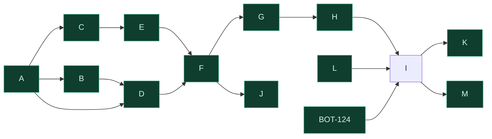
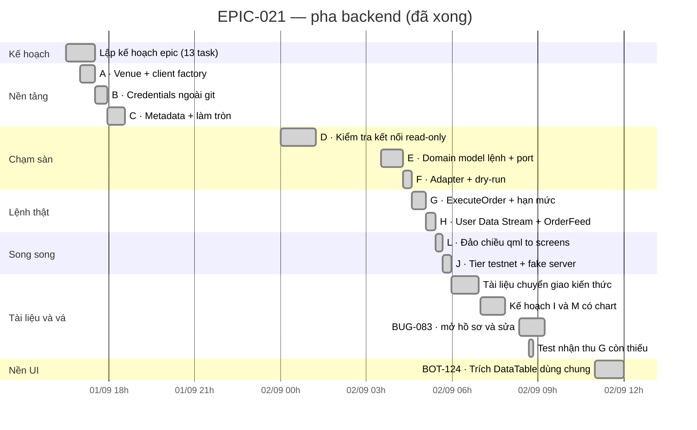
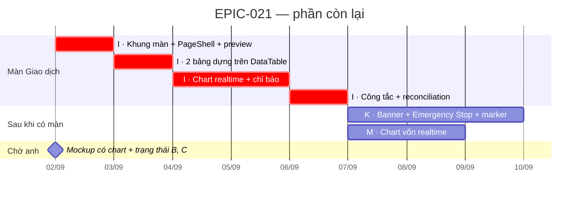

# EPIC-021 — Đang ở đâu, đi đâu tiếp

> Ảnh chụp **2026-09-02**. Số liệu lấy từ `git log` và file task thật, không phải ước lượng.
> Cập nhật lại file này khi một task đổi trạng thái.

---

## 1. Một đoạn tóm tắt

**13/13 task EPIC xong, cộng `BOT-124`. Toàn bộ epic đã dựng xong.**

> **Cập nhật 2026-09-02 (sau khi build `EPIC-021M`):** dòng Kanban/Gantt bên dưới vẽ trạng thái
> **trước** khi `M` xong — chưa vẽ lại toàn bộ sơ đồ, chỉ sửa số liệu ở bảng này cho đúng sự thật.
> `EPIC-021M`'s "kết quả xây dựng" đầy đủ nằm ở
> [`completed/EPIC-021M_chart_von_realtime.md`](completed/EPIC-021M_chart_von_realtime.md) §6.

Phần **nguy hiểm** (ký request, gửi lệnh thật, nghe sàn báo lệnh khớp, 3 rào an toàn + 4 hạn
mức) đã xong từ trước. `EPIC-021I` đóng phần **nhìn thấy được**: một màn hình mới (sổ lệnh, vị
thế, công tắc bật/tắt giao dịch, chart trực tiếp). `EPIC-021K` đóng phần **xuyên suốt cả 5
màn**: biết mình đang ở môi trường nào, một nút dừng khẩn cấp thật, và lệnh khớp hiện lên chart.
`EPIC-021M` đóng nốt phần cuối: đường vốn (equity) realtime trên chính màn Giao dịch, lấy mẫu
trực tiếp từ `ACCOUNT_UPDATE` — không request thêm, không bịa điểm.

| | |
| :--- | :--- |
| **Xong** | 13 task EPIC + `BOT-124` · 5 bug đóng (`BUG-080`/`081`/`082`/`083`/`086`) |
| **Còn lại** | 0 task EPIC — epic đã xong |
| **Đường găng** | — |
| **Chặn ngoài code** | Không còn |
| **Cổng bắt buộc** | ✅ PASS — xem `EPIC-021M` §6.4 cho lần chạy gần nhất |

---

## 2. Bảng Kanban

```mermaid
flowchart TB
  classDef done fill:#0f3d2e,stroke:#2f9e6e,color:#d7f5e6,rx:5,ry:5
  classDef ready fill:#3d3410,stroke:#c9a227,color:#fdf3d0,rx:5,ry:5
  classDef blocked fill:#3d1f1f,stroke:#c96a6a,color:#fadada,rx:5,ry:5
  classDef waiting fill:#1f2c3d,stroke:#5a8ac9,color:#dae7fa,rx:5,ry:5

  subgraph DONE["✅ XONG (14)"]
    direction TB
    L["L · Đảo chiều qml→screens<br/><i>đóng BUG-082</i>"]
    A["A · Venue + client factory<br/><i>đóng BUG-081</i>"]
    B["B · Credentials ngoài git<br/><i>1/2 BUG-080</i>"]
    C["C · Metadata + làm tròn"]
    D["D · Kiểm tra kết nối read-only<br/><i>đóng nốt BUG-080</i>"]
    E["E · Domain model lệnh + port"]
    F["F · Adapter Futures + dry-run"]
    G["G · ExecuteOrder + hạn mức<br/><i>lệnh thật đầu tiên</i>"]
    H["H · User Data Stream + OrderFeed"]
    I["I · Màn hình Giao dịch"]
    J["J · Tier testnet + fake server"]
    K["K · Banner + Emergency Stop + marker"]
    M["M · Chart vốn realtime"]
    T124["BOT-124 · Trích DataTable dùng chung<br/><i>420→253 dòng, 0 assert sửa</i>"]
  end

  subgraph WAIT["⏸️ CHỜ NGOÀI CODE (0)"]
    direction TB
    MOCK["Mockup — đã duyệt 2026-09-02<br/><i>xong</i>"]
  end

  class L,A,B,C,D,E,F,G,H,I,J,K,M,T124 done
  class MOCK done
```



---

## 3. Đồ thị phụ thuộc — đường găng đỏ

Toàn bộ epic đã xong — không còn task nào đang chờ.



`J` là nhánh cụt có chủ ý — nó là **hạ tầng kiểm thử**, không chặn ai. `L` cũng vậy, chỉ chặn `I`.

---

## 4. Gantt — chuyện đã thật sự xảy ra

Giờ thật, lấy từ `git log`. Cả pha backend gọn trong **~13 tiếng**, hai ngày.



**Điều đáng chú ý trong biểu đồ này:** khối "Tài liệu và vá" chiếm gần **một phần ba** thời gian
pha backend. Đó không phải lãng phí — `BUG-083` là cổng CI đỏ suốt 6 ngày, và 2 bài test nhận thu
của `G` là thứ `EPIC-021G` §4 yêu cầu nhưng chưa từng được viết. Nhưng nó nói một điều thật về
nhịp độ: **code nhanh hơn việc kiểm chứng code**.

---

## 5. Gantt — phần còn lại (ước lượng, không phải cam kết)

> ✅ **Đã xong thật, cả `I`/`K`/`M` — cùng ngày 2026-09-02.** Ước lượng dưới đây tính bằng **ngày**
> (`I` 5 ngày, `K` 3 ngày, `M` 2 ngày); thực tế cả ba xong trong cùng một phiên làm việc, tính bằng
> **giờ**. Giữ nguyên không xoá — cùng lý do §4 giữ nguyên Gantt thật: một ước lượng sai nói lên
> điều thật về cách ước lượng task UI trong repo này, không phải thứ để xoá đi cho gọn.

> ⚠️ **Đây là ước lượng, không có dữ liệu thật để dựa vào.** Cơ sở duy nhất: `EPIC-020` (`PageShell`,
> quy mô tương đương `I`). `BOT-124` — quy mô từng dùng làm cơ sở ước lượng — đã **xong thật**
> trong ~1 tiếng (§4), nhanh hơn nhiều so với ước lượng ban đầu; giữ nguyên độ dè dặt cho `I` vì
> nó lớn hơn hẳn (màn mới hoàn chỉnh, không phải một component). Task UI trong repo này **luôn**
> lâu hơn task backend cùng "kích cỡ" vì phải qua guard `preview.py`, test VM không cần GUI, và
> đối chiếu mockup.



`K` và `M` vẽ nối tiếp cho dễ đọc, nhưng **chạy song song được** — cả hai chỉ cần `I`.

---

## 6. Cái gì gõ được **ngay bây giờ**

Đây là phần trả lời trực tiếp "mất phương hướng": epic này **đã giao 6 lệnh chạy được**.

| Lệnh | Làm gì | Từ task |
| :--- | :--- | :---: |
| `exchange-status` | Ký 4 request thật tới Futures Testnet: ping, giờ sàn, số dư, chế độ vị thế | D |
| `order-preview` | Chuẩn hoá một lệnh (làm tròn theo `stepSize`/`tickSize` + kiểm `minNotional`) — **không gửi đi đâu** | E |
| `order-dry-run` | Gửi thật tới `POST /fapi/v1/order/test` — sàn kiểm chữ ký/quyền/payload rồi **không tạo gì** | F |
| `trade-once` | Chạy 1 vòng chiến lược, qua đủ 3 rào an toàn + 4 hạn mức. **DRY-RUN** trừ khi thêm `--live` | G |
| `trade-once --live` | Đặt lệnh **thật** trên testnet | G |
| `scripts/epic021h_user_stream_probe.py` | Nghe User Data Stream, in ra lệnh khớp/vị thế đổi theo thời gian thực | H |

```bash
# Kiểm tra nhanh mọi thứ còn sống:
PYTHONPATH=. Sagittarius_Elite_Warrior/.venv/bin/python \
  Sagittarius_Elite_Warrior/src/main.py exchange-status
```

Cộng thêm tier test opt-in của `J` — chạm sàn thật, gate hai lớp:

```bash
$env:SEW_TESTNET_TESTS = "1"
pwsh -NoProfile -File scripts/ci-local.ps1 -TestnetOnly
```

---

## 7. Nước đi tiếp theo

**Cả 13 task con + `BOT-124` đã xong — epic này không còn task nào để làm.** `EPIC-021I` (màn Giao
dịch), `EPIC-021K` (banner + Emergency Stop + trade marker), và `EPIC-021M` (chart vốn realtime)
đều xong 2026-09-02 — xem §6 của mỗi file cho danh sách file thật và phạm vi đã cắt. Cột `THỜI GIAN`
của bảng Lệnh chờ dùng giờ của sàn (`Order.order_time`); bảng dựng trên `DataTable` dùng chung
(`BOT-124`); Dev Board và màn Giao dịch đều vẽ marker lệnh khớp trên chart qua `OrderFeed`; màn
Giao dịch giờ có thêm chart vốn realtime, lấy mẫu từ `ACCOUNT_UPDATE` qua `EquityFeed`.

Việc còn lại không phải code:

- `BUG-086` (mở khi build `I`) **đã đóng cùng ngày** — `_handle_account_update()`'s nhánh vị thế
  đóng về 0 giờ phát `PositionClosedEvent` riêng (không tái dùng `PositionChangedEvent` với
  `position_amt=0` giả — vi phạm invariant `LivePosition`'s docstring đã ghi rõ), `OrderFeed` thêm
  signal `positionClosed`, `TradingPresenter` gỡ đúng dòng khỏi bảng. Xem
  [`bug_report/completed/BUG-086_...md`](../../bug_report/completed/BUG-086_position_changed_event_khong_ban_khi_dong_vi_the.md)
  §5.
- Phạm vi đã cắt có chủ đích ở `K` (script E2E thủ công cho Mốc 2, fake-server integration test
  riêng cho Emergency Stop — `EPIC-021K` §6.2) và `M` (rail chưa hiển thị số dư USDT — `EPIC-021M`
  §6.3) đều là việc để dành, không phải lỗ hổng chặn ai.
- **Mốc chạy được thật** (không phải test) cần credentials testnet thật và một máy có mạng ra
  ngoài — sandbox này không có, xem mỗi task file's §5 cho lệnh chính xác.
