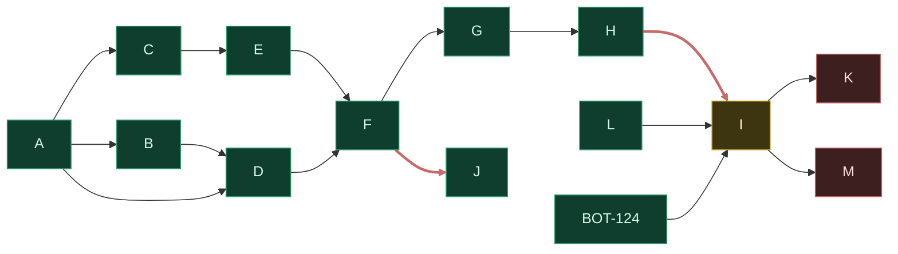
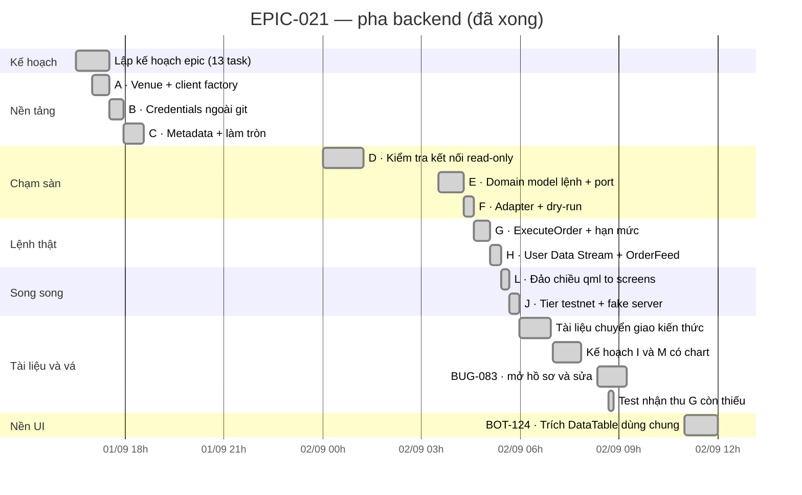
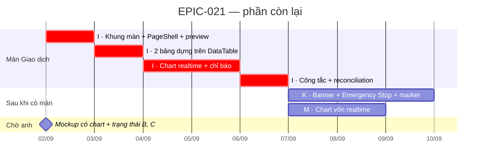

# EPIC-021 — Đang ở đâu, đi đâu tiếp

> Ảnh chụp **2026-09-02**. Số liệu lấy từ `git log` và file task thật, không phải ước lượng.
> Cập nhật lại file này khi một task đổi trạng thái.

---

## 1. Một đoạn tóm tắt

**10/13 task EPIC xong, cộng `BOT-124`. Toàn bộ đường đặt lệnh đã chạy được — nhưng chạy bằng CLI, chưa có gì trên UI.**

Nói cách khác: phần **nguy hiểm** (ký request, gửi lệnh thật, nghe sàn báo lệnh khớp, 3 rào an
toàn + 4 hạn mức) **đã xong và đã có bằng chứng chạy thật**. Phần **còn lại** là làm cho nó
*nhìn thấy được* — một màn hình mới, một banner, hai cái chart.

Nếu anh thấy mất phương hướng, gần như chắc chắn vì lý do này: 6 lệnh CLI chạy được nhưng mở app
lên thì **không thấy gì khác** so với tuần trước. Đó không phải thiếu sót — thứ tự này là cố ý
(`README.md` §4: xếp theo rủi ro tăng dần, làm phần nguy hiểm trước khi có UI để bấm nhầm).

| | |
| :--- | :--- |
| **Xong** | 10 task EPIC + `BOT-124` · 4 bug đóng (`BUG-080`/`081`/`082`/`083`) |
| **Còn lại** | 3 task EPIC — `I` sẵn sàng bắt đầu, `K`/`M` chặn bởi `I` |
| **Đường găng** | `EPIC-021I` → (`EPIC-021K`, `EPIC-021M`) |
| **Chặn ngoài code** | Không còn — mock đã duyệt (`EPIC-021I` §3.4) |
| **Cổng bắt buộc** | ✅ PASS — 3325 passed / 0 failed |

---

## 2. Bảng Kanban

```mermaid
flowchart TB
  classDef done fill:#0f3d2e,stroke:#2f9e6e,color:#d7f5e6,rx:5,ry:5
  classDef ready fill:#3d3410,stroke:#c9a227,color:#fdf3d0,rx:5,ry:5
  classDef blocked fill:#3d1f1f,stroke:#c96a6a,color:#fadada,rx:5,ry:5
  classDef waiting fill:#1f2c3d,stroke:#5a8ac9,color:#dae7fa,rx:5,ry:5

  subgraph DONE["✅ XONG (11)"]
    direction TB
    L["L · Đảo chiều qml→screens<br/><i>đóng BUG-082</i>"]
    A["A · Venue + client factory<br/><i>đóng BUG-081</i>"]
    B["B · Credentials ngoài git<br/><i>1/2 BUG-080</i>"]
    C["C · Metadata + làm tròn"]
    D["D · Kiểm tra kết nối read-only<br/><i>đóng nốt BUG-080</i>"]
    E["E · Domain model lệnh + port"]
    F["F · Adapter Futures + dry-run"]
    G["G · ExecuteOrder + hạn mức<br/><i>lệnh thật đầu tiên</i>"]
    H["H · User Data Stream + OrderFeed"]
    J["J · Tier testnet + fake server"]
    T124["BOT-124 · Trích DataTable dùng chung<br/><i>420→253 dòng, 0 assert sửa</i>"]
  end

  subgraph READY["🟢 SẴN SÀNG BẮT ĐẦU (1)"]
    direction TB
    I["I · Màn hình Giao dịch<br/><i>hết chặn — mock duyệt + DataTable xong</i>"]
  end

  subgraph BLOCKED["🔴 ĐANG BỊ CHẶN (2)"]
    direction TB
    K["K · Banner + Emergency Stop + marker<br/><i>chặn bởi I</i>"]
    M["M · Chart vốn realtime<br/><i>chặn bởi I</i>"]
  end

  subgraph WAIT["⏸️ CHỜ NGOÀI CODE (0)"]
    direction TB
    MOCK["Mockup — đã duyệt 2026-09-02<br/><i>xong</i>"]
  end

  class L,A,B,C,D,E,F,G,H,J,T124 done
  class I ready
  class K,M blocked
  class MOCK done
```



---

## 3. Đồ thị phụ thuộc — đường găng đỏ

Không phải mọi thứ còn lại đều nối tiếp nhau. `K` và `M` **song song được** sau khi `I` xong.



`J` là nhánh cụt có chủ ý — nó là **hạ tầng kiểm thử**, không chặn ai. `L` cũng vậy, chỉ chặn `I`.

---

## 4. Gantt — chuyện đã thật sự xảy ra

Giờ thật, lấy từ `git log`. Cả pha backend gọn trong **~13 tiếng**, hai ngày.



**Điều đáng chú ý trong biểu đồ này:** khối "Tài liệu và vá" chiếm gần **một phần ba** thời gian
pha backend. Đó không phải lãng phí — `BUG-083` là cổng CI đỏ suốt 6 ngày, và 2 bài test nhận thu
của `G` là thứ `EPIC-021G` §4 yêu cầu nhưng chưa từng được viết. Nhưng nó nói một điều thật về
nhịp độ: **code nhanh hơn việc kiểm chứng code**.

---

## 5. Gantt — phần còn lại (ước lượng, không phải cam kết)

> ⚠️ **Đây là ước lượng, không có dữ liệu thật để dựa vào.** Cơ sở duy nhất: `EPIC-020` (`PageShell`,
> quy mô tương đương `I`). `BOT-124` — quy mô từng dùng làm cơ sở ước lượng — đã **xong thật**
> trong ~1 tiếng (§4), nhanh hơn nhiều so với ước lượng ban đầu; giữ nguyên độ dè dặt cho `I` vì
> nó lớn hơn hẳn (màn mới hoàn chỉnh, không phải một component). Task UI trong repo này **luôn**
> lâu hơn task backend cùng "kích cỡ" vì phải qua guard `preview.py`, test VM không cần GUI, và
> đối chiếu mockup.



`K` và `M` vẽ nối tiếp cho dễ đọc, nhưng **chạy song song được** — cả hai chỉ cần `I`.

---

## 6. Cái gì gõ được **ngay bây giờ**

Đây là phần trả lời trực tiếp "mất phương hướng": epic này **đã giao 6 lệnh chạy được**.

| Lệnh | Làm gì | Từ task |
| :--- | :--- | :---: |
| `exchange-status` | Ký 4 request thật tới Futures Testnet: ping, giờ sàn, số dư, chế độ vị thế | D |
| `order-preview` | Chuẩn hoá một lệnh (làm tròn theo `stepSize`/`tickSize` + kiểm `minNotional`) — **không gửi đi đâu** | E |
| `order-dry-run` | Gửi thật tới `POST /fapi/v1/order/test` — sàn kiểm chữ ký/quyền/payload rồi **không tạo gì** | F |
| `trade-once` | Chạy 1 vòng chiến lược, qua đủ 3 rào an toàn + 4 hạn mức. **DRY-RUN** trừ khi thêm `--live` | G |
| `trade-once --live` | Đặt lệnh **thật** trên testnet | G |
| `scripts/epic021h_user_stream_probe.py` | Nghe User Data Stream, in ra lệnh khớp/vị thế đổi theo thời gian thực | H |

```bash
# Kiểm tra nhanh mọi thứ còn sống:
PYTHONPATH=. Sagittarius_Elite_Warrior/.venv/bin/python \
  Sagittarius_Elite_Warrior/src/main.py exchange-status
```

Cộng thêm tier test opt-in của `J` — chạm sàn thật, gate hai lớp:

```bash
$env:SEW_TESTNET_TESTS = "1"
pwsh -NoProfile -File scripts/ci-local.ps1 -TestnetOnly
```

---

## 7. Hai nước đi tiếp theo

| # | Việc | Vì sao trước | Chặn bởi |
| :-: | :--- | :--- | :--- |
| 1 | [`EPIC-021I`](incomplete/EPIC-021I_man_giao_dich_moi.md) — màn Giao dịch | Là thứ duy nhất biến 6 lệnh CLI thành một màn nhìn được. Chặn cả `K` lẫn `M`. Mock đã duyệt, `DataTable` dùng chung đã có ([`BOT-124`](../../completed/BOT-124_trich_datatable_dung_chung_cho_qml.md), xong 02/09) | — hết chặn |
| 2 | `K` và `M` **song song** | Chỉ cần `I`. `M` còn cần đọc `"B"` (số dư) trong `ACCOUNT_UPDATE` — hiện đang bị vứt đi | `I` |

Hai quyết định từng treo chờ đã chốt theo `ONBOARDING.md` §7 (agent tự quyết khi không rơi vào 3
nhóm phải hỏi) — cột `THỜI GIAN` dùng giờ của sàn; bảng dựng trên `DataTable` dùng chung
(`BOT-124`, đã xong). Mock vòng 3 cũng đã duyệt (`EPIC-021I` §3.4) — 4 control + số liệu + hành
động đủ cả; 5 trạng thái ở §2 tổng quát hoá từ pattern có sẵn, không mở vòng mock thứ 4.
Anh vẫn lật lại được, nhưng chúng **không còn chặn** ai nữa.
