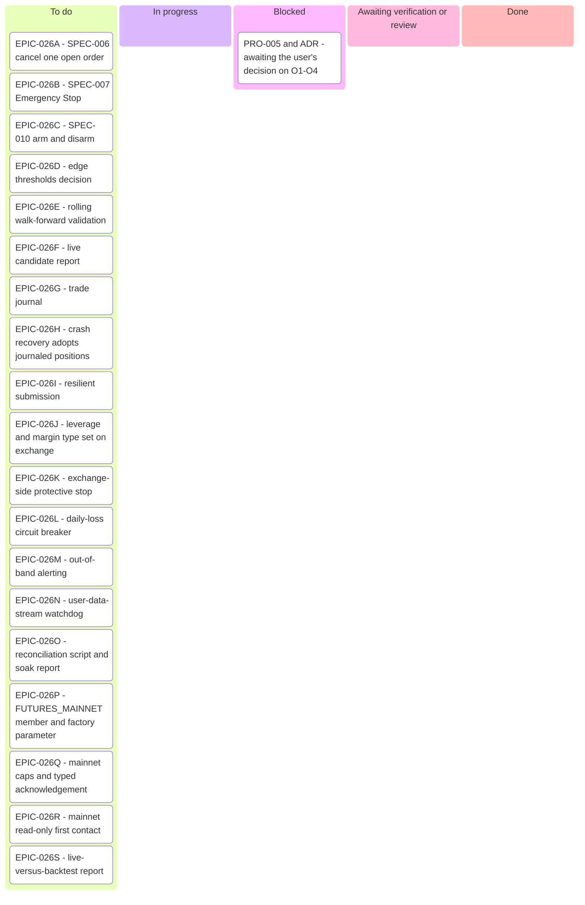
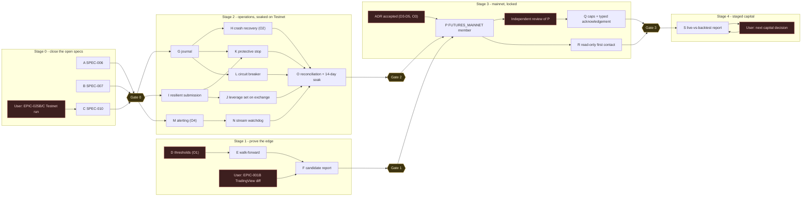
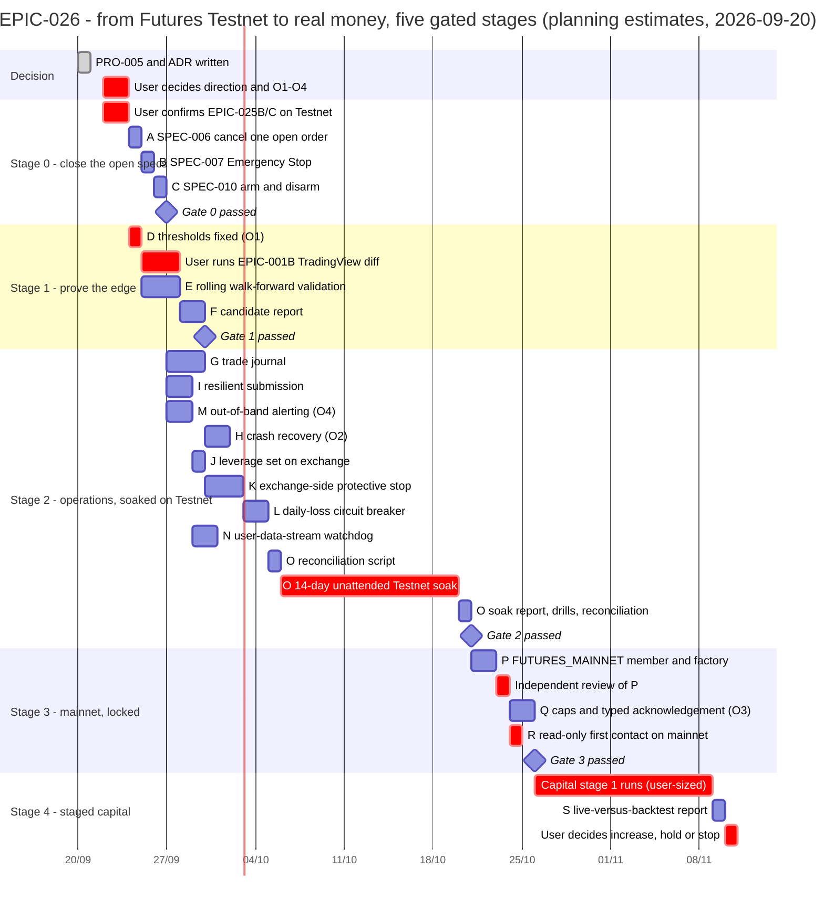

# EPIC-026 — Tracking (Kanban, dependency graph, Gantt)

- **How to read it.** One card per sub-task on the Kanban; one bar per sub-task or per hands-on
  step on the Gantt. `crit` marks a step only the user can do (a decision, a Testnet or
  TradingView run, an independent review, a capital decision); `milestone` marks a gate. Every
  date after 2026-09-20 is a **planning estimate**, revised in the pull request that closes a bar.
- **Who updates it.** The executor of a sub-task moves its card and its bar in the same pull
  request that closes it, and re-dates the bars after it if the estimate moved
  (`report-task-rule.md`: the board is generated from the records, never hand-maintained apart).
- **Validated** with `@mermaid-js/mermaid-cli@11.17.0` on 2026-09-20 (exit 0, fresh SVG, per
  `.claude/skills/execute-task/references/mermaid-validation.md`); the sources below are the
  validated ones, unedited.
- **Renders** on GitHub, in VS Code with a Mermaid extension, or at mermaid.live.

## 1. Kanban (2026-09-20)

## 2. Dependency graph — the gates are the critical path

Stage 1 and stage 2 are independent (ADR D2). Stage 3 needs both gates and the accepted ADR.
Stage 4 is a loop: run a capital stage, report, decide.

## 3. Gantt — planning estimates

The critical path is stage 2's 14-day soak, not stage 1. Working days are the unit; a `1d` bar is
one pull request of the size `EPIC-021`'s tasks had (each closed in under a day of work).

## 4. Estimate, in calendar terms

| Stage | Earliest start | Duration (estimate) | Gate |
| :--- | :--- | :--- | :--- |
| Decision | 2026-09-22 | 2 days of the user's time | — |
| 0 | 2026-09-24 | 3 pull requests, ~3 days | Gate 0 ≈ 2026-09-27 |
| 1 | 2026-09-24 | ~6 days, of which 3 are the user's TradingView run | Gate 1 ≈ 2026-09-30 |
| 2 | 2026-09-27 | ~9 days of pull requests, then a **14-day soak** and a day of drills | Gate 2 ≈ 2026-10-21 |
| 3 | 2026-10-21 | ~5 days including the independent review | Gate 3 ≈ 2026-10-26 |
| 4 | 2026-10-26 | 14 days per capital stage, repeated | per stage |

A first real-money fill, at the smallest stage, is therefore **the last days of October 2026** if
the decision lands in the week of 2026-09-22 and nothing in stage 2 uncovers a defect that the soak
must be restarted for. The soak restarts from zero after any fix to G–N; that is the one rule that
can move gate 2.
