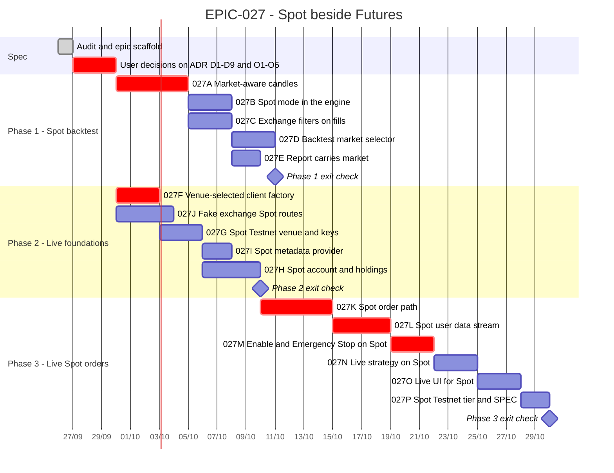

# EPIC-027 — Tracking

- **Epic:** [EPIC-027 — Spot beside Futures](README.md)
- **Status:** 🔵 Planned
- **Target Completion:** not committed; the bars below are relative estimates from the day the ADR is accepted.
- **Renders:** GitHub Markdown, VS Code Mermaid preview, or mermaid.live.

---

## 1. Schedule (Gantt)

The dates are placeholders anchored on the spec day. Each bar is one pull request. Phase 2 can start
in parallel with Phase 1, because `EPIC-027F` and `EPIC-027J` depend on nothing in Phase 1.

---

## 2. Sub-tasks & PR Matrix

| Id | Sub-task | Branch / PR | Risk | Status | Target / Merged |
| :--- | :--- | :--- | :-: | :--- | :--- |
| EPIC-027A | [Market-aware candles](incomplete/EPIC-027A_market_aware_kline_storage_and_download.md) | `claude/wizardly-cerf-fc5b5x` | 🔴 | 🟡 Active | — |
| EPIC-027B | [Spot mode in the engine](incomplete/EPIC-027B_spot_mode_in_the_backtest_engine.md) | — | 🟡 | 🔵 Planned | — |
| EPIC-027C | [Exchange filters on fills](incomplete/EPIC-027C_exchange_filters_on_simulated_fills.md) | — | 🟡 | 🔵 Planned | — |
| EPIC-027D | [Backtest market selector](incomplete/EPIC-027D_backtest_ui_market_selector.md) | — | 🟢 | 🔵 Planned | — |
| EPIC-027E | [Report carries market](incomplete/EPIC-027E_report_schema_carries_market_type.md) | — | 🟢 | 🔵 Planned | — |
| EPIC-027F | [Venue-selected client factory](incomplete/EPIC-027F_venue_selected_trading_client_factory.md) | — | 🔴 | 🔵 Planned | — |
| EPIC-027G | [Spot Testnet venue and keys](incomplete/EPIC-027G_spot_testnet_venue_and_credentials.md) | — | 🟡 | 🔵 Planned | — |
| EPIC-027H | [Spot account and holdings](incomplete/EPIC-027H_spot_account_reader_and_holdings_model.md) | — | 🟡 | 🔵 Planned | — |
| EPIC-027I | [Spot metadata provider](incomplete/EPIC-027I_spot_symbol_metadata_provider.md) | — | 🟢 | 🔵 Planned | — |
| EPIC-027J | [Fake exchange Spot routes](incomplete/EPIC-027J_fake_exchange_spot_routes.md) | — | 🟡 | 🔵 Planned | — |
| EPIC-027K | [Spot order path](incomplete/EPIC-027K_spot_trading_client_and_order_path.md) | — | 🔴 | 🔵 Planned | — |
| EPIC-027L | [Spot user data stream](incomplete/EPIC-027L_spot_user_data_stream.md) | — | 🔴 | 🔵 Planned | — |
| EPIC-027M | [Enable and Emergency Stop on Spot](incomplete/EPIC-027M_spot_session_enable_and_emergency_stop.md) | — | 🔴 | 🔵 Planned | — |
| EPIC-027N | [Live strategy on Spot](incomplete/EPIC-027N_live_strategy_on_spot.md) | — | 🟡 | 🔵 Planned | — |
| EPIC-027O | [Live UI for Spot](incomplete/EPIC-027O_live_ui_for_spot.md) | — | 🟢 | 🔵 Planned | — |
| EPIC-027P | [Spot Testnet tier and SPEC](incomplete/EPIC-027P_spot_testnet_tier_and_spec.md) | — | 🟡 | 🔵 Planned | — |

---

## 3. Milestone & Status Log

| Date | Item | Event & Outcome |
| :--- | :--- | :--- |
| 2026-09-26 | Spec | Epic scaffolded from two audits of `ee7105f8`; ADR Proposed; 16 sub-tasks sliced. |
| 2026-09-26 | ADR | User accepted D1–D9 and answered O1–O6 with every recommended option. `EPIC-027A` started. |

---

## 4. Blockers & Dependencies

| Blocker / Dependency | Impacted Tasks | Resolution / Owner | Status |
| :--- | :--- | :--- | :--- |
| ADR D1–D9 accepted | all | the user | ✅ Resolved 2026-09-26 |
| O3 — how to tag legacy candles | EPIC-027A | the user | ✅ Resolved 2026-09-26 — tag as Spot |
| O2, O4 — arming short-capable strategies; non-USDT quotes | EPIC-027N | the user | ✅ Resolved 2026-09-26 — refuse to arm; USDT-only |
| O6 — Spot average entry price source | EPIC-027H | the user | ✅ Resolved 2026-09-26 — `GET /api/v3/myTrades` |
| Spot Testnet API keys (`testnet.binance.vision`) | EPIC-027H, EPIC-027P | the user | 🟡 Open |
| Shared factory seam with `EPIC-026P` | EPIC-027F | whichever epic lands first builds it | 🟡 Open |
