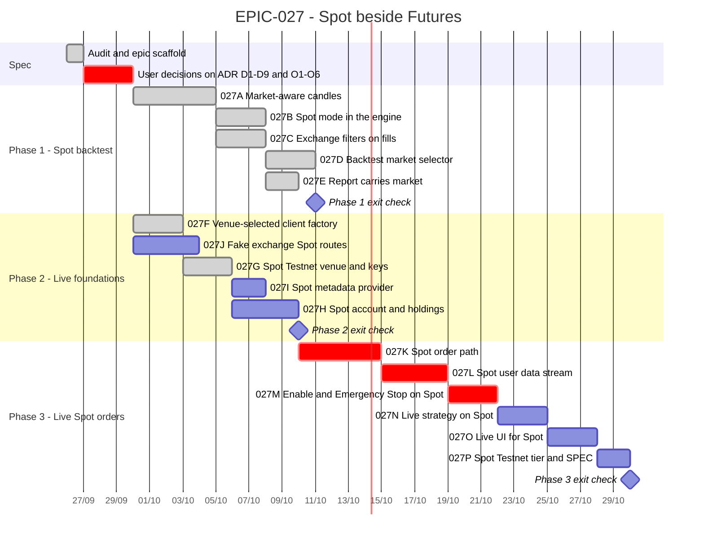

# EPIC-027 — Tracking

- **Epic:** [EPIC-027 — Spot beside Futures](README.md)
- **Status:** 🟢 Phase 1 done (5/5, 2026-09-27); Phase 2 in progress (2/5) — `EPIC-027A`–`EPIC-027E` done; `EPIC-027F` and `EPIC-027G` done: the venue-selected factory seam and `TradingVenue.SPOT_TESTNET` with its own credentials and gates
- **Target Completion:** not committed; the bars below are relative estimates from the day the ADR is accepted.
- **Renders:** GitHub Markdown, VS Code Mermaid preview, or mermaid.live.

---

## 1. Schedule (Gantt)

The dates are placeholders anchored on the spec day. Each bar is one pull request. Phase 2 can start
in parallel with Phase 1, because `EPIC-027F` and `EPIC-027J` depend on nothing in Phase 1.

```mermaid
gantt
    title EPIC-027 - Spot beside Futures
    dateFormat  YYYY-MM-DD
    axisFormat  %d/%m
    todayMarker stroke-width:2px,stroke:#d33,opacity:0.6

    section Spec
    Audit and epic scaffold                 :done,    s1, 2026-09-26, 1d
    User decisions on ADR D1-D9 and O1-O6   :crit,    s2, after s1, 3d

    section Phase 1 - Spot backtest
    027A Market-aware candles               :done,    a, after s2, 5d
    027B Spot mode in the engine            :done,    b, after a, 3d
    027C Exchange filters on fills          :done,    c, after a, 3d
    027D Backtest market selector           :done,    d, after b, 3d
    027E Report carries market              :done,    e, after c, 2d
    Phase 1 exit check                      :milestone, m1, after d, 0d

    section Phase 2 - Live foundations
    027F Venue-selected client factory      :done,    f, after s2, 3d
    027J Fake exchange Spot routes          :         j, after s2, 4d
    027G Spot Testnet venue and keys        :done,    g, after f, 3d
    027I Spot metadata provider             :         i, after g, 2d
    027H Spot account and holdings          :         h, after g j, 4d
    Phase 2 exit check                      :milestone, m2, after h, 0d

    section Phase 3 - Live Spot orders
    027K Spot order path                    :crit,    k, after m2, 5d
    027L Spot user data stream              :crit,    l, after k, 4d
    027M Enable and Emergency Stop on Spot  :crit,    m, after l, 3d
    027N Live strategy on Spot              :         n, after m, 3d
    027O Live UI for Spot                   :         o, after n, 3d
    027P Spot Testnet tier and SPEC         :         p, after o, 2d
    Phase 3 exit check                      :milestone, m3, after p, 0d
```

---

## 2. Sub-tasks & PR Matrix

| Id | Sub-task | Branch / PR | Risk | Status | Target / Merged |
| :--- | :--- | :--- | :-: | :--- | :--- |
| EPIC-027A | [Market-aware candles](completed/EPIC-027A_market_aware_kline_storage_and_download.md) | `claude/wizardly-cerf-fc5b5x` | 🔴 | ✅ Done | 2026-09-26 |
| EPIC-027B | [Spot mode in the engine](completed/EPIC-027B_spot_mode_in_the_backtest_engine.md) | `claude/wizardly-cerf-fc5b5x` | 🟡 | ✅ Done | 2026-09-27 |
| EPIC-027C | [Exchange filters on fills](completed/EPIC-027C_exchange_filters_on_simulated_fills.md) | `claude/wizardly-cerf-fc5b5x` | 🟡 | ✅ Done | 2026-09-27 |
| EPIC-027D | [Backtest market selector](completed/EPIC-027D_backtest_ui_market_selector.md) | `claude/wizardly-cerf-fc5b5x` | 🟢 | ✅ Done | 2026-09-27 |
| EPIC-027E | [Report carries market](completed/EPIC-027E_report_schema_carries_market_type.md) | `claude/wizardly-cerf-fc5b5x` | 🟢 | ✅ Done | 2026-09-27 |
| EPIC-027F | [Venue-selected client factory](completed/EPIC-027F_venue_selected_trading_client_factory.md) | `claude/wizardly-cerf-fc5b5x` | 🔴 | ✅ Done | 2026-09-27 |
| EPIC-027G | [Spot Testnet venue and keys](completed/EPIC-027G_spot_testnet_venue_and_credentials.md) | `claude/wizardly-cerf-fc5b5x` | 🟡 | ✅ Done | 2026-09-27 |
| EPIC-027H | [Spot account and holdings](incomplete/EPIC-027H_spot_account_reader_and_holdings_model.md) | — | 🟡 | 🔵 Planned | — |
| EPIC-027I | [Spot metadata provider](incomplete/EPIC-027I_spot_symbol_metadata_provider.md) | — | 🟢 | 🔵 Planned | — |
| EPIC-027J | [Fake exchange Spot routes](incomplete/EPIC-027J_fake_exchange_spot_routes.md) | — | 🟡 | 🔵 Planned | — |
| EPIC-027K | [Spot order path](incomplete/EPIC-027K_spot_trading_client_and_order_path.md) | — | 🔴 | 🔵 Planned | — |
| EPIC-027L | [Spot user data stream](incomplete/EPIC-027L_spot_user_data_stream.md) | — | 🔴 | 🔵 Planned | — |
| EPIC-027M | [Enable and Emergency Stop on Spot](incomplete/EPIC-027M_spot_session_enable_and_emergency_stop.md) | — | 🔴 | 🔵 Planned | — |
| EPIC-027N | [Live strategy on Spot](incomplete/EPIC-027N_live_strategy_on_spot.md) | — | 🟡 | 🔵 Planned | — |
| EPIC-027O | [Live UI for Spot](incomplete/EPIC-027O_live_ui_for_spot.md) | — | 🟢 | 🔵 Planned | — |
| EPIC-027P | [Spot Testnet tier and SPEC](incomplete/EPIC-027P_spot_testnet_tier_and_spec.md) | — | 🟡 | 🔵 Planned | — |

---

## 3. Milestone & Status Log

| Date | Item | Event & Outcome |
| :--- | :--- | :--- |
| 2026-09-26 | Spec | Epic scaffolded from two audits of `ee7105f8`; ADR Proposed; 16 sub-tasks sliced. |
| 2026-09-26 | ADR | User accepted D1–D9 and answered O1–O6 with every recommended option. `EPIC-027A` started. |
| 2026-09-26 | EPIC-027A | Done — `MarketType` in the shared kernel, market-scoped shard storage + repository/sync ports, klines type resolved per market (not venue), fake exchange proves Spot/Futures routing, legacy shards migrated (tagged Spot), Data Management + export/import carry market. Unit 5516, integration 165 (4 skipped), architecture 445 all green; mypy clean on 702 files. |
| 2026-09-27 | EPIC-027B | Done — `BrokerSimulationConfig.market_type` (default `FUTURES_USD_M`, golden run unchanged apart from the new zero count); Spot refuses leverage ≠ 1 and COIN-M; `MarketSignalGatePolicy` drops and counts SHORT/COVER in both handlers; no Spot trade can liquidate. unit 5550 passed, integration 166 passed (4 pre-existing skips), architecture 445; mypy clean on 703 files. |
| 2026-09-27 | EPIC-027C, EPIC-027D | Done in one PR — fills floored to the step and refused below the minimum notional per (market, symbol), slippage by the real tick; Backtest market selector (Spot / USD-M Futures) with candles, catalog, coverage, sync and filters following it; Spot hides leverage and short-only filters; `market_data` read ports take a market. 5612 unit passed, 168 integration passed (4 skipped), 32 sanity passed. |
| 2026-09-27 | EPIC-027E | Done, closing Phase 1 (5/5) — the report schema (v1→v2) now writes `market_type`/`exchange_filters`/`ignored_short_signals`/`rejected_entries`, plus four pre-existing `BOT-105A`/`105C` fields the serializer had also been silently dropping; a v1 report still loads, its market flagged "not recorded" via `BacktestReportLoadResult.market_type_recorded` rather than guessed; the comparison dialog gained a Spot-vs-Futures mismatch warning distinct from the pre-existing symbol/timeframe one. 5618 unit passed, 168 integration passed (4 skipped), 32 sanity passed, architecture 445, mypy clean. |
| 2026-09-27 | EPIC-027F | Done, opening Phase 2 (1/5) — six direct `FuturesTradingClient(...)` constructions (four order-path handlers, the open-positions query, the user data stream) replaced by `ITradingClientFactory.create(mode)`, bound unconditionally so handlers stay constructible while trading is disabled; venue is selected once by which concrete factory is bound, not by a `create()` argument. New architecture guard scans all of `src/`+`scripts/` and caught a probe script's stale constructor call via mypy. `tests/unit/modules/trading` 794 passed, `tests/unit/architecture` 451 passed, full `tests/unit` 5626 passed, `tests/sanity` 32 passed; ruff and mypy (713 files) clean. |
| 2026-09-27 | EPIC-027G | Done, advancing Phase 2 (2/5) — `TradingVenue.SPOT_TESTNET` with a `market_type` property; `EnvFirstCredentialsProvider` bound to one venue for its lifetime, reading a distinct env var pair per venue (a test proves a Futures key never resolves for Spot); its composition-root binding became a lazy factory (`register()` cannot resolve `TradingVenue`), so its three former consumers now resolve the port themselves. The three order-path gates changed from `is not FUTURES_TESTNET` to `is DISABLED` — a capability check. Found along the way: the live Trading/Dashboard screens hard-code `MarketType.SPOT` for their own chart/stream regardless of `TradingVenue` — a real truth violation, analogous to `EPIC-027A`'s finding but for the live screen; `VenueAlignment.MARKET_MISMATCH` now names it via a new `chart_market_type` parameter on `compute_venue_alignment`. Settings gained the Spot Testnet option. `tests/unit/architecture` 451 passed, `tests/unit/modules/trading` 797 passed, full `tests/unit` 5638 passed; ruff and mypy clean (byte-diffed against a clean-cache baseline — zero new errors). |

---

## 4. Blockers & Dependencies

| Blocker / Dependency | Impacted Tasks | Resolution / Owner | Status |
| :--- | :--- | :--- | :--- |
| ADR D1–D9 accepted | all | the user | ✅ Resolved 2026-09-26 |
| O3 — how to tag legacy candles | EPIC-027A | the user | ✅ Resolved 2026-09-26 — tag as Spot |
| O2, O4 — arming short-capable strategies; non-USDT quotes | EPIC-027N | the user | ✅ Resolved 2026-09-26 — refuse to arm; USDT-only |
| O6 — Spot average entry price source | EPIC-027H | the user | ✅ Resolved 2026-09-26 — `GET /api/v3/myTrades` |
| Spot Testnet API keys (`testnet.binance.vision`) | EPIC-027H, EPIC-027P | the user | 🟡 Open |
| Shared factory seam with `EPIC-026P` | EPIC-027F | whichever epic lands first builds it | 🟡 Open |
