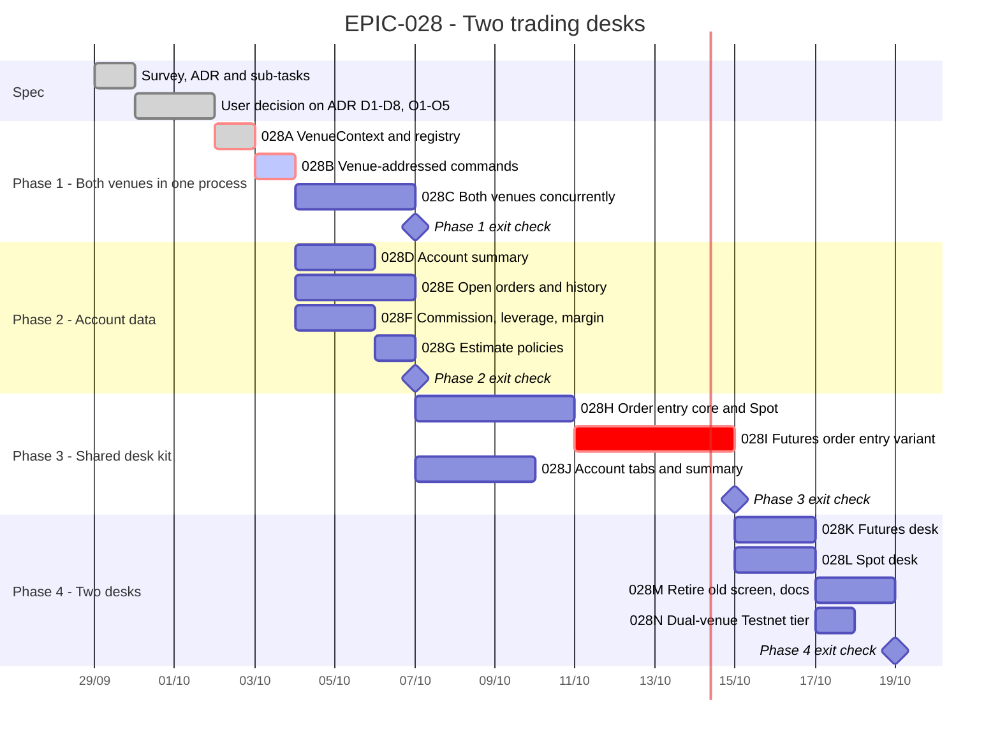

# EPIC-028 — Tracking

- **Epic:** [EPIC-028 — Two trading desks](README.md)
- **Status:** 🟡 In Progress — ADR accepted 2026-09-29; Phase 1 started
- **Target Completion:** not committed; the bars below are relative estimates from the day the ADR is accepted.
- **Renders:** GitHub Markdown, VS Code Mermaid preview, or mermaid.live.

---

## 1. Schedule (Gantt)

Phase 2 can start as soon as `EPIC-028B` lands; Phase 3's UI can be built against fakes in parallel
with Phase 2's adapters.

---

## 2. Sub-tasks & PR Matrix

| Id | Sub-task | Branch / PR | Risk | Status | Target / Merged |
| :--- | :--- | :--- | :-: | :--- | :--- |
| EPIC-028A | [VenueContext and registry](completed/EPIC-028A_venue_context_and_registry.md) | `claude/wizardly-cerf-fc5b5x` | 🔴 | ✅ Done | [#293](https://github.com/anhembedded/Sagittarius_Elite_Warrior/pull/293) merged 2026-09-29 |
| EPIC-028B | [Venue-addressed commands](incomplete/EPIC-028B_venue_addressed_commands.md) | `claude/wizardly-cerf-fc5b5x` | 🔴 | 🟡 Awaiting review | [#293](https://github.com/anhembedded/Sagittarius_Elite_Warrior/pull/293) |
| EPIC-028C | [Both venues concurrently](incomplete/EPIC-028C_both_venues_running_concurrently.md) | — | 🟡 | 🔵 Planned | — |
| EPIC-028D | [Account summary](incomplete/EPIC-028D_account_summary_reader.md) | — | 🟡 | 🔵 Planned | — |
| EPIC-028E | [Open orders and history](incomplete/EPIC-028E_open_orders_and_history_readers.md) | — | 🟡 | 🔵 Planned | — |
| EPIC-028F | [Commission, leverage, margin](incomplete/EPIC-028F_commission_and_futures_account_controls.md) | — | 🟡 | 🔵 Planned | — |
| EPIC-028G | [Estimate policies](incomplete/EPIC-028G_order_estimate_policies.md) | — | 🟢 | 🔵 Planned | — |
| EPIC-028H | [Order entry core and Spot](incomplete/EPIC-028H_order_entry_panel_core_and_spot.md) | — | 🟡 | 🔵 Planned | — |
| EPIC-028I | [Futures order entry](incomplete/EPIC-028I_futures_order_entry_variant.md) | — | 🔴 | 🔵 Planned | — |
| EPIC-028J | [Account tabs and summary](incomplete/EPIC-028J_account_tabs_and_summary_panels.md) | — | 🟡 | 🔵 Planned | — |
| EPIC-028K | [Futures desk](incomplete/EPIC-028K_futures_desk_screen.md) | — | 🟡 | 🔵 Planned | — |
| EPIC-028L | [Spot desk](incomplete/EPIC-028L_spot_desk_screen.md) | — | 🟢 | 🔵 Planned | — |
| EPIC-028M | [Retire old screen, docs](incomplete/EPIC-028M_retire_single_trading_screen_and_docs.md) | — | 🟢 | 🔵 Planned | — |
| EPIC-028N | [Dual-venue Testnet tier](incomplete/EPIC-028N_dual_venue_testnet_tier.md) | — | 🟡 | 🔵 Planned | — |

---

## 3. Milestone & Status Log

| Date | Item | Event & Outcome |
| :--- | :--- | :--- |
| 2026-09-29 | EPIC-028A | Merged in PR #293 after the independent review (four fixes: per-part lock, single-venue reader follows the list, guard sees every spelling, docs). |
| 2026-09-29 | EPIC-028B | Implemented: commands/queries name their venue; `VenueTradingScopes`/`IVenueTradingPorts`/`VenueStrategySessions`; single-venue bindings deleted, guard added. Fast tier green; awaiting independent review. |
| 2026-09-29 | EPIC-028A | Implemented: `IVenueContexts` + per-venue `VenueAssembly`; single-venue ports are primary-venue shims. Fast tier green; awaiting independent review. |
| 2026-09-29 | ADR | Accepted by the user — D1–D8, O1–O5 per recommendation; `EPIC-028A` started. |
| 2026-09-29 | Spec | Epic scaffolded from a survey of `faf4a337`; ADR D1–D8 proposed, O1–O5 open; 14 sub-tasks in four phases. |

---

## 4. Blockers & Dependencies

| Blocker / Dependency | Impacted Tasks | Resolution / Owner | Status |
| :--- | :--- | :--- | :--- |
| ADR D1–D8 accepted, O1 answered | all | the user | ✅ Resolved 2026-09-29 |
| O2 Spot TP/SL, O3 stop-limit | EPIC-028H, EPIC-028I | the user | ✅ Resolved 2026-09-29 |
| O4 retire the old route, O5 history depth | EPIC-028E, EPIC-028M | the user | ✅ Resolved 2026-09-29 |
| Spot OCO protective orders | Spot TP/SL (out of scope) | `EPIC-026K` | 🟡 Open |
