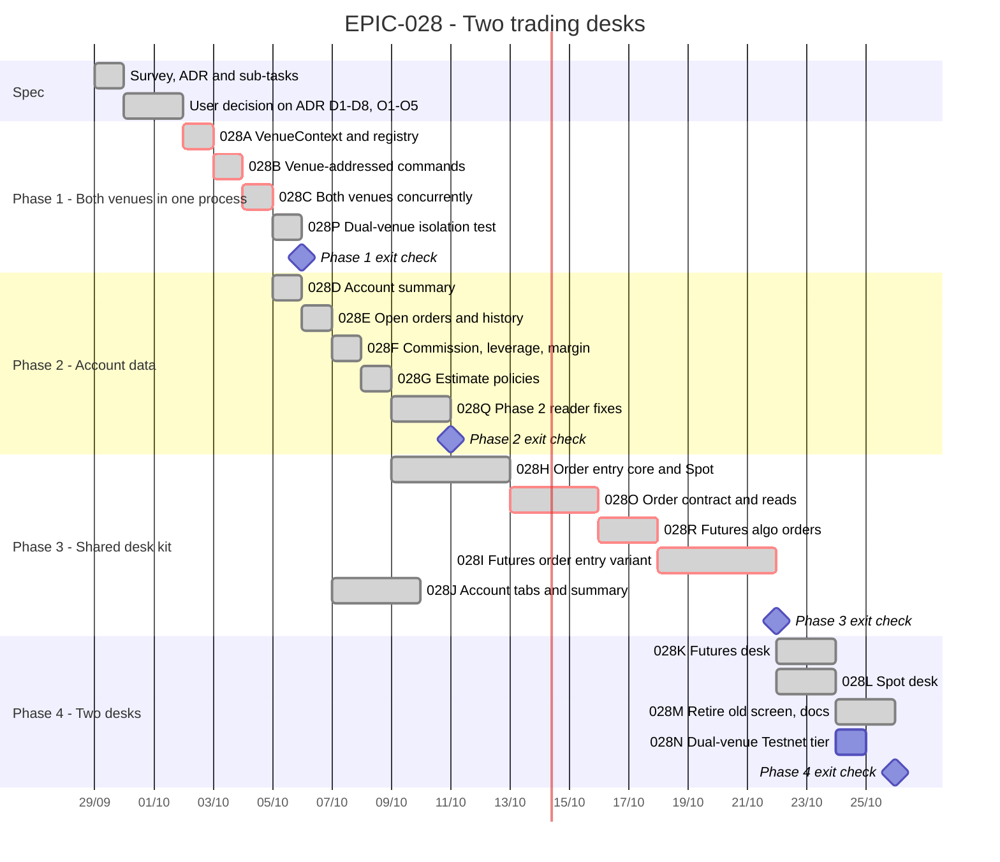

# EPIC-028 — Tracking

- **Epic:** [EPIC-028 — Two trading desks](README.md)
- **Status:** 🟡 In Progress — ADR accepted 2026-09-29; Phase 1 done (`028A`–`028C`, `028P`); Phase 2 readers merged (`028D`–`028G`, `028Q`), exit check pending; Phase 3: `028H` and `028O` merged (#301–#305); `028R` merged (#306); `028J` and `028I` done
- **Target Completion:** not committed; the bars below are relative estimates from the day the ADR is accepted.
- **Renders:** GitHub Markdown, VS Code Mermaid preview, or mermaid.live.

---

## 1. Schedule (Gantt)

Phase 2 can start as soon as `EPIC-028B` lands; Phase 3's UI can be built against fakes in parallel
with Phase 2's adapters.

---

## 2. Sub-tasks & PR Matrix

| Id | Sub-task | Branch / PR | Risk | Status | Target / Merged |
| :--- | :--- | :--- | :-: | :--- | :--- |
| EPIC-028A | [VenueContext and registry](completed/EPIC-028A_venue_context_and_registry.md) | `claude/wizardly-cerf-fc5b5x` | 🔴 | ✅ Done | [#293](https://github.com/anhembedded/Sagittarius_Elite_Warrior/pull/293) merged 2026-09-29 |
| EPIC-028B | [Venue-addressed commands](completed/EPIC-028B_venue_addressed_commands.md) | `claude/wizardly-cerf-fc5b5x` | 🔴 | ✅ Done | [#294](https://github.com/anhembedded/Sagittarius_Elite_Warrior/pull/294) merged 2026-09-29 |
| EPIC-028C | [Both venues concurrently](completed/EPIC-028C_both_venues_running_concurrently.md) | `claude/wizardly-cerf-fc5b5x` | 🟡 | ✅ Done | [#295](https://github.com/anhembedded/Sagittarius_Elite_Warrior/pull/295) merged 2026-09-30 |
| EPIC-028D | [Account summary](completed/EPIC-028D_account_summary_reader.md) | `claude/wizardly-cerf-fc5b5x` | 🟡 | ✅ Done | [#296](https://github.com/anhembedded/Sagittarius_Elite_Warrior/pull/296) merged 2026-09-30 |
| EPIC-028E | [Open orders and history](completed/EPIC-028E_open_orders_and_history_readers.md) | `claude/wizardly-cerf-fc5b5x` | 🟡 | ✅ Done | [#297](https://github.com/anhembedded/Sagittarius_Elite_Warrior/pull/297) merged 2026-09-30 |
| EPIC-028F | [Commission, leverage, margin](completed/EPIC-028F_commission_and_futures_account_controls.md) | `claude/wizardly-cerf-fc5b5x` | 🟡 | ✅ Done | [#299](https://github.com/anhembedded/Sagittarius_Elite_Warrior/pull/299) merged 2026-09-30 |
| EPIC-028G | [Estimate policies](completed/EPIC-028G_order_estimate_policies.md) | `claude/wizardly-cerf-fc5b5x` | 🟢 | ✅ Merged | [#300](https://github.com/anhembedded/Sagittarius_Elite_Warrior/pull/300) |
| EPIC-028H | [Order entry core and Spot](completed/EPIC-028H_order_entry_panel_core_and_spot.md) | `claude/wizardly-cerf-fc5b5x` | 🟡 | ✅ Merged | [#301](https://github.com/anhembedded/Sagittarius_Elite_Warrior/pull/301) |
| EPIC-028O | [Order contract and missing reads](completed/EPIC-028O_order_contract_and_missing_reads.md) | `claude/wizardly-cerf-fc5b5x` | 🔴 | ✅ Merged | [#302](https://github.com/anhembedded/Sagittarius_Elite_Warrior/pull/302), [#303](https://github.com/anhembedded/Sagittarius_Elite_Warrior/pull/303), [#304](https://github.com/anhembedded/Sagittarius_Elite_Warrior/pull/304), [#305](https://github.com/anhembedded/Sagittarius_Elite_Warrior/pull/305) |
| EPIC-028R | [Futures conditional orders via the Algo Order API](completed/EPIC-028R_futures_conditional_orders_via_algo_api.md) | `claude/wizardly-cerf-fc5b5x` | 🔴 | ✅ Done; in review | — |
| EPIC-028P | [Dual-venue isolation test](completed/EPIC-028P_dual_venue_isolation_test.md) | `claude/wizardly-cerf-fc5b5x` | 🟢 | ✅ Merged | [#301](https://github.com/anhembedded/Sagittarius_Elite_Warrior/pull/301) |
| EPIC-028Q | [Phase 2 reader fixes](completed/EPIC-028Q_phase_2_reader_fixes.md) | `claude/wizardly-cerf-fc5b5x` | 🟡 | ✅ Merged | [#301](https://github.com/anhembedded/Sagittarius_Elite_Warrior/pull/301) |
| EPIC-028I | [Futures order entry](completed/EPIC-028I_futures_order_entry_variant.md) | `claude/wizardly-cerf-fc5b5x` | 🔴 | ✅ Merged | [#307](https://github.com/anhembedded/Sagittarius_Elite_Warrior/pull/307) |
| EPIC-028J | [Account tabs and summary](completed/EPIC-028J_account_tabs_and_summary_panels.md) | `claude/wizardly-cerf-fc5b5x` | 🟡 | ✅ Merged | [#307](https://github.com/anhembedded/Sagittarius_Elite_Warrior/pull/307) |
| EPIC-028K | [Futures desk](completed/EPIC-028K_futures_desk_screen.md) | `claude/wizardly-cerf-fc5b5x` | 🟡 | ✅ Done | — |
| EPIC-028L | [Spot desk](completed/EPIC-028L_spot_desk_screen.md) | `claude/wizardly-cerf-fc5b5x` | 🟢 | ✅ Done | — |
| EPIC-028M | [Retire old screen, docs](completed/EPIC-028M_retire_single_trading_screen_and_docs.md) | `claude/wizardly-cerf-fc5b5x` | 🟢 | ✅ Merged | [#309](https://github.com/anhembedded/Sagittarius_Elite_Warrior/pull/309) |
| EPIC-028S | [PR 309 review follow-ups](completed/EPIC-028S_desk_follow_ups_from_pr_309_review.md) | `claude/wizardly-cerf-fc5b5x` | 🟢 | ✅ Done (awaiting review) | — |
| EPIC-028N | [Dual-venue Testnet tier](incomplete/EPIC-028N_dual_venue_testnet_tier.md) | — | 🟡 | 🔵 Planned | — |

---

## 3. Milestone & Status Log

| Date | Item | Event & Outcome |
| :--- | :--- | :--- |
| 2026-10-02 | EPIC-028S | PR 309 review follow-ups: reconciliation fails closed for an unclassified block reason; a desk re-reads its order panel after a fill; F9 tested in the composed app against the fake server. |
| 2026-10-02 | EPIC-028M | The single Trading screen retired (Start opens the Futures desk); its view model and chart coordinators moved to the desk package; the desks took its equity chart and fill markers; the Dev Board's toggle and Emergency Stop are `DeskSessionControls` and its F9 dialog hosts the desks' order panel; HLD/SPEC updated, SPEC-013 new. |
| 2026-10-02 | EPIC-028L | The Spot desk (`trading.spot`) from the same composition with Spot's profile; both desks open at once stay apart (orders, signals, chart streams, Enable, Emergency Stop); boot re-arms every enabled venue's own saved strategy. |
| 2026-10-02 | EPIC-028K | The Futures desk (`trading.futures`): one desk package composing the kit for a venue; per-desk chart stream owner, venue-stamped signals, `IVenueStrategyControls`, banner naming every enabled venue. Found by the journey: a resting Limit never reached Open orders (the stream announces fills and ends only); the desk now lists what the venue accepted. |
| 2026-10-01 | EPIC-028I | Futures panel: estimates-sized maxima (book open loss for market), cost, liquidation estimate, TIF, reduce-only, margin and leverage chips through a new `IFuturesSettingsControl` port; TP/SL as reduce-only conditional orders, purpose-exempt from the limits, placed when the entry's fill is reported. |
| 2026-10-01 | EPIC-028J | Account tabs and summary as desk parts: `IAccountActivity` port on `VenueTradingPorts`; tabs loaded from queries then kept by the venue's `OrderFeed`; histories page over a fixed `since`; cancel all shown and close at market ask first; summary stale mark. Integration: orders placed on the fake elsewhere are listed and cancelled. |
| 2026-10-01 | EPIC-028R | Futures stop-limit through the Algo Order API with the app's client id; algo orders listed, cancelled (fallback on `-2011`), in history, cancelled by Emergency Stop; `ALGO_UPDATE` links a triggered stop's fill to the app's id; fake serves the algo routes and triggers by price. |
| 2026-10-01 | EPIC-028O | PR-4: the desk UI — Spot Stop-limit tab, quote-sized market buy, BBO button (a buy joins the best bid, a sell the best ask), every maximum capped by the app's notional limit. Task done. |
| 2026-10-01 | EPIC-028O | PR-3: the fake fills Futures market orders (trades, positions, wallet; `-2022` on a reduce-only with nothing to reduce); the Futures summary reads Multi-Assets mode. Found and fixed: a short's leverage read as negative. |
| 2026-10-01 | EPIC-028O | PR-2: the reads — Futures leverage, margin mode and brackets on the account control, mark price, best bid and ask on both venues, the app's notional limit; Spot answers `NotApplicable`. Plan split to four PRs (fills and Multi-Assets on their own). |
| 2026-10-01 | EPIC-028O | PR-1: stop-limit, time in force and quote sizing end to end; a crossed stop refused before sending. Found that `python-binance` routes every Futures conditional order to the Algo Order API (client id lost, Emergency Stop does not reach); Futures conditional types refused, `EPIC-028R` added. |
| 2026-10-01 | EPIC-028H, 028P, 028Q | Merged in PR #301 after an independent review (PASS; two should-fix items fixed before merge). |
| 2026-10-01 | EPIC-028Q | Phase 2 readers: mapping errors translated, history gaps carried on `HistoryPage.notices`, closed Futures pairs found through income, history cached for paging, stale account summary published; leverage gate restated as app policy. Desk display moved to 028J; fake fills and Multi-Assets to 028O. |
| 2026-10-01 | EPIC-028P | Dual-venue integration test added; it found every Futures session pinging the Spot API (`python-binance`'s construction-time ping), fixed with `ping=False`. |
| 2026-10-01 | EPIC-028 | Epic-level review on PR #300: plan gaps (028O widened), Phase 1 evidence missing (028P added), Phase 2 reader defects (028Q added), 028I/K/L/M acceptance criteria corrected. |
| 2026-09-30 | EPIC-028H | Implemented: `DeskProfile`, the order-entry panel (Limit/Market, slider, total, fee, disabled Spot TP/SL), the Spot two-column variant, `IOrderEntryTerms`, preview → confirm → submit. Stop-limit and BBO split to `EPIC-028O`. Fast tier green. |
| 2026-09-29 | EPIC-028A | Merged in PR #293 after the independent review (four fixes: per-part lock, single-venue reader follows the list, guard sees every spelling, docs). |
| 2026-10-01 | EPIC-028G | Merged in PR #300. |
| 2026-09-30 | EPIC-028G | Implemented, then redesigned after the PR #300 review: Futures cost and maximum by Binance's rules (assuming price, open loss, notional headroom), Spot by notional plus fee, a liquidation estimate typed as an estimate. Re-review PASS. |
| 2026-09-30 | EPIC-028F | Merged in PR #299 after two independent reviews: NEEDS_REVISION (the position read leaked SDK errors; fixed by moving it onto the port), then PASS. |
| 2026-09-30 | EPIC-028F | Implemented: `IFuturesAccountControl` (none on Spot), `ICommissionRateReader`, leverage and margin-mode commands behind one gate, commission-rate query. Fast tier green; awaiting independent review. |
| 2026-09-30 | EPIC-028E | Merged in PR #297 after two independent reviews: NEEDS_REVISION (a catalog download per unlisted Spot asset, fixed by `ListedSymbols`; 30-day lookback bound), then PASS (the fake enforces the lookback; aggregate weight cost moved to 028J). |
| 2026-09-30 | EPIC-028E | Implemented: `IAccountHistoryReader` per venue, never-truncated window splitting, open-orders/order-history/trade-history queries, Spot average entry price. Fast tier green; awaiting independent review. |
| 2026-09-30 | EPIC-028D | Merged in PR #296 after independent review (PASS); review fixes (stale-summary fence, SPEC-003, ADR D6, warn-once) landed before merge. |
| 2026-09-30 | EPIC-028D | Implemented: `AccountSummary` on the existing connection check (no new port), `GetAccountSummaryQuery`, per-venue refresh on cadence and on fill, CLI available balance. Fast tier green; awaiting independent review. |
| 2026-09-30 | EPIC-028C | Merged in PR #295 after independent review (PASS); Phase 1 done. EPIC-028D started. |
| 2026-09-29 | EPIC-028C | Implemented: per-venue refresh + venue on events; Settings toggles; per-market stream and tick routing; per-venue saved strategy. Fast tier green; awaiting independent review. |
| 2026-09-29 | EPIC-028B | Implemented: commands/queries name their venue; `VenueTradingScopes`/`IVenueTradingPorts`/`VenueStrategySessions`; single-venue bindings deleted, guard added. Fast tier green; awaiting independent review. |
| 2026-09-29 | EPIC-028A | Implemented: `IVenueContexts` + per-venue `VenueAssembly`; single-venue ports are primary-venue shims. Fast tier green; awaiting independent review. |
| 2026-09-29 | ADR | Accepted by the user — D1–D8, O1–O5 per recommendation; `EPIC-028A` started. |
| 2026-09-29 | Spec | Epic scaffolded from a survey of `faf4a337`; ADR D1–D8 proposed, O1–O5 open; 14 sub-tasks in four phases. |

---

## 4. Blockers & Dependencies

| Blocker / Dependency | Impacted Tasks | Resolution / Owner | Status |
| :--- | :--- | :--- | :--- |
| ADR D1–D8 accepted, O1 answered | all | the user | ✅ Resolved 2026-09-29 |
| O2 Spot TP/SL, O3 stop-limit | EPIC-028H, EPIC-028I, EPIC-028O | the user | ✅ Resolved 2026-09-29 |
| O4 retire the old route, O5 history depth | EPIC-028E, EPIC-028M | the user | ✅ Resolved 2026-09-29 |
| Spot OCO protective orders | Spot TP/SL (out of scope) | `EPIC-026K` | 🟡 Open |
