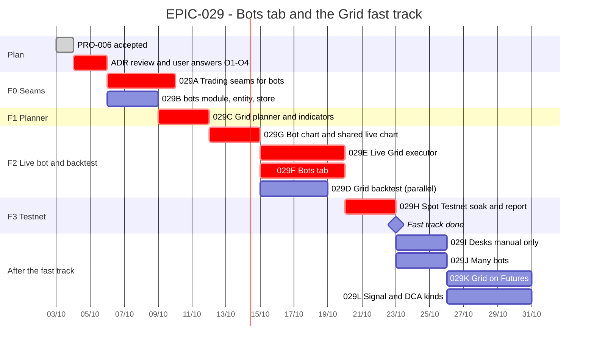

# EPIC-029 — Tracking

- **Epic:** [EPIC-029](README.md)
- **Status:** 🔵 Planned
- **Target completion:** the fast track (029A–029H) is estimated in working days below. The dates are
  a plan, not a commitment.
- **Renders:** GitHub Markdown, VS Code Mermaid preview, or mermaid.live.

---

## 1. Schedule (Gantt)

---

## 2. Sub-tasks & PR Matrix

| Id | Sub-task | Branch / PR | Risk | Status | Target / Merged |
| :--- | :--- | :--- | :-: | :--- | :--- |
| EPIC-029A | [Trading seams for bots](incomplete/EPIC-029A_trading_seams_for_bots.md) | — | 🔴 | 🔵 Planned | — |
| EPIC-029B | [bots module, entity, store](incomplete/EPIC-029B_bots_module_entity_and_store.md) | — | 🟡 | 🔵 Planned | — |
| EPIC-029C | [Grid planner](incomplete/EPIC-029C_grid_planner.md) | — | 🟢 | 🔵 Planned | — |
| EPIC-029D | [Grid backtest](incomplete/EPIC-029D_grid_backtest.md) | — | 🟡 | 🔵 Planned | — |
| EPIC-029E | [Live Grid executor](incomplete/EPIC-029E_live_grid_executor.md) | — | 🔴 | 🔵 Planned | — |
| EPIC-029F | [Bots tab](incomplete/EPIC-029F_bots_tab.md) | — | 🟡 | 🔵 Planned | — |
| EPIC-029G | [Bot chart](incomplete/EPIC-029G_bot_chart.md) | — | 🟡 | 🔵 Planned | — |
| EPIC-029H | [Spot Testnet soak](incomplete/EPIC-029H_spot_testnet_grid_soak.md) | — | 🟡 | 🔵 Planned | — |
| EPIC-029I | [Desks manual only](incomplete/EPIC-029I_desks_manual_only.md) | — | 🟡 | 🔵 Planned | — |
| EPIC-029J | [Many bots](incomplete/EPIC-029J_many_bots.md) | — | 🟡 | 🔵 Planned | — |
| EPIC-029K | [Grid on Futures](incomplete/EPIC-029K_grid_on_futures.md) | — | 🔴 | 🔵 Planned | — |
| EPIC-029L | [Signal and DCA kinds](incomplete/EPIC-029L_signal_and_dca_kinds.md) | — | 🟡 | 🔵 Planned | — |

---

## 3. Milestone & Status Log

| Date | Item | Event & Outcome |
| :--- | :--- | :--- |
| 2026-10-03 | Plan | `PRO-006` accepted by the user. Epic, ADR (D1–D20, O1–O4) and 12 sub-tasks written, for an independent review (PR #317). |

---

## 4. Blockers & Dependencies

| Blocker / Dependency | Impacted Tasks | Resolution / Owner | Status |
| :--- | :--- | :--- | :--- |
| ADR D6 changes a safety gate; O1 adds configuration | 029A, and everything after it | The user, after the independent review | 🟡 Open |
| O2 (resuming after Halted), O3 (stop default) | 029E | The user | 🟡 Open |
| O4 (warning on app close) | 029F | The user | 🟡 Open |
| Spot Testnet keys on the user's machine | 029H | The user (keys are never pasted into chat) | 🟡 Open |
