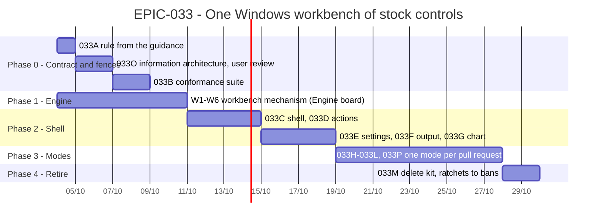

# EPIC-033 — Tracking

- **Epic:** [EPIC-033](README.md)
- **Status:** 🔵 Planned
- **Target Completion:** not set
- **Renders:** GitHub Markdown, VS Code Mermaid preview, or mermaid.live.

---

## 1. Schedule (Gantt)

---

## 2. Sub-tasks & PR Matrix

| Id | Sub-task | Branch / PR | Risk | Status | Target / Merged |
| :--- | :--- | :--- | :-: | :--- | :--- |
| EPIC-033A | [The UI rule is the desktop guidance of Microsoft, KDE and Apple, written as checkable clauses](incomplete/EPIC-033A_stock_control_contract.md) | — | 🟢 | 🔵 Planned | — |
| EPIC-033O | [The information architecture is designed from the use cases, with a wireframe per mode, and approved by the user](incomplete/EPIC-033O_information_architecture.md) | — | 🟢 | 🔵 Planned | — |
| EPIC-033B | [A booted-app conformance suite and static bans hold the contract, shrink-only until each mode migrates](incomplete/EPIC-033B_workbench_conformance_fences.md) | — | 🟡 | 🔵 Planned | — |
| EPIC-033C | [One top-level workbench window: menu bar, mode bar, View menu, Reset layout, status bar](incomplete/EPIC-033C_workbench_shell.md) | — | 🔴 | 🔵 Planned | — |
| EPIC-033D | [Every command is one QAction contributed by its module: menu entry, toolbar button and shortcut share it](incomplete/EPIC-033D_commands_as_actions.md) | — | 🟡 | 🔵 Planned | — |
| EPIC-033N | [Every table, list and read-out is built from one spec per kind](incomplete/EPIC-033N_uniform_display_widgets.md) | — | 🟡 | 🔵 Planned | — |
| EPIC-033E | [One Options dialog (Tools → Options) with sections, OK, Cancel and Apply](incomplete/EPIC-033E_settings_dialog.md) | — | 🟡 | 🔵 Planned | — |
| EPIC-033F | [One Output dock with a channel per module replaces three log cards](incomplete/EPIC-033F_one_output_dock.md) | — | 🟢 | 🔵 Planned | — |
| EPIC-033G | [The chart is a canvas; its controls are actions in the toolbar and the context menu](incomplete/EPIC-033G_stock_chart_controls.md) | — | 🟡 | 🔵 Planned | — |
| EPIC-033H | [Market mode: watch the market — chart central, Watchlist, Order book and Indicators panels](incomplete/EPIC-033H_market_mode.md) | — | 🟢 | 🔵 Planned | — |
| EPIC-033I | [Trade mode: one mode for both venues — chart central, Order entry, Positions or Holdings, Open orders, History and Account panels](incomplete/EPIC-033I_trade_mode.md) | — | 🔴 | 🔵 Planned | — |
| EPIC-033J | [Data mode: what is stored — stored-data table central, Coverage and Candle inspector panels, a Data menu](incomplete/EPIC-033J_data_mode.md) | — | 🟡 | 🔵 Planned | — |
| EPIC-033K | [Bots mode: create, judge, run and watch bots, laid out as HLD §11.2.1 designs it](incomplete/EPIC-033K_bots_mode.md) | — | 🔴 | 🔵 Planned | — |
| EPIC-033L | [Backtest mode: test a strategy on stored history — result chart central, Run setup, Trades, Metrics and Compare panels](incomplete/EPIC-033L_backtest_mode.md) | — | 🟡 | 🔵 Planned | — |
| EPIC-033P | [Developer mode: the testbed, only when developer mode is on](incomplete/EPIC-033P_developer_mode.md) | — | 🟢 | 🔵 Planned | — |
| EPIC-033M | [The kit, the palette and the theme bootstrap are deleted; every ratchet becomes a ban](incomplete/EPIC-033M_retire_kit.md) | — | 🟢 | 🔵 Planned | — |

---

## 3. Milestone & Status Log

| Date | Item | Event & Outcome |
| :--- | :--- | :--- |
| 2026-10-04 | Spec | Epic planned from the UI review. |
| 2026-10-04 | D10, D11 | Redesign from use cases; rule grounded in Microsoft/KDE/Apple guidance; 033O, 033P added. |
| 2026-10-04 | D3, D9 | The user confirmed engine-first and added uniform display widgets (W6, 033N). |

---

## 4. Blockers & Dependencies

| Blocker / Dependency | Impacted Tasks | Resolution / Owner | Status |
| :--- | :--- | :--- | :--- |
| O1: Engine-first (D3) | 033C-033F | Confirmed by the user | ✅ Resolved |
| Engine release pinned in `engine.ref` | Phase 2 | Engine track W1-W6 | 🟡 Open |
