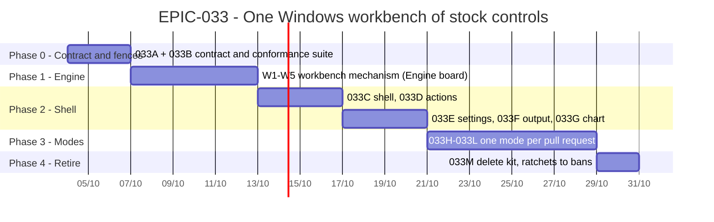

# EPIC-033 — Tracking

- **Epic:** [EPIC-033](README.md)
- **Status:** 🔵 Planned
- **Target Completion:** not set; Phase 1 waits on O1
- **Renders:** GitHub Markdown, VS Code Mermaid preview, or mermaid.live.

---

## 1. Schedule (Gantt)

---

## 2. Sub-tasks & PR Matrix

| Id | Sub-task | Branch / PR | Risk | Status | Target / Merged |
| :--- | :--- | :--- | :-: | :--- | :--- |
| EPIC-033A | [The rules say one look per control kind: stock Qt widgets in the platform style](incomplete/EPIC-033A_stock_control_contract.md) | — | 🟢 | 🔵 Planned | — |
| EPIC-033B | [A booted-app conformance suite and static bans hold the contract, shrink-only until each mode migrates](incomplete/EPIC-033B_workbench_conformance_fences.md) | — | 🟡 | 🔵 Planned | — |
| EPIC-033C | [One top-level workbench window: menu bar, mode bar, View menu, Reset layout, status bar](incomplete/EPIC-033C_workbench_shell.md) | — | 🔴 | 🔵 Planned | — |
| EPIC-033D | [Every command is one QAction contributed by its module: menu entry, toolbar button and shortcut share it](incomplete/EPIC-033D_commands_as_actions.md) | — | 🟡 | 🔵 Planned | — |
| EPIC-033E | [One Settings dialog with sections, OK, Apply and Cancel](incomplete/EPIC-033E_settings_dialog.md) | — | 🟡 | 🔵 Planned | — |
| EPIC-033F | [One Output dock with a channel per module replaces three log cards](incomplete/EPIC-033F_one_output_dock.md) | — | 🟢 | 🔵 Planned | — |
| EPIC-033G | [The chart is a canvas; its controls are actions in the toolbar and the context menu](incomplete/EPIC-033G_stock_chart_controls.md) | — | 🟡 | 🔵 Planned | — |
| EPIC-033H | [Dev Board: plain panels, no card inside a dock, contributions only](incomplete/EPIC-033H_dev_board_workbench.md) | — | 🟡 | 🔵 Planned | — |
| EPIC-033I | [Futures and Spot desks are workbenches: chart central, Order, Account and Strategy docks](incomplete/EPIC-033I_trading_desks_workbench.md) | — | 🔴 | 🔵 Planned | — |
| EPIC-033J | [Database is a workbench: shard table central, Sync dock, actions in menu and context menu](incomplete/EPIC-033J_database_workbench.md) | — | 🟡 | 🔵 Planned | — |
| EPIC-033K | [Watchlist and Welcome follow the contract](incomplete/EPIC-033K_watchlist_and_welcome.md) | — | 🟢 | 🔵 Planned | — |
| EPIC-033L | [Backtest is a workbench and its sixteen dialogs are stock dialogs](incomplete/EPIC-033L_backtest_workbench.md) | — | 🔴 | 🔵 Planned | — |
| EPIC-033M | [The kit, the palette and the theme bootstrap are deleted; every ratchet becomes a ban](incomplete/EPIC-033M_retire_kit.md) | — | 🟢 | 🔵 Planned | — |

---

## 3. Milestone & Status Log

| Date | Item | Event & Outcome |
| :--- | :--- | :--- |
| 2026-10-04 | Spec | Epic planned from the UI review; D3 awaits the user. |

---

## 4. Blockers & Dependencies

| Blocker / Dependency | Impacted Tasks | Resolution / Owner | Status |
| :--- | :--- | :--- | :--- |
| O1: Engine-first (D3) | 033C-033F | The user confirms, or the fallback in the decision record applies | 🟡 Open |
| Engine release pinned in `engine.ref` | Phase 2 | Engine track W1-W5 | 🟡 Open |
