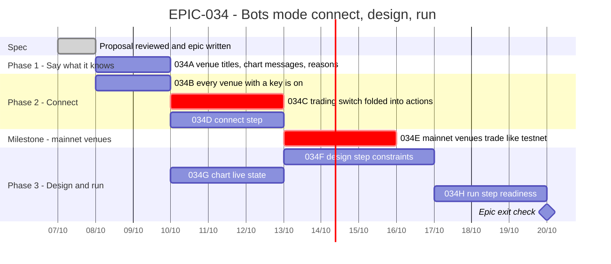

# EPIC-034 — Tracking

- **Epic:** [EPIC-034](README.md)
- **Status:** 🔵 Planned
- **Target Completion:** not set; each phase is one or two pull requests
- **Renders:** GitHub Markdown, VS Code Mermaid preview, or mermaid.live.

---

## 1. Schedule (Gantt)

---

## 2. Sub-tasks & PR Matrix

| Id | Sub-task | Branch / PR | Risk | Status | Target / Merged |
| :--- | :--- | :--- | :-: | :--- | :--- |
| EPIC-034A | [Venue titles, chart messages, disabled reasons](incomplete/EPIC-034A_bots_mode_says_what_it_knows.md) | — | 🟢 | 🔵 Planned | — |
| EPIC-034B | [Every venue with a key is on](completed/EPIC-034B_every_venue_with_a_key_is_on.md) | — | 🟡 | ✅ Done (2026-10-07) | — |
| EPIC-034C | [Trading switch folded into actions](completed/EPIC-034C_trading_switch_folded_into_actions.md) | — | 🔴 | ✅ Done (2026-10-07) | — |
| EPIC-034D | [Connect step](completed/EPIC-034D_connect_step.md) | — | 🟡 | ✅ Done (2026-10-07) | — |
| EPIC-034E | [Mainnet venues trade like testnet](incomplete/EPIC-034E_mainnet_venues_trade_like_testnet.md) | — | 🔴 | 🟡 In progress | — |
| EPIC-034F | [Design step constraints](incomplete/EPIC-034F_design_step_constraints.md) | — | 🟡 | 🔵 Planned | — |
| EPIC-034G | [Chart live state](incomplete/EPIC-034G_chart_live_state.md) | — | 🟡 | 🔵 Planned | — |
| EPIC-034H | [Run step readiness](incomplete/EPIC-034H_run_step_readiness.md) | — | 🟡 | 🔵 Planned | — |

---

## 3. Milestone & Status Log

| Date | Item | Event & Outcome |
| :--- | :--- | :--- |
| 2026-10-07 | Spec | Epic, decision record and eight sub-tasks written from the owner's proposal review. |
| 2026-10-07 | D11 | The owner decided that mainnet trades exactly like testnet: `EPIC-034E` became two mainnet venues from the same code; D4 and `EPIC-026` D3 are superseded. |

---

## 4. Blockers & Dependencies

| Blocker / Dependency | Impacted Tasks | Resolution / Owner | Status |
| :--- | :--- | :--- | :--- |
| D5–D10 not yet answered one by one | EPIC-034D, 034E, 034F, 034G, 034H | the owner accepted them on 2026-10-07 | ✅ Resolved |
| D10 adds the `keyring` dependency | EPIC-034E | approved by the owner on 2026-10-07 | ✅ Resolved |
