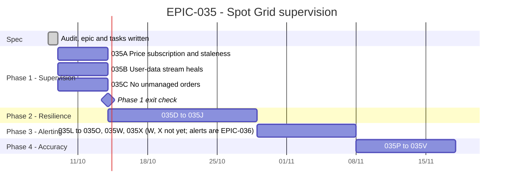

# EPIC-035 — Tracking

- **Epic:** [EPIC-035](README.md)
- **Status:** 🔵 Planned
- **Target Completion:** Phase 1 first; no date set by the owner
- **Renders:** GitHub Markdown, VS Code Mermaid preview, or mermaid.live.

---

## 1. Schedule (Gantt)

---

## 2. Sub-tasks & PR Matrix

| Id | Sub-task | Branch / PR | Risk | Status | Target / Merged |
| :--- | :--- | :--- | :-: | :--- | :--- |
| EPIC-035A | [Price subscription](completed/EPIC-035A_the_bot_owns_its_price_subscription.md) | `epic-035a-bot-owns-price-subscription`, PR #430 | 🔴 | ✅ Done (2026-10-08) | merged |
| EPIC-035B | [User-data stream](completed/EPIC-035B_the_user_data_stream_heals_itself_and_catches_up.md) | branch `claude/epic-035b-user-stream-heals`, PR #431 | 🔴 | ✅ Done (2026-10-08) | pull request open, awaiting merge |
| EPIC-035C | [Unmanaged orders, stuck states](completed/EPIC-035C_no_unmanaged_orders_and_no_stuck_states.md) | branch `epic-035c-no-unmanaged-orders` | 🔴 | ✅ Done (2026-10-08) | pull request open, awaiting review |
| EPIC-035E | [Symbol status gates placement](completed/EPIC-035E_symbol_status_gates_placement.md) | branch `claude/epic-035efg-status-key-store`, PR #436 | 🟡 | ✅ Done (2026-10-08) | pull request open, awaiting review |
| EPIC-035F | [A revoked key is named](completed/EPIC-035F_a_revoked_key_is_named_and_alerted.md) | PR #436 | 🟡 | ✅ Done (2026-10-08); alert waits for 035K | pull request open, awaiting review |
| EPIC-035G | [A failed store write still parks](completed/EPIC-035G_a_failed_store_write_still_parks.md) | PR #436 | 🟡 | ✅ Done (2026-10-08) | pull request open, awaiting review |
| EPIC-035H | [One instance per data root](completed/EPIC-035H_one_app_instance_per_data_root.md) | branch `claude/epic-035h-035i` | 🟡 | ✅ Done (2026-10-08) | pull request open, awaiting review |
| EPIC-035I | [OS sleep](completed/EPIC-035I_os_sleep_is_detected_and_reconciled.md) | branch `claude/epic-035h-035i` | 🟡 | ✅ Done (2026-10-08) | pull request open, awaiting review |
| EPIC-035J | [Reference price has an age](completed/EPIC-035J_the_reference_price_has_an_age.md) | branch `claude/epic-035d-035j-resilience` | 🟡 | ✅ Done (2026-10-08) | pull request open, awaiting review |
| EPIC-035D | [Retry and backoff](completed/EPIC-035D_retry_and_backoff_for_exchange_calls.md) | branch `claude/epic-035d-035j-resilience` | 🟡 | ✅ Done (2026-10-08) | pull request open, awaiting review |
| EPIC-035E–G | Phase 2 (see the [README](README.md) §3) | — | 🟡 | 🔵 Planned | — |
| EPIC-035K | [Superseded by EPIC-036](cancelled/EPIC-035K_alerts_reach_a_user_who_is_away.md) | — | 🟡 | ❌ Cancelled (2026-10-08) | — |
| EPIC-035L | [Range exit, Start outside the range](completed/EPIC-035L_range_exit_and_start_outside_the_range.md) | branch `claude/epic-035l-035s-range-and-levels` | 🟡 | ✅ Done (2026-10-08); alert waits for 036B | pull request open, awaiting review |
| EPIC-035M | [PnL is complete](completed/EPIC-035M_pnl_is_complete.md) | branch `claude/epic-035-mn` | 🟢 | ✅ Done (2026-10-08) | pull request open, awaiting review |
| EPIC-035N | [Invalid parameters explained](completed/EPIC-035N_invalid_parameters_are_explained_where_they_are.md) | branch `claude/epic-035-mn` | 🟢 | ✅ Done (2026-10-08); status bar → 035W | pull request open, awaiting review |
| EPIC-035O | Phase 3 (see the [README](README.md) §3) | — | 🟡 | 🔵 Planned | — |
| EPIC-035W | [Health visible on screen](incomplete/EPIC-035W_the_bots_health_is_visible_on_screen.md) | — | 🟡 | 🔵 Planned; owner: not yet | — |
| EPIC-035X | [Decision audit trail](incomplete/EPIC-035X_every_bot_decision_is_in_an_audit_trail.md) | — | 🟡 | 🔵 Planned; owner: not yet | — |
| EPIC-035S | [Levels that round together are refused](completed/EPIC-035S_levels_that_round_together_are_refused.md) | branch `claude/epic-035l-035s-range-and-levels` | 🟢 | ✅ Done (2026-10-08) | pull request open, awaiting review |
| EPIC-035R | [Resume sizes from what is left](completed/EPIC-035R_resume_sizes_from_what_is_left.md) | branch `claude/epic-035t-035r` | 🟡 | ✅ Done (2026-10-08) | pull request open, awaiting review |
| EPIC-035T | [A rejected counter order does not kill the grid](completed/EPIC-035T_a_rejected_counter_order_does_not_kill_the_grid.md) | branch `claude/epic-035t-035r` | 🟡 | ✅ Done (2026-10-08) | pull request open, awaiting review |
| EPIC-035P–Q, U–V | Phase 4 (see the [README](README.md) §3) | — | 🟡 | 🔵 Planned | — |

---

## 3. Milestone & Status Log

| Date | Item | Event & Outcome |
| :--- | :--- | :--- |
| 2026-10-08 | Spec | Epic scaffolded from the audit; owner decisions D1–D4 recorded (D4: option (a)). |
| 2026-10-08 | 035W, 035X | Added to Phase 3 at the owner's request; the owner asked that they not be started yet (D5). |
| 2026-10-08 | 035A | Implemented; PR #430 merged. |
| 2026-10-08 | 035Q | `BUG-188` delivered the reconciler's executed-quantity read for *saved* orders; adopted orders still start at zero, so 035Q stays open. |

---

## 4. Blockers & Dependencies

| Blocker / Dependency | Impacted Tasks | Resolution / Owner | Status |
| :--- | :--- | :--- | :--- |
| D4: Start with the price outside the range | EPIC-035L | Decided 2026-10-08, option (a); recorded in the decision file | ✅ Resolved |
