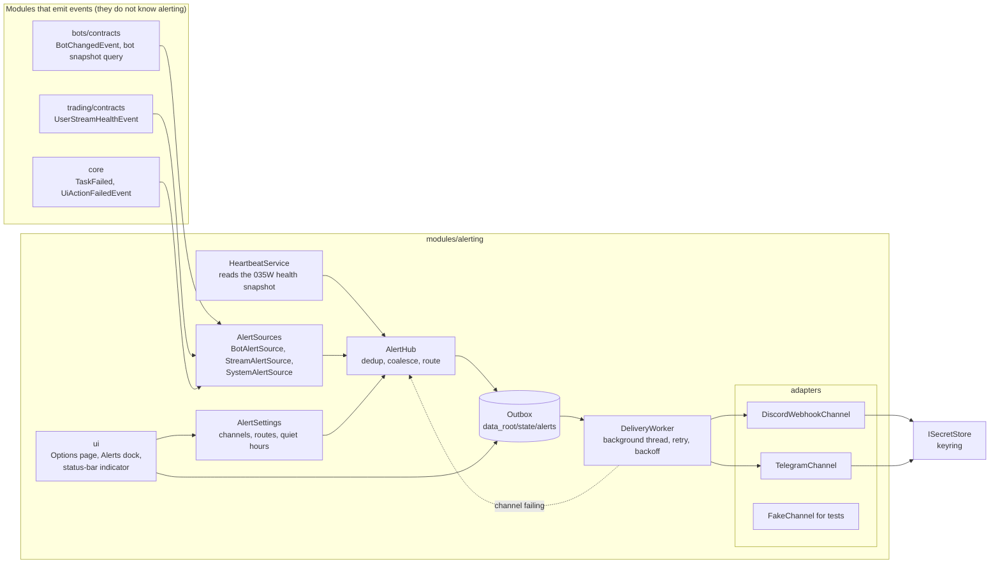
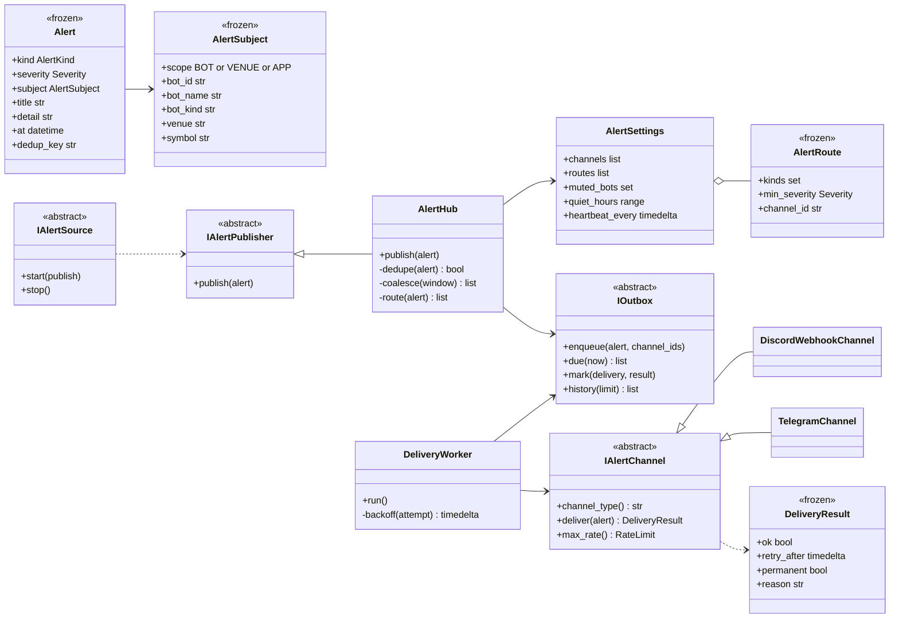
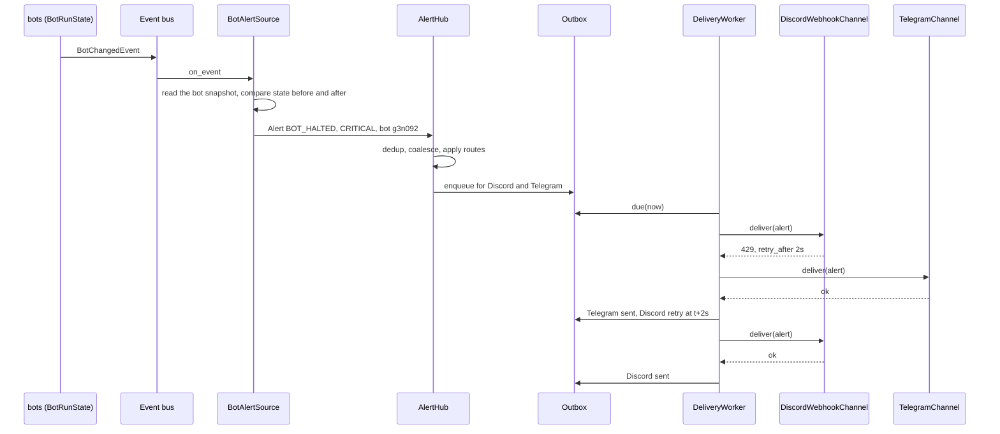
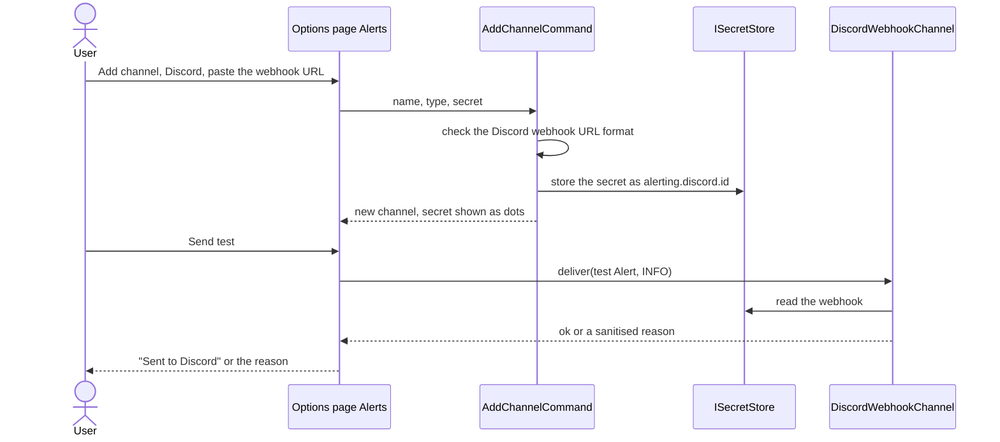
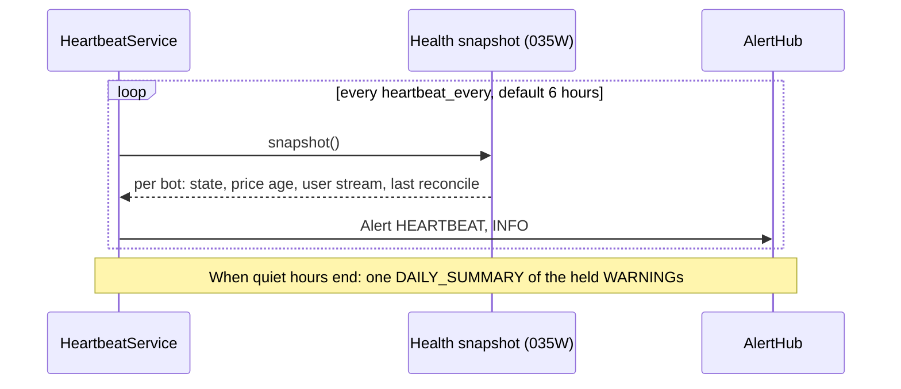
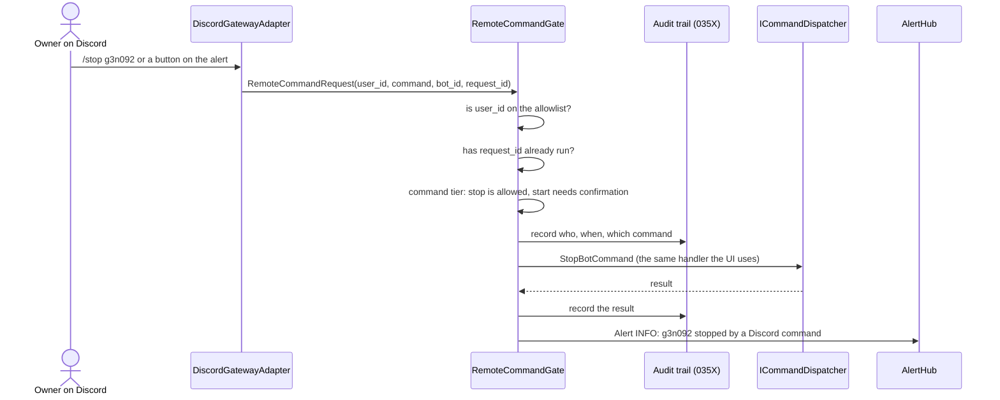

# DESIGN — Alerting and remote control (the alerting module)

**Epic:** [EPIC-036](README.md)
**Date:** 2026-10-08
**Status:** Approved by the owner (decisions N1–N8, [decision record](DECISION_2026-10-08_alerting_module.md))
**Source:** an English transcription of the owner-approved design page (Vietnamese, written against `master-warrior` `1f890e0`). The page is a private artifact that a later session may not be able to open (secondary reference only: https://claude.ai/artifact/Q6J7i4FCLEhHXZiQtruAm1). **This file is the design of record.** The research behind it is in [`RESEARCH_2026-10-08_alerting_lessons.md`](RESEARCH_2026-10-08_alerting_lessons.md). Names that do not exist in the code yet are proposals.

| Label | Meaning |
| :--- | :--- |
| Now | exists on `master-warrior` |
| Proposed | designed here, not built |
| Gap | missing and needs closing |

## 1. Problem and goals

| Existing | State | Problem |
| :--- | :--- | :--- |
| `INotificationChannel.send(str)` | Now | Sends a raw string. A channel knows no severity, bot or reason, so it cannot format or filter. |
| `TelegramNotificationChannel` | Now | The token is in the config file, not the keyring. No retry; a failure is only logged. |
| `NotificationEventHandler` | Now | Hears system failures only (task failed, UI action failed, sync failed). Hears no bot. Its debounce remembers only the last message. |
| Bot alerts (HALT, stop-loss, feed lost, …) | Gap | Only an INFO log line and the Bots screen refreshing. The owner away from the machine does not know. |
| A configuration UI | Gap | Config is hand-edited; no Send test; no view of what was sent or what failed. |

Goals:
- **No miss:** each bot safety event yields exactly one alert; when a channel fails, retry, and if it still fails say so in the app.
- **No spam:** 20 bots losing the price feed in one network drop become one grouped message.
- **A channel is one file; a new kind of bot needs no change in the alerting module.**
- **Secrets** (webhook, token) live only in the keyring, never in a log, an error or a screen.
- **A failing, slow or rate-limited channel never affects a bot.**

## 2. Why this is a module
The earlier view was "just add a channel". The approved scope is larger: a configuration page, per-alert and per-bot routing, a delivery history, a retry queue, a heartbeat and, later, commands from Discord. That is its own data, UI and lifecycle: a bounded context, `src/modules/alerting`.

**Dependency rules**
- **alerting listens; nobody depends on it.** It reads `bots/contracts` and `trading/contracts`. `bots` and `trading` import nothing from `alerting`, so a new kind of bot changes nothing in `alerting`.
- Channels (Discord, Telegram) are adapters in `alerting/adapters`.

**What moves**
- The Telegram channel moves from `infrastructure/notifications` into `alerting/adapters`.
- `ISecretStore` moves from `support/binance_gateway/contracts` to `core/contracts`, so `alerting` and `trading` share it.

**What stays**
- The in-app `INotifier` (toasts and dialogs) is unchanged: a notice inside the app is not an alert outside it.

**What is not done**
- No "Discord" word in `bots` or `trading`.
- No second port beside `INotificationChannel`: the old port is extended into `IAlertChannel`, with a migration step for the old toast channel.
- No new library for sending: a Discord webhook and a Telegram message are each one POST, done with `urllib` as Telegram does today.

## 3. Vocabulary

| Term | Meaning |
| :--- | :--- |
| `Alert` | Something worth reporting: kind, severity, subject, title, detail, time, dedup key. Frozen. |
| `AlertKind` | The fixed catalog: BOT_HALTED, BOT_ERROR, STOP_LOSS_HIT, TAKE_PROFIT_HIT, PRICE_FEED_STALE, USER_STREAM_DOWN, KEY_REJECTED, STORAGE_FAILURE, STOP_FAILED, RATE_LIMITED, RANGE_EXIT, APP_FAILURE, HEARTBEAT, DAILY_SUMMARY, CHANNEL_FAILING. |
| `Severity` | CRITICAL (money at risk, act now), WARNING (the bot handled it, the owner should know), INFO (summary, heartbeat). |
| `AlertSubject` | What the alert is about: a bot (id, name, kind, venue, symbol), a venue, or the whole app. It lets a future "Stop this bot" button point at the right bot. |
| `AlertSource` | Turns one module's events into alerts. One file each: bot, user stream, system. |
| `Route` | Which alert kinds, at what minimum severity, go to which channel; which bots are muted; quiet hours. |
| `Loudness` | A routing cell's level: loud, silent (sent, no sound) or off. |
| `Delivery` | One alert sent through one channel: pending, sent, retrying, failed. Kept in the outbox. |

## 4. Component diagram



Path of an alert: event → AlertSource → AlertHub → outbox → DeliveryWorker → channel. No step runs on a bot's thread or the UI thread. When a channel fails, that failure itself becomes a `CHANNEL_FAILING` alert, sent through the channels still alive and shown on the status bar.

## 5. Class diagram



## 6. Key design points
- **`deliver` returns a result and never raises.** `DeliveryResult` says whether it was sent, whether to retry after `retry_after` (a Discord 429), or whether the failure is permanent (a deleted webhook). The worker decides retry or give up from it.
- **Each channel formats its own message.** Discord uses an embed coloured by severity; Telegram uses Markdown. The hub passes a typed `Alert`, never a pre-built string.
- **The outbox is persistent** (SQLite). If the app stops or the network drops, unsent alerts remain and go out when it returns. An alert older than 24 h is marked expired instead of being sent late and misleading.
- **Secrets go through `ISecretStore`.** The interface moves to `core/contracts`. A channel reads its secret by name at send time; no secret is in `AlertSettings`.
- **A new kind of bot needs no change in alerting.** `BotAlertSource` maps the generic bot state and reason (`BotHaltReason`) to an `AlertKind`; a kind-specific reason goes in the detail.

## 7. Many bots, many channels

| Situation | Handling |
| :--- | :--- |
| One bot repeats the same condition | Dedup by `dedup_key` (kind + bot + reason) with a window per severity: CRITICAL 1 minute, WARNING 15 minutes. When the condition clears (the bot is RUNNING again), send one recovery alert. |
| Many bots hit one incident (a network drop) | Coalesce within a 10-second window: same kind and same venue become one message such as "PRICE_FEED_STALE on Spot Mainnet: 7 bots", listing the bots. |
| A channel is rate limited | Each channel declares `max_rate`. The worker keeps a queue per channel and honours `retry_after`. A slow channel never makes another wait. |
| A bot under test should be quiet | Mute alerts for that bot from its context menu. CRITICAL still goes unless alerts are turned Off, with a confirmation. |
| Night | Quiet hours: INFO and WARNING are held and sent as one summary when the period ends. CRITICAL always goes at once. |
| A venue outage causes a flood of child alerts | Inhibition: while a "Spot Mainnet disconnected" alert is active, the per-bot "price feed stale" alerts of that venue are held and shown only as a count. |
| A channel makes the sender wait too long | If `retry_after` exceeds 5 minutes, a CRITICAL alert fails over to another channel at once; if none is left, the status bar turns red. |
| The app dies or the machine is off | The app cannot report its own death. Two layers: a periodic heartbeat message and, more important, a ping every 5 minutes to an external service (the dead man's switch) that alerts the owner when the pings stop. |

## 8. Sequence: a bot halts, the alert goes out, one channel is rate limited



The Telegram message does not wait for Discord. If Discord fails five times in a row or answers a permanent error, the hub raises `CHANNEL_FAILING` through the remaining channels and the status bar shows "Alerts: Discord failing".

## 9. Sequence: add a Discord channel and send a test



The secret is never shown again; to change it, paste a new URL. An error says "invalid webhook" or "Discord refused (404)", never the URL.

## 10. Sequence: heartbeat and summary



The heartbeat reads the same health snapshot as the on-screen health strip (`EPIC-035W`), so the message and the screen never say two things.

## 11. Sequence: a remote command (Phase 4, `EPIC-036F`)



Seams needed:
- **`IRemoteCommandSource`:** the receive side, separate from `IAlertChannel`. Discord implements both; Telegram may implement only the send side.
- **`RemoteCommandGate`:** checks permission, prevents duplicate runs, applies tiers and audits. Every remote command passes it.
- Remote commands use the UI's own handlers, so the one-instance lock and the Start preconditions apply unchanged.

Safety:
- Only allowlisted user IDs may command.
- Status, pause and stop run at once. Start and resume need a second confirmation and are off by default on mainnet.
- The connection is the Discord gateway websocket: the app connects outward and opens no port. A library (for example `discord.py`) or a hand-written client is needed, and a new dependency needs the owner's approval.
- Built after `EPIC-035X`, so the first remote command already has an audit record.

## 12. UI (QtWidgets, `IOptionsSection`, `configure_item_view`, `preview.py`)

### 12.1 Tools → Options → Alerts

```text
+-- Options ------------------------------------------------ OK  Cancel  Apply --+
| General       | CHANNELS                                                        |
| Trading       |  Channel   Type      Last send                     Enabled      |
| Market data   |  * Phone   Discord   16:52 sent                    [x]          |
| > Alerts      |  ! Backup  Telegram  16:40 failed: token rejected  [x]          |
| Developer     |  [Add...] [Edit...] [Remove] [Send test]                        |
|               |                                                                 |
|               | WHAT GOES WHERE                                                 |
|               |  Alert group                                    Level   Phone   Backup |
|               |  Bot halted, error, SL/TP hit, stop failed      CRIT    loud    loud   |
|               |  Feed lost, stream down, key rejected, disk     CRIT    loud    loud   |
|               |  Rate limited, price left the grid              WARN    silent  off    |
|               |  Heartbeat, summary                             INFO    silent  off    |
|               |                                                                 |
|               | SCHEDULE                                                        |
|               |  Dead man's switch: [https://hc-ping.com/...] (kept in keyring) |
|               |  Heartbeat every [6 hours v]                                    |
|               |  Quiet hours [x] from [23:00] to [07:00]  (critical still sent) |
+-----------------------------------------------------------------------------+
```

- Add… and Edit… are a standard `QDialog`: channel type, name, a password-style secret field. On Edit, an empty secret field keeps the stored secret.
- The alert groups are fixed in code; a new `AlertKind` is added to one group.
- A note on the page: the chat platform accepting a message does not mean the owner read it; a stray message in the channel does not prove a bot has trouble, check the app.
- Suggested: a dedicated channel for critical alerts. Actions: Send test, Rotate webhook.

### 12.2 View → Alerts dock

```text
+-- Alerts ------------------------------------ Filter: [All v]   [Retry failed] --+
| Time      Severity  Subject            Message                        Phone    Backup   |
| 22:41:07  critical  g3n092 ETHUSDT     Stop loss 2419 hit (low 2415.8) sent     failed x3|
| 22:40:51  warning   Spot Mainnet 3 bots Price feed silent 64 s         sent     -        |
| 18:00:00  info      App                Heartbeat: 3 bots RUNNING        sent     -        |
+----------------------------------------------------------------------------------------+
```

A repeated alert is one row with a counter. Delivery status reads "accepted by Discord/Telegram" in the tooltip: it does not mean read.

### 12.3 Status-bar indicator

```text
Exchange: connected | Market data: live | (!) Alerts: Backup failing
```

Three states: off (no channel configured), ok, or the name of the failing channel. Clicking it opens the Alerts dock.

### 12.4 Per bot

The bot's context menu in the Bots list gains **Alerts: On / Critical only / Off**. Off asks for a confirmation. A bot whose alerts are not On shows a crossed-out bell on its row so the owner does not forget it is quiet.

## 13. Decisions N1–N8 (all approved 2026-10-08)

| # | Decision | Task |
| :--- | :--- | :--- |
| N1 | A module `src/modules/alerting`; Telegram moves into it; the in-app `INotifier` stays | [036A](incomplete/EPIC-036A_alerting_core.md), [036B](incomplete/EPIC-036B_alert_sources.md) |
| N2 | A persistent outbox (SQLite in `data_root/state`); alerts older than 24 h expire | 036A |
| N3 | The Telegram token moves to the keyring (migrated once from config); the Discord webhook in the keyring only | [036A](incomplete/EPIC-036A_alerting_core.md), [036C](incomplete/EPIC-036C_discord_channel_and_telegram_migration.md) |
| N4 | Defaults: CRITICAL loud, WARNING silent, heartbeat 6 h, no quiet-hours preset | 036A, [036E](incomplete/EPIC-036E_heartbeat_dead_mans_switch_and_summary.md) |
| N5 | Per-bot alerts: On / Critical only / Off; Off needs a confirmation | 036A, [036D](incomplete/EPIC-036D_alerts_ui.md) |
| N6 | Remote control from Discord is a separate Phase-4 task after `EPIC-035X`; allowlist; library decided at start | [036F](incomplete/EPIC-036F_remote_control_from_discord.md) |
| N7 | A dead man's switch adapter (healthchecks.io or the owner's URL); off by default | 036E |
| N8 | CRITICAL goes to two channels when two or more are configured | 036A |

## 14. Task split
Each task is one pull request, in dependency order:
1. [036A](incomplete/EPIC-036A_alerting_core.md) — the core: module, `Alert`, `IAlertChannel`, `AlertHub`, outbox, worker, `ISecretStore` to core; proved by a `FakeChannel`.
2. [036B](incomplete/EPIC-036B_alert_sources.md) — the sources; `SystemAlertSource` replaces `NotificationEventHandler`.
3. [036C](incomplete/EPIC-036C_discord_channel_and_telegram_migration.md) — Discord, Telegram moved, token to the keyring, no secret in any log.
4. [036D](incomplete/EPIC-036D_alerts_ui.md) — Options page, dock, indicator, per-bot mute, previews.
5. [036E](incomplete/EPIC-036E_heartbeat_dead_mans_switch_and_summary.md) — heartbeat, dead man's switch, summary; with or after `EPIC-035W`.
6. [036F](incomplete/EPIC-036F_remote_control_from_discord.md) — Phase 4 remote control, after `EPIC-035X`.

The "existing seams" this design was read from: `src/core/contracts/i_notification_channel.py`, `src/infrastructure/notifications/telegram_notification_channel.py`, `src/shell/notification_event_handler.py`, `src/core/contracts/i_options_section.py`, `src/support/binance_gateway/contracts/i_secret_store.py`.
