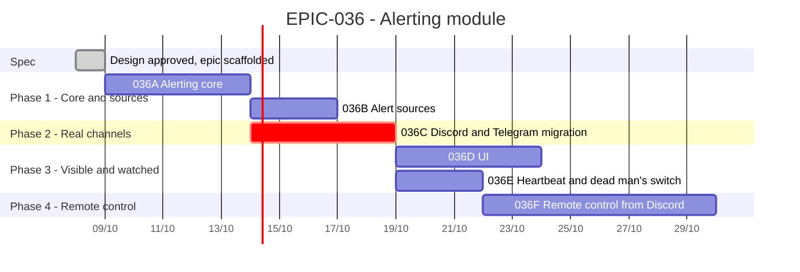

# EPIC-036 — Tracking

- **Epic:** [EPIC-036](README.md)
- **Status:** 🔵 Planned — not started (the owner said: create it and leave it)
- **Target Completion:** not set; each task is one pull request
- **Renders:** GitHub Markdown, VS Code Mermaid preview, or mermaid.live.

---

## 1. Schedule (Gantt)

---

## 2. Sub-tasks & PR Matrix

| Id | Sub-task | Branch / PR | Risk | Status | Target / Merged |
| :--- | :--- | :--- | :-: | :--- | :--- |
| EPIC-036A | [Alerting core](incomplete/EPIC-036A_alerting_core.md) | — | 🟡 | 🔵 Planned | — |
| EPIC-036B | [Alert sources](incomplete/EPIC-036B_alert_sources.md) | — | 🟢 | 🔵 Planned | — |
| EPIC-036C | [Discord channel and Telegram migration](incomplete/EPIC-036C_discord_channel_and_telegram_migration.md) | — | 🟡 | 🔵 Planned | — |
| EPIC-036D | [UI](incomplete/EPIC-036D_alerts_ui.md) | — | 🟢 | 🔵 Planned | — |
| EPIC-036E | [Heartbeat, dead man's switch, daily summary](incomplete/EPIC-036E_heartbeat_dead_mans_switch_and_summary.md) | — | 🟡 | 🔵 Planned; waits for 035W | — |
| EPIC-036F | [Remote control from Discord](incomplete/EPIC-036F_remote_control_from_discord.md) | — | 🔴 | 🔵 Planned; waits for 035X and the owner's library approval | — |

---

## 3. Milestone & Status Log

| Date | Item | Event & Outcome |
| :--- | :--- | :--- |
| 2026-10-08 | Spec | Design approved by the owner (N1–N8); epic scaffolded with six children; `EPIC-035K` superseded. Documentation only. |

---

## 4. Blockers & Dependencies

| Blocker / Dependency | Impacted Tasks | Resolution / Owner | Status |
| :--- | :--- | :--- | :-: |
| The health snapshot of [`EPIC-035W`](../EPIC-035_spot_grid_unattended_safety/incomplete/EPIC-035W_the_bots_health_is_visible_on_screen.md) (the owner asked that it not be started yet) | 036E | Land 035W first, or 036E ships without the heartbeat body and adds it after | 🟡 Open |
| The audit journal of [`EPIC-035X`](../EPIC-035_spot_grid_unattended_safety/incomplete/EPIC-035X_every_bot_decision_is_in_an_audit_trail.md) | 036F | Land 035X first | 🟡 Open |
| A Discord gateway library is a new dependency (`requirements.txt`, `ONBOARDING.md` §7) | 036F | The owner approves the library when 036F starts | 🟡 Open |
