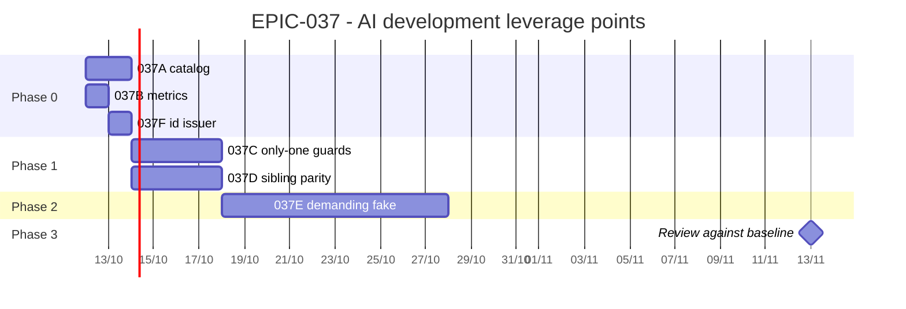

# EPIC-037 — Tracking

- **Epic:** [README](README.md)
- **Status:** 🔵 Planned
- **Target Completion:** 2026-11-13 (four weeks from the start in the week of 2026-10-12; a target, not a commitment)
- **Renders:** GitHub Markdown, VS Code Mermaid preview, or mermaid.live.

---

## 1. Schedule (Gantt)

---

## 2. Sub-tasks & PR Matrix

| Id | Sub-task | Branch / PR | Risk | Status | Target / Merged |
| :--- | :--- | :--- | :-: | :--- | :--- |
| EPIC-037A | [capability catalog](incomplete/EPIC-037A_capability_catalog.md) | — | 🟢 | 🔵 Planned | 2026-10-14 |
| EPIC-037B | [system-health metrics](incomplete/EPIC-037B_system_health_metrics.md) | — | 🟢 | 🔵 Planned | 2026-10-13 |
| EPIC-037F | [one id issuer](incomplete/EPIC-037F_one_place_issues_task_ids.md) | — | 🟢 | 🔵 Planned | 2026-10-14 |
| EPIC-037C | [only-one guards](incomplete/EPIC-037C_only_one_guards.md) | — | 🟡 | 🔵 Planned | 2026-10-20 |
| EPIC-037D | [sibling parity tests](incomplete/EPIC-037D_sibling_parity_tests.md) | — | 🟡 | 🔵 Planned | 2026-10-20 |
| EPIC-037E | [demanding fake exchange](incomplete/EPIC-037E_demanding_fake_exchange.md) | — | 🔴 | 🔵 Planned | 2026-11-03 |

---

## 3. Milestone & Status Log

| Date | Item | Event & Outcome |
| :--- | :--- | :--- |
| 2026-10-09 | Spec | Epic scaffolded from the systems analysis; not started. |

---

## 4. Blockers & Dependencies

| Blocker / Dependency | Impacted Tasks | Resolution / Owner | Status |
| :--- | :--- | :--- | :--- |
| `hypothesis` as a test dependency | EPIC-037E | The owner approves or the task uses a hand-written seeded runner | 🟡 Open |
