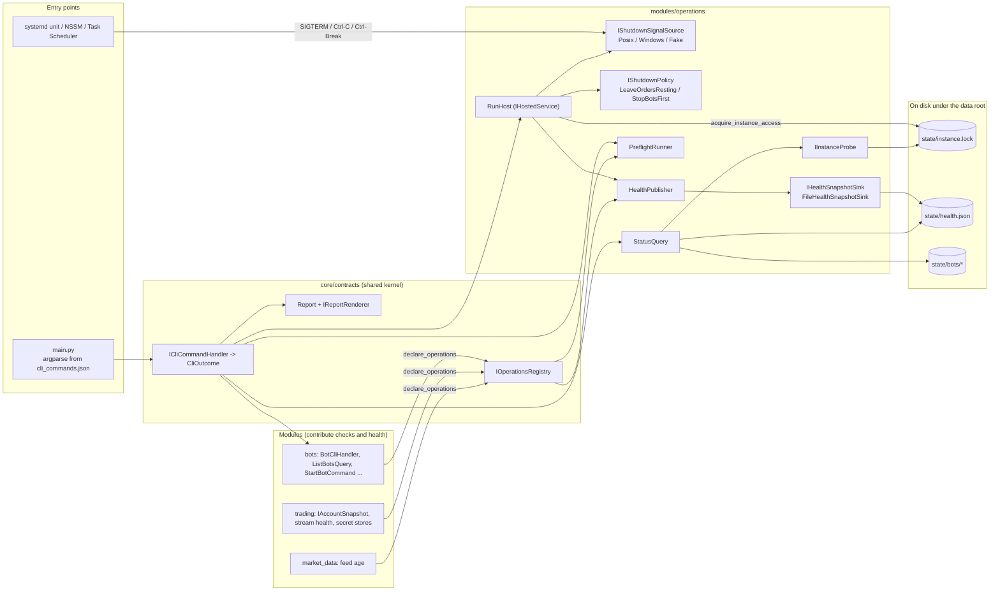
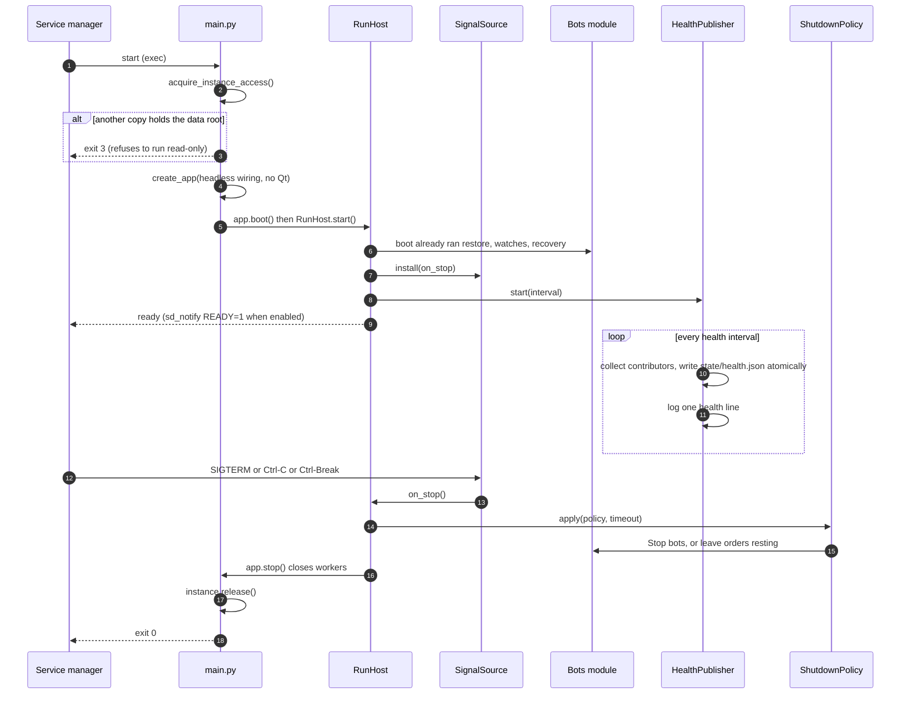
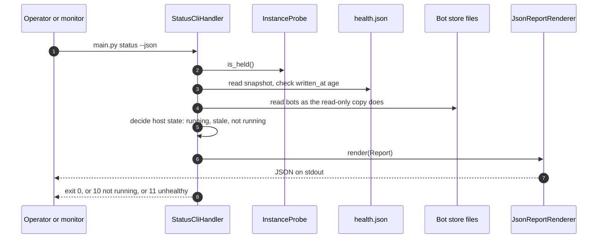
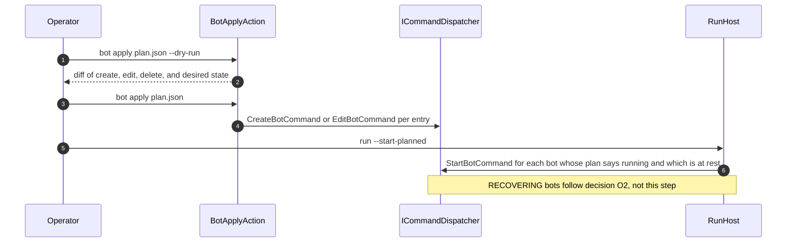
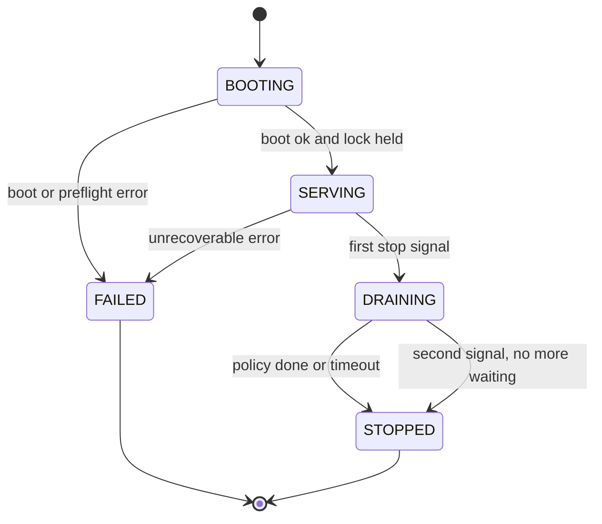

# DESIGN — Running the bots with no GUI: a `run` host, a status read model, and the seams that keep Qt out

**Epic:** [EPIC-038](README.md)
**Date:** 2026-10-09
**Status:** Proposed — written for the owner's review; the open choices are in [`DECISION_2026-10-09_headless_operation.md`](DECISION_2026-10-09_headless_operation.md). Nothing here is built. Names that do not exist in the code yet are proposals.
**Research behind it:** [`RESEARCH_2026-10-09_headless_operation.md`](RESEARCH_2026-10-09_headless_operation.md) (cited below as R1–R17 by section number).

| Label | Meaning |
| :--- | :--- |
| Now | exists on `master-warrior` (`9a6099c`) |
| Proposed | designed here, not built |
| Gap | missing and needs closing |

## 1. What exists today (verified 2026-10-09 against `9a6099c` and engine `f4ef582`, the pin in `engine.ref`)

| Claim | Result | Evidence |
| :--- | :--- | :--- |
| `main.py` has a headless path | **True.** Commands `sync`, `stream`, `exchange-status`, `order-preview`, `order-dry-run`, `trade-once`; no argument starts the interactive REPL. Every command runs once and calls `app.stop()`. There is no command that runs *until told to stop*. | `src/main.py:57-80`, `src/config/cli_commands.json` |
| The CLI is table-driven | **True.** A module declares its commands (`declare_cli` → `CliRegistry`); the argument spec is data in `cli_commands.json` (including subparsers and `store_true` flags); handlers receive an `argparse.Namespace`. | `src/core/contracts/i_cli_registry.py`, `i_cli_command_handler.py`, `src/shell/cli_registry.py`, `src/presentation/cli/cli_parser.py` |
| Domain, application, adapters import no PySide6 | **True at import time** for `src/modules/*/{domain,application,adapters}`, `src/infrastructure` and `src/core` apart from three `TYPE_CHECKING`-only imports of `QWidget` (`contribution_descriptor.py:26`, `i_options_section.py:26`, `i_place_host.py:38`). A module-level import walk from `src.main` reaches no `PySide6` import in our code. | static import walk, repeated; not committed |
| **The headless path boots without PySide6** | **False.** Two independent blockers (below). The coordinator's claim was the one the epic had to prove, and it does not hold. | throwaway probe, §1.1 |
| Bots run without the window | **True**, once PySide6 is *installed* (§1.1 run C): `BotsModule.boot` restored bots, subscribed to fills/ends/ticks, started the price watch, the user-stream watch, the sleep watch and boot recovery, and `shutdown` closed the workers. Proven with an empty store; a bot with orders on an exchange was **not** run (the epic runs nothing against an exchange). | probe log, §1.1 |
| Bot infrastructure is Qt-free | **True.** `TimerBotRetryScheduler` (`threading.Timer`), `SystemBotClock`; boot recovery, `UserStreamWatch`, `BotPriceWatch`, `build_sleep_watch` are in `bots/application`. | `src/modules/bots/module.py:187-232` |
| The engine has no TUI | **True** for what was read: its UI extension is `pyside_mvc`. | `sagittarius_engine/extensions/` |
| A single-instance lock exists | **True.** `acquire_instance_access()` takes an OS exclusive lock on `<data root>/state/instance.lock`; a second copy is read-only. | `composition_root.py:157-168`, `infrastructure/single_instance/instance_access.py` |
| The process stops on SIGTERM | **Gap.** Neither `main.py` nor `src/` installs a signal handler; the only handlers in the engine are the Qt watchdog's and the audit CLI's. A `kill` (SIGTERM) ends the process without `app.stop()`, so `BotsModule.shutdown` never runs and the instance lock is released only by the OS. | `grep signal` over `src/` (none); engine `ui_watchdog.py:42`, `audit/cli.py:409` |
| A failing command exits non-zero | **Gap.** A handler "catches the domain's own errors and prints" (`i_cli_command_handler.py` docstring) and returns; `main()` has no `sys.exit`. A script cannot tell a failed `sync` from a good one. `--json` exists on `order-preview` only. | `src/main.py`, `cli_commands.json:95` |
| Logs rotate | **Gap.** The engine's file log is a plain `logging.FileHandler`. | `std_logger.py:56` |
| Secrets work headless | **Half.** Reads do: environment first, keyring second, a missing keyring reads as "nothing stored" with one INFO line. There is no supported way to *provision* a secret on a server other than a shell `export`. | `env_first_credentials_provider.py`, `keyring_secret_store.py:63-80` |
| Restarting is safe for bots | **True, with a catch.** A restart turns RUNNING/PAUSED into RECOVERING and places/cancels nothing; the reconcile "waits for the user" to open the order session, which today is the first Start/Arm/Buy in the UI (`SPEC-004`). A headless host has to say who does that (decision O2). | `bot_restore_service.py` docstring, `SPEC-004` §2 |

### 1.1 The proof (throwaway probe; not committed)
Python 3.13.16 in a scratch virtual environment, the repository at `9a6099c`, the engine cloned at the pinned `f4ef582`, `SEW_DATA_ROOT` in a scratch directory, proxies unset, no credentials: **no exchange was contacted**.

| Run | Setup | Result |
| :--- | :--- | :--- |
| A | PySide6 not installed | `import composition_root` fails: `ModuleNotFoundError: No module named 'PySide6'` at engine `pyside_mvc/safety/thread_affinity.py:6`, reached through `src/shell/system_error_report.py:41` ← `src/shell/notification_event_handler.py:54` ← `src/shell/composition_root.py:80`. The module `sagittarius_engine.extensions.pyside_mvc` runs `from . import runtime`, which imports `QtWidgets`. |
| B | a package named `PySide6` whose import raises (a stand-in for "blocked") | The same failure, as `ImportError`. |
| C | `PySide6-Essentials` installed, `QT_QPA_PLATFORM=offscreen`, no `QApplication`, no window | First needs `libEGL.so.1` (absent on the image; installed with `apt`). Then `create_app` + `boot()` succeed: "App booted successfully with 11 modules"; bots restore, subscribe and start their watches; `stop()` closes the workers; `SEW_DATA_ROOT/state/instance.lock` is created. |

Who imports PySide6 during run C: our `src/support/ui_kit/assets/icon_loader.py` (reached by `AssetValidatorExtension`, `composition_root.py:284`) and the engine's `pyside_mvc` package (through `system_error_report.py:41`), including `extensions/ui_state/ui_state_coordinator.py`. A **third** blocker is by reading, not by running (run A stops at the import first): `DependencyValidatorExtension(["PySide6", "pyqtgraph", "sqlalchemy"])` (`composition_root.py:275`) calls `importlib.util.find_spec` and `sys.exit(1)` when PySide6 is absent (engine `dependency_validator.py`).

So the three blockers are: **(1)** `system_error_report.py:41`, a *UI-failure* event imported for every entry point; **(2)** the asset validator, a *UI* check run for every entry point; **(3)** the dependency list, which names two UI packages. None is functional — each is a UI concern wired into the shared `create_app` — and each is fixed in the shell without touching a domain, which is why this is [`EPIC-038A`](incomplete/EPIC-038A_qt_free_boot_and_guard.md). Second-order cost found on the way: on a server image PySide6 needs system libraries (`libEGL`, `libGL`, `libxkbcommon`, …), so "install PySide6 and ignore it" is not free.

## 2. Goals and how SOLID shapes them
- **G1** The owner runs bots from a shell on a VPS (Linux or Windows server) with no display and no PySide6, and they restart, stop and report like any other service.
- **G2** The CLI and the GUI cannot drift: a bot action from the command line runs **the same command handler** the screen runs.
- **G3** Every new thing the headless side needs — a command, a secret backend, an output format, a preflight check, a health contributor, a stop policy, a service wrapper — is **one new class plus one registration**, with no edit to existing code.
- **G4** A script or a monitor can read the result: `--json` and documented exit codes.
- **G5** Qt cannot creep back in: CI boots the headless path with PySide6 blocked.

| Principle | Where it bites here |
| :--- | :--- |
| **S** — one reason to change | `RunHost` only sequences boot → serve → drain → stop; it does not know what a bot is. Signals, stop policy, health, and the snapshot file are separate collaborators. A command handler parses nothing and formats nothing. |
| **O** — open for extension, closed for edit | Commands (`declare_cli` + a JSON entry), renderers (`IReportRenderer`), secret backends (`ISecretStore`), preflight checks and health contributors (`declare_operations`), stop policies (`IShutdownPolicy`), signal sources, host signals (sd_notify). §9 lists the extension cases. |
| **L** — substitutable | Every `ISecretStore` obeys the port's contract (a missing store reads `None`, writing raises `SecretStoreUnavailableError`); every renderer accepts any `Report`; a `FakeSignalSource` can stand in for the OS in a test. |
| **I** — small ports | `IShutdownSignalSource`, `IShutdownPolicy`, `IHealthSnapshotSink`, `IInstanceProbe`, `IReportRenderer`, `IPreflightCheck`, `IHealthContributor` are each one method or two. The CLI never sees `IBotStore`; it sees `BotStatusReport`. |
| **D** — depend on abstractions | `operations` reads other modules through `contracts/` and contributions only; nothing in `bots`/`trading` imports `operations`. The CLI handlers for bots call `ICommandDispatcher`, the port the UI uses. |

## 3. Where it lives

```text
src/core/contracts/            (shared kernel — three small additions)
  cli_outcome.py               ExitCode (IntEnum), CliOutcome
  report.py                    Report (payload + layout), IReportRenderer, IReportFormats
  i_operations_registry.py     IOperationsRegistry (declare_health, declare_preflight)  ← mirrors ICliRegistry
src/modules/operations/        (a new bounded context: running the app unattended — proposal)
  contracts/                   HostState, HealthSnapshot, IHealthContributor, IPreflightCheck,
                               IShutdownSignalSource, IShutdownPolicy, IHealthSnapshotSink, IInstanceProbe
  application/                 RunHost, HealthPublisher, PreflightRunner, StatusQuery
  adapters/                    PosixSignalSource, WindowsSignalSource, FileHealthSnapshotSink,
                               LeaveOrdersResting, StopBotsFirst, SdNotifyHostSignal, text/json renderers
  cli/                         RunCliHandler, StatusCliHandler, PreflightCliHandler
src/modules/bots/cli/          BotCliHandler + one action class per verb (list, show, start, stop, pause, resume, apply)
src/modules/trading/adapters/  SystemdCredentialStore, PermissionCheckedFileStore (next to KeyringSecretStore)
```

**Dependency rules** (the same as `alerting`, `EPIC-036` N1): `operations` listens and is not depended on; it reads only `*/contracts/` and what modules *contribute* through `declare_operations`; `bots` and `trading` never import it. Whether a seventh module is warranted is a decision the owner can overrule (D4 in the decision record): the alternative is `shell/` plus `bots/cli`, which is smaller and puts a run loop in the composition layer.

## 4. Components



### 4.1 Ports and classes

| Name | Layer | State | Role | Implementations (each one class) |
| :--- | :--- | :--- | :--- | :--- |
| `ICliCommandHandler` | core | Now | one command; **change:** `handle` may return a `CliOutcome` (`None` = success), so existing handlers stay valid | every existing handler, unchanged |
| `ExitCode` / `CliOutcome` | core | Proposed | the documented exit codes (§7) and a message | — |
| `Report` | core | Proposed | what a command produces: a versioned JSON-ready `payload` and a neutral `layout` (titled sections of rows) | — |
| `IReportRenderer` | core | Proposed | `render(report) -> str`; registered under a name | `TextReportRenderer`, `JsonReportRenderer` |
| `IOperationsRegistry` | core | Proposed | what a module sees: `declare_health(contributor)`, `declare_preflight(check)`; the hook `declare_operations(registry)` is a default no-op on `BoundedContextModule`, like `declare_cli` | the shell's collector |
| `IHealthContributor` | operations | Proposed | `snapshot() -> Mapping` for one named section; **never blocks and never raises** (a failure is a section marked `unavailable`) | bots (state, reason, and the `EPIC-035W` bot health when it exists), trading (user-stream state and age, clock skew), market_data (last tick per symbol) |
| `IPreflightCheck` | operations | Proposed | `run() -> CheckResult` (`PASS`/`WARN`/`FAIL`, a plain-language reason and a remedy) | `ClockSkewCheck`, `CredentialsPresentCheck`, `KeyPermissionsCheck`, `OutboundAddressCheck`, `DiskSpaceCheck`, `DataRootWritableCheck`, `PythonFloorCheck`, `NoWithdrawPermissionCheck` |
| `IShutdownSignalSource` | operations | Proposed | `install(on_stop)`; one call back, idempotent; a second signal means "stop now" | `PosixSignalSource` (SIGTERM, SIGINT), `WindowsSignalSource` (SIGINT, SIGBREAK), `FakeSignalSource` |
| `IShutdownPolicy` | operations | Proposed | what to do with bots before the app stops, bounded by a timeout | `LeaveOrdersResting` (today's GUI behaviour), `StopBotsFirst` (the existing Stop: cancel, confirm, STOPPED) |
| `IHealthSnapshotSink` | operations | Proposed | `publish(snapshot)`; atomic | `FileHealthSnapshotSink` (write temp + rename), later `PrometheusTextfileSink` |
| `IInstanceProbe` | core | Proposed | `is_held() -> bool` without taking the lock for good, for `status` | the file-lock adapter |
| `IHostSignal` | operations | Proposed | `ready()`, `watchdog()`, `stopping()` toward a supervisor | `NullHostSignal` (default), `SdNotifyHostSignal` (R2) |
| `ISecretStore` | core after `EPIC-036A` | Now (in `support/binance_gateway/contracts`) | unchanged | `KeyringSecretStore`, plus `SystemdCredentialStore`, `PermissionCheckedFileStore` |
| `ICommandDispatcher` | core | Now | the one way a command reaches its handler | used by the UI and the CLI |

**Reuse before inventing (`EPIC-037`'s lesson).**
- *Parser:* nothing new. `run`, `status`, `preflight` and `bot …` are entries in `cli_commands.json` with `declare_cli` handlers; `bot`'s verbs use the existing `subparsers` form (as `stream start|stop` does).
- *Bot actions:* `bot start|stop|pause|resume|…` build `StartBotCommand` etc. and call `ICommandDispatcher.dispatch` — the call the Bots screen makes (`bots_screen/bot_actions_coordinator.py:15,31`) — so the lifecycle table, the `BotCommandGate` and the read-only rule (`ReadOnlyInstanceError`) apply identically. A test per verb asserts the CLI and the UI dispatch the same command object.
- *Reads:* `bot list|show` use `ListBotsQuery` / `GetBotQuery`. `status` adds **one** read model, `BotStatusReport`, built from those queries and the contributors; the heartbeat of `EPIC-036E` and the health strip of `EPIC-035W` are asked to read the same one (`EPIC-038C` §3), so three consumers cannot disagree.
- *Lock:* `acquire_instance_access` as is.
- *Skew:* `ConnectionStatus.server_time_skew_ms` from `IAccountSnapshot.check_connection()`, which `exchange-status` already prints.
- *Telegram in headless:* `create_app` already wires Telegram for a run with no window (`composition_root.py:262-270`); `EPIC-036` replaces it. `operations` neither adds nor removes a channel.

## 5. Sequences

### 5.1 `run`: boot, serve, drain, stop


### 5.2 `status --json` from a second process


### 5.3 `bot apply` then `run` (the v1 way to change what runs)


## 6. The `run` host

States: `BOOTING → SERVING → DRAINING → STOPPED`, plus `FAILED` from any state. `RunHost` is an `IHostedService`, so the engine starts and stops it with everything else; it owns the process's *wait*, which today only the REPL does (`shell.wait_for_exit()` in `main.py`).



- **Lock.** Taken first, as `main()` does today. A `run` that gets a read-only copy exits `3` at once: a read-only host would look alive to the supervisor while doing nothing (R13).
- **Serve.** Starts the signal source, the health publisher and (optionally) the host signal. It starts nothing about bots: `BotsModule.boot` already restored them. With `--start-planned` it dispatches `StartBotCommand` for the bots whose plan wants them running (§5.3).
- **Health line.** Every `--health-interval` (default 60 s) one log line, at INFO, parseable: `[health] state=SERVING up=…s bots=running:3,paused:1,halted:0 tick_age_s=… stream_age_s=… skew_ms=… rss_mb=…`. It is progress-based (R1), and the same data is the snapshot file (§8). Memory is on the line because an outage-driven blow-up is the documented failure (R8).
- **Stop.** First signal: `DRAINING`, run the policy under `--stop-timeout` (default 25 s; the unit's `TimeoutStopSec` must be larger, and NSSM's console wait must be raised from its 1.5 s default, R10), then `app.stop()`, release the lock, exit 0. A second signal skips the wait. A policy that times out logs at WARNING which bots it left and exits 0 — the state is on disk and the next boot treats them as RECOVERING.
- **Windows.** `SIGINT` and `SIGBREAK` both route to the same callback; a service wrapper sends Ctrl-C first (R10).
- **Crashes.** Not caught. An unhandled exception exits `1`, the supervisor restarts, and boot recovery does what it does after any crash. The host adds no retry loop (a restart loop in two layers hides failures).

### 6.1 What stopping does to resting orders (decision O1)
| Option | Behaviour | Fit |
| :--- | :--- | :--- |
| **A. Leave resting (recommended default)** | Close workers; orders stay on the exchange; the next boot reads the bot as RECOVERING and reads the exchange. This is what closing the GUI does today and what a crash does regardless. | One path for planned and unplanned stops, so only one is tested in anger. Risk: between stop and restart nothing watches stop-loss/take-profit (the GUI's own warning text says so). |
| B. Stop bots first | Dispatch the existing Stop per running bot (cancel tagged orders, confirm zero open, STOPPED) within the timeout; leave what did not finish. | Right for planned maintenance and for "I am leaving the machine". Cost: the bot must be started again afterwards, and a Stop that fails halts the shutdown path on exchange latency. |
| C. Per bot kind | A bot kind declares its own preferred policy. | More flexible, more to get wrong; defer until two kinds exist. |

Recommendation: **A as the default, B as `run --on-stop stop-bots`** for maintenance, C deferred. The policy is an `IShutdownPolicy`, so choosing again later is one class and one flag (R3).

### 6.2 Resuming after a restart (decision O2)
A restart leaves RUNNING/PAUSED bots RECOVERING and waits for the order session, which a person opens in the GUI. Headless needs an explicit answer: **(a)** `run` restores and reads, then waits for `bot resume <id>`/`confirm` — nothing trades without a human; **(b)** `run --resume-recovering` reconciles and resumes automatically; **(c)** always. Recommendation: **(a) by default, (b) opt-in,** and (b) is offered only after `EPIC-036` has shipped alerts, because (a) after a 3 a.m. crash leaves bots unmanaged and silent. That order is the dependency in §11. Whether Start from the CLI can supply what the screen supplies (`command.base`, the venue confirmation) is to be verified in `EPIC-038D`.

## 7. Exit codes (documented, stable; Proposed)
| Code | Meaning | Used by | systemd |
| :-: | :--- | :--- | :--- |
| 0 | success / clean shutdown | all | — |
| 1 | unexpected error | all | restarted |
| 2 | usage error (argparse already uses 2) | all | not restarted |
| 3 | another copy holds the data root | `run`, mutating commands | **not** restarted (`RestartPreventExitStatus`) |
| 4 | preflight failed | `run`, `preflight` | not restarted |
| 5 | configuration or credentials missing/refused | `run`, `preflight`, trade commands | not restarted |
| 6 | exchange unreachable or rejected the request (includes `-2015`, `-1021`) | commands that touch the exchange | restarted with delay |
| 10 | host not running | `status` | — |
| 11 | host running but unhealthy (snapshot stale, a section unavailable) | `status` | — |

A restart loop for a *configuration* error is the failure R1 describes in reverse; codes 3–5 stop it, and code 6 is a delay-and-retry. A command that prints a failure and returns today exits 0; moving to codes is a documented behaviour change (`EPIC-038B`).

## 8. Machine-readable output and the snapshot
- **`--json`** (the flag `order-preview` already has) on `status`, `bot list`, `bot show`, `preflight`, `exchange-status`, `order-preview`. One envelope: `{"schema": "sew.status/1", "generated_at": "…", "data": {…}}`. The schema string is versioned; a field is added within a version, never renamed. A new format (CSV, Prometheus text, a one-line `key=value`) is an `IReportRenderer` registered under a name; `--json` stays as the short form.
- **`state/health.json`** — written atomically by `FileHealthSnapshotSink` every health interval: `schema`, `app_version`, `pid`, `started_at`, `written_at`, `host_state`, and one object per contributor (`bots`, `trading`, `market_data`). It holds no secret and no account balance. `status` trusts it only if `written_at` is within 3 intervals **and** the lock is held, because a file survives a crash and the lock does not (R1, R13).
- No port is opened (R11).

## 9. Extension points and cases (the repository's `@par Extension cases` form)
```text
@par Extension cases
  · a new CLI command (e.g. `bot rebalance`) — one handler class, one entry in cli_commands.json, one
    declare_cli line in the owning module; the parser, the table and `run` do not change;
  · a new bot verb — one action class in modules/bots/cli, registered in the verb table; it dispatches
    a command the UI already has;
  · a new output format (CSV, Prometheus text, key=value) — one IReportRenderer, registered by name;
  · a new secret backend (Windows DPAPI, Vault, AWS Secrets Manager) — one ISecretStore adapter and its
    place in the provider's order; the credentials provider does not change;
  · a new preflight check (open ports, free memory, DNS) — one IPreflightCheck, declared by the module
    that knows the thing; PreflightRunner does not change;
  · a new health section (a future module's feed) — one IHealthContributor declared the same way; the
    snapshot, `status` and the health line gain it;
  · a new shutdown policy (cancel only grid bots, flatten) — one IShutdownPolicy and a flag value;
  · a new supervisor integration (systemd watchdog, a Windows service control handler) — one IHostSignal;
  · a new snapshot sink (a Prometheus textfile, an HTTP push) — one IHealthSnapshotSink;
  · a new control channel for a running host (a spool directory, a local socket, Discord) — one source of
    commands calling ICommandDispatcher, behind the decision O4 and EPIC-036F.
```

## 10. Secrets on a headless machine
Order of lookup stays: **environment, then the store**. The store port is `ISecretStore`; this epic adds adapters, not a second port, and coordinates with `EPIC-036A` which lifts the port into `core/contracts` (N3) — whichever task lands first does the move, and the other imports it.

| Backend | Where the secret is | Unattended? | Cost / risk |
| :--- | :--- | :-: | :--- |
| Environment (exists) | process environment, inherited by children, visible to the same user's tools | yes | easy to leak into a log or a child process; fine behind a root-owned `EnvironmentFile` mode 640 (R4) |
| **systemd credentials** (Proposed) | a file under `$CREDENTIALS_DIRECTORY` per secret; not inherited; kernel-checked | yes | Linux/systemd only; `LoadCredentialEncrypted=` needs systemd ≥ 250 (R4, third-party note) |
| **Permission-checked file** (Proposed) | a file outside the repository, readable only by the service account; refuses to load if group/other can read (POSIX) or if the ACL grants anyone else (Windows) | yes | secret at rest unencrypted; protection is the OS permission only |
| Keyring + a D-Bus session | gnome-keyring unlocked with a password on stdin | **no** — needs the password at every boot | R4's own procedure; fragile in a container (`--privileged`) |
| Encrypted file / `keyrings.alt` / `keyrings.cryptfile` | third-party | only if the passphrase is itself delivered unattended | a new dependency (needs approval) and the passphrase moves the problem |

Recommendation (decision O3): **Linux: systemd credentials, with the environment as the fallback; Windows: the Credential Manager through the existing keyring adapter under the service account if `EPIC-038E` proves it works for a service, else the permission-checked file.** A backend that holds secrets is the owner's security decision; this table is the options and the recommendation, not the choice. In every case: the key has no withdrawal permission (`NoWithdrawPermissionCheck`), is bound to the VPS address, and is never written to a log, an error, a plan file or the snapshot.

## 11. Dependency on EPIC-036 (alerting)
An unattended bot that fails must reach the owner. Until `EPIC-036` lands, the only external signal is the Telegram channel `create_app` already wires for system failures and **no bot event reaches it** (`EPIC-036` README, "Goals"). So:

| EPIC-038 task | Can land before EPIC-036? | Needs from EPIC-036 |
| :--- | :-: | :--- |
| 038A Qt-free boot and guard | **Yes** | — (coordinate with 036B, which deletes `notification_event_handler.py`) |
| 038B Exit codes and formats | **Yes** | — |
| 038C Status read model | **Yes** | later reads the `EPIC-035W` bot health; the heartbeat (036E) reads this read model |
| 038F Preflight | **Yes** | — |
| 038G Logging for unattended runs | **Yes** | — |
| 038E Secret backends | **Yes** | coordinates the `ISecretStore` lift with 036A |
| 038I Bot plan files | **Yes** | — |
| 038H Units and runbook | **Yes** as a draft; **no** as the supported unattended procedure | 036B + 036C (a bot event reaches the owner) and 036E (the dead man's switch tells the owner the host died) |
| 038D `run` host | merges **Yes**; "supported for unattended use" **No** | prints a startup warning while no alert channel carries bot events; the README states the gate |
| 038J Control of a running host | **No** | 036F, and decision O4 |

Rule: nothing in the epic is *described* as safe for unattended money before 036B, 036C and 036E have merged; the exit criterion of Phase 3 says so.

## 12. Operations (units, logs, preflight)
- **Linux.** A unit file in the runbook (not code): `Type=simple` (or `notify` with the watchdog adapter), `ExecStart=… main.py run`, `Restart=on-failure`, `RestartSec=10`, `StartLimitIntervalSec=0`, `RestartPreventExitStatus=3 4 5`, `TimeoutStopSec` above `--stop-timeout`, `LoadCredential=` for the keys, `MemoryMax=`, a dedicated no-login account, `WorkingDirectory` and `SEW_DATA_ROOT` outside the checkout (R1, R4, R8).
- **Windows.** NSSM as a documented external tool, not a dependency: `AppExit` default `Restart`, console stop wait above the stop timeout, output rotation on; Task Scheduler as a fallback with its limits stated (R10). Decision O5.
- **Logs.** systemd: stdout to the journal, bounded by journald settings; the app's own file log is **off** in the unit. Windows: the wrapper rotates. The engine's plain `FileHandler` gets rotation only through an Engine change (separate confirmation, decision O7); until then `log.file` is documented as "grows without bound" (R9).
- **Preflight** (`preflight [--json]`, also run by `run` unless `--skip-preflight`): clock skew against Binance server time with a threshold (WARN above 500 ms, FAIL above 1000 ms — the 1000 ms-ahead rule, R5), credentials present for each venue in use, key permissions read back (trade yes, withdraw **no**), the outbound address the exchange sees (R6), free disk on the data root and logs, data root writable, Python floor. It sends only read-only requests; the epic's tests use fakes, never an exchange.

## 13. Testing strategy
- **The guard** (G5, `EPIC-038A`): a subprocess boots `create_app` + `boot()` + `stop()` with `sys.modules["PySide6"] = None` (and `PySide6.*`, `shiboken6`, `pyqtgraph`): an import then raises `ImportError` and `importlib.util.find_spec` returns `None`, which is exactly the VPS without Qt. It also runs a second time with `QT_QPA_PLATFORM` unset. It lives in `tests/sanity/` (real composition root, sequential, `ci-rule.md` §2).
- **Host:** `FakeSignalSource` + a fake clock drive `RunHost` through the states, including the second signal and a policy timeout, in unit tests; one sanity test sends a real SIGTERM to a child process and asserts exit 0, a released lock and `BotsModule.shutdown` in its log.
- **CLI/UI parity:** per bot verb, the CLI and the Bots presenter dispatch the same command (`EPIC-037D`'s sibling-parity idea).
- **Contract tests** for every `ISecretStore`, `IReportRenderer`, `IHealthContributor` (one parametrised suite per port, so a new class joins by registration).
- **Soak:** 14 simulated days on the fake exchange with injected stream deaths at the 24 h boundary and 10-minute outages; resident memory stays within a bound; the health line and the snapshot never stop (R7, R8).
- Nothing in this epic runs against a real exchange.

## 14. Risks
| Risk | Mitigation |
| :--- | :--- |
| Qt creeps back into the shared `create_app` | the CI guard (G5), plus moving UI wiring to the GUI entry point so the shared path has none |
| `run` is mistaken for supported-unattended before alerts exist | startup warning, README gate, §11 |
| A restart loop on a configuration error | exit codes 3–5 and `RestartPreventExitStatus` |
| A stop that cancels or leaves orders by accident | the policy is a named, logged option; default = today's behaviour |
| The snapshot file lies after a crash | `status` requires the held lock and a fresh `written_at` |
| Secrets in a plan file or a snapshot | schemas carry no secret field; a test greps the generated files for the test secret |
| The new `declare_operations` hook widens `BoundedContextModule` | default no-op like `declare_cli`; the alternative (operations imports each module's contracts) is recorded and rejected for closing against change |
| Two tasks (036A and 038E) both move `ISecretStore` | one lands the move; the other imports; both tasks say so |

## 15. Vocabulary to add when code lands (`Docs/VOCABULARY/README.md`)
**Host** (the `run` process and its lifecycle), **Health snapshot** (distinct from `EPIC-035W`'s per-bot health, which it embeds), **Preflight**, **Shutdown policy**, **Desired state** (a plan's running/stopped), **Exit code table**. None is added now: a term enters the vocabulary in the commit that introduces it.
