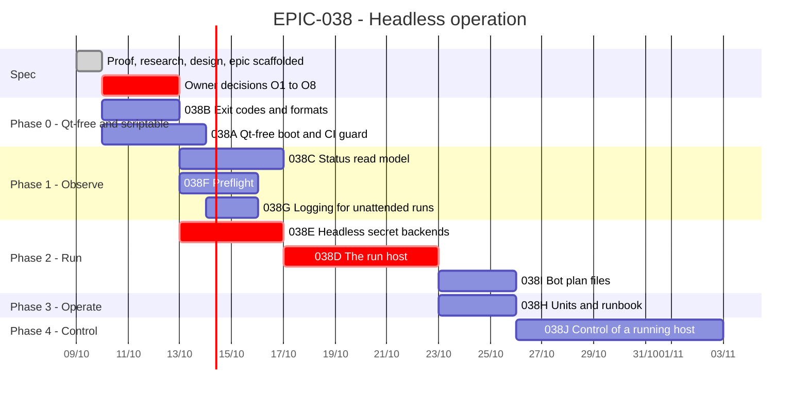

# EPIC-038 — Tracking

- **Epic:** [EPIC-038](README.md)
- **Status:** 🔵 Planned — not started (scaffolded as documentation; the owner decisions O1–O8 are pending)
- **Target Completion:** not set; each task is one pull request
- **Renders:** GitHub Markdown, VS Code Mermaid preview, or mermaid.live.

---

## 1. Schedule (Gantt)

---

## 2. Sub-tasks & PR Matrix

| Id | Sub-task | Branch / PR | Risk | Status | Target / Merged |
| :--- | :--- | :--- | :-: | :--- | :--- |
| EPIC-038A | [Qt-free boot and guard](incomplete/EPIC-038A_qt_free_boot_and_guard.md) | — | 🟡 | 🔵 Planned | — |
| EPIC-038B | [Exit codes and output formats](incomplete/EPIC-038B_exit_codes_and_output_formats.md) | — | 🟢 | 🔵 Planned | — |
| EPIC-038C | [Bot status read model](incomplete/EPIC-038C_bot_status_read_model.md) | — | 🟡 | 🔵 Planned | — |
| EPIC-038D | [The run host](incomplete/EPIC-038D_run_host.md) | — | 🔴 | 🔵 Planned; waits for O1, O2, O8 | — |
| EPIC-038E | [Headless secret backends](incomplete/EPIC-038E_headless_secret_backends.md) | — | 🔴 | 🔵 Planned; waits for O3 | — |
| EPIC-038F | [Preflight command](incomplete/EPIC-038F_preflight_command.md) | — | 🟡 | 🔵 Planned | — |
| EPIC-038G | [Logging for unattended runs](incomplete/EPIC-038G_logging_for_unattended_runs.md) | — | 🟡 | 🔵 Planned | — |
| EPIC-038H | [Service units and runbook](incomplete/EPIC-038H_service_units_and_runbook.md) | — | 🟢 | 🔵 Planned; waits for 038D–G | — |
| EPIC-038I | [Bot plan files](incomplete/EPIC-038I_bot_plan_files.md) | — | 🟡 | 🔵 Planned | — |
| EPIC-038J | [Control of a running host](incomplete/EPIC-038J_control_of_a_running_host.md) | — | 🔴 | 🔵 Planned; gated on O4 and `EPIC-036F` | — |

---

## 3. Milestone & Status Log

| Date | Item | Event & Outcome |
| :--- | :--- | :--- |
| 2026-10-09 | Spec | Headless boot proven impossible without PySide6 (three UI concerns in `create_app`); epic scaffolded with ten children, a design, a research record and a decision record (no TUI). Documentation only. |

---

## 4. Blockers & Dependencies

| Blocker / Dependency | Impacted Tasks | Resolution / Owner | Status |
| :--- | :--- | :--- | :-: |
| Owner decisions O1 (resting orders at stop), O2 (resume after restart), O8 (mainnet on first release) | 038D | The owner answers; recommendations are in the decision record | 🟡 Open |
| Owner decision O3 (secret backend) — a backend that holds secrets is a security decision | 038E | The owner answers | 🟡 Open |
| Owner decision O4 (control channel for a running host) | 038J | The owner answers; default is none in v1 | 🟡 Open |
| Owner decisions O5 (Windows supervisor), O6 (a headless requirements file — dependency change), O7 (Engine changes) | 038H, 038A, 038G | The owner answers | 🟡 Open |
| Alerting: bot events reaching the owner (`EPIC-036B`, `036C`) and the dead man's switch (`036E`) | the "supported unattended" claim of 038D and 038H | Land `EPIC-036` first, or ship without the claim | 🟡 Open |
| `ISecretStore` lift to `core/contracts` (`EPIC-036A`) | 038E | Whichever of 036A/038E lands first does the move once | 🟡 Open |
| The per-bot health snapshot of `EPIC-035W` (the owner asked that it not be started yet) | 038C | 038C ships bot state and reason from `ListBotsQuery`, and embeds the health later, in writing | 🟡 Open |
| `notification_event_handler.py` is deleted by `EPIC-036B` | 038A | 038A moves only the wiring; it does not rewrite the file | 🟡 Open |
