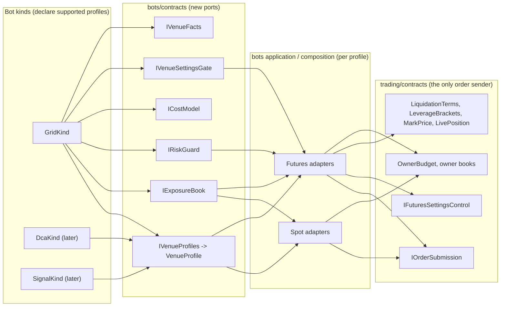
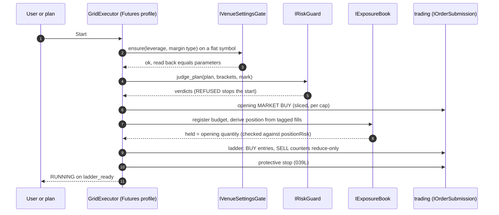
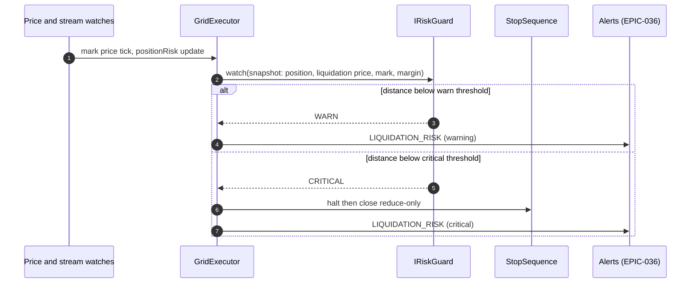

# DESIGN — One venue profile for every bot kind, and the Futures Grid as its first user

**Epic:** [EPIC-039](README.md)
**Date:** 2026-10-10
**Status:** Proposed — written for the owner's review. The choices still open are in [`DECISION_2026-10-10_futures_venue_profile.md`](DECISION_2026-10-10_futures_venue_profile.md). Nothing is built. Names that do not exist in the code yet are proposals.
**Sources:** [`RESEARCH_2026-10-10_futures_grid.md`](RESEARCH_2026-10-10_futures_grid.md) (cited as R1–R9).

| Label | Meaning |
| :--- | :--- |
| Now | exists on `master-warrior` (`076d339`) |
| Proposed | designed here, not built |
| To verify | a claim about the exchange or the code the implementer checks first and records |

## 1. What exists today (verified 2026-10-10)

### 1.1 The Futures building blocks are already in `trading`
| Piece | Where | Note |
| :--- | :--- | :--- |
| Four venues, two markets | `src/support/binance_gateway/contracts/trading_venue.py` — `FUTURES_TESTNET`, `SPOT_TESTNET`, `FUTURES_MAINNET`, `SPOT_MAINNET`; `venue.market_type` → `MarketType.FUTURES_USD_M` or `SPOT` | mainnet trades like testnet, no order blocked (`EPIC-034` D11) |
| Per-venue ports | `trading/contracts/venue_trading_ports.py` — `order_submission`, `trading_session`, `account_snapshot`, `equity_curve`, `order_entry_terms`, `account_activity`, `futures_settings` | `order_entry_terms` answers `NotApplicable.ON_THIS_VENUE` for leverage/brackets/mark on Spot |
| Leverage and margin control | `trading/contracts/i_futures_settings_control.py` (set leverage, set margin type; refuse with an open position) and `futures_symbol_setting.py` (`leverage`, `margin_type`, `max_notional`) | position mode is not controllable here ("plausible extension") |
| Brackets | `leverage_brackets.py` (`initial_leverage`, `notional_floor/cap`, `maintenance_margin_rate`, `maintenance_amount`) | read via `IOrderEntryTerms` |
| Liquidation estimate | `trading/contracts/liquidation_estimate.py` — `LiquidationTerms(side, quantity, entry_price, margin, maintenance_margin_rate, maintenance_amount)` → `estimated_liquidation_price()`; Binance's one-way formula; **an estimate** (optimistic under cross margin; funding not counted) | the type forbids passing it where an exchange-reported price belongs |
| Positions | `live_position.py` — one-way only; direction from the sign of `position_amt`; `liquidation_price` read from the exchange, never computed | Hedge Mode refused at connection time (`ConnectionFailureKind.HEDGE_MODE_UNSUPPORTED`; words in `bots/application/services/connect_failure_words.py:52`) |
| Mark price | `mark_price.py` (`GET /fapi/v1/premiumIndex`, mark price only — **no funding fields**) | |
| Reduce-only | `Order.reduce_only` (`trading/contracts/order.py`) | the fake refuses a non-reducing one with `-2022` |
| Conditional (stop) orders | `adapters/binance/futures_algo_order_mapper.py`, `algo_update_parser.py`, `algo_order_links.py` — Binance's Algo Order API | `EPIC-028R` |
| Futures user-data stream | `adapters/binance/futures_user_data_stream.py`, `futures_order_updates.py`; `ORDER_TRADE_UPDATE` and `ACCOUNT_UPDATE` handled | `OrderFilledEvent.fee_amount` is `None` for Futures and the docstring says `ORDER_TRADE_UPDATE` "carries no per-fill commission field at all" (`order_filled_event.py`). **To verify** against the official docs: Binance's `ORDER_TRADE_UPDATE` is understood to carry commission (`n`, `N`) and realized profit (`rp`); if so the docstring is wrong and fees can be counted (task 039G) |
| Commission rate | `adapters/binance/futures_commission_rate_reader.py`, `i_commission_rate_reader.py` | feeds `ExchangeTerms.maker_fee/taker_fee` |

### 1.2 `bots` is Spot-only, in exactly these places
**Hard-coded Spot outside `ui/` (9):**
| # | File:line | What it does |
| :-: | :--- | :--- |
| 1 | `domain/bot.py:120` | `venue_locked_reason`: "Only a Spot bot can change its venue." |
| 2 | `domain/bot.py:136` | `moved_to`: refuses a non-Spot venue |
| 3 | `application/services/bot_run_facts.py:60` | `_venue_problem`: "… is not a Spot venue this app trades on" |
| 4 | `application/services/planner_numbers.py:59` | the planner's numbers only for Spot |
| 5 | `application/queries/get_planner_market/handler.py:72` | planner market read passes `MarketType.SPOT` |
| 6–8 | `application/queries/run_grid_backtest/handler.py:70,86,97` | backtest candles and filters are Spot |
| 9 | `application/services/exchange_facts_reader.py:63-64,183` | the readiness snapshot reads `SpotHolding` |

**In `ui/` (6):** `strategies/arm_strategy_dialog.py:94` (`fields.setRowVisible(self.leverage, venue.market_type is not MarketType.SPOT)`, the arm-strategy dialog's leverage row, the one UI site that already branches the other way), `bots_screen/venue_choice.py:48` (the venue picker lists only Spot venues), `bots_screen/bot_chart_host.py:80` (chart market defaults to SPOT), `bots_screen/bots_presenter.py:118` (`BotTickFeed(…, MarketType.SPOT)`), `kinds/grid/backtest/grid_backtest.py:47` and `grid_backtest_presenter.py:262` (backtest market). Text that says "Spot" for the user: `bot_plan_panel.py:210,228`, `bot_venues.py:64`, `bot_commands.py:54`.

**Already generic (leave alone):** `application/services/bot_price_watch.py:178` (opens the stream for `bot.definition.venue.market_type`), `application/event_handlers/bot_event_router.py:123` (matches a tick to an executor by market type and market-data venue).

**Spot *meaning* that is not a branch** (these are the deeper changes):
- the ladder's SELL levels are covered by an **opening MARKET BUY** and sized net of its base fee (`domain/grid/grid_plan.py`, `application/services/grid_start_sequence.py`);
- readiness is about **base and quote balances** and "base short for sells" (`application/services/exchange_rules.py:201,229`, `contracts/exchange_facts.py`);
- the **owner budget** is "open BUY quote plus the inventory at cost" and the inventory is **derived from the exchange's history of tagged orders** (`trading/contracts/owner_budget.py`, `trading/application/owner_inventory_deriver.py`, ADR D6) — its docstring already names "a Futures owner: the inventory becomes a position";
- Stop asks `BaseHandling.KEEP | SELL_AT_MARKET` (`contracts/i_bot_executor.py`); a stop loss or take profit forces SELL (`grid_price_reaction.py`);
- the reconciler's `inventory_mismatch` (`application/services/grid_reconciler.py`);
- the bots' `AccountView.available_quote` (`domain/bot_kind_inputs.py`) — Futures has margin, not a quote balance.

### 1.3 The seam the code already announced
`IBotKind`'s docstring (`bots/contracts/i_bot_kind.py`) lists "**Futures Grid** — the same planner with leverage, a liquidation guard and long, short or neutral modes (`EPIC-029K`); validate adds the liquidation distance. Each is a new class implementing this ABC and one registration; the shell, the store and the lifecycle do not change." `EPIC-029K`'s own §3 says Futures is "a venue profile of `GridKind`, not a second kind". This epic keeps that and widens it: the profile is not a Grid detail but a bots-wide contract, so the next kind inherits both sides.

### 1.4 The test world is Spot-only
`tests/integration/modules/bots/conftest.py` sets only `SPOT_ENV_API_KEY/SECRET` and patches `Client.API_TESTNET_URL` to the fake's Spot URL. The fake server (`tests/sanity/fake_exchange/`) has Futures routes — leverage, brackets, `positionRisk`, account, algo orders, **MARKET orders that fill at once and move the position** — but its docstring (`order_book_state.py`) says **"a resting order never fills"**. Spot has a matcher (`spot_order_book.py`: `rest`, `take`, `trade_at`). A Futures Grid is a ladder of resting LIMIT orders, so it cannot be tested end to end until the fake matches them (`039C`).

## 2. Goals and how SOLID shapes them
- **G1** A Grid on Futures with long, short and neutral directions and leverage, judged and guarded before and during the run.
- **G2** *Any* bot kind — Grid now, DCA/Signal/Trailing later — gets Futures by declaring support and using shared ports; none re-implements exposure, risk, costs or settings.
- **G3** Spot behaviour is byte-for-byte unchanged by every task of phases 0–1.
- **G4** The exchange is the source of truth for exposure and liquidation; the bot never supplies a figure the exchange can contradict (ADR D6, `domain-truth-rule.md`).
- **G5** A Futures position never stands without an exchange-side stop on mainnet.

| Principle | Where it bites here |
| :--- | :--- |
| **S** | A kind decides *what to trade*; the profile says *what the venue allows*; the exposure book says *what the bot holds*; the risk guard says *whether that is safe*; the cost model says *what it costs*. Five reasons to change, five types. |
| **O** | A new kind, direction, margin mode or venue is a class plus a registration (§11). No `if market is FUTURES` is added anywhere: a guard fails on it (`039A`). |
| **L** | Every `VenueProfile` answers every question (a Spot profile answers "no leverage", never raises); every kind passes the conformance suite (`039M`) for every profile it declares. |
| **I** | `IExposureBook`, `IRiskGuard`, `ICostModel`, `IVenueSettingsGate` are separate small ports; a kind with no use for one (a Spot-only kind) never sees it. |
| **D** | `bots` depends on `bots/contracts` ports; the adapters that call `trading` are composed at the shell. `trading` stays the only module that sends orders. |

## 3. The shared ports (Proposed)
All in `src/modules/bots/contracts/` unless said otherwise; adapters in `src/modules/bots/application/` or `composition/` calling `trading/contracts` only.

| Port / type | Role | Spot answer | Futures answer |
| :--- | :--- | :--- | :--- |
| `VenueProfile` (frozen value) | what the venue allows: `market_type`, `directions` (a set of `TradeDirection`), `max_leverage_known`, `margin_modes`, `has_funding`, `exposure_kind` (`INVENTORY` or `POSITION`), `needs_reduce_only_exits` | LONG only, no leverage, no funding, `INVENTORY` | LONG/SHORT/NEUTRAL, leverage, ISOLATED (CROSS later), funding, `POSITION` |
| `IVenueProfiles` | `for_venue(venue) -> VenueProfile` — **the one place** that reads `venue.market_type` | | |
| `TradeDirection` (`LONG`, `SHORT`, `NEUTRAL`) | how much exposure a ladder opens at start (§5) | only LONG | all |
| `IExposureBook` | what the bot holds now and what it may add: `held() -> Exposure`, `headroom()` | the owner's derived inventory (`OwnerInventory`) | the owner's signed position, derived from tagged fills and checked against `positionRisk` |
| `ExposureHandling` (`KEEP`, `CLOSE_AT_MARKET`) | what Stop does with exposure; **replaces `BaseHandling`** | sell base | reduce-only market close |
| `IRiskGuard` | `judge_plan(plan, settings, brackets, mark) -> tuple[Verdict, …]` and `watch(snapshot) -> RiskState` | no-op (`SAFE`) | liquidation distance, bracket cap, margin ratio |
| `ICostModel` | `fees()`, `funding_estimate(position, horizon)`, `breakeven_step()` | maker/taker | maker/taker from the account + funding |
| `IVenueSettingsGate` | make the venue match the bot's parameters before Start and prove it still does: leverage, margin type, position mode | no-op | set margin type then leverage; read back; refuse with an open position or order; verify one-way |
| `IVenueFacts` (generalises `ExchangeFacts`) | readiness facts: Spot balances, or Futures margin, position, mode, leverage, foreign position | `base_*`/`quote_*` | `available_margin`, `position`, `position_mode`, `symbol_setting`, `foreign_position` |



**Why `IExposureBook` sits on the trading side for the derivation but on the bots side for the port:** trading owns the exchange evidence and the budget registration (ADR D1, D6); the bot only asks "what do I hold". For Futures the derivation is the new work (`039D`): replay the owner's tagged fills into a signed quantity and average entry, check it against `positionRisk`, and treat a **foreign position on the symbol as a start refusal** (the symbol lease already allows one bot per symbol, so a position on the symbol belongs to the bot only if none existed before it started — the same idea as "earlier runs" on Spot, `BUG-196`).

## 4. Capital and leverage: what the user types (open — O2)
Spot: `capital_quote` is spent. Futures: the user commits **margin** and chooses **leverage**; exposure is `margin × leverage`. Recommendation (O2): `capital_quote` stays *what the user puts at risk* (the margin), a new `leverage` key is added, and the planner sizes the ladder so the **worst-case position notional** (the direction's extreme, §6) is at most `capital_quote × leverage` and at most the bracket's `notional_cap` at that leverage. A Spot bot is the same formula with `leverage = 1`. The user's rule is kept: the bot computes and judges; it never changes a parameter.

## 5. One planner, three directions (Proposed; to confirm by a property test)
Let the grid have levels `L0 < … < LN`, quantity `q` per level, last price `P`, and `k(P)` the number of levels above `P`. A grid is a **position function of price**: whatever the orders, a filled-through ladder holds

> `position(P) = q · (k(P) − c)`

where the constant `c` is how many level-quantities were bought (or sold) at the start:

| Direction | `c` | Position at start | Range of position | Opening trade | Counter orders |
| :--- | :-: | :--- | :--- | :--- | :--- |
| **LONG** (Spot = LONG at leverage 1) | `0` | `q·k(P₀)` ≥ 0 | `0 … q·N` | a MARKET BUY of the SELL levels' quantity (exactly what Spot does now) | every SELL is a counter that reduces a long → **reduce-only is safe** |
| **NEUTRAL** | `k(P₀)` | `0` | `−q·(N−k(P₀)) … +q·k(P₀)` | none | BUY below `P₀` opens/adds long, SELL above opens/adds short; a fill's counter is the neighbouring level. **No reduce-only** (the net can cross zero) |
| **SHORT** | `N` | `−q·(N−k(P₀))` ≤ 0 | `−q·N … 0` | a MARKET SELL of the BUY levels' quantity | every BUY is a counter that reduces a short → reduce-only safe |

Consequences the implementation relies on:
1. **The opening exposure is the only thing that differs.** The level prices, spacing, counter-order rule and fill accounting are shared; `GridPlan` gains `direction` and `opening_quantity` (signed), and `opening_buy_quantity` becomes the LONG case of it (`grid_plan.py`).
2. **Spot is the regression oracle.** For every input the new planner with `LONG`, leverage 1 must give the same levels, quantities, opening quantity and simulated PnL as today's (`039B`'s property test compares against `grid_simulator.py` results recorded from the current code).
3. **Worst case for liquidation** is at the range's far edge on the exposed side: LONG at `L0` (position `q·N`), SHORT at `LN` (position `−q·N`), NEUTRAL at both edges — so a neutral plan has **two** liquidation estimates and both must clear the stop loss.
4. **Out of range**: price below `L0` leaves a LONG grid at maximum long, idle, with losses growing; the bot's reaction is a parameter (O6), not an accident (R1).

## 6. Risk guard (Proposed)
**Plan time** (verdicts, same `Verdict` shape and severities as the Spot checks, thresholds editable in a `FuturesGridThresholds` value like `GridThresholds`, never literals in a check):
| Check | Judges | Severity |
| :--- | :--- | :-: |
| `LIQUIDATION_INSIDE_RANGE` | the estimated liquidation price (via `estimated_liquidation_price`, worst case per §5.3, bracket looked up for the worst-case notional) lies **inside** the range — the bot can be liquidated before the ladder is used | REFUSED |
| `STOP_LOSS_NEEDED` / `STOP_LOSS_AFTER_LIQUIDATION` | a stop loss that sits beyond the liquidation price, or none when leverage > 1 (O3), or closer than `min_liq_buffer_atr` (default **1 daily ATR**, `EPIC-029K`) before it | REFUSED / WARNING per O3 |
| `NOTIONAL_ABOVE_BRACKET` | worst-case notional exceeds the bracket cap for the chosen leverage (`FuturesSymbolSetting.max_notional`, `LeverageBracket.notional_cap`) | REFUSED |
| `MARGIN_TOO_SMALL` | initial margin for the worst case exceeds the margin committed or available | REFUSED |
| `FOREIGN_POSITION` | a position (not only orders) already exists on the symbol | REFUSED |
| `LEVERAGE_HIGH` | leverage above a threshold (default 10×, editable) | WARNING |
| `FUNDING_ADVERSE` | the current funding rate costs the bot's net direction more than a share of its expected cycle profit | WARNING |
| `STEP_BELOW_FEES_FUTURES` | the existing `check_min_step`/`check_break_even` with the Futures fees | as Spot |

The estimate is *always labelled an estimate* (`LiquidationPriceEstimate.is_estimate`); under Cross margin it is optimistic (`liquidation_estimate.py` docstring), which is why v1 is **Isolated only** (O5).

**Run time:** `watch()` compares the **exchange-reported** liquidation price (`LivePosition.liquidation_price`) and the **mark** price (liquidation is on mark, R1) and moves the bot through `SAFE → WARN → CRITICAL`; `CRITICAL` (distance below a threshold) halts and closes by the policy of §8; every transition is a named event the alert module can turn into an alert (`LIQUIDATION_RISK`, `MARGIN_LOW`, `ADL_OR_LIQUIDATED` — new kinds for `EPIC-036B`). A client order id Binance uses for a forced close is **to verify** (the docs reviewed did not render it, R8); a fill the bot did not order is a `FOREIGN_FILL` halt, never ignored.

## 7. Settings gate (Proposed)
Before Start the gate: (1) reads `FuturesSymbolSetting` and the account's position mode; (2) refuses with `HEDGE_MODE_UNSUPPORTED` if Hedge (existing connection check); (3) if margin type differs, sets it — **Binance refuses while the symbol has an open order or position** (R3, `-4067`/`-4068` for position mode; margin type has the same restriction, third-party source, **to verify**) so the gate runs *before* the ladder, on a flat symbol; (4) sets leverage; (5) **reads back** and compares to the bot's parameters; mismatch is a start refusal naming both values. While running, `reconcile_after_gap` re-reads and a drift (someone changed leverage or margin in the Binance app) halts with `SETTINGS_DRIFT`. The bot never changes position mode.

## 8. Stop, halt and what stands after (Proposed; O8)
| Event | Spot today | Futures (proposed) |
| :--- | :--- | :--- |
| User Stop, keep | cancel tagged orders, keep base | cancel tagged orders, keep the position **only if a protective stop stands** (else refuse the "keep" choice) |
| User Stop, close | cancel, SELL_AT_MARKET | cancel, reduce-only MARKET close of the position, confirm flat |
| Stop loss / take profit tick | Stop with SELL forced | the same, on **mark** price for the trigger (R1; `workingType=MARK_PRICE`) |
| **Halt** (feed stale, stream down, error) | cancel the ladder, **leave the base** (the 2026-10-09 incident) | cancel the ladder and **leave a position only under an exchange-side stop**; without one the halt closes it (reduce-only) — a leveraged position is never left bare |
| App closed / crash | orders stay resting; restart reads RECOVERING | the same, **plus** the protective stop stands on the exchange (`039L`); `countdownCancelAll` is a possible dead-man for the *ladder* only (documented endpoint, R4) and conflicts with "leave orders resting" — owner's call, `EPIC-038` O1 |
Binance's conditional orders go through the Algo Order API (the repo already maps them, `futures_algo_order_mapper.py`); `closePosition=true` cannot be combined with `quantity` or `reduceOnly` and has Hedge Mode restrictions (R4) — **to verify** the exact current endpoint and parameters before coding `039L`.

## 9. Sequences

### 9.1 Start of a Futures Grid (Long)


### 9.2 Runtime guard


## 10. Options for a Futures bot (parameters)
| Option | Key (Proposed) | Default | Notes |
| :--- | :--- | :--- | :--- |
| Direction | `direction` = `long`/`short`/`neutral` | `long` (a Spot bot has only this) | the profile lists what is allowed |
| Leverage | `leverage` (int) | `1`; Futures UI starts at a low value (O4) | capped by bracket and `max_notional`; set through the gate |
| Margin mode | `margin_type` = `isolated` | `isolated` | Cross is later (O5) |
| Stop loss / take profit | existing keys, resolved on **mark** | per O3 | the stop must clear liquidation by the buffer |
| Out of range | `on_range_exit` = `hold`/`close` | `hold` (O6) | Futures holds the maximum position and idles (R1) |
| Start condition | `trigger_price` (optional) | off | Pionex has it (R1); shared by all kinds when built |
| Liquidation buffer | `min_liq_buffer_atr` | `1` | in `FuturesGridThresholds` |
Everything above is a *user parameter or a threshold*, never a hidden default (`grid_params.py`: "no field has a hidden default"); a Spot bot's definition files keep loading unchanged (missing `direction`/`leverage` mean LONG/1 **only for definitions created before this epic**, recorded as a one-time migration in `039B`, never as a silent default for new ones).

## 11. Extension cases (the repository's `@par Extension cases` form)
```text
@par Extension cases
  · a new bot kind (DCA, Signal, Trailing) — implement IBotKind, declare supported_profiles, use
    IExposureBook / IRiskGuard / ICostModel / IVenueSettingsGate; the conformance suite (039M) is the
    checklist; the shell, the store and the lifecycle do not change;
  · a new venue profile (Coin-M, delivery, Spot margin, another exchange) — one VenueProfile value and its
    adapters for the ports; kinds already declare what they support;
  · a new direction rule — one TradeDirection member and its opening-exposure rule in the planner;
  · a new margin mode (Cross) — a MarginMode member, a Cross-aware RiskGuard (needs the other positions'
    maintenance margin, which the current LiquidationTerms does not have);
  · auto-add margin or profit-to-margin (Pionex, Bitget) — an IMarginManager adapter the executor calls on
    RiskState WARN; not built;
  · trailing range — a kind or a Grid option that moves the range; not available for Neutral on the vendor
    compared (R1), so a profile-level capability;
  · a new risk (ADL, funding spike) — one more check in the guard's list and one more RiskState reason.
```

## 12. Interplay with the other epics
- **`EPIC-038` (headless):** a `run` host's default stop policy "leave orders resting" is acceptable for a Spot bot and **not** for a Futures bot without a protective stop. The policy must be per profile (`IShutdownPolicy` asks the profile); this is recorded as an open question in both epics. The health snapshot of `EPIC-038C` gains the liquidation distance from `IRiskGuard.watch`.
- **`EPIC-036` (alerting):** new `AlertKind`s `LIQUIDATION_RISK`, `MARGIN_LOW`, `SETTINGS_DRIFT`, `FOREIGN_FILL` (CRITICAL where money is at risk) — added by `EPIC-036B` or by `039F`, whichever lands second, once.
- **`EPIC-037`:** the "only one" guard idea gives the guard of `039A`; the sibling-parity idea gives a parity test between the Spot and Futures LONG executors on shared scenarios (`039H`).
- **`EPIC-026K`:** the exchange-side stop for strategy entries; `039L` reuses its order mapping and adds the bot's ownership of the stop (cancel on exit, adopt on restart).

## 13. Test strategy
- **Spot oracle:** property tests (Hypothesis is an approved-first dependency question, `EPIC-037E`; until then, table-driven with seeded random inputs) that the generalised planner/simulator with `LONG`, leverage 1 equals the recorded current output (`039B`).
- **Position function:** for random price paths, the simulated position equals `q·(k(P)−c)` within rounding, for all three directions (`039B`).
- **Guards:** the "only one `market_type` decision" guard shown red by re-adding a branch (`039A`); the liquidation guard shown red by a plan whose estimate sits inside the range (`039F`).
- **Fake exchange:** every executor journey runs on the Futures fake with LIMIT matching (`039C`), including a restart in the middle, a stream gap, an out-of-range exit and a forced liquidation.
- **Conformance:** one suite, parametrised over registered kinds × profiles (`039M`).
- **Never** against a real exchange in CI; Futures testnet runs are the owner's and are recorded by the owner.

## 14. Risks
| Risk | Mitigation |
| :--- | :--- |
| Spot regresses while the seam is cut | phases 0–1 change no Spot behaviour; the Spot oracle and the unchanged Spot journeys are the proof |
| The generalised planner hides a Futures-only edge case | the direction table is tested as a property; neutral's net-crossing-zero case has its own journey |
| A leveraged position is left bare by a halt | §8; `039L` is a gate for mainnet leverage above 1; until then Futures mainnet stays closed (O7) |
| The fake exchange is kinder than Binance | `039C` includes funding, liquidation and `-2022`; the "demanding fake" idea of `EPIC-037E` applies |
| An exchange rule is assumed, not read | every *To verify* is an acceptance criterion of its task |
| `AccountView.available_quote` and `ExchangeFacts` assume Spot | `IVenueFacts` generalises them in `039E`; the Spot fields move behind the Spot adapter unchanged |
