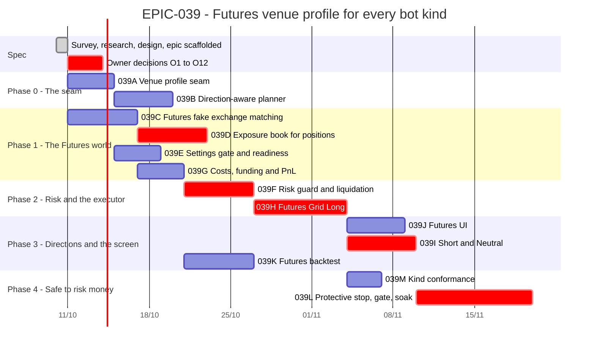

# EPIC-039 — Tracking

- **Epic:** [EPIC-039](README.md)
- **Status:** 🔵 Planned — not started (scaffolded as documentation; owner decisions O1–O12 pending)
- **Target Completion:** not set; each task is one pull request
- **Renders:** GitHub Markdown, VS Code Mermaid preview, or mermaid.live.

---

## 1. Schedule (Gantt)

---

## 2. Sub-tasks & PR Matrix

| Id | Sub-task | Branch / PR | Risk | Status | Target / Merged |
| :--- | :--- | :--- | :-: | :--- | :--- |
| EPIC-039A | [Venue profile seam](incomplete/EPIC-039A_venue_profile_seam.md) | — | 🟡 | 🔵 Planned | — |
| EPIC-039B | [Direction-aware planner](incomplete/EPIC-039B_direction_aware_grid_planner.md) | — | 🟡 | 🔵 Planned | — |
| EPIC-039C | [Futures fake exchange matching](incomplete/EPIC-039C_futures_fake_exchange_matching.md) | — | 🟡 | 🔵 Planned | — |
| EPIC-039D | [Exposure book for positions](incomplete/EPIC-039D_exposure_book_for_positions.md) | — | 🔴 | 🔵 Planned | — |
| EPIC-039E | [Settings gate and readiness](incomplete/EPIC-039E_futures_settings_gate_and_readiness.md) | — | 🟡 | 🔵 Planned | — |
| EPIC-039F | [Risk guard and liquidation](incomplete/EPIC-039F_risk_guard_and_liquidation.md) | — | 🔴 | 🔵 Planned; asks O3, O4 | — |
| EPIC-039G | [Costs, funding and PnL](incomplete/EPIC-039G_futures_costs_funding_and_pnl.md) | — | 🟡 | 🔵 Planned | — |
| EPIC-039H | [Futures Grid Long](incomplete/EPIC-039H_futures_grid_long.md) | — | 🔴 | 🔵 Planned; asks O1, O6, O8, O10 | — |
| EPIC-039I | [Short and Neutral](incomplete/EPIC-039I_futures_grid_short_and_neutral.md) | — | 🔴 | 🔵 Planned | — |
| EPIC-039J | [Futures UI](incomplete/EPIC-039J_futures_ui.md) | — | 🟡 | 🔵 Planned | — |
| EPIC-039K | [Futures backtest](incomplete/EPIC-039K_futures_backtest.md) | — | 🟡 | 🔵 Planned; asks O9 | — |
| EPIC-039L | [Protective stop, mainnet gate, soak](incomplete/EPIC-039L_protective_stop_mainnet_gate_and_soak.md) | — | 🔴 | 🔵 Planned; asks O7, O12; waits for `EPIC-026K` | — |
| EPIC-039M | [Kind conformance](incomplete/EPIC-039M_kind_conformance_for_profiles.md) | — | 🟢 | 🔵 Planned | — |

---

## 3. Milestone & Status Log

| Date | Item | Event & Outcome |
| :--- | :--- | :--- |
| 2026-10-10 | Spec | Evaluation accepted by the owner; epic scaffolded with thirteen children, a design, a research record and a decision record; `EPIC-029K` superseded. Documentation only. |

---

## 4. Blockers & Dependencies

| Blocker / Dependency | Impacted Tasks | Resolution / Owner | Status |
| :--- | :--- | :--- | :-: |
| Owner decisions O1–O12 ([decision record §4](DECISION_2026-10-10_futures_venue_profile.md)) | 039B (O2), 039F (O3, O4), 039H (O1, O6, O8, O10), 039K (O9), 039L (O7, O12) | The owner answers when the task that needs it starts; recommendations are in the record | 🟡 Open |
| Binance pages that did not render in the research session ([RESEARCH §8](RESEARCH_2026-10-10_futures_grid.md)) | 039C, 039E, 039F, 039G, 039L | Each task reads the official page first and records it | 🟡 Open |
| `EPIC-029H` (Spot testnet soak) — how far the Spot executor is trusted as the model | 039H | The soak's result is read when 039H starts | 🟡 Open |
| `EPIC-026K` (exchange-side protective stop) | 039L | Land 026K first, or 039L builds the minimum and 026K adopts it (owner decides) | 🟡 Open |
| `EPIC-036B` alert kinds (`LIQUIDATION_RISK`, `MARGIN_LOW`, `SETTINGS_DRIFT`, `FOREIGN_FILL`) | 039F, 039L | Whichever lands second adds them once | 🟡 Open |
| `EPIC-038` stop policy per profile (O12) | 039L, `EPIC-038D` | Recorded in both epics when answered | 🟡 Open |
| A property-test library (`hypothesis`) is a new dependency (`EPIC-037E`, owner approval) | 039B | Seeded table-driven tests meanwhile | 🟡 Open |
