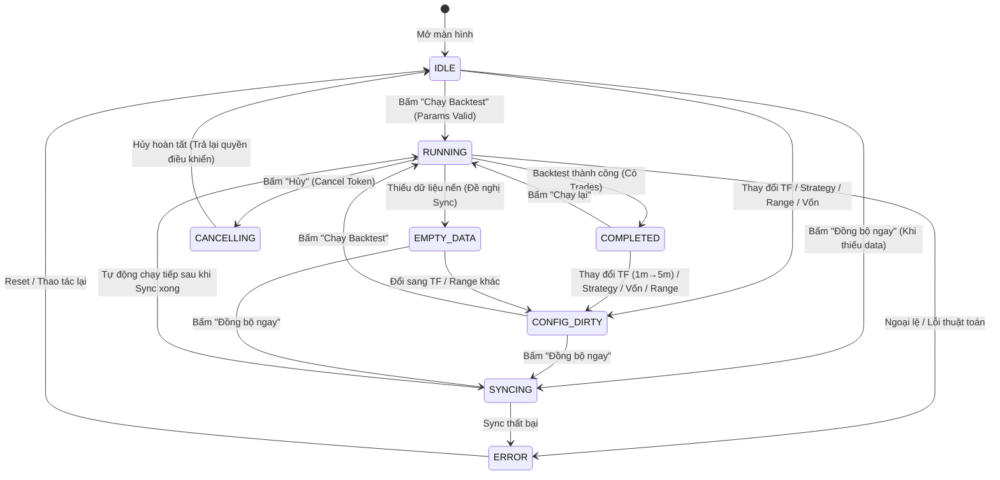

Listed directory backtest
Listed directory logic
Viewed backtest_state.py:1-28
Viewed backtest_view_model.py:1-120
Viewed backtest_presenter.py:1-150
Searched for "timeframe"
Searched for "timeframe"
Searched for "interval"
Searched for "selectedTimeframe"
Searched for "def _on_timeframe_changed"
Searched for "_on_timeframe_changed"
Viewed backtest_presenter.py:300-340
Viewed backtest_presenter.py:720-760
Viewed BackTestTopPanel.qml:100-160
Viewed BackTestTopPanel.qml:160-200
Viewed BackTestModals.qml:1-119
Viewed TimeframePickerModal.qml:1-66
Viewed BackTestTradeLogs.qml:1-60

Dưới đây là **kết quả điều tra chi tiết mã nguồn màn hình Backtest** và **bản thiết kế Epic mới** để hoàn thiện toàn diện hệ thống UI Signals & State Machine (FSM) cho màn hình Backtest.

---

## 🔍 1. Kết quả Điều tra Mã nguồn Hiện tại (Deep Code Investigation)

Qua kiểm tra trực tiếp các tệp [`backtest_presenter.py`](file:///c:/Users/hoang/Documents/Sagittarius-Elite-Warrior/src/presentation/ui/screens/backtest/backtest_presenter.py), [`backtest_view_model.py`](file:///c:/Users/hoang/Documents/Sagittarius-Elite-Warrior/src/presentation/ui/screens/backtest/backtest_view_model.py), [`BackTestTopPanel.qml`](file:///c:/Users/hoang/Documents/Sagittarius-Elite-Warrior/src/presentation/ui/screens/backtest/BackTestTopPanel.qml) và [`backtest_state.py`](file:///c:/Users/hoang/Documents/Sagittarius-Elite-Warrior/src/presentation/ui/screens/backtest/logic/backtest_state.py):

### ⚠️ Các lỗ hổng và thiếu sót lớn đang tồn tại:

1. **Khi nhấn đổi Timeframe (`1m` $\rightarrow$ `5m`), Đổi Chiến lược, hoặc Đổi Ngày: Gần như KHÔNG LÀM GÌ!**
   - Trong `backtest_presenter.py` (dòng 724–736):
     ```python
     @Slot()
     @safe_ui_action
     def _on_timeframe_changed(self) -> None:
         self._logger.log_timeframe_selected(self._view_model.selectedTimeframe)
     ```
   - **Hậu quả:** Khi người dùng vừa chạy xong Backtest `1m` (có kết quả PnL +15%, 50 trades, chart nến 1m), sau đó mở menu chọn `5m`:
     - Toolbar đổi chữ hiển thị thành `5m`.
     - Nhưng toàn bộ 4 thẻ kết quả (Net PnL, Win Rate, Drawdown), 8 thẻ chi tiết, đường cong vốn (Equity Curve), các cờ Buy/Sell trên Chart và bảng 50 lệnh Trade Logs **VẪN LÀ DỮ LIỆU CỦA `1m`**!
     - Màn hình **không hề có chỉ báo "Dữ liệu cũ / Cần chạy lại" (Stale Data)**. Người dùng sẽ bị nhầm lẫn nghiêm trọng rằng kết quả đang xem là của `5m`.
     - Nếu bấm Export CSV, hệ thống xuất ra danh sách trade của `1m` dù thanh công cụ đang ghi `5m`.

2. **State Machine (`BacktestUiState`) quá sơ sài:**
   - Hiện tại `BacktestUiState` chỉ có 4 trạng thái thô: `IDLE`, `RUNNING`, `SYNCING`, `ERROR`.
   - **Thiếu các trạng thái quan trọng:**
     - ❌ `CONFIG_DIRTY` / `STALE`: Trạng thái khi người dùng đã thay đổi bất kỳ tham số nào (Timeframe, Strategy, Date Range, Capital, Bot Params) so với lần chạy gần nhất.
     - ❌ `CANCELLING` / `STOPPING`: Cho phép người dùng dừng một đợt backtest đang chạy.
     - ❌ `EMPTY_DATA`: Phân biệt giữa "Không có dữ liệu để backtest" với "Lỗi hệ thống/crash" (`ERROR`).
     - ❌ `COMPLETED`: Trạng thái đã có kết quả mới nhất đồng bộ với thanh công cụ.

3. **Chưa có Nút Hủy / Dừng Backtest (Stop/Cancel Execution):**
   - Khi backtest trên tập dữ liệu lớn (vài trăm nghìn nến), UI chuyển sang `RUNNING` và khóa các nút (`controlsEnabled = false`). Nếu người dùng chọn nhầm chiến lược hoặc timeframe, **hoàn toàn không có nút Hủy**, phải chờ chạy xong.
   - Chưa tích hợp `CancellationToken` vào chuỗi thực thi `RunStaticBacktestCommand`.

4. **Chart không Preview / không kiểm tra dữ liệu khi đổi Timeframe:**
   - Khi người dùng đổi sang `5m` hoặc `1h`, màn hình không tải trước (preview) nến của khung đó lên biểu đồ, cũng không kiểm tra xem trong SQLite đã có nến `5m` hay chưa. Người dùng chỉ biết thiếu dữ liệu sau khi đã bấm "Chạy Backtest" và bị fail.

5. **Thiếu Real-time Validation Feedback trên Toolbar:**
   - Người dùng nhập vốn ban đầu là số âm hoặc gõ ngày bắt đầu lớn hơn ngày kết thúc $\rightarrow$ Không có báo lỗi tức thời trên ô nhập liệu, chỉ khi bấm "Chạy Backtest" mới bị chặn.

---

## 🏗️ 2. Đề xuất EPIC Mới: `BOT-095`

### 🎯 Tên Epic:
> **Epic `BOT-095`: Hoàn thiện Hệ thống UI Signals, State Machine & Vòng đời Tham số cho Màn hình Backtest**
> *(Backtest Screen UI Signals, Finite State Machine & Parameter Lifecycle Architecture)*

---

### 🗺️ Mô hình Luồng Trạng thái Mới (FSM State Flow):



---

## 📋 3. Danh sách các Task Con thuộc Epic `BOT-095`

Epic này được chia thành **5 task cụ thể, rõ ràng và có thể kiểm thử độc lập**:

---

### 🔹 Task 1: `BOT-095A` — Mở rộng State Machine `BacktestUiState` & Quản lý Trạng thái Dữ liệu Cũ (`STALE` / `CONFIG_DIRTY`)
- **Mục tiêu:**
  - Mở rộng `BacktestUiState`: `IDLE`, `CONFIG_DIRTY`, `RUNNING`, `CANCELLING`, `SYNCING`, `EMPTY_DATA`, `COMPLETED`, `ERROR`.
  - Bổ sung cơ chế phát hiện cấu hình thay đổi (`dirty_tracking`): Khi người dùng đổi Timeframe (`1m` $\rightarrow$ `5m`), Strategy, Date Range, Capital, hoặc Bot Params:
    - Nếu đã có kết quả cũ: FSM tự động chuyển sang `CONFIG_DIRTY`.
    - UI tự động làm mờ nhẹ (opacity 0.6) các bảng kết quả cũ và hiển thị badge cảnh báo: *"Thông số đã đổi — Kết quả hiển thị bên dưới chưa được cập nhật. Nhấn 'Chạy Backtest' để tính lại."*
    - Khi bấm "Chạy Backtest" và thành công $\rightarrow$ Chuyển sang `COMPLETED` và xóa cờ dirty.
- **File tác động:** [`backtest_state.py`](file:///c:/Users/hoang/Documents/Sagittarius-Elite-Warrior/src/presentation/ui/screens/backtest/logic/backtest_state.py), [`backtest_view_model.py`](file:///c:/Users/hoang/Documents/Sagittarius-Elite-Warrior/src/presentation/ui/screens/backtest/backtest_view_model.py), [`backtest_presenter.py`](file:///c:/Users/hoang/Documents/Sagittarius-Elite-Warrior/src/presentation/ui/screens/backtest/backtest_presenter.py), [`BackTestTopPanel.qml`](file:///c:/Users/hoang/Documents/Sagittarius-Elite-Warrior/src/presentation/ui/screens/backtest/BackTestTopPanel.qml).

---

### 🔹 Task 2: `BOT-095B` — Nút Hủy / Dừng Backtest (`CancellationToken` & Stop Button UI)
- **Mục tiêu:**
  - Tích hợp `CancellationToken` vào `RunStaticBacktestCommand` và `RunStaticBacktestCommandHandler`.
  - Trong lúc trạng thái là `RUNNING`:
    - Nút "Chạy Backtest" trên QML đổi thành nút màu đỏ **"Hủy" (Cancel)** hoặc xuất hiện nút Stop bên cạnh.
    - Người dùng bấm Hủy $\rightarrow$ Phát signal `cancelBacktestRequested` $\rightarrow$ FSM chuyển sang `CANCELLING`.
    - Background task dừng ngay ở nến gần nhất, dọn dẹp bộ nhớ và connection handles an toàn, sau đó FSM chuyển về `IDLE` (hoặc `CONFIG_DIRTY`).
- **File tác động:** [`backtest_view_model.py`](file:///c:/Users/hoang/Documents/Sagittarius-Elite-Warrior/src/presentation/ui/screens/backtest/backtest_view_model.py), [`backtest_presenter.py`](file:///c:/Users/hoang/Documents/Sagittarius-Elite-Warrior/src/presentation/ui/screens/backtest/backtest_presenter.py), [`run_static_backtest/`](file:///c:/Users/hoang/Documents/Sagittarius-Elite-Warrior/src/application/use_cases/backtest/run_static_backtest/), [`BackTestTopPanel.qml`](file:///c:/Users/hoang/Documents/Sagittarius-Elite-Warrior/src/presentation/ui/screens/backtest/BackTestTopPanel.qml).

---

### 🔹 Task 3: `BOT-095C` — Xử lý Sự kiện Đổi Khung Thời Gian (Timeframe Change Lifecycle & Data Probe)
- **Mục tiêu:**
  - Khi người dùng chọn một Timeframe mới (ví dụ từ `1m` sang `5m` hoặc `1h`):
    1. Kiểm tra nhanh (fast probe) xem trong cơ sở dữ liệu SQLite đã có dữ liệu nến cho khung thời gian mới này hay chưa.
    2. **Nếu đã có dữ liệu:** Tự động tải nến của khung mới lên `ChartCard` (ở chế độ preview) để người dùng xem biểu đồ nến trước.
    3. **Nếu chưa có dữ liệu:** Hiển thị tooltip hoặc banner nhỏ: *"Chưa có dữ liệu 5m. Bấm 'Đồng bộ ngay' hoặc 'Chạy Backtest' để tự động tải từ Binance."*
    4. Cập nhật state và phát log thông tin rõ ràng.
- **File tác động:** [`backtest_presenter.py`](file:///c:/Users/hoang/Documents/Sagittarius-Elite-Warrior/src/presentation/ui/screens/backtest/backtest_presenter.py), [`backtest_view_model.py`](file:///c:/Users/hoang/Documents/Sagittarius-Elite-Warrior/src/presentation/ui/screens/backtest/backtest_view_model.py), [`TimeframePickerModal.qml`](file:///c:/Users/hoang/Documents/Sagittarius-Elite-Warrior/src/presentation/ui/components/TimeframePickerModal.qml).

---

### 🔹 Task 4: `BOT-095D` — Real-time Input Validation Signals & Live Feedback trên Toolbar
- **Mục tiêu:**
  - Bổ sung tín hiệu kiểm tra hợp lệ tức thì khi người dùng thay đổi giá trị trong các modal / ô nhập:
    - **Vốn ban đầu (`initialCapitalText`):** Kiểm tra số thực $> 0$. Nếu $\le 0$ hoặc ký tự sai $\rightarrow$ Hiển thị viền đỏ cảnh báo ngay trên dialog.
    - **Khoảng thời gian tùy chỉnh (`customStartText`, `customEndText`):** Kiểm tra định dạng `YYYY-MM-DD HH:MM` và điều kiện `Start < End`. Nếu vi phạm $\rightarrow$ Báo lỗi trực tiếp trên `TimeRangePickerModal`.
  - Khi có bất kỳ trường nào không hợp lệ: Nút "Chạy Backtest" tự động bị `disabled` và tooltip hiển thị lý do không hợp lệ.
- **File tác động:** [`backtest_view_model.py`](file:///c:/Users/hoang/Documents/Sagittarius-Elite-Warrior/src/presentation/ui/screens/backtest/backtest_view_model.py), [`CapitalDialog.qml`](file:///c:/Users/hoang/Documents/Sagittarius-Elite-Warrior/src/presentation/ui/components/CapitalDialog.qml), [`TimeRangePickerModal.qml`](file:///c:/Users/hoang/Documents/Sagittarius-Elite-Warrior/src/presentation/ui/components/TimeRangePickerModal.qml).

---

### 🔹 Task 5: `BOT-095E` — Toggle Chỉ báo Tham chiếu Động trên Biểu đồ sau Backtest
- **Mục tiêu:**
  - Sau khi một đợt Backtest đã hoàn thành, nếu người dùng mở menu "Chỉ báo" (`IndicatorPickerModal.qml`) và bật/tắt các script tham chiếu (như RSI, MACD, EMA Ribbon):
    - Presenter tự động vẽ thêm hoặc ẩn các đường chỉ báo đó ngay trên `ChartCanvas` dựa trên tập nến hiện có.
    - **Không bắt người dùng phải chạy lại toàn bộ thuật toán Backtest** chỉ để xem thêm một đường chỉ báo tham khảo.
- **File tác động:** [`backtest_presenter.py`](file:///c:/Users/hoang/Documents/Sagittarius-Elite-Warrior/src/presentation/ui/screens/backtest/backtest_presenter.py), [`indicator_script_runner.py`](file:///c:/Users/hoang/Documents/Sagittarius-Elite-Warrior/src/presentation/ui/screens/dashboard/indicator_script_runner.py).

---

## 🏁 4. Tóm tắt Bảng Kế hoạch Epic `BOT-095`

| Task ID | Tên Nhiệm vụ | Mức độ Ưu tiên | Trọng tâm chính |
| :--- | :--- | :---: | :--- |
| **`BOT-095A`** | **Mở rộng State Machine & Quản lý Trạng thái Stale Dữ liệu Cũ** | **P1 (Core)** | `CONFIG_DIRTY` state, làm mờ kết quả cũ khi đổi tham số (TF, Strategy, Vốn, Ngày) |
| **`BOT-095B`** | **Nút Hủy / Dừng Backtest (`CancellationToken` & Stop UI)** | **P1 (UX Safety)** | Nút Cancel khi đang RUNNING, ngắt luồng an toàn |
| **`BOT-095C`** | **Vòng đời Đổi Timeframe (`1m` $\rightarrow$ `5m`) & Data Probe** | **P1 (Data Flow)** | Tải trước nến, kiểm tra sẵn sàng dữ liệu trong SQLite khi đổi Timeframe |
| **`BOT-095D`** | **Real-time Validation Signals & Live Feedback Toolbar** | **P2 (Validation)** | Báo lỗi trực tiếp trên Modal Vốn & Ngày tháng, khóa nút Run khi sai input |
| **`BOT-095E`** | **Dynamic Reference Indicator Script Toggle sau Backtest** | **P2 (Visualization)** | Bật/tắt chỉ báo tham chiếu trên biểu đồ mà không cần chạy lại backtest |

---

Bạn thấy cấu trúc Epic `BOT-095` với 5 task con này đã đầy đủ và bao quát hết các kịch bản tương tác (như đổi `1m` sang `5m`, đổi chiến lược, hủy giữa chừng, v.v.) chưa? Nếu bạn duyệt, tôi sẽ tạo file đặc tả Epic `BOT-095` và cập nhật vào [`Tasks/ROADMAP.md`](file:///c:/Users/hoang/Documents/Sagittarius-Elite-Warrior/Tasks/ROADMAP.md)!