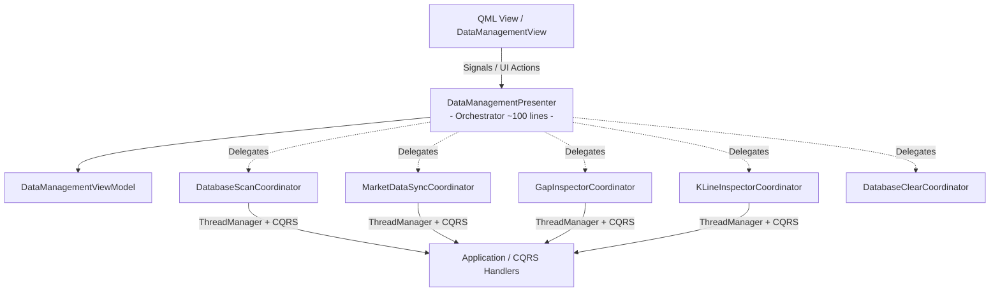

Presenter phình to (trên 800+ dòng) là hiện tượng kinh điển của **"Fat Presenter" (God Object trong tầng Presentation)** khi màn hình mở rộng nhiều tính năng (Sync, Bulk Sync, Scan, Gap Inspector, KLine Inspector, Data Integrity Audit, Clear DB...).

Dưới đây là các **triết lý kiến trúc (Philosophy)** và **design pattern chuẩn** trong Clean Architecture / MVP để chia nhỏ Presenter một cách khoa học, dễ bảo trì và 100% testable:

---

## 1. Triết lý cốt lõi: Single Responsibility & Composition over Inheritance

* **Presenter chính chỉ là "Nhạc trưởng" (Orchestrator/Coordinator)**: Nhiệm vụ duy nhất của nó là kết nối `View <-> ViewModel`, quản lý vòng đời FSM chung, và định tuyến (route) action đến đúng module xử lý.
* **Feature Slices & Delegation (Ủy quyền xử lý)**: Tách các nghiệp vụ độc lập thành các **Sub-Controllers / Coordinators** riêng biệt. Mỗi file chỉ chịu trách nhiệm cho 1 nhóm tính năng cụ thể.



---

## 2. 3 Giải pháp Thiết Kế (Design Patterns)

### 🥇 Cách 1: Sub-Controller / Coordinator Pattern (Khuyên dùng nhất - Best Practice)

Chia nhỏ Presenter thành các **Coordinator/Sub-Controller** chuyên trách trong thư mục `src/presentation/ui/screens/data_management/coordinators/` (hoặc `controllers/`):

#### Cấu trúc thư mục đề xuất:
```text
src/presentation/ui/screens/data_management/
├── data_management_presenter.py       # (Chỉ còn ~100-150 dòng: Khởi tạo, FSM, bind signals)
├── data_management_view.py
├── data_management_view_model.py
├── DatabaseScreen.qml
└── coordinators/                      # (Tách rời các nghiệp vụ độc lập)
    ├── __init__.py
    ├── scan_coordinator.py            # Quét DB shard, thống kê dung lượng, symbol
    ├── sync_coordinator.py            # Sync đơn, Bulk Sync, lắng nghe progress
    ├── gap_coordinator.py             # Quét gap, repair gap
    ├── kline_inspector_coordinator.py # Load nến thô, audit toàn vẹn dữ liệu
    └── clear_coordinator.py           # Xóa dữ liệu shard
```

#### Code Mẫu `kline_inspector_coordinator.py`:
```python
# src/presentation/ui/screens/data_management/coordinators/kline_inspector_coordinator.py

class KLineInspectorCoordinator:
    """Chịu trách nhiệm riêng cho nghiệp vụ Tra cứu nến & Audit dữ liệu."""
    
    def __init__(self, view_model: DataManagementViewModel, thread_manager: IThreadManager, dispatcher: IDispatcher):
        self._vm = view_model
        self._thread_mgr = thread_manager
        self._dispatcher = dispatcher

    def inspect_klines(self, symbol: str, interval: str) -> None:
        self._thread_mgr.submit(self._run_inspect, symbol, interval)

    def _run_inspect(self, symbol: str, interval: str) -> None:
        # Toàn bộ logic query GetHistoricalKlinesQuery & dispatch sang UI thread
        ...

    def run_audit(self, symbol: str, interval: str) -> None:
        self._thread_mgr.submit(self._run_audit, symbol, interval)

    def _run_audit(self, symbol: str, interval: str) -> None:
        # Toàn bộ logic query AuditDatabaseIntegrityQuery & emit kết quả
        ...
```

#### Lúc này `DataManagementPresenter` trở nên vô cùng tinh gọn:
```python
# data_management_presenter.py
class DataManagementPresenter(BasePresenter):
    def __init__(self, view: DataManagementView, container: IContainer) -> None:
        super().__init__(view, container)
        self._view_model = DataManagementViewModel()
        view.set_view_model(self._view_model)

        thread_mgr = container.resolve(IThreadManager)
        dispatcher = container.resolve(IDispatcher)

        # Khởi tạo các coordinators độc lập
        self._scan_coord = DatabaseScanCoordinator(self._view_model, thread_mgr, dispatcher)
        self._sync_coord = MarketDataSyncCoordinator(self._view_model, thread_mgr, dispatcher)
        self._gap_coord = GapInspectorCoordinator(self._view_model, thread_mgr, dispatcher)
        self._kline_coord = KLineInspectorCoordinator(self._view_model, thread_mgr, dispatcher)

        # Kết nối ViewModel signals -> Coordinators
        self._view_model.inspectKlinesRequested.connect(self._kline_coord.inspect_klines)
        self._view_model.runAuditRequested.connect(self._kline_coord.run_audit)
        self._view_model.syncRequested.connect(self._sync_coord.start_sync)
        # ...
```

---

### 🥈 Cách 2: Action Handler Pattern (Hướng tiếp cận CQRS ở Presentation)

Tạo một `ActionHandler` cho từng User Intent. 
* Ví dụ: `InspectKlinesHandler`, `BulkSyncHandler`, `RepairGapHandler`.
* **Ưu điểm**: Cực kỳ dễ viết Unit Test độc lập cho từng Action Handler mà không cần khởi tạo toàn bộ Presenter hoặc Qt Event Loop lớn.

---

### 🥉 Cách 3: Python Mixins / Multiple Traits (Refactor nhanh nhất, nhưng ít khuyến nghị hơn)

Tách code thành các file mixin: `DataManagementScanMixin`, `DataManagementSyncMixin`, `DataManagementInspectorMixin` rồi kế thừa gộp trong `DataManagementPresenter(BasePresenter, DataManagementScanMixin, ...)`.
* **Ưu điểm**: Không cần đổi cấu trúc truyền tham số / gọi hàm nội bộ `self._run_audit(...)`.
* **Nhược điểm**: Vẫn là 1 class gộp tại runtime, khó test cô lập từng phần hơn cách 1.

---

## 🎯 So Sánh & Đánh Giá

| Tiêu chí | Presenter Monolith (Hiện tại) | Coordinator Pattern (Cách 1) | Action Handler (Cách 2) | Mixin (Cách 3) |
| :--- | :---: | :---: | :---: | :---: |
| **Số dòng / file** | > 800 dòng ❌ | ~100-150 dòng/file ✅ | ~50-80 dòng/file ✅ | ~150 dòng/file 🟡 |
| **Tuân thủ SRP / Clean Arch** | Kém (God Class) | Rất cao | Rất cao | Trung bình |
| **Độ dễ viết Unit Test** | Phức tạp (cần mock cả container) | Rất dễ (test riêng từng coord) | Rất dễ | Khá phức tạp |
| **Dễ đọc & Trace code** | Phải cuộn 800 dòng | Tìm đúng file coordinator | Tìm đúng file handler | Phải nhảy qua các file mixin |

### 💡 Đề xuất hành động:
Nếu bạn đồng ý, chúng ta có thể áp dụng **Sub-Controller / Coordinator Pattern (Cách 1)** để tái cấu trúc (refactor) `DataManagementPresenter` thành các Coordinator con trong thư mục `coordinators/`. Việc này sẽ giúp code sạch, ngắn gọn, và làm mẫu chuẩn (template) cho các Presenter lớn khác như `BacktestPresenter`.