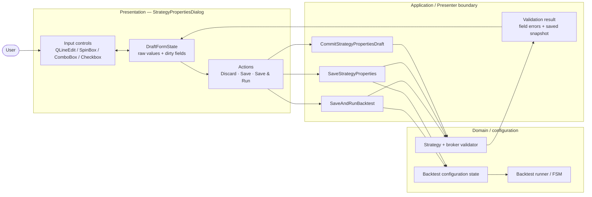
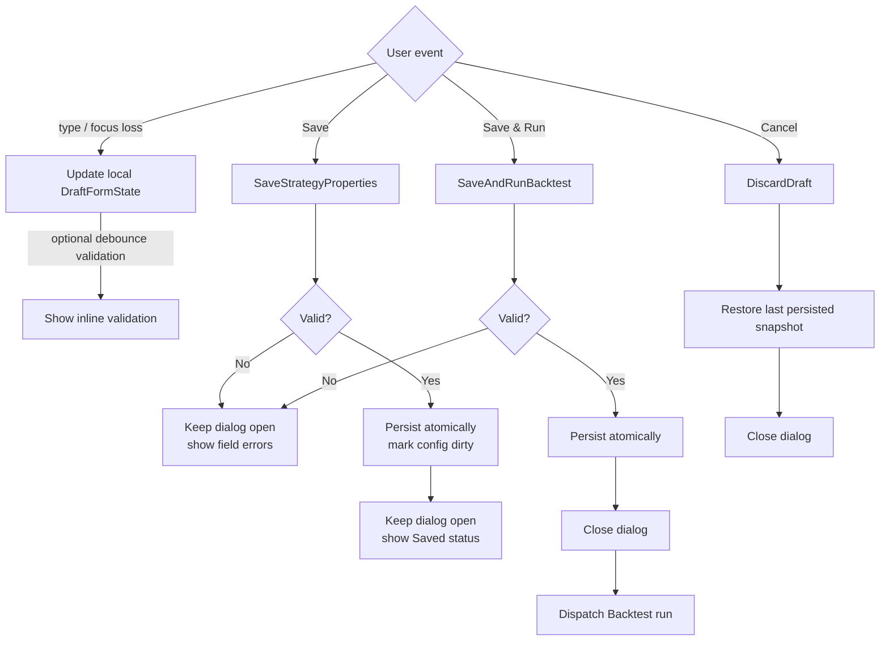
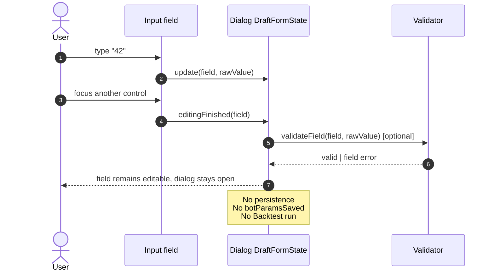
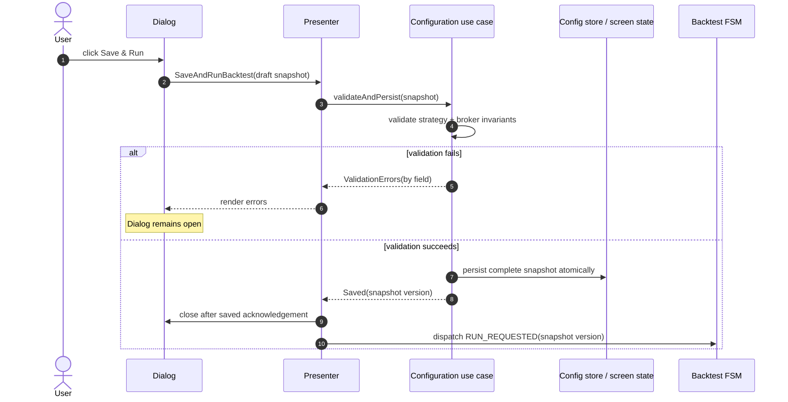
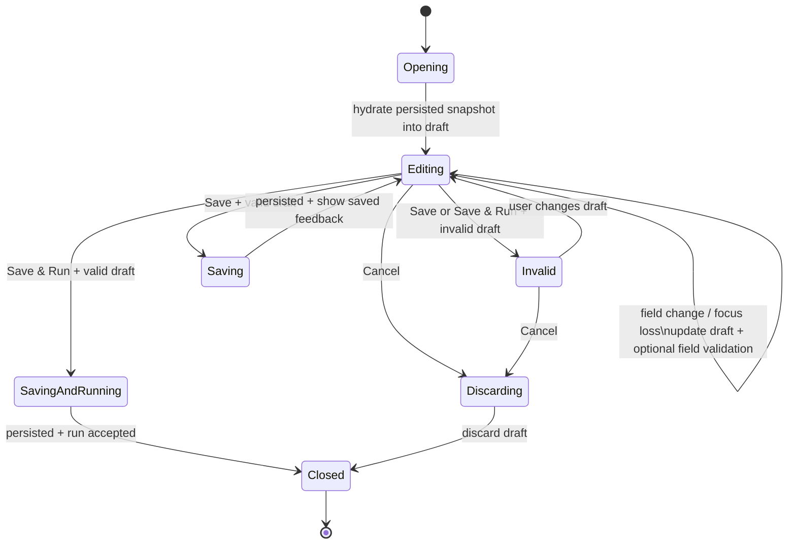
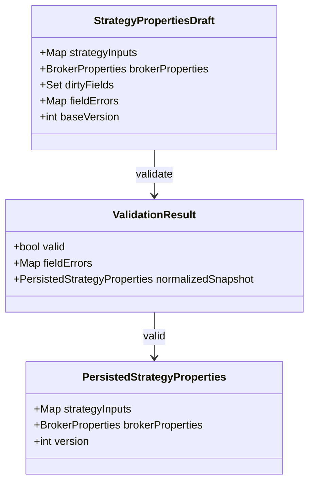

# Design đề xuất — Strategy Properties input lifecycle

> Mục tiêu: tách rõ **chỉnh sửa nháp**, **lưu cấu hình**, và **lưu + chạy lại**.
> Đây là design proposal; chưa phải hành vi đã implement.

## 1. Component boundary

### Ownership

| Thành phần | Chịu trách nhiệm | Không làm |
| :--- | :--- | :--- |
| Dialog | giữ draft, focus, field error, nút thao tác | tự chạy Backtest hoặc tự đổi domain state |
| Presenter | route command, điều phối result/FSM | đọc widget trực tiếp |
| Coordinator/use case | parse, validate, apply snapshot atomically | biết focus/dialog widget |
| Domain config | invariant strategy/broker | biết UI action nào khởi phát |

## 2. Ba command riêng biệt

**Khuyến nghị chính:** `focus loss` chỉ cập nhật **draft** (và có thể validate),
không persist, không close, không run. Điều này làm nút **Hủy** có ý nghĩa rõ
ràng: bỏ toàn bộ thay đổi chưa Save.

## 3. Sequence — chỉnh field rồi chuyển focus

## 4. Sequence — Save & Run thành công

## 5. Dialog state machine

## 6. Data contract

## 7. Acceptance criteria cho design mới

- Chuyển focus A → B không đóng dialog và không chạy Backtest.
- Enter chỉ thực hiện nghĩa được chốt rõ trong UX (khuyến nghị: validate/commit
  draft, không run).
- **Cancel** không đổi persisted configuration nếu chưa Save.
- **Save** persist toàn bộ snapshot atomically, dialog vẫn mở.
- **Save & Run** chỉ chạy sau khi snapshot đã validate và persist thành công.
- Validation lỗi giữ toàn bộ draft người dùng đã nhập; không reset sang default.
- Dynamic strategy field và static broker field theo cùng lifecycle.
- Tests chứng minh riêng các hành vi: focus loss, Enter, Cancel, Save, Save &
  Run, validation error, và snapshot consistency.
